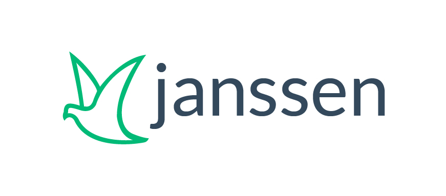

[](https://www.codacy.com/gh/JanssenProject/jans-cloud-native/dashboard?utm_source=github.com&utm_medium=referral&utm_content=JanssenProject/jans-cloud-native&utm_campaign=Badge_Grade)


[](https://artifacthub.io/packages/search?repo=janssen-auth-server)



# Welcome to the Janssen Project

Janssen enables organizations to build a scalable centralized authentication and authorization service using free open source software. The components of the project include client and server implementations of the OAuth, OpenID Connect, SCIM and FIDO standards. New digital identity components may be added as the technology evolves.

# Project Goal

Using the Janssen Project components, you can build a world class cloud native identity and access management ("IAM") platform. But why should you?
1. You have economies of scale, and outsourcing this critical infrastructure to a third party does not make sense
1. You need to embed this component in your product or solution
1. The privacy or security profile of a hosted solution is not acceptable
1. You need more freedom to customize

Through the Janssen project, we can coalesce a community. Open source development results in more innovation and better code. And ultimately, more trust in the code--*trust* is foundational to digital identity infrastructure.

# Project Structure

Janssen is a Linux Foundation project, governed according to the [charter](./community/charter.md). Technical oversight of the project is the responsibility of the Technical Steering Committee ("TSC"). Day to day decision making is in the hands of the Contributors. The TSC helps to guide the direction of the project and to improve the quality and security of the development process.

# Design Goals

The Janssen Project is aligned with the goals of cloud native infrastructure to enable:

1. High Concurrency: For digital identity infrastructure, the number of users is not necessarily related to performance. If you have a billion users who never login, you can do this with a monolithic platform. Concurrency is hard. Janssen is designed to scale horizontally--enabling hypothetically any concurrency by adding more compute and memory.

2. Highly Available: Digital identity infrastructure is mission critical. For many applications, if you can't login, you're dead in the water. Robustness is a fundamental consideration.

3. Flexible while Upgradable: Open source gives you the freedom to modify the code. But having your own fork of the code might make it hard to upgrade--you'll have to merge changes. Janssen provides standard interfaces that make it possible to implement custom business logic in an upgrade-friendly manner.

# History

The initial code was ported by [Gluu](https://gluu.org), based on version 4.2 of it's identity and access management (IAM) platform. Gluu launched in 2009 with the goal of creating an enterprise-grade open source distribution of IAM components. In 2012, Gluu started work on an OAuth Authorization Server to implement OpenID Connect, which they saw as a promising next-generation replacement for SAML. This project was called [oxAuth](https://github.com/GluuFederation/oxauth), and over time, became the core component of the Gluu Server.  Gluu has submitted many [self-certifications](https://openid.net/certification/) at the OpenID Foundation. Today, it is  one of the most comprehensive OpenID Connect Providers.

In 2020, Gluu decided to democratize the governance of the oxAuth project by moving it to the Linux Foundation. The name of the project was changed from oxAuth to Janssen, to avoid any potential trademark issues. Gluu felt that a collaboration with the Linux Foundation would help to build a larger ecosystem.

# Why the name Janssen?

Pigeons (or doves if you like...) are universally regarded as a symbol of peace. But they are also fast. Powered by a handful of seeds, a well trained racing pigeon can fly 1000 kilometers in a day. The Janssen brothers of Arendonk in Belgium bred the world's fastest family of racing pigeons. Complex open source infrastructure, like competitive animal husbandry, requires incremental improvement. Janssen racing pigeons revolutionized the sport. The Janssen Project seeks to revolutionize identity and access management.

# Projects

Modern Identity and Access Management platforms should not be one big monolithic application. Organizations should be able to run services *ala carte*, depending on their requirements. Below is an overview of the different Janssen components.

1. **[auth-server](./jans-auth-server)**: This component is the OAuth Authorization Server, the OpenID Connect Provider, and the UMA Authorization Server--this is the main Internet facing component of Janssen. It's the service that returns tokens, JWT's and identity assertions. This service must be Internet facing.

1. **[fido](./jans-fido2)**:  This component provides the server side endpoints to enroll and validate devices that use FIDO or W3C Web Authentication. This service must be internet facing.

1. **[scim](./jans-scim)**: [SCIM](http://www.simplecloud.info/) is JSON/REST API to manage user data. Use it to add, edit and update user information. This service should not be Internet facing.

1. **[config-api](https://github.com/JanssenProject/jans-config-api)**: The API to configure the auth-server and other components is consolidated in this component. This service should not be Internet-facing.

1. **[jans-cli](https://github.com/JanssenProject/jans-cli)**: Config API's are great, but long curl commands are not the most user friendly way to manage things. This command line tool for configuring the Janssen software provides both an interactive and single line syntax for configuration.

1. **[eleven](https://github.com/JanssenProject/jans-eleven)**: This is a PKCS11 REST API that can be used for key operations by the auth-server in lieu of local storage of private keys. This should service should not be Internet facing.

1. **[client-api](https://github.com/JanssenProject/jans-client-api)**: Middleware API to help application developers call an OAuth, OpenID or UMA server. You may wonder why this is necessary. It makes it easier for client developers to use OpenID signing and encryption features, without becoming crypto experts. This API provides some high level endpoints to do some of the heavy lifting.

1. **[jans-setup](./jans-ce-setup)**: The project provides business logic to install Janssen components.

1. **[core](./jans-core)**: This library has code that is shared across several Janssen components.

1. **[orm](./jans-orm)**: This is the library for persistence and caching implemenations in Janssen. Currently LDAP, Couchbase, Spanner and RDBMS are supported.

1. **docker-**: These are the projects that contain the docker containers.

# Support

[Docs](https://janssenproject.github.io/docs/) are a work in progress. You may want to also check Gluu Server [docs](https://gluu.org/docs), which have a lot in common with Janssen.

We have setup a [community chat on Gitter](https://gitter.im/JanssenProject/Lobby). You can register for free their with your Github identity.

You can subscribe to the [Janssen Google Group](https://groups.google.com/u/2/g/janssen_project)
and post messages there.

If you find a bug in a Janssen project, or you would like to suggest a new feature, try the chat first. Then raise an issue on the respective repository. If you have a "howto" or "usage" question, [raise the issue](https://github.com/JanssenProject/jans/issues)! 

## Quick Start

Try first, ask questions later? Here's how to deploy Janssen

### System Requirements for cloud deployments

!!!note
For local deployments like `minikube` and `microk8s` or cloud installations in demo mode, resources may be set to the minimum and hence can have `8GB RAM`, `4 CPU`, and `50GB disk` in total to run all services.

Releases of images are in style 1.0.0-beta.0, 1.0.0-0

Please calculate the minimum required resources as per services deployed. The following table contains default recommended resources to start with. Depending on the use of each service the resources may be increased or decreased.

| Service           | CPU Unit | RAM   | Disk Space | Processor Type | Required                           |
| ----------------- | -------- | ----- | ---------- | -------------- | ---------------------------------- |
| Auth server       | 2.5      | 2.5GB | N/A        | 64 Bit         | Yes                                |
| LDAP (OpenDJ)     | 1.5      | 2GB   | 10GB       | 64 Bit         | Only if couchbase is not installed |
| fido2             | 0.5      | 0.5GB | N/A        | 64 Bit         | No                                 |
| scim              | 1.0      | 1.0GB | N/A        | 64 Bit         | No                                 |
| config - job      | 0.5      | 0.5GB | N/A        | 64 Bit         | Yes on fresh installs              |
| persistence - job | 0.5      | 0.5GB | N/A        | 64 Bit         | Yes on fresh installs              |
| client-api        | 1        | 0.4GB | N/A        | 64 Bit         | No                                 |
| nginx             | 1        | 1GB   | N/A        | 64 Bit         | Yes if not ALB                     |
| auth-key-rotation | 0.3      | 0.3GB | N/A        | 64 Bit         | No [Strongly recommended]          |
| config-api        | 0.5      | 0.5GB | N/A        | 64 Bit         | No                                 |

### Deploy with microk8s

Start a fresh ubuntu `18.04` or `20.04` and execute the following

```bash
sudo su -
wget https://raw.githubusercontent.com/JanssenProject/jans/master/automation/startopenbankingdemo.sh && chmod u+x startopenbankingdemo.sh && ./startopenbankingdemo.sh
```

This will install docker, microk8s, helm and Janssen with the default settings the can be found inside [values.yaml](helm/pygluu/kubernetes/templates/gluu/values.yaml). Please map the `ip` of the instance running ubuntu to `demoexample.jans.io` and then access the endpoints at your browser such in the example in the table below.

| Service     | Example endpoint                                               |
| ----------- | -------------------------------------------------------------- |
| Auth server | `https://demoexample.jans.io/.well-known/openid-configuration` |
| fido2       | `https://demoexample.jans.io/.well-known/fido2-configuration`  |
| scim        | `https://demoexample.jans.io/.well-known/scim-configuration`   |

For more information follow [here](helm/README.md).

Helm charts are located
