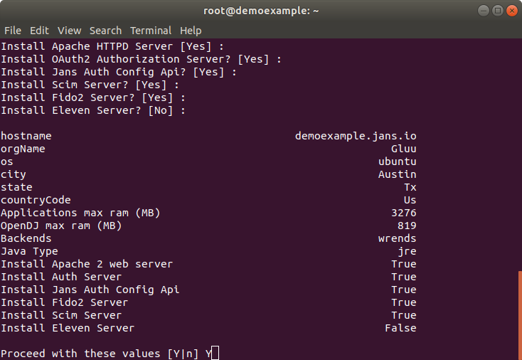
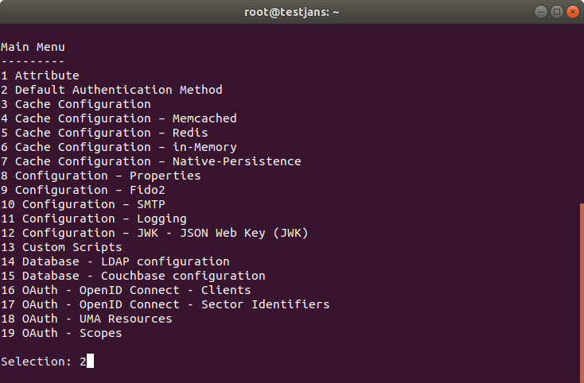
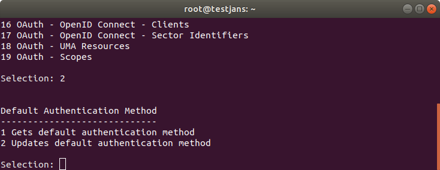
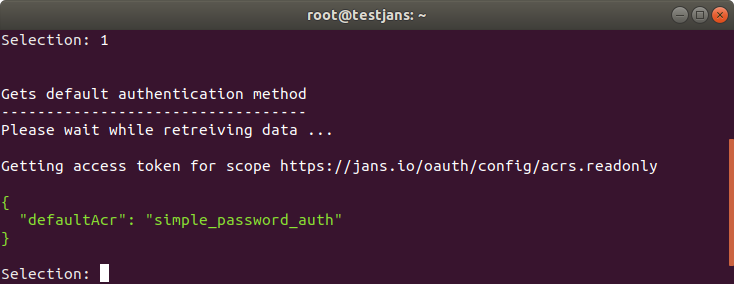

# _jans-cli_
`jans-cli` is a **Command Line Interface** for Janssen Configuration. It also has `menu-driven` interface that makes 
easier to understand how to use [Janssen Server](https://github.com/JanssenProject/home) through the Interactive Mode.


# Quick Start

**jans-cli** is automatically installed if you choose `jans-config-api` during installation 
of [Janssen Server](https://github.com/JanssenProject/home).



After successfully installed Janssen Server, run the following command:

```/opt/jans/jans-cli/config-cli.py```

You will get a menu as below:


From the following list you can choose any option by selecting it's number. For example, let's say number 2,
to get **Default Authentication Method**. 



That returns another two options as below:



Now selecting 1 and it returns our desired result:



So, It was a quick start to view how this _jans-cli_ Interactive Mode really works. Please, follow this [link](docs) 
to read _jans-cli_ docs for better understanding of Janssen Command Line.


