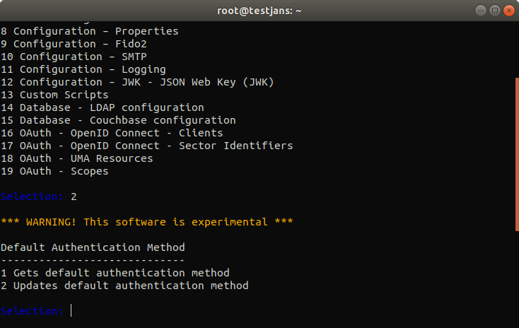

# _Janssen Command Line Interface_
`jans-cli` is a **Command Line Interface** for Janssen Configuration. It also has `menu-driven` interface that makes easier to understand how to use [Janssen Server](https://github.com/JanssenProject/home) through the Interactive Mode.

# _Quick Start_

**jans-cli** is automatically installed if you choose `jans-config-api` during installation 
of [Janssen Server](https://github.com/JanssenProject/home).

After successfully installed Janssen Server, run the following command.
```
/opt/jans/jans-cli/config-cli.py
```
If you get any error then try this one:
```
python3 /opt/jans/jans-cli/config-cli.py
```

Alternatively, you can make python3 as a default version:
```
sudo update-alternatives --install /usr/bin/python python /usr/bin/python3 10
/opt/jans/jans-cli/config-cli.py
```

You will get a menu as below image:


From the following list you can choose any option by selecting its number. For example, let's say number 2,
to get **Default Authentication Method**. 

That returns another two options as below:



Now selecting 1 and it returns our desired result as below image:


So, It was a quick start to view how this _jans-cli_ Interactive Mode really works. Please, follow this [link](docs) 
to read _jans-cli_ docs for better understanding of Janssen Command Line.
