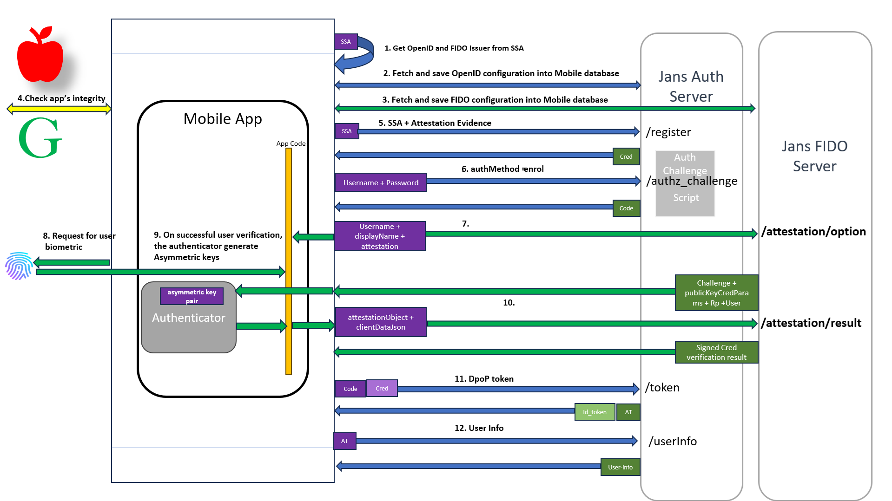

# Jans Chip

- A first party android mobile application that leverages dynamic client registration (DCR), DPoP access tokens.
- Passkey authentication

## Android

[Demo Video](https://www.loom.com/embed/66e145e3bba4406ebda53715168ca8f9?sid=e946f580-587e-4c55-8ea8-3845d6ae4ce9)


### Steps followed in App for authentication

#### Enrolment



##### Mobile application loading

1. The mobile application distribution includes the [SSA](https://docs.Janssen.io/v1.1.3/admin/auth-server/endpoints/ssa/#software-statement-assertion-ssa) (Software Statement Assertion) generated from the Janssen Auth Server. The application reads OpenID and FIDO issuers from the SSA.
2. & 3. The application fetches OpenID and FIDO configurations to the mobile database.
4. To mitigate the risk of app tampering and the use of fraudulent devices, the integrity of the app and device, for Android applications can be verified using the [Play Integrity API](https://developer.android.com/google/play/integrity).
5. The application performs [DCR](https://docs.Janssen.io/v1.1.3/admin/auth-server/endpoints/client-registration/#dynamic-client-registration-dcr) (Dynamic Client Registration) against the Auth Server using the SSA. To [use attestation in OAuth 2.0 Dynamic Client Registration](https://www.ietf.org/id/draft-tschofenig-oauth-attested-dclient-reg-00.html), the app generates evidence in JWT format containing verifiable claims like app_id and app-checksum. The integrity verdict from the Play Integrity API can be added as a claim in the evidence JWT for attested DCR. This claim is then verified by the designated verifier to ensure the trustworthiness of both the app and the Android device. Based on this verification, the DCR is either approved or rejected.

##### Passkey Enrolment

6. Once the application is loaded, it shows the enrollment screen where the user can submit their username/password (for users already registered on the auth server). The app requests the Janssen Auth server's Authorization Challenge Endpoint to exchange an authorization code for the correct username/password. The Janssen auth server provides an AuthorizationChallengeType custom script which is used to control Authorization Challenge Endpoint behavior. During user enrollment in the app, username and password verification is expertly guided by the Authorization Challenge script.
7. After verifying the username/password, the app calls the Janssen FIDO Server's [/attestation/options](https://github.com/JanssensenProject/Janssen/blob/main/Janssen-fido2/docs/JanssenFido2Swagger.yaml) endpoint with the username, displayname, and attestation (none) request parameters. The Janssen FIDO Server returns information about the user, the RP, and the type of credential desired.
8. To perform user verification, the mobile app requests the user's fingerprint impression.
9. On successful fingerprint verification, the authenticator library inside the app creates a new asymmetric key pair and safely stores the private key. The public key, a credential ID, and other attestation data are converted to an attestationObject by the authenticator.
10. The app calls the Janssen FIDO Server's [/attestation/reult](https://github.com/JanssensenProject/Janssen/blob/main/Janssen-fido2/docs/JanssenFido2Swagger.yaml) endpoint with the attestationObject and clientDataJSON (a byte array containing the challenge sent by the RP, the origin of the domain observed by the client, and the type of operation performed) request parameters. The Janssen FIDO Server verifies the request and sends the success/failure response.
11. Using the authorization code obtained in step #6, the app requests an access token from the Janssen Auth Server using the token endpoint. The token is of type [DpoP](https://datatracker.ietf.org/doc/html/draft-ietf-oauth-dpop-16).
12. Using the access token, user info is fetched from the Janssen Auth Server, and the user details page is shown on the app with the user info.

#### Authentication


1. The mobile application displays already enrolled passkeys with it. On selecting a passkey it makes request to [/assertion/options](https://github.com/JanssenProject/jans/blob/main/jans-fido2/docs/jansFido2Swagger.yaml) of Janssen FIDO server.
2. The response of `/assertion/options` contains the challenge and the allowCredentials field which contains a list of previously registered credentials.
3. The app requests the user for biometric input (thumb impression). 
4. One the user is verified, the authenticator finds a credential that matches the Relying Party ID and creates a new assertion by signing over the clientDataHash and authenticatorData with the private key generated for this account during enrolment.
5. The app then make request to [/assertion/result](https://github.com/JanssenProject/jans/blob/main/jans-fido2/docs/jansFido2Swagger.yaml)  of Janssen FIDO server with authenticatorData and assertion signature. 
6. The FIDO server performs validation and responds with success or failure response. This request is made through Authorization Challenge Endpoint script so that authorization code is sent on success of `/assertion/result` request.
7. & 8.  Using the authorization code, the app exchanges an access token and then user-info from Janssen Auth server.

### Prerequisite

1. A Running Janssen Auth server and Janssen FIDO server.
2. SSA generated from the Janssen Auth server with `authorization_code` `grant_types`.
 
### Auth Challenge Script

Add following [Auth Challenge Script](./android/docs/authChallengeScript.java) in Jans Server (before using the App) with following details.

- **Name of Script** : passkey_auth_challenge
- **Script Type** : Authorization Challenge
- **Programming Language** : Java
- **Location Type**: Database
- Add `fido2_server_uri` custom property with https://{fido_server_url} as value. Replace `{fido_server_url}` with fido server hostname.

### Workspace Setup

1. Clone `jans` monorepo.
   ```
    git clone https://github.com/JanssenProject/jans.git
   ```
2. Start Android Studio and open `{jans_monorep_path}\demos\jans-chip\android` of cloned jans monorepo. 
3. Press `ctrl` key twice on Android Studio to open `Run Anything` dialog.
4. Enter `gradle wrapper --gradle-version 8.0` and press enter key. This will generate gradle wrapper at `{jans_monorep_path}\demos\jans-chip\gradle\wrapper`.
5. Add SSA from Janssen Auth server to SSA field in `demos/jans-chip/android/app/src/main/java/io/jans/chip/utils/AppConfig.kt`.
5. Build and run project on an emmulator (in Android Studio).

## iOS

- WIP

**Reference:**
- https://github.com/JanssenProject/jans/wiki/Mobile-DPoP-FIDO-Authn
- https://github.com/JanssenProject/jans/wiki/DPoP-Mobile-App-POC
- Authenticator code from https://github.com/duo-labs/android-webauthn-authenticator/tree/master