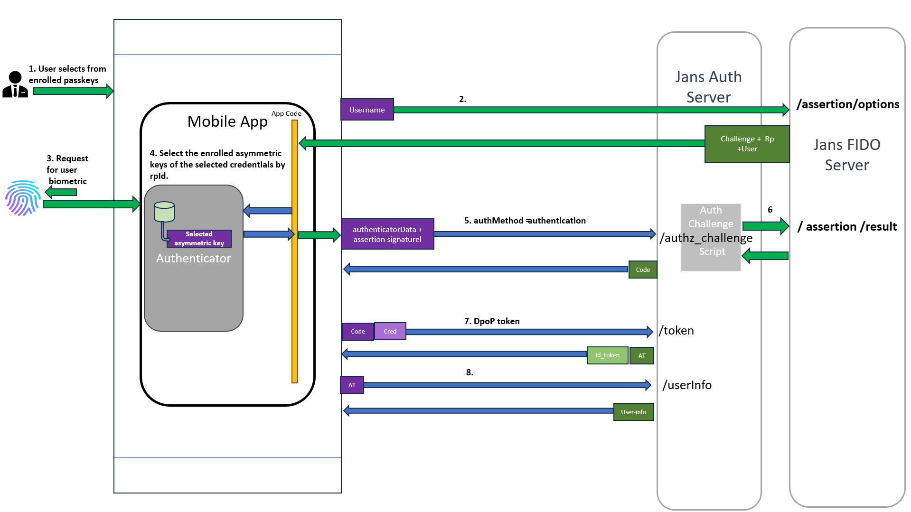

# Jans Chip

## A  first party android mobile application that leverages dynamic client registration (DCR), DPoP access tokens.

[Demo Video](https://www.loom.com/embed/66e145e3bba4406ebda53715168ca8f9?sid=e946f580-587e-4c55-8ea8-3845d6ae4ce9)


### Steps followed in App for authentication

#### Enrolment


#### Authentication



### Workspace Setup

1. Clone `jans` monorepo.
   ```
    git clone https://github.com/JanssenProject/jans.git
   ```
2. Start Android Studio and open `{jans_monorep_path}\demos\jans-chip\android` of cloned jans monorepo. 
3. Press `ctrl` key twice on Android Studio to open `Run Anything` dialog.
4. Enter `gradle wrapper --gradle-version 8.0` and press enter key. This will generate gradle wrapper at `{jans_monorep_path}\demos\jans-chip\gradle\wrapper`. 
5. Build and run project on an emmulator (in Android Studio).
6. After launch add configuration endpoint of Janssen Server (with a trusted
   domain, not self-signed certificate) and desired scopes on the register screen
   to start testing.

**Reference:**
- https://github.com/JanssenProject/jans/wiki/Mobile-DPoP-FIDO-Authn
- https://github.com/JanssenProject/jans/wiki/DPoP-Mobile-App-POC