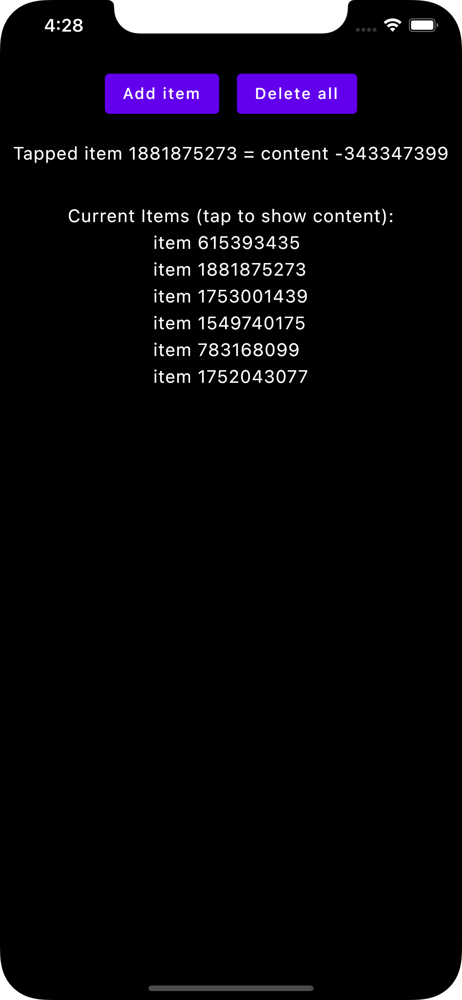
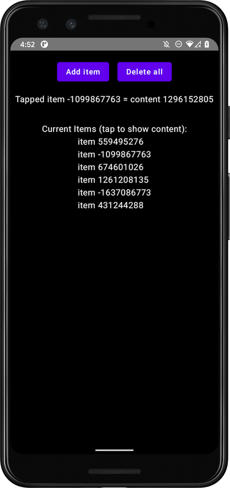

# KMP (Kotlin Multi-Platform) Compose UI App using Google's Room Database for iOS and Android

How to use Google Room database (loved by Android devs) in Pure Compose UI KMP apps for iOS and Android 
- Attempting to use the simplest implementation possible to show the minimal code needed.
- No Viewmodels! Pure Compose-only app.

- > ### $\textcolor{yellow}{Please\ consider\ giving\ me\ a\ STAR\ as\ THANKS!\ ⭐️ 🤩\}$

## Original Document:
Project generated from this template (iOS & Android, Shared UI): https://kmp.jetbrains.com/

This is a Kotlin Multiplatform project targeting Android, iOS.

* `/composeApp` is for code that will be shared across your Compose Multiplatform applications.
  It contains several subfolders:
  - `commonMain` is for code that’s common for all targets.
  - Other folders are for Kotlin code that will be compiled for only the platform indicated in the folder name.
    For example, if you want to use Apple’s CoreCrypto for the iOS part of your Kotlin app,
    `iosMain` would be the right folder for such calls.

* `/iosApp` contains iOS applications. Even if you’re sharing your UI with Compose Multiplatform, 
  you need this entry point for your iOS app. This is also where you should add SwiftUI code for your project.

Learn more about [Kotlin Multiplatform](https://www.jetbrains.com/help/kotlin-multiplatform-dev/get-started.html)…
