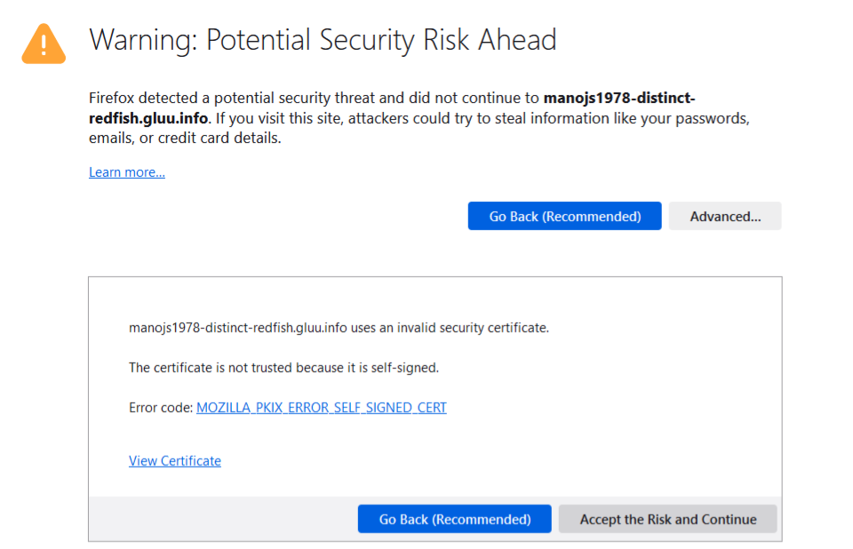
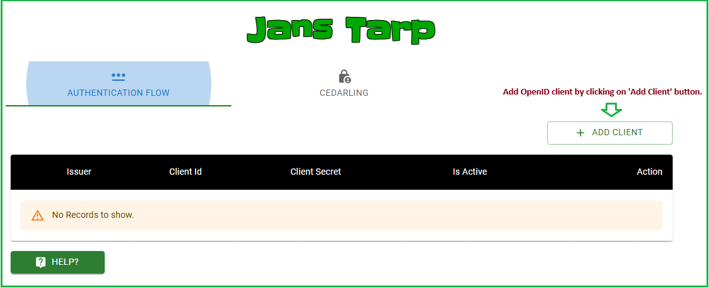
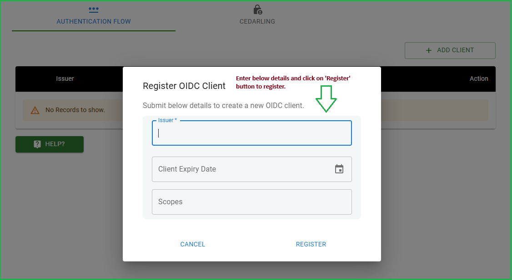
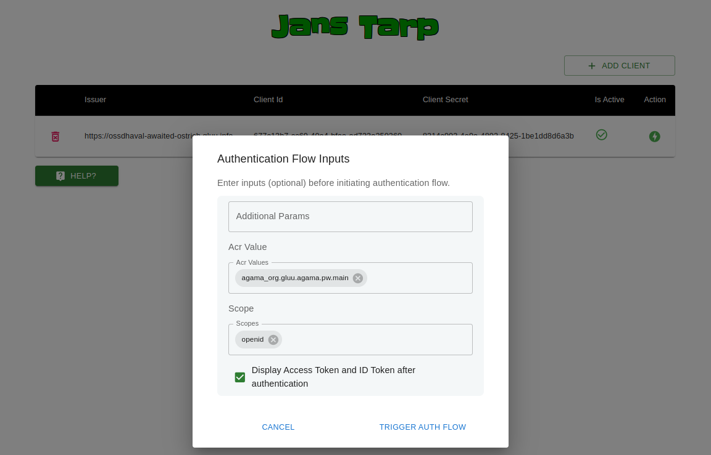
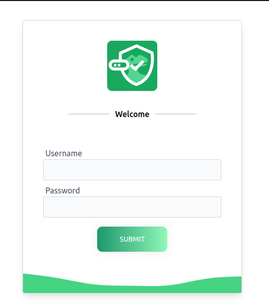
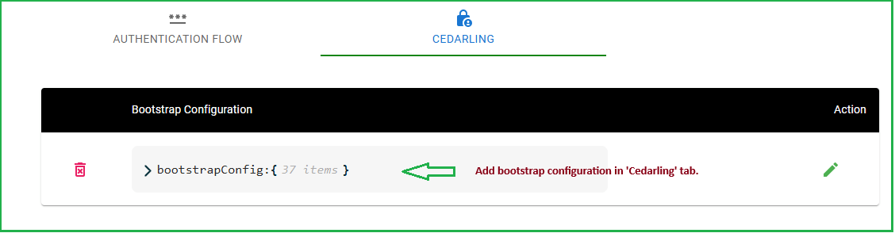
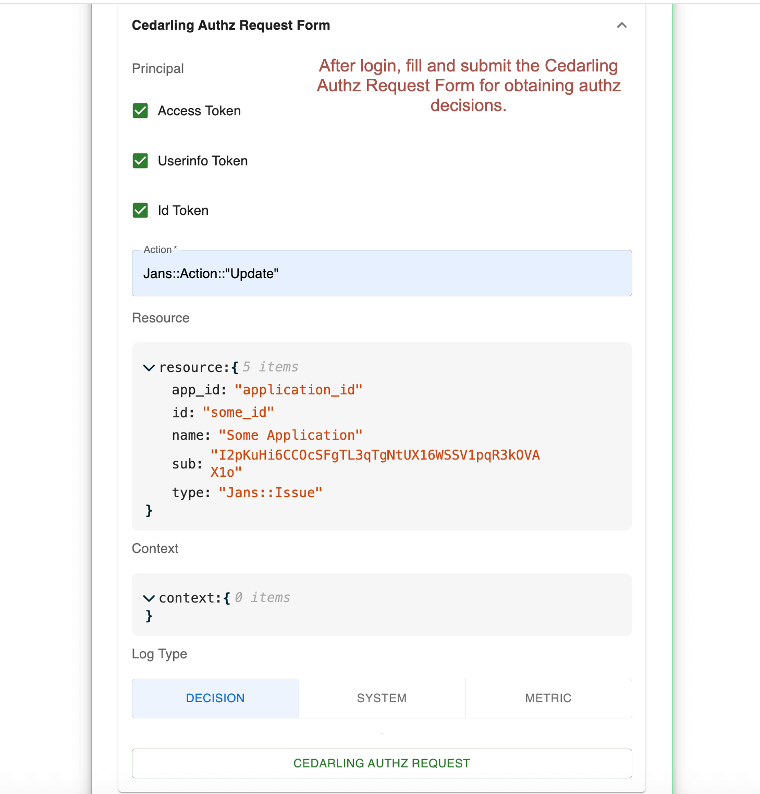
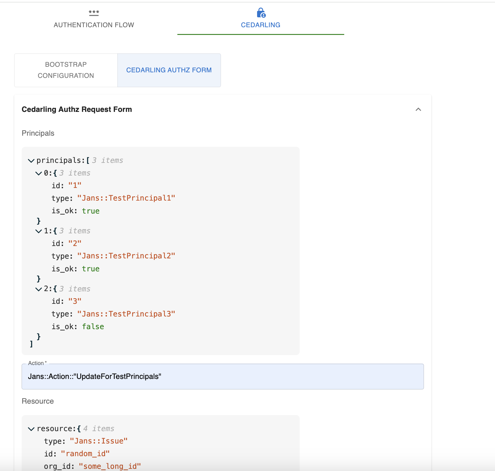
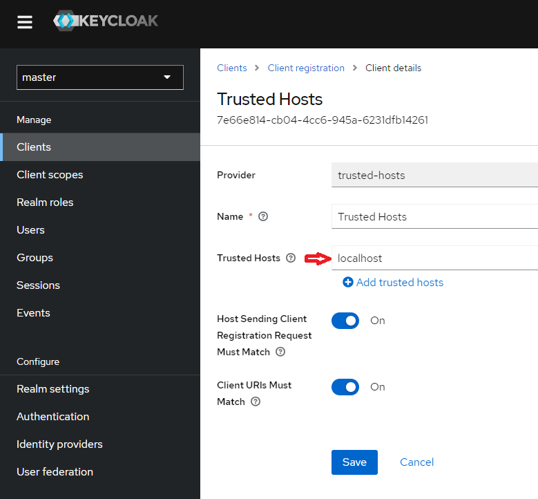
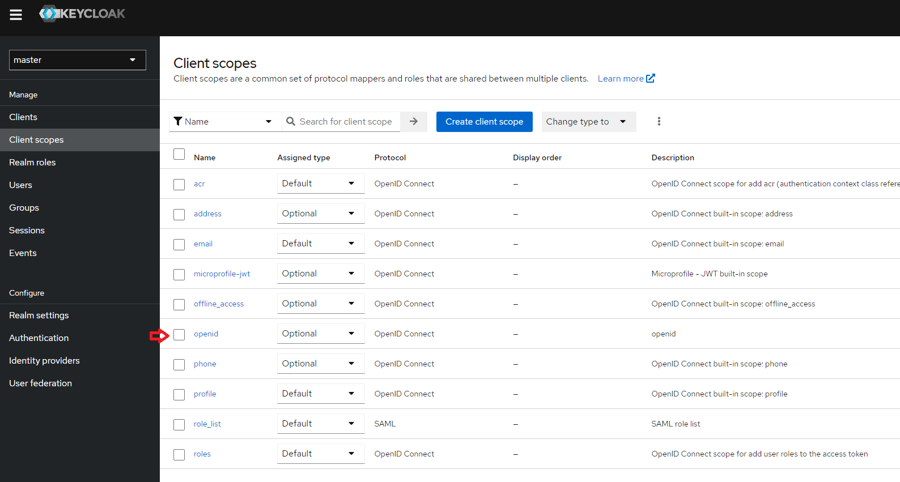

# Jans Tarp

## Relying Party tool in form of a Browser Extension.

[Demo Video](https://www.loom.com/share/b112b9c7214a4920812a2ebe9c36dbf5?sid=7a15d2e5-881e-4002-9b8c-902dd1d80cec)

- This extension is for convenient testing of authentication flows on browser.
- [Cedarling](https://docs.jans.io/head/cedarling/cedarling-overview/) is an embeddable stateful Policy Decision Point, or "PDP". Cedarling is integrated with Jans Tarp to make authorization decision post-authentication.

## Supporting Browser

- Chrome
- Firefox (version >= 115.0.3 )

## Prerequisite

- Node.js (>= v18.15.0)

## Build

1. Change directory to the project directory (`/jans-tarp`).
2. Run `npm install`.
3. Run `npm run build`. It will create Chrome and Firefox build in `/jans-tarp/dist/chrome` and `/jans-tarp/dist/firefox` directories respectively.
4. To pack the build into a zip file run `npm run pack`. This command will pack  Chrome and Firefox builds in zip files at `/jans-tarp/release`.

## Releases

Instead of building from source code, you can download and install `jans-tarp` directly in your browser. Look for the `demo-jans-tarp-chrome-v{x.x.x}.zip` and `demo-jans-tarp-firefox-v{x.x.x}.zip` assets in the release section at https://github.com/JanssenProject/jans/releases. 

## Installation in browser

### Chrome

1. Go to `Settings --> Extensions` of Chrome browser.
2. Switch on the `Developer mode`.
3. Click on `Load unpacked` button to load the extension and select the build created in `/jans-tarp/dist/chrome` directory.

### Firefox

The extension can directly installed on Firefox browser from https://addons.mozilla.org/en-US/firefox/addon/janssen-tarp/.

#### Temporary Installation (from build)

1. In Firefox, open the `about:debugging` page.
2. Click the `This Firefox` option.
3. Click the `Load Temporary Add-on` button, then select the `jans-tarp-firefox-v{}.zip` zip file from `/jans-tarp/release/`.

##### Note:

When you are testing Janssen IdP with self-signed cert then follow below steps before client registration using jans-tarp.

1. Open the OP_HOST url on browser.
2. Accept the security risk due to self-signed cert and continue.

## Testing using Jans Tarp

* Setup Jans-Tarp. [Instructions](https://github.com/JanssenProject/jans/tree/main/demos/jans-tarp)
* Configuration to run Agama flow
* Add Your Jans Auth server host , Client expiry date, Scopes and click on `Register` client. It will register new OP Client on your Auth server.

* Add `Acr values` and `Scopes ` click on Trigger Auth Code flow.

* It will trigger agama flow and show login screen to you. You can use TUI to add testing user.

* After successful auth, it will show you below screen

* Add Cedarling bootstrap configuration on Cedarling tab.

* After authentication, test Cedarling Authorization decision using following request form.

## Cedarling unsigned authorization

* The `authorize_unsigned` method allows making authorization decisions without JWT token verification.

## Testing with Keycloak (installed on localhost)

1. Login to KC admin console

2. Go to `Clients --> Client registration --> Client details --> Trusted Hosts`  and set localhost as Trusted Hosts (as your KC is running on localhost).

3. Go to `Client scopes` and create a scope with name `openid`. The assigned type should be `Optional`.

Once above configuration is done, jans-tarp can be used test KC IdP.
