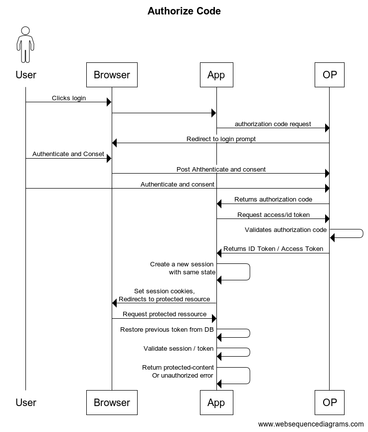

# Test-Auth-Client

This client aims to be a reliable client build with BDD / TDD metologies to be used in auth testing.

Flask based auth/identity app based on test-first, made to encourage and learn BDD and TDD.

## Authorization code flow / Protected Ressources



``` websequencediagrams.com
actor User
User->Browser: Clicks login
Browser->App:
App->OP: authorization code request
OP->Browser: Redirect to login prompt
User->Browser: Authenticate and Conset
Browser->OP:Post Ahthenticate and consent
User->OP: Authenticate and consent
OP->App: Returns authorization code
App->OP: Request access/id token
OP->OP: Validates authorization code
OP->App: Returns ID Token / Access Token
App->App: Create a new session\n with same state
App->Browser: Set session cookies, \nRedirects to protected resource
Browser->App: Request protected ressource
App->App: Restore previous token from DB
App->App: Validate session / token
App->App: Return protected-content\nOr unauthorized error
```

## Installation

*  Install dependencies

```
pip3 install -r requirements.txt
```

* Create client on Auth server, i.e.:
    * response_type `code`
    * redirect_uri `https://localhost:9090/oidc_callback`
    * Grants `authorization_code`
    * client authn at token endpoint `client_secret_post`
    * scopes `openid` `username` `profile` `email`
   Please notice: You may also use the `register` endpoint, still to be documented.

* Copy `auth-tdd-client/config_dummy.py` to `config.py` and use data according to your needs, i.e.:
    * Input client_id and secret from above step
    * Set configuration endpoint URL
    * Set `ISSUER`
    * Set `ACR_VALUES='basic'`

* Import your Auth Server certificate

```
export CERT_PATH=$(python3 -m certifi)
export SSL_CERT_FILE=${CERT_PATH}
export REQUESTS_CA_BUNDLE=${CERT_PATH}
mv issuer.cer $(python3 -m certifi)
```

* Run server

```
python3 main.py
```

* navigate to `https://localhost:9090/protected-content`

## Extra Features

### Auto-register endpoint

Sending a `POST` request to `/register` endpoint containing a `JSON` with the OP/AS url and client url, like this:

```json
{
    "op_url": "https://idpproxy-test.usg.edu",
    "client_url": "https://tempclient.techno24x7.com"
}
```

Will return client id and client secret

### Auto-config endpoint

Sending a `POST` request to `/configuration` endpoint, containing client id, client secret, and metadata endpoint will fetch data from metadata url and override `config.py` settings during runtime. 

```json
{
    "client_id": "e4f2c3a9-0797-4c6c-9268-35c5546fb3e9",
    "client_secret": "5c9e4775-0f1d-4a56-87c9-a629e1f88b9b",
    "op_metadata_url": "https://t1.techno24x7.com/.well-known/openid-configuration"
}
```


