# Janssen Tarp

Janssen Tarp is a browser extension from the [Janssen Project](https://github.com/JanssenProject/jans/tree/main/demos/janssen-tarp) that lets you test OpenID Connect (OIDC) authentication flows and [Cedarling](https://docs.jans.io/head/cedarling/cedarling-overview/) authorization decisions directly from your browser — no application code required.

In this tutorial you will:

1. Install Janssen Tarp in your browser
2. Register an OIDC client with your identity provider (IdP)
3. Run an OAuth 2.0 Authorization Code flow and inspect the tokens
4. Configure Cedarling (bootstrap configuration and policy store)
5. Run a Cedarling multi-issuer authorization request and read the decision result

---

## 1. Prerequisites

- **Browser:** Chrome, or Firefox (version ≥ 115.0.3)
- **An OpenID Provider** Janssen Auth Server that supports Dynamic Client Registration

> **Self-signed certificates:** If your auth server uses a self-signed TLS certificate, open the server's URL in a browser tab first and accept the security warning. Otherwise, client registration will fail with a TLS error.

## 2. Install the extension

Download the latest release assets from the [Janssen releases page](https://github.com/JanssenProject/jans/releases/latest):

- Chrome: `demo-janssen-tarp-chrome-v{x.x.x}.zip`
- Firefox: `demo-janssen-tarp-firefox-v{x.x.x}.xpi`

**Chrome**

1. Unzip the downloaded file.
2. Go to `Settings > Extensions` and enable **Developer mode** (top right).
3. Click **Load unpacked** and select the unzipped folder.

**Firefox**

1. Open `about:addons` in the address bar.
2. Click **Extensions** in the left menu.
3. Click the gear icon next to *Manage Your Extensions*, then **Install Add-on From File...**.
4. Select the downloaded `.xpi` file.

Open the extension. You'll land on the **Authentication** tab, with two more tabs available: **Cedarling** and **AI Agent**.

## 3. Register an OIDC client

1. On the **Authentication** tab, click **+ Add Client**.
2. In the **Register OIDC Client** dialog, fill in:
   - **Issuer** (required) — your OpenID Provider host, e.g. `admin-ui-test.gluu.org`
   - **Scopes** — type a scope and press Enter (e.g. `openid`)
   - **Client Expiry Date** — when the client should expire
   - Tick **Add an existing client** only if you want to reuse an already-registered client instead of creating a new one.
3. Click **Register**.

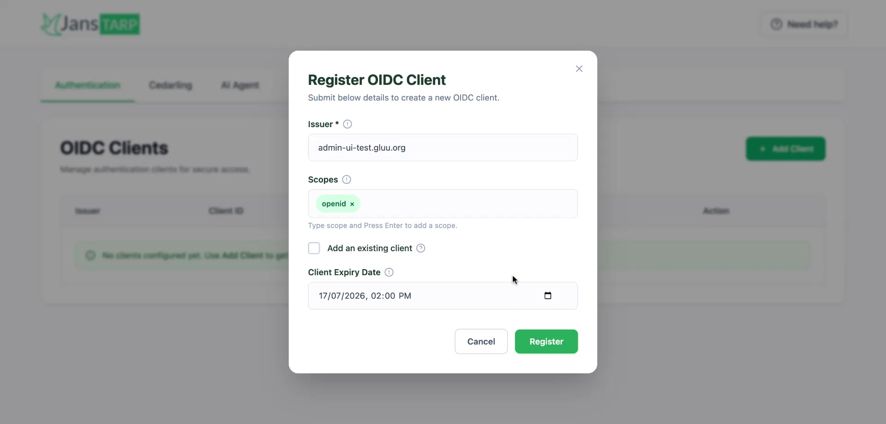

Tarp performs Dynamic Client Registration against the issuer. The new client appears in the **OIDC Clients** table with its Client ID, Client Secret, and an `Enabled` status.

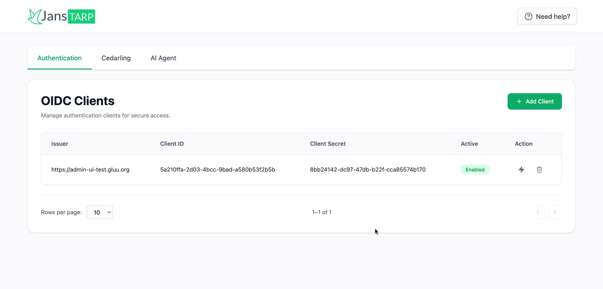

## 4. Run the authentication flow

1. In the client's row, click the ⚡ (trigger) icon under **Action**.
2. The **Authentication Flow Inputs** dialog opens. All inputs are optional:
   - **Additional Params** — extra request parameters as JSON, e.g. `{"paramOne": "valueOne"}`
   - **Acr Values** — pick the authentication method (ACR) to request
   - **Scope** — additional scopes for the request
   - **Display tokens after authentication** — tick this to see the tokens after login
3. Click **Trigger Auth Flow**.

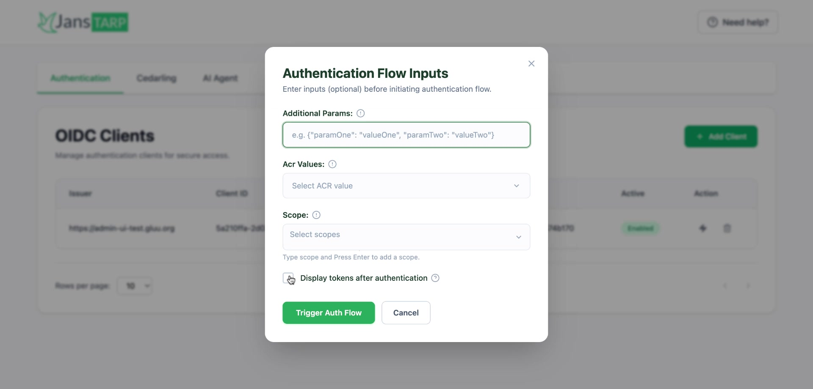

Your browser is redirected to the IdP's login page. Sign in with your user credentials (if you already have a session, you may be logged in silently).

After a successful login, Tarp shows the **User Details** page with expandable sections for the **Access Token**, **ID Token**, and **User Details** (userinfo). Use **Show Payload** to decode a token, **Copy** to copy the details, and **Logout** to end the session.

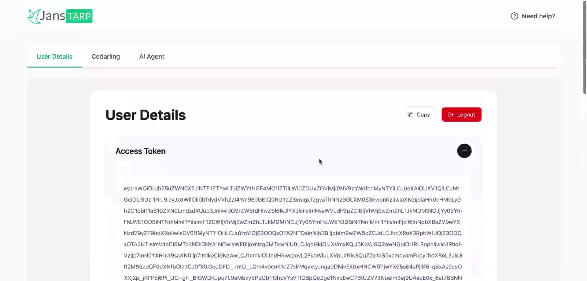

## 5. Configure Cedarling

Cedarling is an embedded Policy Decision Point (PDP) that evaluates authorization requests against Cedar policies. Configure it once, then test authorization decisions.

### 5.1 Add a bootstrap configuration

1. Open the **Cedarling** tab. You'll see the **Bootstrap Configuration** page.
2. Click **+ Add Configurations**.

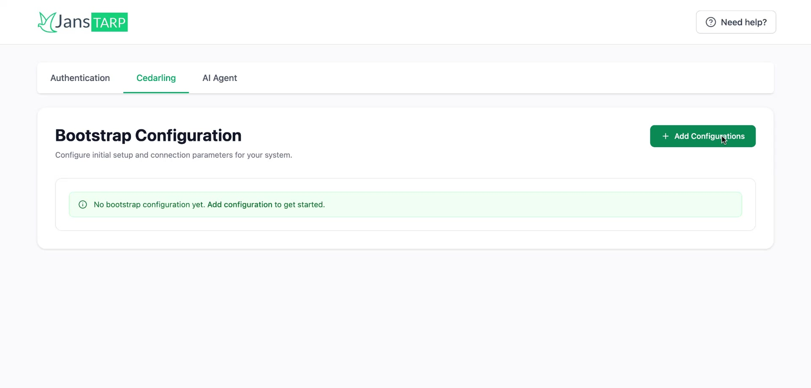

3. In the **Add Cedarling Configuration** dialog, choose **JSON** (or **URL**) input. A minimal configuration is pre-filled — edit it as needed. Key properties:
   - `CEDARLING_APPLICATION_NAME` — any name, e.g. `My App`
   - `CEDARLING_POLICY_STORE_URI` — URL of your Cedar policy store (`.cjar`)
   - `CEDARLING_JWT_SIG_VALIDATION` / `CEDARLING_JWT_STATUS_VALIDATION` — `enabled`/`disabled` token validation
   - `CEDARLING_LOG_TYPE`, `CEDARLING_LOG_LEVEL`, `CEDARLING_LOG_TTL` — logging options
4. Click **Save**.

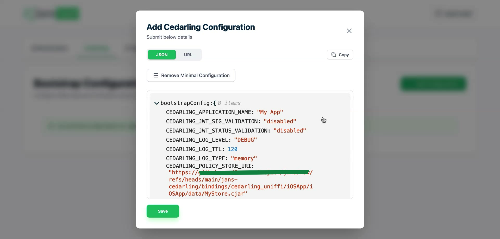

The saved configuration appears in the table. Two more sub-tabs become available: **Cedarling Unsigned Authz Form** and **Cedarling Multi-Issuer Authz Form**.

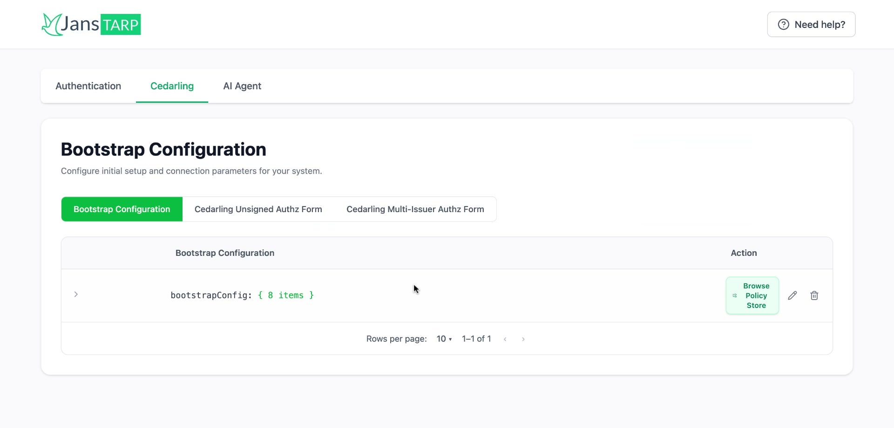

### 5.2 Browse the policy store (optional)

Click **Browse Policy Store** in the configuration's row to inspect the loaded policy store: Cedar policies, trusted issuers, manifest, metadata, and schema. Click any file to view its contents — for example, a policy that only permits users with the `auditor` role to `Read`.

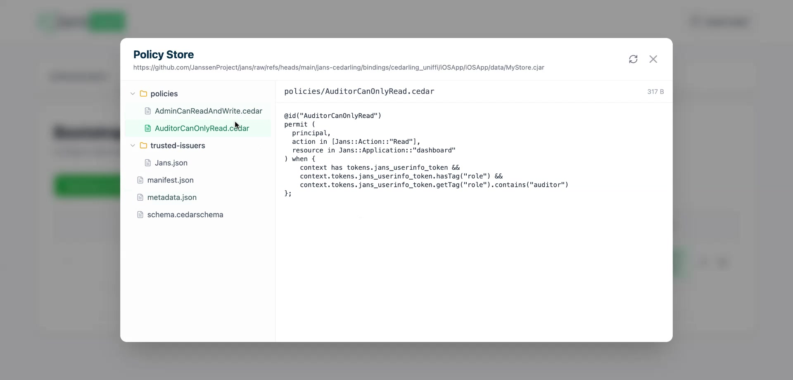

## 6. Test authorization (Cedarling Multi-Issuer Authz Form)

This form builds an authorization request from tokens, an action, a resource, and optional context — then asks Cedarling for a decision.

1. On the **Cedarling** tab, open **Cedarling Multi-Issuer Authz Form**. The status badge shows **Ready** once the bootstrap configuration is initialized.

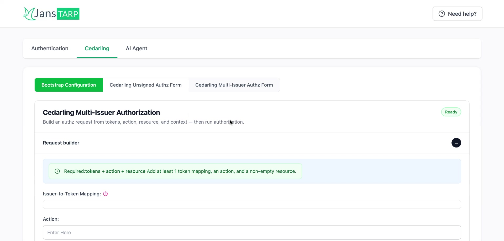

2. Fill in the **Request builder** (at least one token mapping, an action, and a non-empty resource are required):
   - **Issuer-to-Token Mapping** — the tokens to evaluate (e.g. `Jans::Access_token`, `Jans::id_token` with their JWT payloads). If you completed the authentication flow, Tarp can use those tokens.
   - **Action** — the Cedar action, e.g. `Jans::Action::"Read"`
   - **Resource** — the Cedar entity, e.g. `entity_type: "Jans::Application"`, `id: "dashboard"`
   - **Context** — optional additional context attributes
   - **Log tag** — choose which logs to display: `Decision`, `System`, or `Metric`
3. Click **Run authorization**.

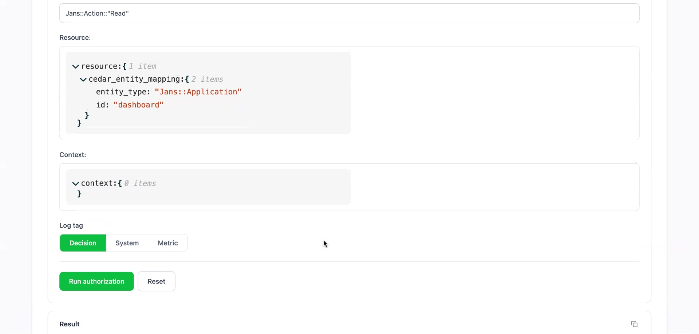

The **Result** panel shows the outcome:

- **Decision** — `True` (allow) or `False` (deny)
- **diagnostics → reason** — which policies matched (e.g. `AdminCanReadAndWrite`, `AuditorCanOnlyRead`)
- **errors** — any evaluation errors
- **request_id** — correlates with entries in the **Logs** panel below

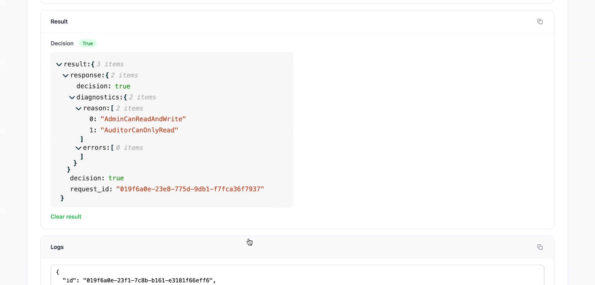

Use **Clear result** to reset and try different tokens, actions, or resources. See the [Cedarling multi-issuer authorization reference](https://docs.jans.io/head/cedarling/reference/cedarling-multi-issuer/) for details.

## 7. Troubleshooting

- **TLS error during client registration** — trust the server's self-signed certificate first (Section 1).
- **Registration fails against Keycloak on localhost** — in the KC admin console, set `localhost` under *Clients → Client registration → Trusted Hosts*, and create an **Optional** client scope named `openid`.
- **Authorization always denied** — verify the policy store URI in the bootstrap configuration, and that your token payloads match what the policies expect (use **Browse Policy Store** to check).

