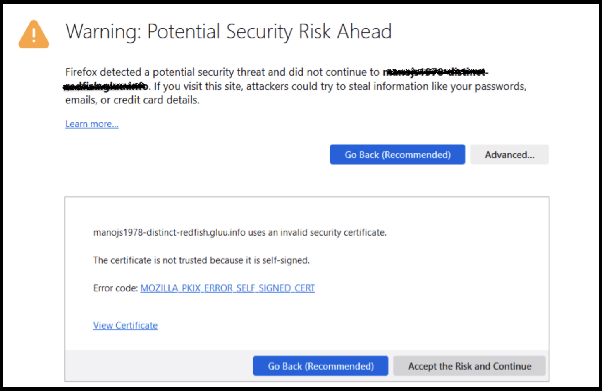
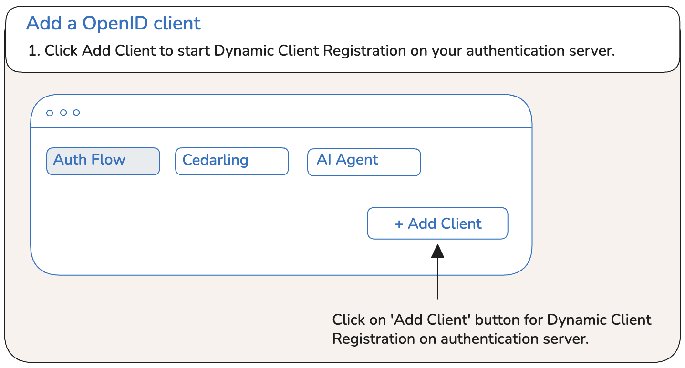
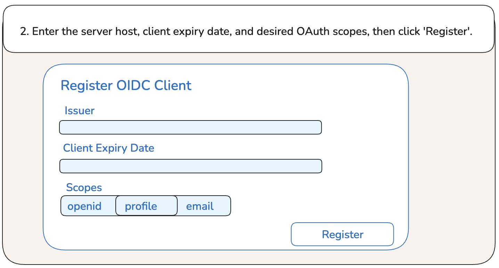
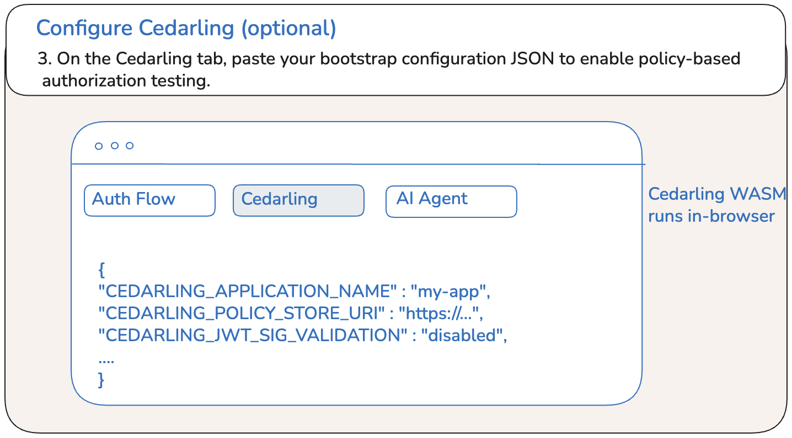
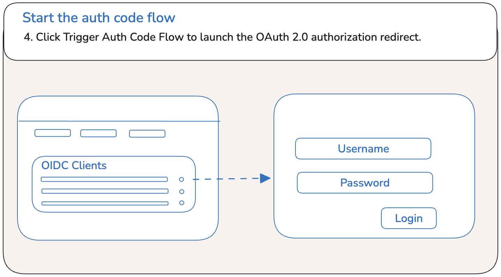
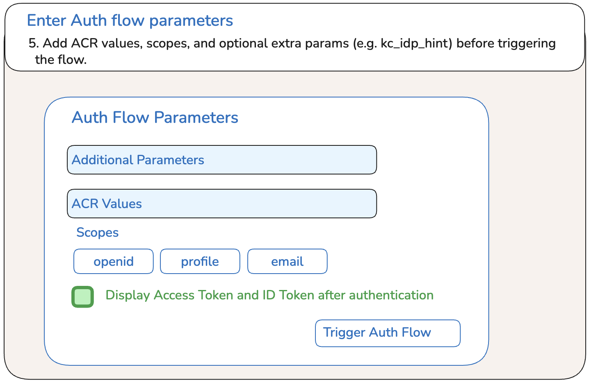
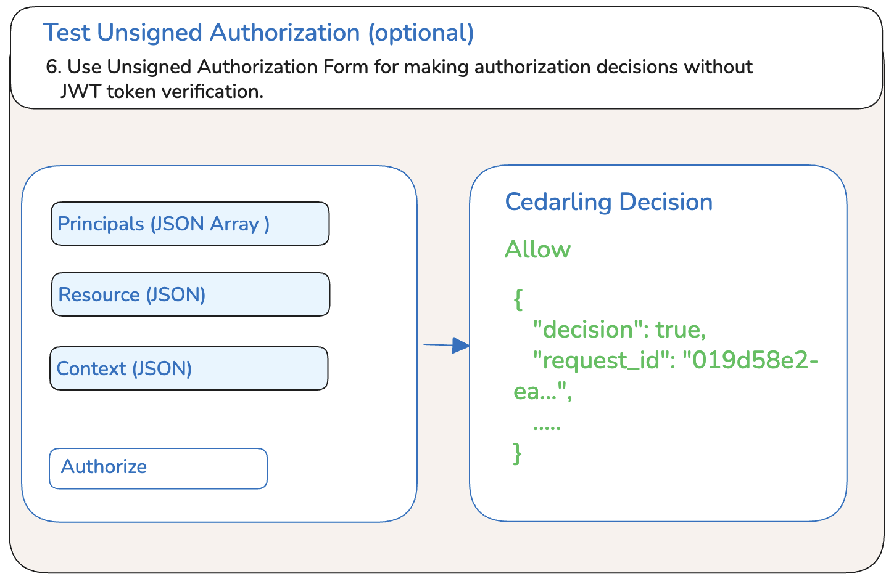
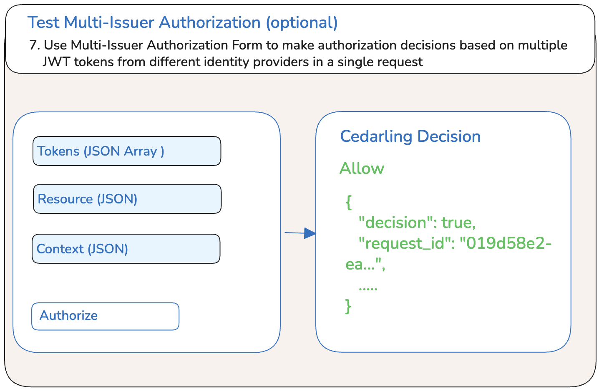
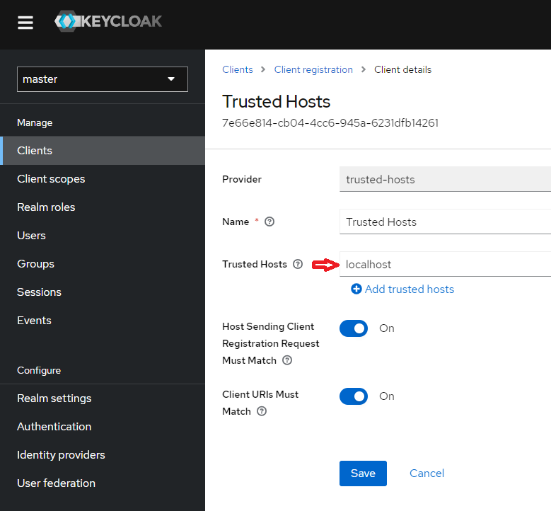
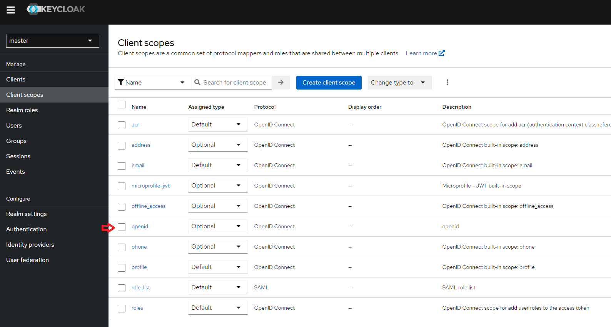

# Janssen Tarp

## Table of Contents

1. [Overview](#overview)
2. [Supporting Browsers](#supporting-browser)
3. [Prerequisite](#prerequisite)
4. [Build Instructions](#build)
5. [Releases](#releases)
6. [Installation in Browser](#installation-in-browser)
   - [Chrome](#chrome)
   - [Firefox](#firefox)
7. [Note on Self-Signed Certificates](#self-signed-certificate-handling)
8. [Testing Using Janssen Tarp](#testing-using-janssen-tarp)
9. [Cedarling Authorization](#cedarling-authorization)
10. [Cedarling Unsigned Authorization](#cedarling-unsigned-authorization)
11. [AI Agents in Admin UI](./docs/ai-agents.md#ai-agents-in-admin-ui)
12. [Testing with Keycloak](#testing-with-keycloak-installed-on-localhost)

## Overview

Janssen Tarp is a browser extension demo tool built as part of the Janssen Project — an open-source Identity and Access Management (IAM) platform under the Linux Foundation. The extension allows developers and IAM engineers to quickly register OpenID Connect (OIDC) clients, trigger OAuth 2.0 Authorization Code flows, and test Cedarling-based authorization decisions — all directly from the browser without writing any application code.

[Demo Video](https://www.loom.com/share/b112b9c7214a4920812a2ebe9c36dbf5?sid=7a15d2e5-881e-4002-9b8c-902dd1d80cec)

- This extension is for convenient testing of authentication flows on browser.
- [Cedarling](https://docs.jans.io/head/cedarling/cedarling-overview/) is an embeddable stateful Policy Decision Point, or "PDP". Cedarling is integrated with Janssen Tarp to make authorization decision post-authentication.
- AI Agents can be configured on Janssen Tarp to register OIDC client and invoke authentication flow with natural language input.

## Supporting Browser

- Chrome
- Firefox (version >= 115.0.3 )

## Prerequisite

- Node.js (>= v18.15.0)

## Build

1. Change directory to the project directory (`/janssen-tarp/browser-extension`).
2. Run `npm install`.
3. Run `npm run build`. It will create Chrome and Firefox build in `/janssen-tarp/browser-extension/dist/chrome` and `/janssen-tarp/browser-extension/dist/firefox` directories respectively.
4. To pack the build into a zip file run `npm run pack`. This command will pack  Chrome and Firefox builds in zip files at `/janssen-tarp/browser-extension/release`.

## Releases

Instead of building from source code, you can download and install `janssen-tarp` directly in your browser. Look for the `demo-janssen-tarp-chrome-v{x.x.x}.zip` and `demo-janssen-tarp-firefox-v{x.x.x}.xpi` assets in the release section at https://github.com/JanssenProject/jans/releases/latest.

## Installation in browser

### Chrome
1. Unzip the downloaded `demo-janssen-tarp-chrome-v{x.x.x}.zip`file
2. Open Chrome and go to `Settings > Extensions`.
3. Enable `Developer mode` at the top right.
4. Click the `Load unpacked` button, and select the unzipped folder `demo-janssen-tarp-chrome-v{x.x.x}`.

### Firefox

1. In Firefox, open the `about:addons` on address bar.
2. Click the `Extension` link on left menu .
3. Click on `Setting` icon before `Manage your Extensions` label, then click the `Install Add-on from file...`.
4. Browse and open the downloaded `demo-janssen-tarp-firefox-v{x.x.x}.xpi` file to install the extension.

##### Self-Signed Certificate Handling:

When testing against a Janssen Auth Server using a self-signed TLS certificate, you must configure browser trust for the certificate before attempting client registration. Failure to do so will result in TLS errors during the Dynamic Client Registration call.

Follow your browser's procedure to import or trust the self-signed certificate authority (CA) used by the Janssen Auth Server.

1. Open the OP_HOST url on browser.
2. Accept the security risk due to self-signed cert and continue.

## Testing using Janssen Tarp

* Setup Janssen-Tarp. [Instructions](https://github.com/JanssenProject/jans/tree/main/demos/janssen-tarp)

* See the [Cedarling multi-issuer authorization reference](https://docs.jans.io/head/cedarling/reference/cedarling-multi-issuer/) for unsigned authorization details.

* See the [Cedarling multi-issuer authorization reference](https://docs.jans.io/head/cedarling/reference/cedarling-multi-issuer/) for multi-issuer authorization details.

 

## Testing with Keycloak (installed on localhost)

1. Login to KC admin console

2. Go to `Clients --> Client registration --> Client details --> Trusted Hosts`  and set localhost as Trusted Hosts (as your KC is running on localhost).

3. Go to `Client scopes` and create a scope with name `openid`. The assigned type should be `Optional`.

Once above configuration is done, janssen-tarp can be used test KC IdP.

