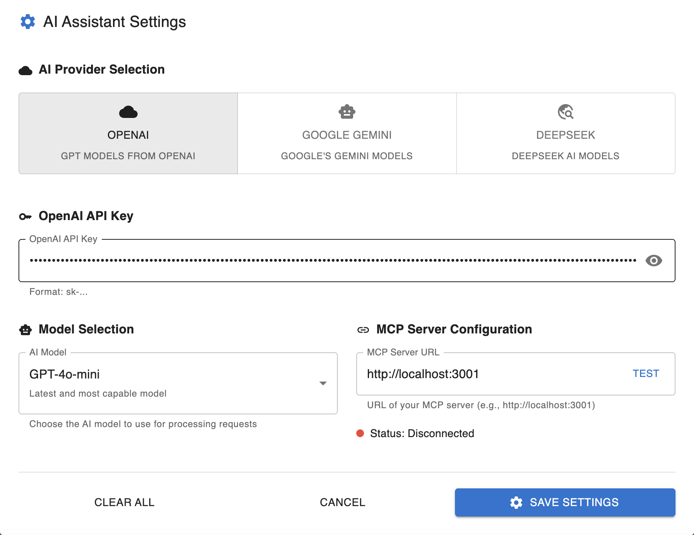

# Using the AI Assistant in Janssen Tarp

The AI Assistant in Tarp is a tool that allows you to interact with your Tarp extension using natural language. It leverages AI models (OpenAI, Google Gemini, or DeepSeek) to understand your requests and perform actions through the Model Context Protocol (MCP) server.

The AI Assistant in Tarp can perform following functions:

1. Register OIDC client
2. Invoke Authentication Flow

# Getting Started

## MCP server 

### Prerequisite

- Node.js (>= v18.15.0)

### Build & Run

1. Change directory to the project directory (`/janssen-tarp/mcp-server`).
2. Run `npm install`.
3. Run `npx tsc` to compile the typescript files to javascript files into the `./janssen-tarp/mcp-server/dist` directory.
3. Run `node './dist/server.js'` to start MCP server at port 3001.

## Browser extension

Open the AI Assistant on the Janssen Tarp and on `Settings` popup configure the following:

1. **AI Provider**: Choose from OpenAI, Google Gemini, or DeepSeek

2. **API Key**: Obtain and enter your provider's API key

3. **Model**: Select which AI model to use

4. **MCP Server URL**: Configure the connection to your Tarp server. It will be `https://localhost:3001` when MCP server is running locally.

## Working

Please check following video to understand how to use AI Agents with Natural Language Inputs

[Demo Video](https://www.loom.com/share/f391fcddb5dc403b840b352b0cefccf4)

