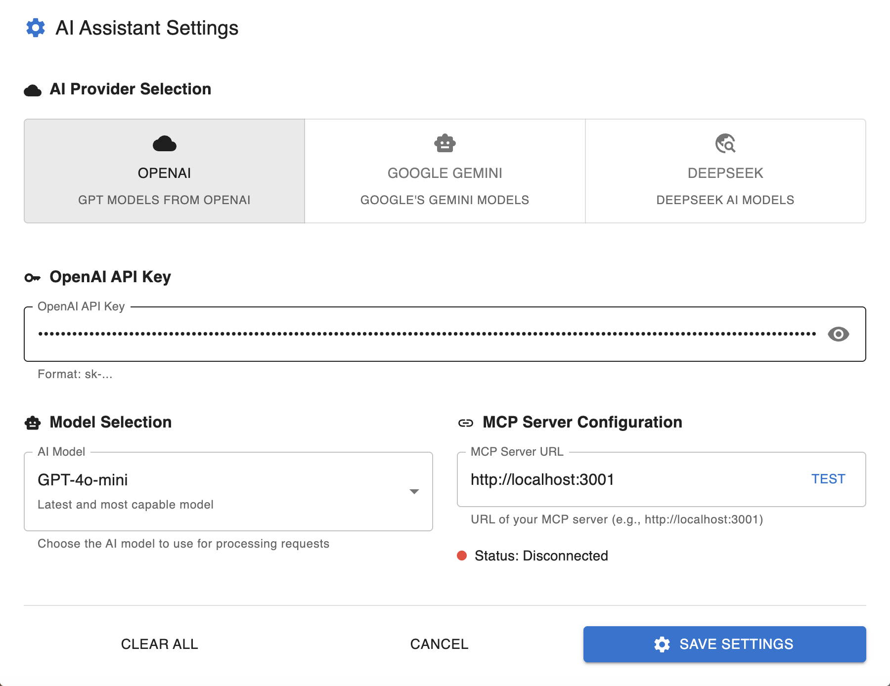

# Using the AI Assistant in Janssen Tarp

The AI Assistant in Tarp allows you to interact with your Tarp extension using natural language. It leverages AI models (OpenAI, Anthropic Claude, or a locally hosted model via Ollama) to understand your requests and perform actions through the Model Context Protocol (MCP) server.

The AI Assistant in Tarp can perform following things:

1. Register OIDC client
2. Invoke Authentication Flow

# Getting Started

## MCP server

### Prerequisite

- Node.js (>= v18.18.0)

### Build & Run

1. Change directory to the project directory (`/janssen-tarp/mcp-server`).
2. Run `npm install`.
3. Run `npx tsc` to compile the typescript files to javascript files into the `./janssen-tarp/mcp-server/dist` directory.
4. Run `node './dist/server.js'` to start MCP server at port 3001.

## Browser extension

Open the AI Assistant on the Janssen Tarp and on `Settings` popup configure the following:

1. **AI Provider**: Choose from OpenAI, Anthropic Claude, or Ollama.

2. **API Key**: Obtain and enter your provider's API key.
   - **OpenAI**: Create a key at [platform.openai.com](https://platform.openai.com/api-keys) (format `sk-...`).
   - **Anthropic Claude**: Create a key at [console.anthropic.com](https://console.anthropic.com/settings/keys) (format `sk-ant-...`).
   - **Ollama**: No API key is required — Ollama runs locally. The API Key field is hidden and instead you configure the **Ollama Server Endpoint** (defaults to `http://localhost:11434/v1`).

3. **Model**: Select which AI model to use, or pick **Custom Model** to enter any model name your provider supports.

4. **MCP Server URL**: Configure the connection to your Tarp server. It will be `http://localhost:3001` when the MCP server is running locally.



## Using Ollama (local, no API key)

[Ollama](https://ollama.com) lets you run open models (Llama, Qwen, Mistral, etc.) locally so no API key or external service is needed. Because the Tarp AI Assistant runs inside a browser extension, Ollama must be told to accept requests from the extension's origin via the `OLLAMA_ORIGINS` environment variable — otherwise calls to `http://localhost:11434/v1/chat/completions` are rejected with an **HTTP 403**.

### 1. Install Ollama

**macOS**

- Download and install the app from [ollama.com/download](https://ollama.com/download), or via Homebrew:
  ```sh
  brew install ollama
  ```

**Linux**

```sh
curl -fsSL https://ollama.com/install.sh | sh
```

**Windows**

- Download and run the installer from [ollama.com/download](https://ollama.com/download).

### 2. Pull a model

```sh
ollama pull llama3.1
```

You can substitute any supported model (e.g. `llama3.2`, `qwen2.5`, `mistral`). The model name you pull must match the one selected in the AI Assistant **Settings**.

### 3. Allow the Chrome extension origin (`OLLAMA_ORIGINS`)

Set `OLLAMA_ORIGINS` to allow the extension origin, then restart Ollama. Use `chrome-extension://*` to allow any extension, or replace `*` with your specific extension ID (find it at `chrome://extensions`) for a tighter policy.

**macOS** (app or `brew` install)

```sh
launchctl setenv OLLAMA_ORIGINS "chrome-extension://*"
```
Then fully quit and reopen the Ollama app (a simple window close is not enough). If you run the server manually instead, use:
```sh
OLLAMA_ORIGINS="chrome-extension://*" ollama serve
```

**Linux** (systemd service)

```sh
sudo systemctl edit ollama.service
```
Add the following, then save:
```ini
[Service]
Environment="OLLAMA_ORIGINS=chrome-extension://*"
```
Reload and restart:
```sh
sudo systemctl daemon-reload
sudo systemctl restart ollama
```
If you run the server manually instead:
```sh
OLLAMA_ORIGINS="chrome-extension://*" ollama serve
```

**Windows**

```powershell
setx OLLAMA_ORIGINS "chrome-extension://*"
```
Then quit Ollama from the system tray and start it again (or sign out/in so the new environment variable is picked up).

### 4. Verify

Confirm the server is reachable and the origin is accepted (this should return models, not a 403):

```sh
curl -i -H "Origin: chrome-extension://test" http://localhost:11434/v1/models
```

If you still get a 403, the environment variable did not take effect — make sure Ollama was fully restarted after setting it.

In the AI Assistant **Settings**, choose **Ollama** as the provider, select your pulled model, set the **Ollama Server Endpoint** if it differs from the default, and save.

## Working

Please check following video to understand how to use AI Agents with Natural Language Inputs

[Demo Video](https://www.loom.com/share/f391fcddb5dc403b840b352b0cefccf4)


