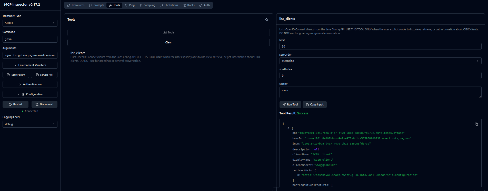

# MCP Server for Janssen configuration API

This is a MCP server for Janssen configuration API. It uses MCP Inspector to connect to the Janssen server and run tools.

Current tools:
- List OpenID Connect clients configured on the Janssen server



## How to run this MCP server

### PREREQUISITES

- Java 17
- Maven
- MCP Inspector installed
- A Janssen server instance
- To connect and invoke config-api on the Janssen server, this MCP server needs an access token with appropriate scopes. Get the access token from the Janssen server.

### Build MCP server

- Clone the `Jans` repository from GitHub and navigate to
`demos/mcp/config-api/mcp-config-api-server` directory.
- Run `mvn clean package` to build the project

Project creates an uber jar in `target` directory.

### Run the MCP server

- Run the command below after replacing the values for `JANS_HOST_URL` and `JANS_OAUTH_ACCESS_TOKEN` with the values for your Janssen server. Set `MCP_SERVER_PORT` to port of your choice. This will start the MCP server hosted on Jetty server. If you are running MCP server against a Janssen server with self-signed certificate, run this server in [development mode](#development-mode).

    ```bash
    export JANS_HOST_URL="https://example.jans.host.io" &&
    export JANS_OAUTH_ACCESS_TOKEN="b6c8ef0b-09b5-xxx-xxx-xxx" &&
    export MCP_SERVER_PORT=8181 &&
    java -jar target/jans-mcp-config-api-server-0.0.1.jar
    ```
- Start a client to connect with the MCP server. If you are using MCP Inspector, run the following command:

    ```bash
    npx @modelcontextprotocol/inspector --transport http --server-url http://localhost:8181/mcp
    ``` 
- Navigate to the Chrome instance opened by MCP Inspector.
- Click `connect` to connect with the MCP server. Then click `tools` to
list all the available tools. 
- Select the tool to invoke and hit `run` to see the response from the tool. For
instance, to list all the clients configured on the Janssen server, select
`list clients` and hit `run`. This should show JSON list of clients on the jans server.

### Development mode

The MCP server can be run in development mode by adding `-dev` flag to the
command line, which will disable SSL certificate validation. This is useful
when running MCP server against a Janssen server with self-signed certificate.

    ```bash
    export JANS_HOST_URL="https://example.jans.host.io" &&
    export JANS_OAUTH_ACCESS_TOKEN="b6c8ef0b-09b5-xxx-xxx-xxx" &&
    export MCP_SERVER_PORT=8181 &&
    java -jar target/jans-mcp-config-api-server-0.0.1.jar -dev
    ```

### Janssen server setup

- Two clients 
    - one that you created for MCP server to connect with config API. You use this client to get a the access token. Provide this access token to the MCP server via command-line arg. When debugging this token is updated in the debug profile in (.vscode/launch.json). Configuration of this client is as given in [this section](#mcp-client-config).
    - Second created by tarp dynamically. You will use tarp to obtain tokens for your user. These tokens (access, id and userinfo) are passed to the server through the toolhandler.properties. Server uses these tokens to extract the user information. Specifically the `role`. Remember that this client, you need to update on the jans, so that it has the `role` scope along with the `openid` default scope.
    - Create a user on Jans that has `role` claim added with value `ops`.

## Architectural Decision Records (ADRs)

### Use JsonNode instead of custom model classes

#### Decision

Use `JsonNode` instead of custom model classes to represent the response from the Janssen server.

#### Rationale

- Using model classes provided one benefit of type safety and compile-time checking. 
Type checking is not essential for MCP server as it is a tool to interact with the Janssen server.
The final JSON is used by the MCP client or agents that
are calling the MCP server. So, type safety should be considered at the actual consumer of the JSON response if at all required.
Having custom model classes for each response from the Janssen server adds complexity of writing model classes for each response from
the Janssen server. Using `JsonNode` provides a simple and flexible way to represent the response from the Janssen server.

#### Consequences

Type safety is not provided at the MCP server level.

## Jans configs

### MCP client config

```
dn: "inum=d458f14b-fd20-4c02-90ff-9e466047cc92,ou=clients,o=jans"
deletable: false
frontChannelLogoutUri: ""
frontChannelLogoutSessionRequired: false
redirectUris: ["https://google.com"]
responseTypes: ["token", "code", "id_token"]
grantTypes: ["authorization_code", "implicit", "refresh_token", "client_credentials"]
applicationType: "web"
idTokenTokenBindingCnf: ""
clientName: "mcpclient"
logoUri: ""
clientUri: ""
policyUri: ""
clientNameLocalized: {}
logoUriLocalized: {}
clientUriLocalized: {}
policyUriLocalized: {}
tosUriLocalized: {}
jwksUri: ""
jwks: ""
sectorIdentifierUri: ""
subjectType: "pairwise"
tokenEndpointAuthMethod: "client_secret_basic"
initiateLoginUri: ""
scopes: ["https://jans.io/oauth/config/openid/clients.delete", "https://jans.io/oauth/config/openid/clients.readonly", "https://jans.io/oauth/config/openid/clients.write"]
trustedClient: false
persistClientAuthorizations: false
includeClaimsInIdToken: true
accessTokenLifetime: 30000
customAttributes: [{"name": "displayNameLocalized", "multiValued": true, "values": ["{}"], "value": "{}", "displayValue": "{}"}, {"name": "jansClntURILocalized", "multiValued": true, "values": ["{}"], "value": "{}", "displayValue": "{}"}, {"name": "jansLogoURILocalized", "multiValued": true, "values": ["{}"], "value": "{}", "displayValue": "{}"}, {"name": "jansPolicyURILocalized", "multiValued": true, "values": ["{}"], "value": "{}", "displayValue": "{}"}, {"name": "jansTosURILocalized", "multiValued": true, "values": ["{}"], "value": "{}", "displayValue": "{}"}]
rptAsJwt: false
accessTokenAsJwt: true
disabled: false
softwareId: ""
softwareVersion: ""
softwareStatement: ""
attributes: {"runIntrospectionScriptBeforeJwtCreation": false, "keepClientAuthorizationAfterExpiration": false, "allowSpontaneousScopes": false, "backchannelLogoutSessionRequired": false, "parLifetime": 600, "requirePar": false, "dpopBoundAccessToken": false, "jansDefaultPromptLogin": false, "requirePkce": false, "minimumAcrLevel": -1}
backchannelTokenDeliveryMode: "poll"
backchannelClientNotificationEndpoint: ""
backchannelUserCodeParameter: false
description: ""
displayName: "mcpclient"
allAuthenticationMethods: ["client_secret_basic"]
authenticationMethod: "client_secret_basic"
baseDn: "inum=d458f14b-fd20-4c02-90ff-9e466047cc92,ou=clients,o=jans"
inum: "d458f14b-fd20-4c02-90ff-9e466047cc92"
```
