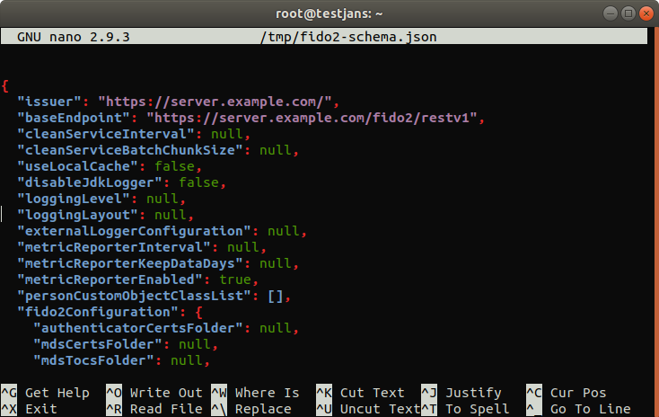
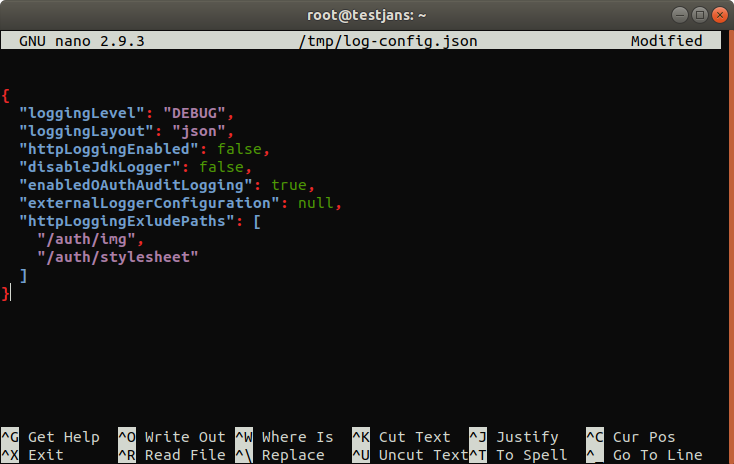

# Using jans-cli

`jans-cli` is automatically installed if you choose to install **jans-config-api** during the installation of the Janssen Server. `jans-cli` has two modes of operation
1. Menu-driven Interactive Mode
2. Command Line Argument Mode

## Menu-driven Interactive Mode
We will refer _Menu-driven Interactive Mode_ as **IM**. To run IM just simply execute jans-cli as follows:
```
/opt/jans/jans-cli/config-cli.py
```
You will see the main menu as below:


Using IM is very simple and intuitive. Just make a selection and answer questions. There is a special option to read value for a question from a file using **_file** tag. This option is the most suitable choice to input the large text (e.g., interception script source code or JSON file content). To use this option input **_file /path/of/file** e.g. **_file /home/user/interceptionscript.py**. From the following menu, you can choose an option by selecting its number. Let's start from the beginning.

### Tips
1. `_` is an escape character for IM mode. For example, you can create a list `["me", "you"]` by entering `me_,you`
1. `_true` means boolean **True** instead of string `"true"`, similarly `_false` is boolean **False** instead of string `"false"`
1. `_null` is comprehended as **None** (or in json **null**)
1. `_x` exits the current process and go back to the parent menu
1. `_q` refers to `quit`


### Attribute

Using **Janssen CLI**, You can perform some quick operations in _Attribute_. Such as:
- `view/find` list of Attributes in detail.
- `add` new attributes.
- `update` an existing attribute
- `delete` an attribute using its `inum` etc.

For example, to get all attributes to choose 1 from the Main Menu, you will get the following options:


To `View/Find` attributes choose 1, you will be asked to enter `Search size`,  `Search pattern` and `Status of the attribute` . For simplicity, leave defaults in our case:


Once press Enter, it will retrieve 50 attributes and prints to screen in green color:


You can save the result as a file by choosing `w` in the result screen. To go back enter `b`, to quit enter `q`. If you enter a recognized command, it will display valid command.

To `Add` a new attribute, choose 2 (on the Attribute screen). Then enter a value for each type of attribute item, after then it will ask to `continue?` enter `y` to continue. If everything is filled in the right way, it will create a new attribute on the list.
You can go with to add a new attribute quickly:
```text
Obtained Data:
{
  "dn": "ou=attributes,o=jans",
  "inum": null,
  "selected": false,
  "name": "testAttrb",
  "displayName": "test Attribute",
  "description": "testing attribute addition",
  "dataType": "STRING",
  "status": "ACTIVE",
  "lifetime": null,
  "sourceAttribute": null,
  "salt": null,
  "nameIdType": null,
  "origin": null,
  "editType": [
    "ADMIN",
    "USER"
  ],
  "viewType": [
    "ADMIN",
    "USER"
  ],
  "usageType": null,
  "claimName": null,
  "seeAlso": null,
  "saml1Uri": null,
  "saml2Uri": null,
  "urn": null,
  "scimCustomAttr": false,
  "oxMultiValuedAttribute": false,
  "custom": false,
  "requred": false,
  "attributeValidation": {
    "regexp": null,
    "minLength": null,
    "maxLength": null
  },
  "tooltip": null
}
```

 

To `update` an attribute, choose 3 (on the Attribute screen). It will ask `inum` of the attribute you are going to update. For example, I want to change the description for an attribute having `inum=BCA8`. 
It will retrieve current data and ask for the modification of each property, just leave defaults if you don't want to change that property.

When it comes to an end, it will display modified data and ask if you want to continue (this data just before it sends to a server)

```text
Obtained Data:

{
  "dn": "inum=BCA8,ou=attributes,o=jans",
  "inum": "BCA8",
  "selected": false,
  "name": "transientId",
  "displayName": "TransientId",
  "description": "TransientId",
  "dataType": "STRING",
  "status": "ACTIVE",
  "lifetime": null,
  "sourceAttribute": null,
  "salt": null,
  "nameIdType": null,
  "origin": "jansPerson",
  "editType": [
    "USER",
    "ADMIN"
  ],
  "viewType": [
    "USER",
    "ADMIN"
  ],
  "usageType": null,
  "claimName": null,
  "seeAlso": null,
  "saml1Uri": "urn:mace:dir:attribute-def:transientId",
  "saml2Uri": "urn:oid:1.3.6.1.4.1.48710.1.3.312",
  "urn": "mace:shibboleth:1.0:nameIdentifier",
  "scimCustomAttr": false,
  "oxMultiValuedAttribute": false,
  "custom": false,
  "requred": false,
  "attributeValidation": {
    "regexp": null,
    "minLength": null,
    "maxLength": null
  },
  "tooltip": null
}
```


Enter `y` to perform an `update` and display updated data on the screen.

To update property of an attribute, you can go with partial updates from Attribute Menu. To update partially, you must be asked to enter `inum`, `op`, `path` and `value`.
- **__inum__** identity of an attribute where operation to be done.
- **__op__** means operation to be done: [`replace`, `move`, `add`, `remove`, `copy`, `test`]
- **__path__** chose path where operation will be performed: for example `attributeValidation/minLength`
- **__value__** value that you want update. It can be integer, boolean or string.


Finally, it will display the updated result.

```text
Getting access token for scope https://jans.io/oauth/config/attributes.write
Please wait for patching...

{
  "dn": "inum=BCA8,ou=attributes,o=jans",
  "inum": "BCA8",
  "selected": true,
  "name": "transientId",
  "displayName": "TransientId",
  "description": "TransientId",
  "dataType": "STRING",
  "status": "ACTIVE",
  "lifetime": null,
  "sourceAttribute": null,
  "salt": null,
  "nameIdType": null,
  "origin": "jansPerson",
  "editType": [
    "USER",
    "ADMIN"
  ],
  "viewType": [
    "USER",
    "ADMIN"
  ],
  "usageType": null,
  "claimName": null,
  "seeAlso": null,
  "saml1Uri": "urn:mace:dir:attribute-def:transientId",
  "saml2Uri": "urn:oid:1.3.6.1.4.1.48710.1.3.312",
  "urn": "mace:shibboleth:1.0:nameIdentifier",
  "scimCustomAttr": false,
  "oxMultiValuedAttribute": false,
  "custom": false,
  "requred": false,
  "attributeValidation": {
    "regexp": null,
    "minLength": null,
    "maxLength": null
  },
  "tooltip": null
}
```

To `delete` an attribute, choose option 5 from Attribute Menu. Enter the `inum` value that you want to delete. Here I chose that I already created in the above: `"inum=0adfeb80-cb57-4f7b-a3a0-944082e4c199"` It will ask for confirmation, enter `y` to confirm.


### Authentication Method
Sometimes It's getting hard to change **Default Authentication Method** from a web browser if you can't log in using the web interface. Here Janssen CLI is going to help you a lot. 


- `View` Default Authentication Method.
- `Update` Default Authentication Method.

Select option 2 from Main Menu to chose Authentication Method. You can see such options as listed above.

To `View` default authentication method select '1' from Authentication Menu, It will show you the current default authentication method of the Janssen server.


To `update` the default authentication method select '2', then enter the default authentication method that you want to update with it. It will ask for the confirmation, `y` to confirm. 


### Cache Configuration
In the following Main Menu, Options `3, 4, 5, 6 & 7` are for **Cache Configuration**. 
- Cache Configuration
- Cache Configuration – Memcached
- Cache Configuration – Redis
- Cache Configuration – in-Memory
- Cache Configuration – Native-Persistence

Select option 3 to enter in _Cache Configuration_ menu. 
You will get two options as below:

```text
Cache Configuration
-------------------
1 Returns cache configuration
2 Partially modifies cache configuration
```
If you want to view `cache configuration` then choose option 1
from Cache Configuration Menu. It will return cache configuration in details as below:
```json5
{
  "cacheProviderType": "NATIVE_PERSISTENCE",
  "memcachedConfiguration": {
    "servers": "localhost:11211",
    "maxOperationQueueLength": 100000,
    "bufferSize": 32768,
    "defaultPutExpiration": 60,
    "connectionFactoryType": "DEFAULT"
  },
  "redisConfiguration": {
    "redisProviderType": "STANDALONE",
    "servers": "localhost:6379",
    "password": null,
    "defaultPutExpiration": 60,
    "sentinelMasterGroupName": null,
    "useSSL": false,
    "sslTrustStoreFilePath": null,
    "maxIdleConnections": 10,
    "maxTotalConnections": 500,
    "connectionTimeout": 3000,
    "soTimeout": 3000,
    "maxRetryAttempts": 5
  },
  "inMemoryConfiguration": {
    "defaultPutExpiration": 60
  },
  "nativePersistenceConfiguration": {
    "defaultPutExpiration": 60,
    "defaultCleanupBatchSize": 10000,
    "deleteExpiredOnGetRequest": false
  }
}
```

To update partially, select option 2. then you will be asked to enter `op`, `path` and `value`.

- **__op__** means operation to be done: [`replace`, `move`, `add`, `remove`, `copy`, `test`]
- **__path__** chose path where operation will be performed: for example `memcachedConfiguration/bufferSize`
- **__value__** value that you want update. It can be integer, boolean or string.

At next it will ask `Patch another param?` you can press `y` if you want to update multiple parameters at a time otherwise `n`. After 
then it will show all the patches that are going to be performed. 

> `Continue?` 

If any mistake happens simply press `n` to abort this operation  otherwise press `y` to go with it.
It will show you the updated result. please, see below example, you will get a clear concept on this.

```text

Selection: 2

«The operation to be performed. Type: string»
op: replace

«A JSON-Pointer. Type: string»
path: memcachedConfiguration/bufferSize

«The value to be used within the operations. Type: object»
value  [{}]: 32777

Patch another param? n
[
  {
    "op": "replace",
    "path": "/memcachedConfiguration/bufferSize",
    "value": "32777"
  }
]

Continue? y
Getting access token for scope https://jans.io/oauth/config/cache.write
Please wait patching...

{
  "cacheProviderType": "NATIVE_PERSISTENCE",
  "memcachedConfiguration": {
    "servers": "localhost:11211",
    "maxOperationQueueLength": 100000,
    "bufferSize": 32777,
    "defaultPutExpiration": 60,
    "connectionFactoryType": "DEFAULT"
  },
  "redisConfiguration": {
    "redisProviderType": "STANDALONE",
    "servers": "localhost:6379",
    "password": null,
    "defaultPutExpiration": 60,
    "sentinelMasterGroupName": null,
    "useSSL": false,
    "sslTrustStoreFilePath": null,
    "maxIdleConnections": 10,
    "maxTotalConnections": 500,
    "connectionTimeout": 3000,
    "soTimeout": 3000,
    "maxRetryAttempts": 5
  },
  "inMemoryConfiguration": {
    "defaultPutExpiration": 60
  },
  "nativePersistenceConfiguration": {
    "defaultPutExpiration": 60,
    "defaultCleanupBatchSize": 10000,
    "deleteExpiredOnGetRequest": false
  }
}
```

#### Cache Configuration - Memcached

Do You want to update _Memcached_ only? you can go with this option. _Memcached_ have two options:

```text
Cache Configuration – Memcached
-------------------------------
1 Returns Memcached cache configuration
2 Updates Memcached cache configuration
```

__Option 1__ to get _memcached_ configuration. select 1, and you will get the details:

```text
Getting access token for scope https://jans.io/oauth/config/cache.readonly

{
  "servers": "localhost:11211",
  "maxOperationQueueLength": 100000,
  "bufferSize": 32777,
  "defaultPutExpiration": 60,
  "connectionFactoryType": "DEFAULT"
}
```

__Option 2__ to update _memcached_ configuration. It will ask for each parameter, enter a value or skip to set default.

```text
Selection: 2

Returns Memcached cache configuration
-------------------------------------
Please wait while retreiving data ...

Getting access token for scope https://jans.io/oauth/config/cache.readonly

«Server details separated by spaces. Type: string»
servers  [localhost:11211]: 

«Maximum operation Queue Length. Type: integer»
maxOperationQueueLength  [100000]: 

«Buffer Size. Type: integer»
bufferSize  [32777]: 

«Expiration timeout value. Type: integer»
defaultPutExpiration  [60]: 

«The MemcachedConnectionFactoryType Type. Type: string»
connectionFactoryType  [DEFAULT]: 
Obtained Data:

{
  "servers": "localhost:11211",
  "maxOperationQueueLength": 100000,
  "bufferSize": 32777,
  "defaultPutExpiration": 60,
  "connectionFactoryType": "DEFAULT"
}

Continue? y
Getting access token for scope https://jans.io/oauth/config/cache.write
Please wait while posting data ...

{
  "servers": "localhost:11211",
  "maxOperationQueueLength": 100000,
  "bufferSize": 32777,
  "defaultPutExpiration": 60,
  "connectionFactoryType": "DEFAULT"
}
```

#### Cache Configuration - Redis

To `get/update` **redis** configuration, select option 5 to enter the menu.
```text
Cache Configuration – Redis
---------------------------
1 Returns Redis cache configuration
2 Updates Redis cache configuration
```

__Option 1__ to get redis cache configuration.

```text
Selection: 1

Returns Redis cache configuration
---------------------------------
Please wait while retreiving data ...

Getting access token for scope https://jans.io/oauth/config/cache.readonly

{
  "redisProviderType": "STANDALONE",
  "servers": "localhost:6379",
  "password": null,
  "defaultPutExpiration": 60,
  "sentinelMasterGroupName": null,
  "useSSL": false,
  "sslTrustStoreFilePath": null,
  "maxIdleConnections": 10,
  "maxTotalConnections": 500,
  "connectionTimeout": 3000,
  "soTimeout": 3000,
  "maxRetryAttempts": 5
}
```

__Option 2__ to update the Redis cache configuration. You can fill each property or keep as empty to set default. 
> `Continue?` press `y` to update the Redis configuration.

```text
Selection: 2

Returns Redis cache configuration
---------------------------------
Please wait while retreiving data ...

Getting access token for scope https://jans.io/oauth/config/cache.readonly

«Type of connection. Type: string»
redisProviderType  [STANDALONE]: 

«server details separated by comma e.g. 'server1:8080server2:8081'. Type: string»
servers  [localhost:6379]: 

«Redis password. Type: string»
password: 

«defaultPutExpiration timeout value. Type: integer»
defaultPutExpiration  [60]: 

«Sentinel Master Group Name (required if SENTINEL type of connection is selected). Type: string»
sentinelMasterGroupName: 

«Enable SSL communication between Gluu Server and Redis cache. Type: boolean»
useSSL  [false]: 

«Directory Path to Trust Store. Type: string»
sslTrustStoreFilePath: 

«The cap on the number of \idle\ instances in the pool. If max idle is set too low on heavily loaded systems it is possible you will see objects being destroyed and almost immediately new objects being created. This is a result of the active threads momentarily returning objects faster than they are requesting them causing the number of idle objects to rise above max idle. The best value for max idle for heavily loaded system will vary but the default is a good starting point. Type: integer»
maxIdleConnections  [10]: 

«The number of maximum connection instances in the pool. Type: integer»
maxTotalConnections  [500]: 

«Connection time out. Type: integer»
connectionTimeout  [3000]: 

«With this option set to a non-zero timeout a read() call on the InputStream associated with this Socket will block for only this amount of time. If the timeout expires a java.net.SocketTimeoutException is raised though the Socket is still valid. The option must be enabled prior to entering the blocking operation to have effect. The timeout must be > 0. A timeout of zero is interpreted as an infinite timeout. Type: integer»
soTimeout  [3000]: 

«Maximum retry attempts in case of failure. Type: integer»
maxRetryAttempts  [5]: 
Obtained Data:

{
  "redisProviderType": "STANDALONE",
  "servers": "localhost:6379",
  "password": null,
  "defaultPutExpiration": 60,
  "sentinelMasterGroupName": null,
  "useSSL": false,
  "sslTrustStoreFilePath": null,
  "maxIdleConnections": 10,
  "maxTotalConnections": 500,
  "connectionTimeout": 3000,
  "soTimeout": 3000,
  "maxRetryAttempts": 5
}

Continue? y
Getting access token for scope https://jans.io/oauth/config/cache.write
Please wait while posting data ...

{
  "redisProviderType": "STANDALONE",
  "servers": "localhost:6379",
  "password": null,
  "defaultPutExpiration": 60,
  "sentinelMasterGroupName": null,
  "useSSL": false,
  "sslTrustStoreFilePath": null,
  "maxIdleConnections": 10,
  "maxTotalConnections": 500,
  "connectionTimeout": 3000,
  "soTimeout": 3000,
  "maxRetryAttempts": 5
}
```

#### Cache Configuration - In-Memory

To enter `In-Memory` menu select option 6, you will get two options as below:
```text
Cache Configuration – in-Memory
-------------------------------
1 Returns in-Memory cache configuration
2 Updates in-Memory cache configuration
```

__Option 1__ to get the information of In-Memory cache configuration:

```text
Selection: 1

Returns in-Memory cache configuration
-------------------------------------
Please wait while retreiving data ...

Getting access token for scope https://jans.io/oauth/config/cache.readonly

{
  "defaultPutExpiration": 60
}
```

__Option 2__ to update the information of In-Memory cache configuration:

```text
Selection: 2

Returns in-Memory cache configuration
-------------------------------------
Please wait while retreiving data ...

Getting access token for scope https://jans.io/oauth/config/cache.readonly

«defaultPutExpiration timeout value. Type: integer»
defaultPutExpiration  [60]: 
Obtained Data:

{
  "defaultPutExpiration": 60
}
```

#### Cache Configuration - Native-Persistence

```text
Cache Configuration – Native-Persistence
----------------------------------------
1 Returns native persistence cache configuration
2 Updates native persistence cache configuration
```

__Option 1__ to get the information of native persistence cache configuration.
```text
Selection: 1

Returns native persistence cache configuration
----------------------------------------------
Please wait while retreiving data ...

Getting access token for scope https://jans.io/oauth/config/cache.readonly

{
  "defaultPutExpiration": 60,
  "defaultCleanupBatchSize": 10000,
  "deleteExpiredOnGetRequest": false
}
```

__Option 2__ to update the information of native persistence cache configuration.

```text
Selection: 2

Returns native persistence cache configuration
----------------------------------------------
Please wait while retreiving data ...

Getting access token for scope https://jans.io/oauth/config/cache.readonly

«defaultPutExpiration timeout value. Type: integer»
defaultPutExpiration  [60]: 

«defaultCleanupBatchSize page size. Type: integer»
defaultCleanupBatchSize  [10000]: 

«Type: boolean»
deleteExpiredOnGetRequest  [false]: 
Obtained Data:

{
  "defaultPutExpiration": 60,
  "defaultCleanupBatchSize": 10000,
  "deleteExpiredOnGetRequest": false
}

Continue? y
Getting access token for scope https://jans.io/oauth/config/cache.write
Please wait while posting data ...

{
  "defaultPutExpiration": 60,
  "defaultCleanupBatchSize": 10000,
  "deleteExpiredOnGetRequest": false
}
```


### Jans Authorization Server

From the Main Menu choose option 8 to `get/modify` Jans authorization server configuration properties.
```text
Configuration – Properties
--------------------------
1 Gets all Jans authorization server configuration properties
2 Partially modifies Jans authorization server Application configuration properties
```

Select 1 to get all the details about Jans authorization server configuration. It will show all the properties as below:
```json5
{
  "issuer": "https://testjans.gluu.com",
  "baseEndpoint": "https://testjans.gluu.com/jans-auth/restv1",
  "authorizationEndpoint": "https://testjans.gluu.com/jans-auth/restv1/authorize",
  "tokenEndpoint": "https://testjans.gluu.com/jans-auth/restv1/token",
  "tokenRevocationEndpoint": "https://testjans.gluu.com/jans-auth/restv1/revoke",
  "userInfoEndpoint": "https://testjans.gluu.com/jans-auth/restv1/userinfo",
  "clientInfoEndpoint": "https://testjans.gluu.com/jans-auth/restv1/clientinfo",
  "checkSessionIFrame": "https://testjans.gluu.com/jans-auth/opiframe.htm",
  "endSessionEndpoint": "https://testjans.gluu.com/jans-auth/restv1/end_session",
  "jwksUri": "https://testjans.gluu.com/jans-auth/restv1/jwks",
  "registrationEndpoint": "https://testjans.gluu.com/jans-auth/restv1/register",
  "openIdDiscoveryEndpoint": "https://testjans.gluu.com/.well-known/webfinger",
  "openIdConfigurationEndpoint": "https://testjans.gluu.com/.well-known/openid-configuration",
  "idGenerationEndpoint": "https://testjans.gluu.com/jans-auth/restv1/id",
  "introspectionEndpoint": "https://testjans.gluu.com/jans-auth/restv1/introspection",
  "deviceAuthzEndpoint": "https://testjans.gluu.com/jans-auth/restv1/device_authorization",
  "sessionAsJwt": false,
  "sectorIdentifierCacheLifetimeInMinutes": 1440,
  "umaConfigurationEndpoint": "https://testjans.gluu.com/jans-auth/restv1/uma2-configuration",
  "umaRptAsJwt": false,
  "umaRptLifetime": 3600,
  "umaTicketLifetime": 3600,
  "umaPctLifetime": 2592000,
  "umaResourceLifetime": 2592000,
  "umaAddScopesAutomatically": true,
  "umaValidateClaimToken": false,
  "umaGrantAccessIfNoPolicies": false,
  "umaRestrictResourceToAssociatedClient": false,
  "spontaneousScopeLifetime": 86400,
  "openidSubAttribute": "inum",
  "responseTypesSupported": [
    "['token', 'code']",
    "['id_token']",
    "['token']",
    "['id_token', 'code']",
    "['id_token', 'token', 'code']",
    "['code']",
    "['id_token', 'token']"
  ],
  "responseModesSupported": [
    "query",
    "form_post",
    "fragment"
  ],
  "grantTypesSupported": [
    "password",
    "client_credentials",
    "refresh_token",
    "urn:ietf:params:oauth:grant-type:uma-ticket",
    "urn:ietf:params:oauth:grant-type:device_code",
    "implicit",
    "authorization_code"
  ],
  "subjectTypesSupported": [
    "public",
    "pairwise"
  ],
  "defaultSubjectType": [
    "p",
    "a",
    "i",
    "r",
    "w",
    "i",
    "s",
    "e"
  ],
  "userInfoSigningAlgValuesSupported": [
    "HS256",
    "HS384",
    "HS512",
    "RS256",
    "RS384",
    "RS512",
    "ES256",
    "ES384",
    "ES512"
  ],
  "userInfoEncryptionAlgValuesSupported": [
    "RSA1_5",
    "RSA-OAEP",
    "A128KW",
    "A256KW"
  ],
  "userInfoEncryptionEncValuesSupported": [
    "A128CBC+HS256",
    "A256CBC+HS512",
    "A128GCM",
    "A256GCM"
  ],
  "idTokenSigningAlgValuesSupported": [
    "none",
    "HS256",
    "HS384",
    "HS512",
    "RS256",
    "RS384",
    "RS512",
    "ES256",
    "ES384",
    "ES512"
  ],
  "idTokenEncryptionAlgValuesSupported": [
    "RSA1_5",
    "RSA-OAEP",
    "A128KW",
    "A256KW"
  ],
  "idTokenEncryptionEncValuesSupported": [
    "A128CBC+HS256",
    "A256CBC+HS512",
    "A128GCM",
    "A256GCM"
  ],
  "requestObjectSigningAlgValuesSupported": [
    "none",
    "HS256",
    "HS384",
    "HS512",
    "RS256",
    "RS384",
    "RS512",
    "ES256",
    "ES384",
    "ES512"
  ],
  "requestObjectEncryptionAlgValuesSupported": [
    "RSA1_5",
    "RSA-OAEP",
    "A128KW",
    "A256KW"
  ],
  "requestObjectEncryptionEncValuesSupported": [
    "A128CBC+HS256",
    "A256CBC+HS512",
    "A128GCM",
    "A256GCM"
  ],
  "tokenEndpointAuthMethodsSupported": [
    "client_secret_basic",
    "client_secret_post",
    "client_secret_jwt",
    "private_key_jwt",
    "tls_client_auth",
    "self_signed_tls_client_auth"
  ],
  "tokenEndpointAuthSigningAlgValuesSupported": [
    "HS256",
    "HS384",
    "HS512",
    "RS256",
    "RS384",
    "RS512",
    "ES256",
    "ES384",
    "ES512"
  ],
  "dynamicRegistrationCustomAttributes": null,
  "displayValuesSupported": [
    "page",
    "popup"
  ],
  "claimTypesSupported": [
    "normal"
  ],
  "jwksAlgorithmsSupported": [
    "RS256",
    "RS384",
    "RS512",
    "ES256",
    "ES384",
    "ES512",
    "PS256",
    "PS384",
    "PS512",
    "RSA1_5",
    "RSA-OAEP"
  ],
  "serviceDocumentation": [
    "h",
    "t",
    "t",
    "p",
    ":",
    "/",
    "/",
    "j",
    "a",
    "n",
    "s",
    ".",
    "o",
    "r",
    "g",
    "/",
    "d",
    "o",
    "c",
    "s"
  ],
  "claimsLocalesSupported": [
    "en"
  ],
  "idTokenTokenBindingCnfValuesSupported": [
    "tbh"
  ],
  "uiLocalesSupported": [
    "en",
    "bg",
    "de",
    "es",
    "fr",
    "it",
    "ru",
    "tr"
  ],
  "claimsParameterSupported": false,
  "requestParameterSupported": true,
  "requestUriParameterSupported": true,
  "requestUriHashVerificationEnabled": false,
  "requireRequestUriRegistration": false,
  "opPolicyUri": "http://www.jans.io/doku.php?id=jans:policy",
  "opTosUri": "http://www.jans.io/doku.php?id=jans:tos",
  "authorizationCodeLifetime": 60,
  "refreshTokenLifetime": 14400,
  "idTokenLifetime": 3600,
  "idTokenFilterClaimsBasedOnAccessToken": false,
  "accessTokenLifetime": 300,
  "cleanServiceInterval": 60,
  "cleanServiceBatchChunkSize": 10000,
  "cleanServiceBaseDns": null,
  "keyRegenerationEnabled": true,
  "keyRegenerationInterval": 48,
  "defaultSignatureAlgorithm": [
    "R",
    "S",
    "2",
    "5",
    "6"
  ],
  "oxOpenIdConnectVersion": "openidconnect-1.0",
  "oxId": "https://testjans.gluu.com/oxid/service/jans/inum",
  "dynamicRegistrationEnabled": true,
  "dynamicRegistrationExpirationTime": -1,
  "dynamicRegistrationPersistClientAuthorizations": true,
  "trustedClientEnabled": true,
  "skipAuthorizationForOpenIdScopeAndPairwiseId": false,
  "dynamicRegistrationScopesParamEnabled": true,
  "dynamicRegistrationPasswordGrantTypeEnabled": false,
  "dynamicRegistrationAllowedPasswordGrantScopes": null,
  "dynamicRegistrationCustomObjectClass": null,
  "personCustomObjectClassList": [
    "jansCustomPerson",
    "jansPerson"
  ],
  "persistIdTokenInLdap": false,
  "persistRefreshTokenInLdap": true,
  "allowPostLogoutRedirectWithoutValidation": false,
  "invalidateSessionCookiesAfterAuthorizationFlow": false,
  "returnClientSecretOnRead": true,
  "rejectJwtWithNoneAlg": true,
  "expirationNotificatorEnabled": false,
  "useNestedJwtDuringEncryption": true,
  "expirationNotificatorMapSizeLimit": 100000,
  "expirationNotificatorIntervalInSeconds": 600,
  "authenticationFiltersEnabled": false,
  "clientAuthenticationFiltersEnabled": false,
  "clientRegDefaultToCodeFlowWithRefresh": true,
  "authenticationFilters": [
    {
      "filter": "(&(mail=*{0}*)(inum={1}))",
      "bind": false,
      "bind-password-attribute": null,
      "base-dn": null
    },
    {
      "filter": "uid={0}",
      "bind": true,
      "bind-password-attribute": null,
      "base-dn": null
    }
  ],
  "clientAuthenticationFilters": [
    {
      "filter": "myCustomAttr1={0}",
      "bind": null,
      "bind-password-attribute": null,
      "base-dn": null
    }
  ],
  "corsConfigurationFilters": [
    {
      "filterName": "CorsFilter",
      "corsEnabled": true,
      "corsAllowedOrigins": "*",
      "corsAllowedMethods": "GET,POST,HEAD,OPTIONS",
      "corsAllowedHeaders": "Origin,Authorization,Accept,X-Requested-With,Content-Type,Access-Control-Request-Method,Access-Control-Request-Headers",
      "corsExposedHeaders": null,
      "corsSupportCredentials": true,
      "corsLoggingEnabled": false,
      "corsPreflightMaxAge": 1800,
      "corsRequestDecorate": true
    }
  ],
  "sessionIdUnusedLifetime": 86400,
  "sessionIdUnauthenticatedUnusedLifetime": 120,
  "sessionIdEnabled": true,
  "sessionIdPersistOnPromptNone": true,
  "sessionIdRequestParameterEnabled": false,
  "changeSessionIdOnAuthentication": true,
  "sessionIdPersistInCache": false,
  "sessionIdLifetime": 86400,
  "serverSessionIdLifetime": 86400,
  "configurationUpdateInterval": 3600,
  "enableClientGrantTypeUpdate": true,
  "dynamicGrantTypeDefault": [
    "client_credentials",
    "refresh_token",
    "urn:ietf:params:oauth:grant-type:uma-ticket",
    "urn:ietf:params:oauth:grant-type:device_code",
    "implicit",
    "authorization_code"
  ],
  "cssLocation": null,
  "jsLocation": null,
  "imgLocation": null,
  "metricReporterInterval": 300,
  "metricReporterKeepDataDays": 15,
  "metricReporterEnabled": false,
  "pairwiseIdType": [
    "a",
    "l",
    "g",
    "o",
    "r",
    "i",
    "t",
    "h",
    "m",
    "i",
    "c"
  ],
  "pairwiseCalculationKey": "sckNNuFhwz3r2fC4xLLlBeVybFw",
  "pairwiseCalculationSalt": "USZej6vS3pI7RzFIl3AT",
  "shareSubjectIdBetweenClientsWithSameSectorId": true,
  "webKeysStorage": "keystore",
  "dnName": "CN=Jans Auth CA Certificates",
  "keyStoreFile": "/etc/certs/jans-auth-keys.jks",
  "keyStoreSecret": "0EIsfpb6tURD",
  "keySelectionStrategy": "OLDER",
  "oxElevenTestModeToken": null,
  "oxElevenGenerateKeyEndpoint": "https://testjans.gluu.com/oxeleven/rest/oxeleven/generateKey",
  "oxElevenSignEndpoint": "https://testjans.gluu.com/oxeleven/rest/oxeleven/sign",
  "oxElevenVerifySignatureEndpoint": "https://testjans.gluu.com/oxeleven/rest/oxeleven/verifySignature",
  "oxElevenDeleteKeyEndpoint": "https://testjans.gluu.com/oxeleven/rest/oxeleven/deleteKey",
  "introspectionAccessTokenMustHaveUmaProtectionScope": false,
  "endSessionWithAccessToken": false,
  "cookieDomain": null,
  "enabledOAuthAuditLogging": null,
  "jmsBrokerURISet": null,
  "jmsUserName": null,
  "jmsPassword": null,
  "clientWhiteList": [
    "*"
  ],
  "clientBlackList": [
    "*.attacker.com/*"
  ],
  "legacyIdTokenClaims": false,
  "customHeadersWithAuthorizationResponse": true,
  "frontChannelLogoutSessionSupported": true,
  "loggingLevel": "INFO",
  "loggingLayout": "text",
  "updateUserLastLogonTime": false,
  "updateClientAccessTime": false,
  "logClientIdOnClientAuthentication": true,
  "logClientNameOnClientAuthentication": false,
  "disableJdkLogger": true,
  "authorizationRequestCustomAllowedParameters": [
    "customParam2",
    "customParam3",
    "customParam1"
  ],
  "legacyDynamicRegistrationScopeParam": false,
  "openidScopeBackwardCompatibility": false,
  "disableU2fEndpoint": false,
  "useLocalCache": true,
  "fapiCompatibility": false,
  "forceIdTokenHintPrecense": false,
  "forceOfflineAccessScopeToEnableRefreshToken": true,
  "errorReasonEnabled": false,
  "removeRefreshTokensForClientOnLogout": true,
  "skipRefreshTokenDuringRefreshing": false,
  "refreshTokenExtendLifetimeOnRotation": false,
  "consentGatheringScriptBackwardCompatibility": false,
  "introspectionScriptBackwardCompatibility": false,
  "introspectionResponseScopesBackwardCompatibility": false,
  "softwareStatementValidationType": "script",
  "softwareStatementValidationClaimName": null,
  "authenticationProtectionConfiguration": {
    "attemptExpiration": 15,
    "maximumAllowedAttemptsWithoutDelay": 4,
    "delayTime": 2,
    "bruteForceProtectionEnabled": false
  },
  "errorHandlingMethod": "internal",
  "keepAuthenticatorAttributesOnAcrChange": false,
  "deviceAuthzRequestExpiresIn": 1800,
  "deviceAuthzTokenPollInterval": 5,
  "deviceAuthzResponseTypeToProcessAuthz": "code",
  "backchannelClientId": null,
  "backchannelRedirectUri": "https://testjans.gluu.com/jans-auth/ciba/home.htm",
  "backchannelAuthenticationEndpoint": "https://testjans.gluu.com/jans-auth/restv1/bc-authorize",
  "backchannelDeviceRegistrationEndpoint": "https://testjans.gluu.com/jans-auth/restv1/bc-deviceRegistration",
  "backchannelTokenDeliveryModesSupported": [
    "poll",
    "ping",
    "push"
  ],
  "backchannelAuthenticationRequestSigningAlgValuesSupported": null,
  "backchannelUserCodeParameterSupported": false,
  "backchannelBindingMessagePattern": "^[a-zA-Z0-9]{4,8}$",
  "backchannelAuthenticationResponseExpiresIn": 3600,
  "backchannelAuthenticationResponseInterval": 2,
  "backchannelLoginHintClaims": [
    "inum",
    "uid",
    "mail"
  ],
  "cibaEndUserNotificationConfig": {
    "apiKey": null,
    "authDomain": null,
    "databaseURL": null,
    "projectId": null,
    "storageBucket": null,
    "messagingSenderId": null,
    "appId": null,
    "notificationUrl": null,
    "notificationKey": null,
    "publicVapidKey": null
  },
  "backchannelRequestsProcessorJobIntervalSec": 5,
  "backchannelRequestsProcessorJobChunkSize": 100,
  "cibaGrantLifeExtraTimeSec": 180,
  "cibaMaxExpirationTimeAllowedSec": 1800,
  "cibaEnabled": false,
  "discoveryCacheLifetimeInMinutes": 60,
  "httpLoggingEnabled": false,
  "httpLoggingExludePaths": null,
  "externalLoggerConfiguration": null
}
```
By selecting the 2nd option, you can modify its properties partially. 


At the end, it will show the updated result.

### Janssen FIDO2
Janssen includes a FIDO2 component to implement a two-step, two-factor authentication (2FA) with a username/password as the first step, and any FIDO2 device as the second step. During Janssen installation, the administrator will have an option to install the FIDO2 component.

Using Janssen CLI, you can `view/update` details of the FIDO2 configuration.
From the main menu select option 9, you will get two options.

```text
Configuration – Fido2
---------------------
1 Gets Jans Authorization Server Fido2 configuration properties
2 Updates Fido2 configuration properties
```
If you chose the first option, You will get some details of fido2 configuration properties:
```json5
{
  "issuer": "https://testjans.gluu.com",
  "baseEndpoint": "https://testjans.gluu.com/fido2/restv1",
  "cleanServiceInterval": 60,
  "cleanServiceBatchChunkSize": 10000,
  "useLocalCache": true,
  "disableJdkLogger": true,
  "loggingLevel": "INFO",
  "loggingLayout": "text",
  "externalLoggerConfiguration": "",
  "metricReporterInterval": 300,
  "metricReporterKeepDataDays": 15,
  "metricReporterEnabled": true,
  "personCustomObjectClassList": [
    "jansCustomPerson",
    "jansPerson"
  ],
  "fido2Configuration": {
    "authenticatorCertsFolder": "/etc/jans/conf/fido2/authenticator_cert",
    "mdsCertsFolder": "/etc/jans/conf/fido2/mds/cert",
    "mdsTocsFolder": "/etc/jans/conf/fido2/mds/toc",
    "serverMetadataFolder": "/etc/jans/conf/fido2/server_metadata",
    "requestedParties": [
      {
        "name": "https://testjans.gluu.com",
        "domains": [
          "testjans.gluu.com"
        ]
      }
    ],
    "userAutoEnrollment": false,
    "unfinishedRequestExpiration": 180,
    "authenticationHistoryExpiration": 1296000,
    "requestedCredentialTypes": [
      "RS256",
      "ES256"
    ]
  }
}

```
If you want to update the fido2 configuration, you can choose the 2nd option. It will ask to fill each property, skip for default values. 
For example, if you want to change **_logginglevel_** `INFO` to `DEBUG`, simply enter **DEBUG** when it will ask to enter a value.


> **__Add RequestedParties?__**; If you want to add any requested domains then enter `y`, it will ask `name` and `domains` information of requested parties. Otherwise, enter `n` to skip.

```text
Continue? y
Getting access token for scope https://jans.io/oauth/config/fido2.write
Please wait while posting data ...

{
  "issuer": "https://testjans.gluu.com",
  "baseEndpoint": "https://testjans.gluu.com/fido2/restv1",
  "cleanServiceInterval": 60,
  "cleanServiceBatchChunkSize": 10000,
  "useLocalCache": false,
  "disableJdkLogger": false,
  "loggingLevel": "DEBUG",
  "loggingLayout": "text",
  "externalLoggerConfiguration": null,
  "metricReporterInterval": 300,
  "metricReporterKeepDataDays": 15,
  "metricReporterEnabled": false,
  "personCustomObjectClassList": [
    "jansCustomPerson",
    "jansPerson"
  ],
  "fido2Configuration": {
    "authenticatorCertsFolder": null,
    "mdsCertsFolder": null,
    "mdsTocsFolder": null,
    "serverMetadataFolder": null,
    "requestedParties": [
      {
        "name": null,
        "domains": []
      }
    ],
    "userAutoEnrollment": false,
    "unfinishedRequestExpiration": null,
    "authenticationHistoryExpiration": null,
    "requestedCredentialTypes": []
  }
}
```

### SMTP Server Configuration
Janssen CLI also supports SMTP configuration. You can do the following things as stated below:
- `View/Get`
- `Add/Delete`
- `Update`
- `Test`

Simply select option '10' from Main Menu, It will show some options as below:
```text
Configuration – SMTP
--------------------
1 Returns SMTP server configuration
2 Adds SMTP server configuration
3 Updates SMTP server configuration
4 Deletes SMTP server configuration
5 Test SMTP server configuration
```
Just go with the option and perform operation.

- **__view / find__** : select option 1, it will return as below:

```text
Returns SMTP server configuration
---------------------------------
Please wait while retreiving data ...

Getting access token for scope https://jans.io/oauth/config/smtp.readonly

{
  "host": null,
  "port": 0,
  "requiresSsl": null,
  "serverTrust": null,
  "fromName": null,
  "fromEmailAddress": null,
  "requiresAuthentication": null,
  "userName": null,
  "password": null
}
```
- **__Add SMTP Server__**
To add a smtp server, chose option 2 from SMTP Configuration Menu:
  
```text
Selection: 2

«Hostname of the SMTP server. Type: string»
host: 

«Port number of the SMTP server. Type: integer»
port: 

«Boolean value with default value false. If true, SSL will be enabled. Type: boolean»
requiresSsl  [false]: 

«Boolean value with default value false. Type: boolean»
serverTrust  [false]: 

«Name of the sender. Type: string»
fromName: 

«Email Address of the Sender. Type: string»
fromEmailAddress: 

«Boolean value with default value false. It true it will enable sender authentication. Type: boolean»
requiresAuthentication  [false]: 

«Username of the SMTP. Type: string»
userName: 

«Password for the SMTP. Type: string»
password: 
Obtained Data:

{
  "host": null,
  "port": null,
  "requiresSsl": false,
  "serverTrust": false,
  "fromName": null,
  "fromEmailAddress": null,
  "requiresAuthentication": false,
  "userName": null,
  "password": null
}

Continue? 
```

Fill each property with the correct information.
- **Test SMTP Server**

If the server is running, and all the information you have entered is correct. You can test SMTP server from the following option 5, it will respond if the server is configured properly.

### Janssen Logging Configuration

Using Janssen CLI, you can easily update the logging configuration. Just go with option 11 from Main Menu, It will display two options.

```text
Configuration – Logging
-----------------------
1 Returns Jans Authorization Server logging settings
2 Updates Jans Authorization Server logging settings
```

The first option returns the current logging configuration.
```json
Returns Jans Authorization Server logging settings
--------------------------------------------------
Please wait while retreiving data ...

Getting access token for scope https://jans.io/oauth/config/logging.readonly

{
  "loggingLevel": "INFO",
  "loggingLayout": "text",
  "httpLoggingEnabled": false,
  "disableJdkLogger": true,
  "enabledOAuthAuditLogging": false,
  "externalLoggerConfiguration": null,
  "httpLoggingExludePaths": null
}
```
To update the current logging configuration select option 2. For example, I have updated `logging level INFO to DEBUG` and enabled `enabledOAuthAuditLogging`.
```json
Returns Jans Authorization Server logging settings
--------------------------------------------------
Please wait while retreiving data ...

Getting access token for scope https://jans.io/oauth/config/logging.readonly

«Logging level for Jans Authorization Server logger. Type: string»
loggingLevel [INFO]: DEBUG

«Logging layout used for Jans Authorization Server loggers. Type: string»
loggingLayout [text]: 

«To enable http request/response logging. Type: boolean»
httpLoggingEnabled [false]: 

«To enable/disable Jdk logging. Type: boolean»
disableJdkLogger [true]: 

«To enable/disable OAuth audit logging. Type: boolean»
enabledOAuthAuditLogging [false]: true
Please enter a(n) boolean value: _true, _false
enabledOAuthAuditLogging [false]: _true

«Path to external log4j2 configuration file. Type: string»
externalLoggerConfiguration: 

«List of paths to exclude from logger. Type: array of string separated by _,»
Example: /auth/img, /auth/stylesheet
httpLoggingExludePaths: 
Obtained Data:

{
  "loggingLevel": "DEBUG",
  "loggingLayout": "text",
  "httpLoggingEnabled": false,
  "disableJdkLogger": true,
  "enabledOAuthAuditLogging": true,
  "externalLoggerConfiguration": null,
  "httpLoggingExludePaths": null
}

Continue? y
Getting access token for scope https://jans.io/oauth/config/logging.write
Please wait while posting data ...

{
  "loggingLevel": "DEBUG",
  "loggingLayout": "text",
  "httpLoggingEnabled": false,
  "disableJdkLogger": true,
  "enabledOAuthAuditLogging": true,
  "externalLoggerConfiguration": null,
  "httpLoggingExludePaths": null
}

```

### JSON Web Key 
This operation is used to get the JSON Web Key Set (JWKS) from OP host. The JWKS is a set of keys containing the public 
keys that should be used to verify any JSON Web Token (JWT) issued by the authorization server.
From the Main Menu, select option 12, It returns some options as stated below:

```text
Configuration – JWK - JSON Web Key (JWK)
----------------------------------------
1 Gets a list of JSON Web Key (JWK) used by a server
2 Puts/replaces JWKS
3 Patch JWKS
```
You can `view` the list of JSON Web Key, `add/replace` and `patch` using Janssen CLI.

- **__`Get list of JSON Web Key`__**

Select option 1 from JSON Web Key Menu and it will return a list of key with details information as below:
  
```text
Gets list of JSON Web Key (JWK) used by server
Gets list of JSON Web Key (JWK) used by server. JWK is a JSON data structure that represents a set of public keys as a JSON object [RFC4627].
---------------------------------------------------------------------------------------------------------------------------------------------
Please wait while retreiving data ...

Getting access token for scope https://jans.io/oauth/config/jwks.readonly

{
  "keys": [
    {
      "kid": "a1d120af-d4c1-45aa-8cff-034e00f13d2b_sig_rs256",
      "kty": "RSA",
      "use": "sig",
      "alg": "RS256",
      "crv": "",
      "exp": 1610923149000,
      "x5c": [
        "MIIDCjCCAfKgAwIBAgIhAKefzbtkilZu5nn6G1WHSbJZu/PIdKpR9U5QA58DXN6GMA0GCSqGSIb3DQEBCwUAMCQxIjAgBgNVBAMMGUphbnMgQXV0aCBDQSBDZXJ0aWZpY2F0ZXMwHhcNMjEwMTE1MjIzODU5WhcNMjEwMTE3MjIzOTA5WjAkMSIwIAYDVQQDDBlKYW5zIEF1dGggQ0EgQ2VydGlmaWNhdGVzMIIBIjANBgkqhkiG9w0BAQEFAAOCAQ8AMIIBCgKCAQEAxmm58zzhORBJkyxcjyfFUrRO06V4PwDZT/ObroQOQDuN8KbOzqkGdZX6BkZiFPNHuWdnUp0/2Fxf2LM1z5nhyCG4Wy92rUqHL6ispNtPfWOe3mWwQlFJk/Z/87gqJZ00ss3vnSk+05j4AsgvnPoKZJtgJPAEjZ8+bBSNExpqWdHBFcqJJsLhyjE5o7hQFQplMevQLyVvrzxsY8YwZuoTZA+bUo7//vsrHUe/PyZP0+0FHRbFzwo+ArxrdFcFlEhTqjKijo7pyh8gmZkgvXG8D1Zi1Fmstnf9yiF36ZBlN+RSr+JHxPAvwU2O/aMmFhvZNJ9aOzP0dienSZo72xSiRwIDAQABoycwJTAjBgNVHSUEHDAaBggrBgEFBQcDAQYIKwYBBQUHAwIGBFUdJQAwDQYJKoZIhvcNAQELBQADggEBAGB6JFBWpIAux87xE1GL1iY+LrcxC7T6ITRb+mwhtsA0bOTx9CISNLhuFUIcOBrB+2LQD7asVvbo7I2zJ9enIR0QJbO4Z3niSCVULWeBhPACh5a+HgkpZ7mlFLJyD1hpw+pEfobasvoJLzvyuVpL/EXCgMYoi0qmrkwZfYXoajjZAhsT6Y5mTBd25xYGcatglQZutaVOgneQxZb2vjAH4h3H14EHdKPh3viXbpyXe6MP+DqX1kIqFHX3rYbhvLXdALHkRsqlcoHMW7jQuQyyfXNbwddg6H/IR0VV5yliOsoHP8BxHS9vIGHroGpZarpCwkxgsRKL+Uib1+wBN1GLu6o="
      ],
      "n": "xmm58zzhORBJkyxcjyfFUrRO06V4PwDZT_ObroQOQDuN8KbOzqkGdZX6BkZiFPNHuWdnUp0_2Fxf2LM1z5nhyCG4Wy92rUqHL6ispNtPfWOe3mWwQlFJk_Z_87gqJZ00ss3vnSk-05j4AsgvnPoKZJtgJPAEjZ8-bBSNExpqWdHBFcqJJsLhyjE5o7hQFQplMevQLyVvrzxsY8YwZuoTZA-bUo7__vsrHUe_PyZP0-0FHRbFzwo-ArxrdFcFlEhTqjKijo7pyh8gmZkgvXG8D1Zi1Fmstnf9yiF36ZBlN-RSr-JHxPAvwU2O_aMmFhvZNJ9aOzP0dienSZo72xSiRw",
      "e": "AQAB",
      "x": null,
      "y": null
    },
    {
      "kid": "5841b726-4a62-4a91-9b14-2c4e774b8187_sig_rs384",
      "kty": "RSA",
      "use": "sig",
      "alg": "RS384",
      "crv": "",
      "exp": 1610923149000,
      "x5c": [
        "MIIDCjCCAfKgAwIBAgIhAK29kWeoIZxzuN9D5Bi+TJOSkxSMyK+9O6sFHH9UG6KTMA0GCSqGSIb3DQEBDAUAMCQxIjAgBgNVBAMMGUphbnMgQXV0aCBDQSBDZXJ0aWZpY2F0ZXMwHhcNMjEwMTE1MjIzOTAwWhcNMjEwMTE3MjIzOTA5WjAkMSIwIAYDVQQDDBlKYW5zIEF1dGggQ0EgQ2VydGlmaWNhdGVzMIIBIjANBgkqhkiG9w0BAQEFAAOCAQ8AMIIBCgKCAQEAtegG/5p4hXBV8BhPE7bUYgCXYnwFY9J9yVNjMI306qnN1sRrTvqH88SCLg2/sY2gWI+Y8lmqXYsLbsmCoCXMUAHU6ujqrwWZsiubucyb6wmE2yWdkSgIcT1jpepnfvm4oyKnhZVqn6hOuDx+/vBNk/RJfPibBrhJp/+uiZFc86at3JIgqXB5RqV9ryXGSXpL7tj5cST2HFU+2WzoutHRze7T3XLcA0bIiiQUfHzssxElfSbrUZRY36mpoaqm2WDMEhBEwu2B1L2Jwx76LIn7dWszwaIHkqLMy7PSl3Hit0MdO7SD5bqHnMHHmSjj+9XmYBg5oErfOKJOWAevLlksgQIDAQABoycwJTAjBgNVHSUEHDAaBggrBgEFBQcDAQYIKwYBBQUHAwIGBFUdJQAwDQYJKoZIhvcNAQEMBQADggEBACSX/4j+sd5TGsM1e3ISJHxjDlWhvsurPQhadaDu49NdCP/9hrwo7Th48q8Q8o99DnDBOIV0AE7VORYC4xRWHXlGJV84YAQRhHi1rL8L5YWheNeR0/ibanLhaTMb4Ecw8CRJWplslKmt78bn/J1xl4cWilDTVeB+LAYrpmDJNXSx/3QHtIc2PoIKn3dE8cHhHvQ+zHmd52TxGdBR08+TqZDcwZT9XvjrOwyUkk5LIXp8Di9oqPtcDM2vqrgZna40cZAtXHzY1x6PKlwRoMSEZ+olYjjy2OlqsotORc+fbQIkLkUUnhyHTAiobZT1N55LjYkhwjXV+Ps1Qm0Q2px9uMs="
      ],
      "n": "tegG_5p4hXBV8BhPE7bUYgCXYnwFY9J9yVNjMI306qnN1sRrTvqH88SCLg2_sY2gWI-Y8lmqXYsLbsmCoCXMUAHU6ujqrwWZsiubucyb6wmE2yWdkSgIcT1jpepnfvm4oyKnhZVqn6hOuDx-_vBNk_RJfPibBrhJp_-uiZFc86at3JIgqXB5RqV9ryXGSXpL7tj5cST2HFU-2WzoutHRze7T3XLcA0bIiiQUfHzssxElfSbrUZRY36mpoaqm2WDMEhBEwu2B1L2Jwx76LIn7dWszwaIHkqLMy7PSl3Hit0MdO7SD5bqHnMHHmSjj-9XmYBg5oErfOKJOWAevLlksgQ",
      "e": "AQAB",
      "x": null,
      "y": null
    },
    {
      "kid": "71d17b7d-045b-4095-ad00-5025fa6829ec_sig_rs512",
      "kty": "RSA",
      "use": "sig",
      "alg": "RS512",
      "crv": "",
      "exp": 1610923149000,
      "x5c": [
        "MIIDCTCCAfGgAwIBAgIgBcLFz+d7BzpRRt6y8Q7tx+JHp/Mz+W7wYrJ79B879AwwDQYJKoZIhvcNAQENBQAwJDEiMCAGA1UEAwwZSmFucyBBdXRoIENBIENlcnRpZmljYXRlczAeFw0yMTAxMTUyMjM5MDBaFw0yMTAxMTcyMjM5MDlaMCQxIjAgBgNVBAMMGUphbnMgQXV0aCBDQSBDZXJ0aWZpY2F0ZXMwggEiMA0GCSqGSIb3DQEBAQUAA4IBDwAwggEKAoIBAQC5fSJXTly7NcBc0hUWE4+n0n9qS0dshbO4iHWEGrIcE3sWAYlz1Y1UItlS3LdkIkP92yV7d2c1Y9DEpVaanH21yIoHDjUkNtgYOUv6QMVzOb0o3P6NDZQBUTW1dXIc6XF2gfM3HVd7blcq1yqrENQKpZcqAFd6acyPvuIJq9o8w7MfEJHrpOlBWYeMarXGgzIdNd4S+1jGBpbsbROm3jUFVftjunL0sub1+tViBEk+cspleaOtA2r5oc8pC5BbkIQ4CreocOHtIBSQOXhp4iS30xiEemKcM0Me9n5A9DzzB2EHfo48qR0zjsKdV2XRVGYehwxwQTXJcmFLWJb1phQDAgMBAAGjJzAlMCMGA1UdJQQcMBoGCCsGAQUFBwMBBggrBgEFBQcDAgYEVR0lADANBgkqhkiG9w0BAQ0FAAOCAQEAnqYSP4iuwe2fZjPw3yYBk9ZR64qeQvihJZKwgQFwJ5yOo+bu8gErDisVmMUVxeR/g6RTuBBbJGwECtz2Fcpj7euapPoGGxkHEnZMAwkro0UPWztSi798tIhZoeRrZI0A9Lhk885qI2ZSE9hcD5oaDU1uRcnBFwbsoZovmLnwm+9hNJyb6WNpLO3fOnIQGAIx1P6CGShKCK/U4Q3kXrhCg5H7ceSVbHWPwMrKmBSp4dytSXimo8VCFe2a2sInKWcGC1nhBHD0vUlrmJrPo31xYkoSDFkBIszGXLrSUAj5rFFY+qurWv2izECkdMHtv8TqRC9+wFLppFgbbr/R8EZP8A=="
      ],
      "n": "uX0iV05cuzXAXNIVFhOPp9J_aktHbIWzuIh1hBqyHBN7FgGJc9WNVCLZUty3ZCJD_dsle3dnNWPQxKVWmpx9tciKBw41JDbYGDlL-kDFczm9KNz-jQ2UAVE1tXVyHOlxdoHzNx1Xe25XKtcqqxDUCqWXKgBXemnMj77iCavaPMOzHxCR66TpQVmHjGq1xoMyHTXeEvtYxgaW7G0Tpt41BVX7Y7py9LLm9frVYgRJPnLKZXmjrQNq-aHPKQuQW5CEOAq3qHDh7SAUkDl4aeIkt9MYhHpinDNDHvZ-QPQ88wdhB36OPKkdM47CnVdl0VRmHocMcEE1yXJhS1iW9aYUAw",
      "e": "AQAB",
      "x": null,
      "y": null
    },
    {
      "kid": "941699d5-7abf-4d7b-a34d-680778dbf202_sig_es256",
      "kty": "EC",
      "use": "sig",
      "alg": "ES256",
      "crv": "P-256",
      "exp": 1610923149000,
      "x5c": [
        "MIIBfjCCASSgAwIBAgIhAJEw743rfFLOZzVxJ5Y0/syaX3M2pgKQRHSiikfcKlu+MAoGCCqGSM49BAMCMCQxIjAgBgNVBAMMGUphbnMgQXV0aCBDQSBDZXJ0aWZpY2F0ZXMwHhcNMjEwMTE1MjIzOTAwWhcNMjEwMTE3MjIzOTA5WjAkMSIwIAYDVQQDDBlKYW5zIEF1dGggQ0EgQ2VydGlmaWNhdGVzMFkwEwYHKoZIzj0CAQYIKoZIzj0DAQcDQgAEjIQfizmxui3ZMItmyfI+PAXt/lu5DAVx9U7XNLWlJV1SslGyJO5EpQgw3KaMbT8Z7CXUEM15YBX7Q3ipRwmaYaMnMCUwIwYDVR0lBBwwGgYIKwYBBQUHAwEGCCsGAQUFBwMCBgRVHSUAMAoGCCqGSM49BAMCA0gAMEUCICFR1HkIWNaKvmnC3K2yKzqT3mV04li35Y3wSa2jNE0jAiEAgPSZmkjWhAybbeFVhwYw2tRoUr33aKxH75kIy8MdYGE="
      ],
      "n": null,
      "e": null,
      "x": "AIyEH4s5sbot2TCLZsnyPjwF7f5buQwFcfVO1zS1pSVd",
      "y": "UrJRsiTuRKUIMNymjG0_Gewl1BDNeWAV-0N4qUcJmmE"
    },
    {
      "kid": "1e422bb9-09d8-429b-965b-85ec88e29059_sig_es384",
      "kty": "EC",
      "use": "sig",
      "alg": "ES384",
      "crv": "P-384",
      "exp": 1610923149000,
      "x5c": [
        "MIIBuzCCAUGgAwIBAgIhAKhVZ9S8jBZxo7bFKUTGPlxAmXE7+NRa15UhkwD3DjrRMAoGCCqGSM49BAMDMCQxIjAgBgNVBAMMGUphbnMgQXV0aCBDQSBDZXJ0aWZpY2F0ZXMwHhcNMjEwMTE1MjIzOTAwWhcNMjEwMTE3MjIzOTA5WjAkMSIwIAYDVQQDDBlKYW5zIEF1dGggQ0EgQ2VydGlmaWNhdGVzMHYwEAYHKoZIzj0CAQYFK4EEACIDYgAEsVnnhnMVqJlgdJL1nAMdkY3TYsfe7+jCvG8/HV9fFcLWGYj8LGRFPqjr0tuwAW0Y96przj2GvNOyA90nddd8X5KHiln8x9OZ0ZhCAjlH8KJfn3SqaXfDF+N6A/LAN7uBoycwJTAjBgNVHSUEHDAaBggrBgEFBQcDAQYIKwYBBQUHAwIGBFUdJQAwCgYIKoZIzj0EAwMDaAAwZQIwXO/CxFQRYyEucM2ELFG/duih44ghTzxhzOP+3RbJQHLLT0Z34iZlRPePVzXC52AaAjEAiM6wI9pOMxl8rdNdHEuCiL1SETlHs6K3mr6An6iWm63E0jL6szZX1zOZtVk/y386"
      ],
      "n": null,
      "e": null,
      "x": "ALFZ54ZzFaiZYHSS9ZwDHZGN02LH3u_owrxvPx1fXxXC1hmI_CxkRT6o69LbsAFtGA",
      "y": "APeqa849hrzTsgPdJ3XXfF-Sh4pZ_MfTmdGYQgI5R_CiX590qml3wxfjegPywDe7gQ"
    },
    {
      "kid": "52f64d60-b50b-4b07-95b2-582f87a2cb37_sig_es512",
      "kty": "EC",
      "use": "sig",
      "alg": "ES512",
      "crv": "P-521",
      "exp": 1610923149000,
      "x5c": [
        "MIICBTCCAWagAwIBAgIgEtgLr/raWVlRStF9d1djdZucnWYKKhRiZAH0KiElSnwwCgYIKoZIzj0EAwQwJDEiMCAGA1UEAwwZSmFucyBBdXRoIENBIENlcnRpZmljYXRlczAeFw0yMTAxMTUyMjM5MDBaFw0yMTAxMTcyMjM5MDlaMCQxIjAgBgNVBAMMGUphbnMgQXV0aCBDQSBDZXJ0aWZpY2F0ZXMwgZswEAYHKoZIzj0CAQYFK4EEACMDgYYABACvjTXQc/bAWetmIpkGg4z8b/81zz3y4ycZjiKHb9BOQfq4503ZfJ4KBj22UzaUPzjWV1se9UVv6QL+IIAkHVJbzQCP3vMaURBUUvplobpQ2791d0LFC98T6qfzGlMgBcTTMRF5QsEuFyc3PkbNpUIFLJUaLCRauNIExRuxOWjp2Zu9KaMnMCUwIwYDVR0lBBwwGgYIKwYBBQUHAwEGCCsGAQUFBwMCBgRVHSUAMAoGCCqGSM49BAMEA4GMADCBiAJCAZmADtCphAEt7UO7rfCC1fNVwHJiUz7msGCFP7pLZObijl/z/uy0dIV+YV5TcwE//aMzXj5QGfJ4tkdibp+iskNhAkIBPO7ZoCVHKiRvyxAa3RTXZHK8Sv0UixFmeS2nICyUVBLKgz36qsLkA6uXxLxuvXUhabJwJsyrAKjyp/i0X897KE0="
      ],
      "n": null,
      "e": null,
      "x": "AK-NNdBz9sBZ62YimQaDjPxv_zXPPfLjJxmOIodv0E5B-rjnTdl8ngoGPbZTNpQ_ONZXWx71RW_pAv4ggCQdUlvN",
      "y": "AI_e8xpREFRS-mWhulDbv3V3QsUL3xPqp_MaUyAFxNMxEXlCwS4XJzc-Rs2lQgUslRosJFq40gTFG7E5aOnZm70p"
    },
    {
      "kid": "13394d6c-e7cc-4699-8b96-6423984b94d7_sig_ps256",
      "kty": "RSA",
      "use": "sig",
      "alg": "PS256",
      "crv": "",
      "exp": 1610923149000,
      "x5c": [
        "MIIDcTCCAiWgAwIBAgIgMp9yALa/gAL+jgCC/gs20Zlyx+WMmmIewokfcGn3xgYwQQYJKoZIhvcNAQEKMDSgDzANBglghkgBZQMEAgEFAKEcMBoGCSqGSIb3DQEBCDANBglghkgBZQMEAgEFAKIDAgEgMCQxIjAgBgNVBAMMGUphbnMgQXV0aCBDQSBDZXJ0aWZpY2F0ZXMwHhcNMjEwMTE1MjIzOTAxWhcNMjEwMTE3MjIzOTA5WjAkMSIwIAYDVQQDDBlKYW5zIEF1dGggQ0EgQ2VydGlmaWNhdGVzMIIBIjANBgkqhkiG9w0BAQEFAAOCAQ8AMIIBCgKCAQEAkcvMiWwaCFNJYpq0Ioev9nlrt40XNASE5NjuhZHGg4MHlBOAaMOsnmLqkEGhdWybbAaXkOoeoPFVBkMkuo+BpmugNBJjiGtlGbOkguRQ7+P3Ifjq45EcaBoEEr9h7MfbkYHpGSxQS1JnmylT7ORfbAaqsh3LbS+82Q/eP4/AF4WjoJeTPdkGXrqaGmqrHKtNLTN/U8/hFO52nnnbjljGbsPnTGU5279r0L1+VN5hUEstAyNlDcy5MVDesswq4AK3U7vRxDmguAiW1sw0Xzv9jR6xecdwJM0Q54i7Lwjk7IlFxWm7akE78Q9frlWaQLA8kR16yYnxoI4O+cum618c8wIDAQABoycwJTAjBgNVHSUEHDAaBggrBgEFBQcDAQYIKwYBBQUHAwIGBFUdJQAwQQYJKoZIhvcNAQEKMDSgDzANBglghkgBZQMEAgEFAKEcMBoGCSqGSIb3DQEBCDANBglghkgBZQMEAgEFAKIDAgEgA4IBAQAZtk2ljb/Z/gT0uzdYRUYNR6JuZXOpajoMALSSjmPSWF9IVMgQZ5dmZWg6PYmJJ/mBKSGw6ju6nbHXeVE8gPlcTZ3YOdaRS7hX9zDAF7VtiAblbDRNSt3F61euMl3HBNMcfUXhBlYt+RJwaN/x1WQ1YvOaB3xt7rihJHYhTaK+WZAQl1ptdXN7m9IXCHMWEqO4A3+m3a9z3bNoSd7W221He+G0OUcNhMXyLxSJp2D6RO80AIAOCahhSy3DQ33Uk6PPiQu3AZlKk9Ppi6e17B+yUU9PVt9U2GgqAFa8ll2AjT3lG/kyQZLSmM0WU44rcsncsCdWWXGTmChxD4DUCV0u"
      ],
      "n": "kcvMiWwaCFNJYpq0Ioev9nlrt40XNASE5NjuhZHGg4MHlBOAaMOsnmLqkEGhdWybbAaXkOoeoPFVBkMkuo-BpmugNBJjiGtlGbOkguRQ7-P3Ifjq45EcaBoEEr9h7MfbkYHpGSxQS1JnmylT7ORfbAaqsh3LbS-82Q_eP4_AF4WjoJeTPdkGXrqaGmqrHKtNLTN_U8_hFO52nnnbjljGbsPnTGU5279r0L1-VN5hUEstAyNlDcy5MVDesswq4AK3U7vRxDmguAiW1sw0Xzv9jR6xecdwJM0Q54i7Lwjk7IlFxWm7akE78Q9frlWaQLA8kR16yYnxoI4O-cum618c8w",
      "e": "AQAB",
      "x": null,
      "y": null
    },
    {
      "kid": "66294948-40f2-48df-8ff6-d342d56f8102_sig_ps384",
      "kty": "RSA",
      "use": "sig",
      "alg": "PS384",
      "crv": "",
      "exp": 1610923149000,
      "x5c": [
        "MIIDcTCCAiWgAwIBAgIgOpAUrzN/UPGm9uLadWCgpQIaDb7wp6I44MAYu3pAsuAwQQYJKoZIhvcNAQEKMDSgDzANBglghkgBZQMEAgIFAKEcMBoGCSqGSIb3DQEBCDANBglghkgBZQMEAgIFAKIDAgEwMCQxIjAgBgNVBAMMGUphbnMgQXV0aCBDQSBDZXJ0aWZpY2F0ZXMwHhcNMjEwMTE1MjIzOTAxWhcNMjEwMTE3MjIzOTA5WjAkMSIwIAYDVQQDDBlKYW5zIEF1dGggQ0EgQ2VydGlmaWNhdGVzMIIBIjANBgkqhkiG9w0BAQEFAAOCAQ8AMIIBCgKCAQEAy9KnfzsvwhO23Pef6TfyIOkAqnDGNwrzzeBYuqiql3/Zu9uhtbDD9Q1/XClqOvbi+ouUXJHZ9Rsxpvald1z9+8XAZYIpQ0Rrqr11KBeNEwyrn/fK/lfgOaVuVSG1oe7o5zVZXMlYUiRk+koVkrm2Jj9NG7FDBW28pChps3Wk05KBsopgndKjIna3WYgT2zr0KHDwPe4EbQSL2NyS87TF77jD6yW24jqEMuAa/FvvFIDiEP60JQG9aNO19w0yMkmj8c8+cQtwO/E5huRg83bfGHMPMSaDgxoXoDCt+UKIpkVC+SgE1+SBZLMuLpsj+wTBXhz0MJm6LYFLJxalz9+eawIDAQABoycwJTAjBgNVHSUEHDAaBggrBgEFBQcDAQYIKwYBBQUHAwIGBFUdJQAwQQYJKoZIhvcNAQEKMDSgDzANBglghkgBZQMEAgIFAKEcMBoGCSqGSIb3DQEBCDANBglghkgBZQMEAgIFAKIDAgEwA4IBAQBGhHD5FKSqJ4GJYPEi48AhUlrmc4xBsKr7FXNGzYpXkgzwlhP0XkifGguT4W/4JD9ra4GdPjVweC6XM525Uu1NDKvBDMLUYaQj5rDmXe0hHSL8cJ60yKOipbbyOXycvHot3Kebqy7rECCKDjEbejaHnYYjdVNFehz7CvweAB0cn34QKAPfBjfqDHW8d2B46Ow7jhGL18ep01j9WeEeLW5K0nbdgRRLKA2T7RV6jXrsnI5w7eOxfn1WXj7PGmFeyLZQaEUtK7pX+cU10wBVk3Jtt/9HaQTxE9aVETpddwWLjakAzoS0gXRqlQLh1786zIBcHGKlpkYKbTEXIBokBgdN"
      ],
      "n": "y9KnfzsvwhO23Pef6TfyIOkAqnDGNwrzzeBYuqiql3_Zu9uhtbDD9Q1_XClqOvbi-ouUXJHZ9Rsxpvald1z9-8XAZYIpQ0Rrqr11KBeNEwyrn_fK_lfgOaVuVSG1oe7o5zVZXMlYUiRk-koVkrm2Jj9NG7FDBW28pChps3Wk05KBsopgndKjIna3WYgT2zr0KHDwPe4EbQSL2NyS87TF77jD6yW24jqEMuAa_FvvFIDiEP60JQG9aNO19w0yMkmj8c8-cQtwO_E5huRg83bfGHMPMSaDgxoXoDCt-UKIpkVC-SgE1-SBZLMuLpsj-wTBXhz0MJm6LYFLJxalz9-eaw",
      "e": "AQAB",
      "x": null,
      "y": null
    },
    {
      "kid": "c9239f5e-9168-43dc-a931-e3fe26ffec51_sig_ps512",
      "kty": "RSA",
      "use": "sig",
      "alg": "PS512",
      "crv": "",
      "exp": 1610923149000,
      "x5c": [
        "MIIDcjCCAiagAwIBAgIhALyTZpvJJ7wbNwXRjx4qAOkF8+PE0CAKLiNmluz8qBsSMEEGCSqGSIb3DQEBCjA0oA8wDQYJYIZIAWUDBAIDBQChHDAaBgkqhkiG9w0BAQgwDQYJYIZIAWUDBAIDBQCiAwIBQDAkMSIwIAYDVQQDDBlKYW5zIEF1dGggQ0EgQ2VydGlmaWNhdGVzMB4XDTIxMDExNTIyMzkwMVoXDTIxMDExNzIyMzkwOVowJDEiMCAGA1UEAwwZSmFucyBBdXRoIENBIENlcnRpZmljYXRlczCCASIwDQYJKoZIhvcNAQEBBQADggEPADCCAQoCggEBAOV/yvZh9YgWhjWUX/uhFSxXscTiidKrmxRoHJprK3daNgNj04jkWC53aZYt4TvYI/gTOUwmt+j8IzVmxpDZeKi7BiEb5C0iv1iDndEDZfVScLBQnXMPvaObtnFc5FXPe/8rMsRdtPigIcZW7lB987+jlgi62lojFSQKR3C+q7P6jQ0LSy/v9bCwE/X+dVfgQ0iiigFQfLISb/o49jyMZ8tiW+skHCpfE5WrlYq4dilfZIExcF5fgNKXb9DaGRT/GUtF7at+tDD186UiToWcez2V1i5hh97WGVq43CUA4PWfXHidJN4Orzn8rP/tx7CAsl3fVFImKStIKtuhzm0ig4sCAwEAAaMnMCUwIwYDVR0lBBwwGgYIKwYBBQUHAwEGCCsGAQUFBwMCBgRVHSUAMEEGCSqGSIb3DQEBCjA0oA8wDQYJYIZIAWUDBAIDBQChHDAaBgkqhkiG9w0BAQgwDQYJYIZIAWUDBAIDBQCiAwIBQAOCAQEAzm9YrqtVIUwnXZ2Uhl9J7FCC73nF8OC31/SQMBzfxsyo6Hx9ksxuBfvvmnCb761luVgeFOELlttfsV9uj4T3TuNzZ8uOCrxCgFOeG1CTJ3V4tl5XDSo3cLeYwIlj8hpeHKwCc6Ecjh4BLfQvzIGQWTVFLfiA1SHUsidnLFNUSogD7OXBDHq+GzErcQafCqeozRF1JfrUEt9NHdGk4+w859qz7jAP3hjkBtCMYWFhMUnR55PHBUfZ0sLIH10nDG+eeRCaVDJLbrUb6lLMPQH7sWDU7f3EYa2lk3Z25M1p7Oah6R5VaKcO/AQ4bEk9ptQWd6HLyYLMVtk4dRNbr7IX+Q=="
      ],
      "n": "5X_K9mH1iBaGNZRf-6EVLFexxOKJ0qubFGgcmmsrd1o2A2PTiORYLndpli3hO9gj-BM5TCa36PwjNWbGkNl4qLsGIRvkLSK_WIOd0QNl9VJwsFCdcw-9o5u2cVzkVc97_ysyxF20-KAhxlbuUH3zv6OWCLraWiMVJApHcL6rs_qNDQtLL-_1sLAT9f51V-BDSKKKAVB8shJv-jj2PIxny2Jb6yQcKl8TlauVirh2KV9kgTFwXl-A0pdv0NoZFP8ZS0Xtq360MPXzpSJOhZx7PZXWLmGH3tYZWrjcJQDg9Z9ceJ0k3g6vOfys_-3HsICyXd9UUiYpK0gq26HObSKDiw",
      "e": "AQAB",
      "x": null,
      "y": null
    },
    {
      "kid": "90d4965b-868d-4290-91a6-8c5d49459f88_enc_rsa1_5",
      "kty": "RSA",
      "use": "enc",
      "alg": "RSA1_5",
      "crv": "",
      "exp": 1610923149000,
      "x5c": [
        "MIIDCjCCAfKgAwIBAgIhAIksD5qI5INemoZFFfxQ+DT6CwQT/3vPF+hSmWtKOqUpMA0GCSqGSIb3DQEBCwUAMCQxIjAgBgNVBAMMGUphbnMgQXV0aCBDQSBDZXJ0aWZpY2F0ZXMwHhcNMjEwMTE1MjIzOTAyWhcNMjEwMTE3MjIzOTA5WjAkMSIwIAYDVQQDDBlKYW5zIEF1dGggQ0EgQ2VydGlmaWNhdGVzMIIBIjANBgkqhkiG9w0BAQEFAAOCAQ8AMIIBCgKCAQEApB+uqGCDL32xtRSrdADTTakbLKx3DelyBLIfTbEsTv2u0GjRawv/AocnWiwHd3N6b/SkmXXnOpvsFSlFNTbZJho49kjdcdZ7zmXE7LkcXsa3Z1F1bHweXddqqWuxVUXt80so5eAQseOW33KPGMbORHhIkt4IRDC0bAcEKUgk5ibGA9wuolcsA4tZ9/zuKhZpQzXy+3Z2ezfX+veRLXB7N7bh3JZeaJMKEaMriOE73iTHk6xr4qcEK2wdVJhQjxCHoEm0++66ATivSGcJqAexoS6hoR/LibpSMP5+Tw5QHHvLFc1b0CDa0yhFzPMpB+CYJJnDOpPdLz1i2/oAOeh1RQIDAQABoycwJTAjBgNVHSUEHDAaBggrBgEFBQcDAQYIKwYBBQUHAwIGBFUdJQAwDQYJKoZIhvcNAQELBQADggEBAHbVma4EZAsw7ltfqlwpJK6lGPCNdPInzYlrWof4vay4oCkKXrhE4AvAayxlszoom+Ap1RKf+8oUzVN0Ilz1IF0OvKle+PL1S92kb90uM6NxlQ/fRSveAg7At/J+N9Xu2OJ1v0xUkDvmCTmX6bnnfSafWWSU0Z/na2w84owRD29dRsFn2Ge5EmuhIjNzDYfZCMhfVQQvJh1olvHXr59+ustbJGM8pmeZ0Uh15IidzpTR3kiXbcOVbHuJCJ8vjjLiUq2MzNFXWRxTDinw920yVCxLT1GhMy0lq2IHsZFGMwrsDT50aUv9+7/dz4RQlpLuVs+p2q8ERGCfxPLxaO8MG38="
      ],
      "n": "pB-uqGCDL32xtRSrdADTTakbLKx3DelyBLIfTbEsTv2u0GjRawv_AocnWiwHd3N6b_SkmXXnOpvsFSlFNTbZJho49kjdcdZ7zmXE7LkcXsa3Z1F1bHweXddqqWuxVUXt80so5eAQseOW33KPGMbORHhIkt4IRDC0bAcEKUgk5ibGA9wuolcsA4tZ9_zuKhZpQzXy-3Z2ezfX-veRLXB7N7bh3JZeaJMKEaMriOE73iTHk6xr4qcEK2wdVJhQjxCHoEm0--66ATivSGcJqAexoS6hoR_LibpSMP5-Tw5QHHvLFc1b0CDa0yhFzPMpB-CYJJnDOpPdLz1i2_oAOeh1RQ",
      "e": "AQAB",
      "x": null,
      "y": null
    },
    {
      "kid": "e6e8ccc4-708b-4a83-bbd2-7a9e0181734f_enc_rsa-oaep",
      "kty": "RSA",
      "use": "enc",
      "alg": "RSA-OAEP",
      "crv": "",
      "exp": 1610923149000,
      "x5c": [
        "MIIDCjCCAfKgAwIBAgIhAIfkfNwuxlcdhdiAKvWrX+LbYKvZwRC9aEn9tOqCZLunMA0GCSqGSIb3DQEBCwUAMCQxIjAgBgNVBAMMGUphbnMgQXV0aCBDQSBDZXJ0aWZpY2F0ZXMwHhcNMjEwMTE1MjIzOTAyWhcNMjEwMTE3MjIzOTA5WjAkMSIwIAYDVQQDDBlKYW5zIEF1dGggQ0EgQ2VydGlmaWNhdGVzMIIBIjANBgkqhkiG9w0BAQEFAAOCAQ8AMIIBCgKCAQEAw6p2QLwHKwPA+W9oTjTAkYn1iRQVXdPsNIu18Lao11Fbp0krMKSsnVcBIuO8zjsERf8b/awTN9zJQpKO3LqHHcGIjZJdAfH42CPgyUMjn6laF8iO0S+kI8RCocRLoPP2PVbqPjYD6kvK0mlSSLu+t9bU7mgEsYF5y8r05hX1ROdLUTFuHMa2g4cuD0HEEJMzewK1TzPikNiThsQv0yzwkwGZrBldWeB1E8BGWha2jwVom/Noo6vimtN8Le1XeYq5PvRVaS4AtLup4K0SaVetL0mAiCWKUTudWNDCRWB/Z4lJCJGOCCfk6bPp0TsjOcDjGkPzP05G9FFWndOpQ49UcwIDAQABoycwJTAjBgNVHSUEHDAaBggrBgEFBQcDAQYIKwYBBQUHAwIGBFUdJQAwDQYJKoZIhvcNAQELBQADggEBAJ6zGYZqI4rwBJri7v3XSLvKrUgU19xLq6aik6h3DMylzHFEydnMdgyYU23GWP/rcvM1K4whhiopUcoj/FHQ0uaQV67zb6/NvCbIxiGjQs08ZcYnMtZ0zwm9hj7YeafsVQVI3qo1VdJfPWYHEW4IUfaqIlWdsj/CW1HeKWOrw0+WC1JYwD5Ka13bwYtC3jgt8yHwn3XoOhbINzFsVdRA5pfJKCvZN5IteHhpkmeOkvOlRFaPrqlGM2rukCzo2aBakC8F8SwaQje6prm2wSRJp/qjJKxKO8fMklcBT/FMD2zdYeHb4+YFRo8/CzjRNPEmMSI4LHdFkmjGDrLQYjrxOsY="
      ],
      "n": "w6p2QLwHKwPA-W9oTjTAkYn1iRQVXdPsNIu18Lao11Fbp0krMKSsnVcBIuO8zjsERf8b_awTN9zJQpKO3LqHHcGIjZJdAfH42CPgyUMjn6laF8iO0S-kI8RCocRLoPP2PVbqPjYD6kvK0mlSSLu-t9bU7mgEsYF5y8r05hX1ROdLUTFuHMa2g4cuD0HEEJMzewK1TzPikNiThsQv0yzwkwGZrBldWeB1E8BGWha2jwVom_Noo6vimtN8Le1XeYq5PvRVaS4AtLup4K0SaVetL0mAiCWKUTudWNDCRWB_Z4lJCJGOCCfk6bPp0TsjOcDjGkPzP05G9FFWndOpQ49Ucw",
      "e": "AQAB",
      "x": null,
      "y": null
    }
  ]
}
```

- **`puts/replace - JWK`**

You can add a new JWK or replace an old JWK with new value through this Interactive Mode option.
When it will ask `Add JwonWebKey?` just press `y` to confirm. Fill each property with a value, keep empty to skip.

- **__kid__**: Unique Key Identifier [String].
- **__kty__**: Cryptographic algorithm name used with the key [String].
- **__use__**: Key usage, [enc, sig,..]
- **__alg__**: The cryptographic algorithm name that is going to be used.
- **__exp__**: time validation

```text
Gets list of JSON Web Key (JWK) used by server
Gets list of JSON Web Key (JWK) used by server. JWK is a JSON data structure that represents a set of public keys as a JSON object [RFC4627].
---------------------------------------------------------------------------------------------------------------------------------------------
Please wait while retreiving data ...

Getting access token for scope https://jans.io/oauth/config/jwks.readonly

«JsonWebKey. »
Add JsonWebKey? y

   «The unique identifier for the key. Type: string»
   kid: aabb

   «The family of cryptographic algorithms used with the key. Type: string»
   kty: RSA

   «How the key was meant to be used; sig represents the signature. Type: string»
   use: enc

   «The specific cryptographic algorithm used with the key. Type: string»
   alg: RSA-OAEP

   «The crv member identifies the cryptographic curve used with the key. Values defined by this specification are P-256, P-384 and P-521. Additional crv values MAY be used, provided they are understood by implementations using that Elliptic Curve key. The crv value is case sensitive. Type: string»
   crv: 

   «Contains the token expiration timestamp. Type: integer»
   exp: 

   «The x.509 certificate chain. The first entry in the array is the certificate to use for token verification; the other certificates can be used to verify this first certificate. Type: array of string separated by _,»
   x5c: 

   «The modulus for the RSA public key. Type: string»
   n: 

   «The exponent for the RSA public key. Type: string»
   e: 

   «The x member contains the x coordinate for the elliptic curve point. It is represented as the base64url encoding of the coordinate's big endian representation. Type: string»
   x: 

   «The y member contains the y coordinate for the elliptic curve point. It is represented as the base64url encoding of the coordinate's big endian representation. Type: string»
   y: 

Add another JsonWebKey? n
Obtained Data:

{
  "keys": [
    {
      "kid": "aabb",
      "kty": "RSA",
      "use": "enc",
      "alg": "RSA-OAEP",
      "crv": null,
      "exp": null,
      "x5c": [],
      "n": null,
      "e": null,
      "x": null,
      "y": null
    }
  ]
}

Continue? y
Getting access token for scope https://jans.io/oauth/config/jwks.write
Please wait while posting data ...

{
  "keys": [
    {
      "kid": "aabb",
      "kty": "RSA",
      "use": "enc",
      "alg": "RSA-OAEP",
      "crv": "",
      "exp": null,
      "x5c": null,
      "n": null,
      "e": null,
      "x": null,
      "y": null
    }
  ]
}
```

- **`Patch JWK`**

Just chose this option and fill the value for `op`, `path`, and `value` to patch JSON Web Key.

### Custom Scripts

Interception scripts can be used to implement custom business logic for authentication, authorization, and more in a way that is upgrade-proof and doesn't require forking the Gluu Server code. Using Janssen CLI, you can perform such an operation as listed below:

```text
Custom Scripts
--------------
1 Gets a list of custom scripts
2 Adds a new custom script
3 Updates a custom script
4 Deletes a custom script
```
- **get info of custom scripts**

To get the status of each type of script select option 1, you will get the below result in return:

```
Gets a list of custom scripts
-----------------------------
Please wait while retreiving data ...

Getting access token for scope https://jans.io/oauth/config/scripts.readonly
+----+-------------------------------------+-----------------------------------------------------------+-----------+-----------+
|    | scriptType                          | name                                                      | enabled   | inum      |
+====+=====================================+===========================================================+===========+===========+
|  1 | RESOURCE_OWNER_PASSWORD_CREDENTIALS | resource_owner_password_credentials_example               | False     | 2DAF-AA91 |
+----+-------------------------------------+-----------------------------------------------------------+-----------+-----------+
|  2 | INTROSPECTION                       | introspection_custom_params                               | False     | 2DAF-BA90 |
+----+-------------------------------------+-----------------------------------------------------------+-----------+-----------+
|  3 | UMA_CLAIMS_GATHERING                | sampleClaimsGathering                                     | False     | 2DAF-F996 |
+----+-------------------------------------+-----------------------------------------------------------+-----------+-----------+
|  4 | END_SESSION                         | frontchannel_logout_sample                                | False     | 2DAF-CA90 |
+----+-------------------------------------+-----------------------------------------------------------+-----------+-----------+
|  5 | UPDATE_TOKEN                        | update_token_sample                                       | False     | 2D3E.5A03 |
+----+-------------------------------------+-----------------------------------------------------------+-----------+-----------+
|  6 | INTROSPECTION                       | introspection_sample                                      | False     | 2DAF-AA90 |
+----+-------------------------------------+-----------------------------------------------------------+-----------+-----------+
|  7 | RESOURCE_OWNER_PASSWORD_CREDENTIALS | resource_owner_password_credentials_custom_params_example | False     | 2DAF-BA91 |
+----+-------------------------------------+-----------------------------------------------------------+-----------+-----------+
|  8 | CIBA_END_USER_NOTIFICATION          | firebase_ciba_end_user_notification                       | False     | C1BA-C1BA |
+----+-------------------------------------+-----------------------------------------------------------+-----------+-----------+
|  9 | PERSON_AUTHENTICATION               | basic                                                     | False     | A51E-76DA |
+----+-------------------------------------+-----------------------------------------------------------+-----------+-----------+
| 10 | CONSENT_GATHERING                   | consent_gathering                                         | False     | DAA9-BA60 |
+----+-------------------------------------+-----------------------------------------------------------+-----------+-----------+
| 11 | PERSON_AUTHENTICATION               | basic_lock                                                | False     | 4BBE-C6A8 |
+----+-------------------------------------+-----------------------------------------------------------+-----------+-----------+
| 12 | PERSON_AUTHENTICATION               | cert                                                      | False     | 2124-0CF1 |
+----+-------------------------------------+-----------------------------------------------------------+-----------+-----------+
| 13 | PERSON_AUTHENTICATION               | yubicloud                                                 | False     | 24FD-B96E |
+----+-------------------------------------+-----------------------------------------------------------+-----------+-----------+
| 14 | PERSON_AUTHENTICATION               | otp                                                       | False     | 5018-D4BF |
+----+-------------------------------------+-----------------------------------------------------------+-----------+-----------+
| 15 | PERSON_AUTHENTICATION               | smpp                                                      | False     | 09A0-93D7 |
+----+-------------------------------------+-----------------------------------------------------------+-----------+-----------+
| 16 | PERSON_AUTHENTICATION               | twilio_sms                                                | False     | 09A0-93D6 |
+----+-------------------------------------+-----------------------------------------------------------+-----------+-----------+
| 17 | PERSON_AUTHENTICATION               | thumb_sign_in                                             | False     | 92F0-759E |
+----+-------------------------------------+-----------------------------------------------------------+-----------+-----------+
| 18 | PERSON_AUTHENTICATION               | u2f                                                       | False     | 8BAF-80D6 |
+----+-------------------------------------+-----------------------------------------------------------+-----------+-----------+
| 19 | PERSON_AUTHENTICATION               | duo                                                       | False     | 5018-F9CF |
+----+-------------------------------------+-----------------------------------------------------------+-----------+-----------+
| 20 | PERSON_AUTHENTICATION               | super_gluu                                                | False     | 92F0-BF9E |
+----+-------------------------------------+-----------------------------------------------------------+-----------+-----------+
| 21 | PERSON_AUTHENTICATION               | fido2                                                     | False     | 8BAF-80D7 |
+----+-------------------------------------+-----------------------------------------------------------+-----------+-----------+
| 22 | PERSON_AUTHENTICATION               | uaf                                                       | False     | 5018-AF9C |
+----+-------------------------------------+-----------------------------------------------------------+-----------+-----------+
| 23 | USER_REGISTRATION                   | user_registration                                         | False     | 6EA0-8F0C |
+----+-------------------------------------+-----------------------------------------------------------+-----------+-----------+
| 24 | UMA_RPT_POLICY                      | scim_access_policy                                        | False     | 2DAF-F9A5 |
+----+-------------------------------------+-----------------------------------------------------------+-----------+-----------+
| 25 | UMA_RPT_POLICY                      | uma_rpt_policy                                            | False     | 2DAF-F995 |
+----+-------------------------------------+-----------------------------------------------------------+-----------+-----------+
| 26 | DYNAMIC_SCOPE                       | org_name                                                  | False     | 031C-5621 |
+----+-------------------------------------+-----------------------------------------------------------+-----------+-----------+
| 27 | PERSISTENCE_EXTENSION               | persistence_extension                                     | False     | 8AF7.D82A |
+----+-------------------------------------+-----------------------------------------------------------+-----------+-----------+
| 28 | ID_GENERATOR                        | id_generator                                              | False     | 031C-4A65 |
+----+-------------------------------------+-----------------------------------------------------------+-----------+-----------+
| 29 | IDP                                 | idp                                                       | False     | 8AF7.D82B |
+----+-------------------------------------+-----------------------------------------------------------+-----------+-----------+
| 30 | CACHE_REFRESH                       | cache_refresh                                             | False     | 13D3-E7AD |
+----+-------------------------------------+-----------------------------------------------------------+-----------+-----------+
| 31 | APPLICATION_SESSION                 | application_session                                       | False     | DAA9-B789 |
+----+-------------------------------------+-----------------------------------------------------------+-----------+-----------+
| 32 | DYNAMIC_SCOPE                       | dynamic_permission                                        | True      | CB5B-3211 |
+----+-------------------------------------+-----------------------------------------------------------+-----------+-----------+
| 33 | SCIM                                | scim_event_handler                                        | False     | A910-56AB |
+----+-------------------------------------+-----------------------------------------------------------+-----------+-----------+
| 34 | CLIENT_REGISTRATION                 | client_registration                                       | False     | DAA9-B788 |
+----+-------------------------------------+-----------------------------------------------------------+-----------+-----------+
| 35 | DYNAMIC_SCOPE                       | work_phone                                                | False     | 031C-5622 |
+----+-------------------------------------+-----------------------------------------------------------+-----------+-----------+
| 36 | USER_REGISTRATION                   | user_confirm_registration                                 | False     | 6EA0-8F0D |
+----+-------------------------------------+-----------------------------------------------------------+-----------+-----------+
| 37 | UPDATE_USER                         | update_user                                               | False     | 522F-CDC5 |
+----+-------------------------------------+-----------------------------------------------------------+-----------+-----------+


```

To add a new script, choose option 2 and fill each property:

`dn, inum, display name, valid script`
```
ScriptType: [PERSON_AUTHENTICATION, INTROSPECTION, RESOURCE_OWNER_PASSWORD_CREDENTIALS, APPLICATION_SESSION, CACHE_REFRESH, UPDATE_USER, USER_REGISTRATION, CLIENT_REGISTRATION, ID_GENERATOR, UMA_RPT_POLICY, UMA_RPT_CLAIMS, UMA_CLAIMS_GATHERING, CONSENT_GATHERING, DYNAMIC_SCOPE, SPONTANEOUS_SCOPE, END_SESSION, POST_AUTHN, SCIM, CIBA_END_USER_NOTIFICATION, PERSISTENCE_EXTENSION, IDP]

Programming Language: [PYTHON, JAVA]
```
- **update scripts**

Let update `Person Authentication basic` by its inum. Select option 3 from **custom scripts** menu
and enter its inum, in my case it's `A51E-76DA`


selecting the field we are gonna update: 4

```
«q: quit, v: view, s: save, l: list fields #: update filed. »
Selection: 4

«boolean value indicating if script enabled. Type: boolean»
enabled  [false]: true
Please enter a(n) boolean value: _true, _false
enabled  [false]: _true

«q: quit, v: view, s: save, l: list fields #: update filed. »
Selection: 4

«boolean value indicating if script enabled. Type: boolean»
enabled  [true]: 

```
In this way you can update any field you want.

- **Delete scripts**

To delete a custom script, you need an `inum` of a custom script that you want to delete.
It will ask for confirmation when you enter `inum`, simply enter `yes/y` to delete it otherwise enter `no/n` to cancel the operation.

### LDAP Configuration 

Using Janssen CLI, the Following list of actions can be performed in LDAP.
```text
Database - LDAP configuration
-----------------------------
1 Gets list of existing LDAP configurations
2 Adds a new LDAP configuration
3 Updates LDAP configuration
4 Gets an LDAP configuration by name
5 Deletes an LDAP configuration
6 Partially modify an LDAP configuration
7 Tests an LDAP configuration
```

- **List of Existing LDAP**

To get a list of existing LDAP configurations, select option 1 and press enter, you will get a list of existing LDAP configurations in your Janssen server.

```text
Gets list of existing LDAP configurations
-----------------------------------------
Please wait while retreiving data ...

Getting access token for scope https://jans.io/oauth/config/database/ldap.readonly

[
  {
    "configId": "auth_ldap_server",
    "bindDN": "cn=directory manager",
    "bindPassword": "gD63aUTvvS4=",
    "servers": [
      "localhost:1636"
    ],
    "maxConnections": 1000,
    "useSSL": true,
    "baseDNs": [
      "ou=people,o=jans"
    ],
    "primaryKey": "uid",
    "localPrimaryKey": "uid",
    "useAnonymousBind": false,
    "enabled": false,
    "version": 0,
    "level": 0
  }
]
```
- **Adding new LDAP**

To add a new LDAP configuration, choose option 2 and add the following properties:
```json5
{
  "configId":,
  "bindDN": ,
  "bindPassword":,
  "servers": [],
  "maxConnections": 2,
  "useSSL": false,
  "baseDNs": [],
  "primaryKey":,
  "localPrimaryKey":,
  "useAnonymousBind": false,
  "enabled": false,
  "version": null,
  "level": null
}
```
Then enter `y` to confirm.

- **Update an LDAP configuration**

To update an existing LDAP configuration, select option 3 and enter the LDAP configuration name. If it matches to the existing configuration then It will ask to enter a value for each properties.

- **Delete a LDAP configuration**

To delete an existing ldap configuration, enter a name of an existing ldap configuration and enter `yes/y` to confirm.


### Couchbase Configuration

From the main menu, select option 15 to enter into Couchbase configuration menu. You will get the following menu like LDAP configuration.

```text
Database - Couchbase configuration
----------------------------------
1 Gets list of existing Couchbase configurations
2 Adds a new Couchbase configuration
3 Updates Couchbase configuration
4 Gets a Couchbase configurations by name
5 Partially modify an Couchbase configuration
6 Deletes a Couchbase configurations by name
7 Tests a Couchbase configuration
```

### OpenID Connect - Clients

OpenID Connect Interactive Mode supports the following list of actions:

```text
OAuth - OpenID Connect - Clients
--------------------------------
1 Gets list of OpenID Connect clients
2 Create new OpenId connect client
3 Update OpenId Connect client
4 Get OpenId Connect Client by Inum
5 Delete OpenId Connect client
6 Update modified properties of OpenId Connect client by Inum
```
Using Janssen CLI, the Administrator can easily `create/update/delete` OpenID Connect without any interruption.

- **__list of OpenID Connect clients__**

By selecting option '1' you will get a list of OpenID Connect clients.
You may enter `limit[50]` and `pattern` to filter in searching.

```
Gets list of OpenID Connect clients
-----------------------------------

«Search size - max size of the results to return. Type: integer»
limit  [50]: 

«Search pattern. Type: string»
pattern: 
Calling Api with parameters: {'limit': 50}
Please wait while retreiving data ...

Getting access token for scope https://jans.io/oauth/config/openid/clients.readonly
[
  {
    "dn": "inum=1801.d361f68d-8200-4ba2-a0bb-ca7fea79e805,ou=clients,o=jans",
    "inum": "1801.d361f68d-8200-4ba2-a0bb-ca7fea79e805",
    "clientSecret": "KfwZeAfq4jrL",
    "frontChannelLogoutUri": null,
    "frontChannelLogoutSessionRequired": false,
    "registrationAccessToken": null,
    "clientIdIssuedAt": null,
    "clientSecretExpiresAt": null,
    "redirectUris": [
      "https://testjans.gluu.com/admin-ui",
      "http//:localhost:4100"
    ],
    "claimRedirectUris": null,
    "responseTypes": [
      "code"
    ],
    "grantTypes": [
      "authorization_code",
      "refresh_token",
      "client_credentials"
    ],
    "applicationType": "web",
    "contacts": null,
    "clientName": "Jans Config Api Client",
    "idTokenTokenBindingCnf": null,
    "logoUri": null,
    "clientUri": null,
    "policyUri": null,
    "tosUri": null,
    "jwksUri": null,
    "jwks": null,
    "sectorIdentifierUri": null,
    "subjectType": "pairwise",
    "idTokenSignedResponseAlg": "RS256",
    "idTokenEncryptedResponseAlg": null,
    "idTokenEncryptedResponseEnc": null,
    "userInfoSignedResponseAlg": null,
    "userInfoEncryptedResponseAlg": null,
    "userInfoEncryptedResponseEnc": null,
    "requestObjectSigningAlg": null,
    "requestObjectEncryptionAlg": null,
    "requestObjectEncryptionEnc": null,
    "tokenEndpointAuthMethod": "client_secret_basic",
    "tokenEndpointAuthSigningAlg": null,
    "defaultMaxAge": null,
    "requireAuthTime": false,
    "defaultAcrValues": null,
    "initiateLoginUri": null,
    "postLogoutRedirectUris": null,
    "requestUris": null,
    "scopes": [
      "inum=1800.F6E877,ou=scopes,o=jans",
      "inum=1800.D4F3E7,ou=scopes,o=jans",
      "inum=1800.2FD7EF,ou=scopes,o=jans",
      "inum=1800.97B23C,ou=scopes,o=jans",
      "inum=1800.8FC2C7,ou=scopes,o=jans",
      "inum=1800.1FFDF2,ou=scopes,o=jans",
      "inum=1800.5CF44C,ou=scopes,o=jans",
      "inum=1800.CCA518,ou=scopes,o=jans",
      "inum=1800.E62D6E,ou=scopes,o=jans",
      "inum=1800.11CB33,ou=scopes,o=jans",
      "inum=1800.781FA2,ou=scopes,o=jans",
      "inum=1800.ADAD8F,ou=scopes,o=jans",
      "inum=1800.40F22F,ou=scopes,o=jans",
      "inum=1800.7619BA,ou=scopes,o=jans",
      "inum=1800.E0DAF5,ou=scopes,o=jans",
      "inum=1800.7F45B0,ou=scopes,o=jans",
      "inum=1800.778C57,ou=scopes,o=jans",
      "inum=1800.E39293,ou=scopes,o=jans",
      "inum=1800.939483,ou=scopes,o=jans",
      "inum=1800.0ED2E8,ou=scopes,o=jans",
      "inum=1800.66CA59,ou=scopes,o=jans",
      "inum=1800.A4DBE5,ou=scopes,o=jans",
      "inum=1800.9AF358,ou=scopes,o=jans",
      "inum=1800.478CCF,ou=scopes,o=jans",
      "inum=1800.450A9A,ou=scopes,o=jans",
      "inum=1800.27A193,ou=scopes,o=jans",
      "inum=1800.3971D5,ou=scopes,o=jans",
      "inum=1800.891693,ou=scopes,o=jans",
      "inum=1800.A35DFD,ou=scopes,o=jans",
      "inum=1800.3516DE,ou=scopes,o=jans",
      "inum=F0C4,ou=scopes,o=jans",
      "inum=764C,ou=scopes,o=jans",
      "inum=10B2,ou=scopes,o=jans"
    ],
    "claims": null,
    "trustedClient": false,
    "lastAccessTime": null,
    "lastLogonTime": null,
    "persistClientAuthorizations": true,
    "includeClaimsInIdToken": false,
    "refreshTokenLifetime": null,
    "accessTokenLifetime": null,
    "customAttributes": [],
    "customObjectClasses": [
      "top"
    ],
    "rptAsJwt": false,
    "accessTokenAsJwt": false,
    "accessTokenSigningAlg": "RS256",
    "disabled": false,
    "authorizedOrigins": null,
    "softwareId": null,
    "softwareVersion": null,
    "softwareStatement": null,
    "attributes": {
      "tlsClientAuthSubjectDn": null,
      "runIntrospectionScriptBeforeAccessTokenAsJwtCreationAndIncludeClaims": false,
      "keepClientAuthorizationAfterExpiration": false,
      "allowSpontaneousScopes": false,
      "spontaneousScopes": null,
      "spontaneousScopeScriptDns": null,
      "backchannelLogoutUri": null,
      "backchannelLogoutSessionRequired": false,
      "additionalAudience": null,
      "postAuthnScripts": null,
      "consentGatheringScripts": null,
      "introspectionScripts": null,
      "rptClaimsScripts": null
    },
    "backchannelTokenDeliveryMode": null,
    "backchannelClientNotificationEndpoint": null,
    "backchannelAuthenticationRequestSigningAlg": null,
    "backchannelUserCodeParameter": null,
    "expirationDate": null,
    "deletable": false,
    "jansId": null
  },
  {
    "dn": "inum=1001.0e964ce7-7670-44a4-a2d1-d0a5f689a34f,ou=clients,o=jans",
    "inum": "1001.0e964ce7-7670-44a4-a2d1-d0a5f689a34f",
    "clientSecret": "4OJLToBXav0P",
    "frontChannelLogoutUri": "https://testjans.gluu.com/identity/ssologout.htm",
    "frontChannelLogoutSessionRequired": true,
    "registrationAccessToken": null,
    "clientIdIssuedAt": null,
    "clientSecretExpiresAt": null,
    "redirectUris": [
      "https://testjans.gluu.com/identity/scim/auth",
      "https://testjans.gluu.com/identity/authcode.htm",
      "https://testjans.gluu.com/jans-auth/restv1/uma/gather_claims?authentication=true"
    ],
    "claimRedirectUris": [
      "https://testjans.gluu.com/jans-auth/restv1/uma/gather_claims"
    ],
    "responseTypes": [
      "code"
    ],
    "grantTypes": [
      "authorization_code",
      "implicit",
      "refresh_token"
    ],
    "applicationType": "web",
    "contacts": null,
    "clientName": "oxTrust Admin GUI",
    "idTokenTokenBindingCnf": null,
    "logoUri": null,
    "clientUri": null,
    "policyUri": null,
    "tosUri": null,
    "jwksUri": null,
    "jwks": null,
    "sectorIdentifierUri": null,
    "subjectType": "public",
    "idTokenSignedResponseAlg": "HS256",
    "idTokenEncryptedResponseAlg": null,
    "idTokenEncryptedResponseEnc": null,
    "userInfoSignedResponseAlg": null,
    "userInfoEncryptedResponseAlg": null,
    "userInfoEncryptedResponseEnc": null,
    "requestObjectSigningAlg": null,
    "requestObjectEncryptionAlg": null,
    "requestObjectEncryptionEnc": null,
    "tokenEndpointAuthMethod": "client_secret_basic",
    "tokenEndpointAuthSigningAlg": null,
    "defaultMaxAge": null,
    "requireAuthTime": false,
    "defaultAcrValues": null,
    "initiateLoginUri": null,
    "postLogoutRedirectUris": [
      "https://testjans.gluu.com/identity/finishlogout.htm"
    ],
    "requestUris": null,
    "scopes": [
      "inum=F0C4,ou=scopes,o=jans",
      "inum=10B2,ou=scopes,o=jans",
      "inum=764C,ou=scopes,o=jans"
    ],
    "claims": null,
    "trustedClient": true,
    "lastAccessTime": null,
    "lastLogonTime": null,
    "persistClientAuthorizations": false,
    "includeClaimsInIdToken": false,
    "refreshTokenLifetime": null,
    "accessTokenLifetime": null,
    "customAttributes": [],
    "customObjectClasses": [
      "top"
    ],
    "rptAsJwt": false,
    "accessTokenAsJwt": false,
    "accessTokenSigningAlg": null,
    "disabled": false,
    "authorizedOrigins": null,
    "softwareId": null,
    "softwareVersion": null,
    "softwareStatement": null,
    "attributes": {
      "tlsClientAuthSubjectDn": null,
      "runIntrospectionScriptBeforeAccessTokenAsJwtCreationAndIncludeClaims": false,
      "keepClientAuthorizationAfterExpiration": false,
      "allowSpontaneousScopes": false,
      "spontaneousScopes": null,
      "spontaneousScopeScriptDns": null,
      "backchannelLogoutUri": null,
      "backchannelLogoutSessionRequired": false,
      "additionalAudience": null,
      "postAuthnScripts": null,
      "consentGatheringScripts": null,
      "introspectionScripts": null,
      "rptClaimsScripts": null
    },
    "backchannelTokenDeliveryMode": null,
    "backchannelClientNotificationEndpoint": null,
    "backchannelAuthenticationRequestSigningAlg": null,
    "backchannelUserCodeParameter": null,
    "expirationDate": null,
    "deletable": false,
    "jansId": null
  },
  {
    "dn": "inum=1201.d71e6b84-b637-4e26-b8d3-34c80934c097,ou=clients,o=jans",
    "inum": "1201.d71e6b84-b637-4e26-b8d3-34c80934c097",
    "clientSecret": "0vFoEhc7Zut2",
    "frontChannelLogoutUri": null,
    "frontChannelLogoutSessionRequired": false,
    "registrationAccessToken": null,
    "clientIdIssuedAt": null,
    "clientSecretExpiresAt": null,
    "redirectUris": null,
    "claimRedirectUris": null,
    "responseTypes": null,
    "grantTypes": [
      "client_credentials"
    ],
    "applicationType": "native",
    "contacts": null,
    "clientName": "SCIM client",
    "idTokenTokenBindingCnf": null,
    "logoUri": null,
    "clientUri": null,
    "policyUri": null,
    "tosUri": null,
    "jwksUri": null,
    "jwks": null,
    "sectorIdentifierUri": null,
    "subjectType": "pairwise",
    "idTokenSignedResponseAlg": null,
    "idTokenEncryptedResponseAlg": null,
    "idTokenEncryptedResponseEnc": null,
    "userInfoSignedResponseAlg": null,
    "userInfoEncryptedResponseAlg": null,
    "userInfoEncryptedResponseEnc": null,
    "requestObjectSigningAlg": null,
    "requestObjectEncryptionAlg": null,
    "requestObjectEncryptionEnc": null,
    "tokenEndpointAuthMethod": "client_secret_basic",
    "tokenEndpointAuthSigningAlg": null,
    "defaultMaxAge": null,
    "requireAuthTime": false,
    "defaultAcrValues": null,
    "initiateLoginUri": null,
    "postLogoutRedirectUris": null,
    "requestUris": null,
    "scopes": [
      "inum=1200.841184,ou=scopes,o=jans",
      "inum=1200.98DDA5,ou=scopes,o=jans",
      "inum=1200.F40A49,ou=scopes,o=jans",
      "inum=1200.B609F0,ou=scopes,o=jans",
      "inum=1200.492980,ou=scopes,o=jans",
      "inum=1200.F7EC4A,ou=scopes,o=jans",
      "inum=1200.280C97,ou=scopes,o=jans",
      "inum=1200.E236BB,ou=scopes,o=jans",
      "inum=1200.DC0FDE,ou=scopes,o=jans",
      "inum=1200.2483ED,ou=scopes,o=jans"
    ],
    "claims": null,
    "trustedClient": false,
    "lastAccessTime": null,
    "lastLogonTime": null,
    "persistClientAuthorizations": false,
    "includeClaimsInIdToken": false,
    "refreshTokenLifetime": null,
    "accessTokenLifetime": null,
    "customAttributes": [],
    "customObjectClasses": [
      "top"
    ],
    "rptAsJwt": false,
    "accessTokenAsJwt": false,
    "accessTokenSigningAlg": "RS256",
    "disabled": false,
    "authorizedOrigins": null,
    "softwareId": null,
    "softwareVersion": null,
    "softwareStatement": null,
    "attributes": {
      "tlsClientAuthSubjectDn": null,
      "runIntrospectionScriptBeforeAccessTokenAsJwtCreationAndIncludeClaims": false,
      "keepClientAuthorizationAfterExpiration": false,
      "allowSpontaneousScopes": false,
      "spontaneousScopes": null,
      "spontaneousScopeScriptDns": null,
      "backchannelLogoutUri": null,
      "backchannelLogoutSessionRequired": false,
      "additionalAudience": null,
      "postAuthnScripts": null,
      "consentGatheringScripts": null,
      "introspectionScripts": null,
      "rptClaimsScripts": null
    },
    "backchannelTokenDeliveryMode": null,
    "backchannelClientNotificationEndpoint": null,
    "backchannelAuthenticationRequestSigningAlg": null,
    "backchannelUserCodeParameter": null,
    "expirationDate": null,
    "deletable": false,
    "jansId": null
  }
]

Selection: 

```

- **__Create a New OpenID Client__**

To create a new OpenID client, you need two enter '2' from OpenID Menu.
It will ask to enter below information:

- frontChannelLogoutSessionRequired[false, true]
- applicationType[web, native]
- clientName
- subjectType[pairwise, public]
- includeClaimsInIdToken[false, true]
- Populate optional fields?[y, n]

If you enter `y` to **Populate optional fields?** then you will get a lot of optional fields are listed below:

```
Populate optional fields? y
Optiaonal Fields:
1 clientSecret
2 frontChannelLogoutUri
3 registrationAccessToken
4 clientIdIssuedAt
5 clientSecretExpiresAt
6 redirectUris
7 claimRedirectUris
8 responseTypes
9 grantTypes
10 contacts
11 idTokenTokenBindingCnf
12 logoUri
13 clientUri
14 policyUri
15 tosUri
16 jwksUri
17 jwks
18 sectorIdentifierUri
19 idTokenSignedResponseAlg
20 idTokenEncryptedResponseAlg
21 idTokenEncryptedResponseEnc
22 userInfoSignedResponseAlg
23 userInfoEncryptedResponseAlg
24 userInfoEncryptedResponseEnc
25 requestObjectSigningAlg
26 requestObjectEncryptionAlg
27 requestObjectEncryptionEnc
28 tokenEndpointAuthMethod
29 tokenEndpointAuthSigningAlg
30 defaultMaxAge
31 requireAuthTime
32 defaultAcrValues
33 initiateLoginUri
34 postLogoutRedirectUris
35 requestUris
36 scopes
37 claims
38 trustedClient
39 lastAccessTime
40 lastLogonTime
41 persistClientAuthorizations
42 refreshTokenLifetime
43 accessTokenLifetime
44 customAttributes
45 customObjectClasses
46 rptAsJwt
47 accessTokenAsJwt
48 accessTokenSigningAlg
49 disabled
50 authorizedOrigins
51 softwareId
52 softwareVersion
53 softwareStatement
54 attributes
55 backchannelTokenDeliveryMode
56 backchannelClientNotificationEndpoint
57 backchannelAuthenticationRequestSigningAlg
58 backchannelUserCodeParameter
59 expirationDate
60 deletable
61 jansId

«c: continue, #: populate filed. »

Selection: 1

«The client secret.  The client MAY omit the parameter if the client secret is an empty string. Type: string»
clientSecret: aabbccdd

«c: continue, #: populate filed. »
Selection: c

Obtained Data:

{
  "dn": null,
  "inum": null,
  "clientSecret": "aabbccdd",
  "frontChannelLogoutUri": null,
  "frontChannelLogoutSessionRequired": false,
  "registrationAccessToken": null,
  "clientIdIssuedAt": null,
  "clientSecretExpiresAt": null,
  "redirectUris": null,
  "claimRedirectUris": null,
  "responseTypes": null,
  "grantTypes": null,
  "applicationType": "web",
  "contacts": null,
  "clientName": "newOID",
  "idTokenTokenBindingCnf": null,
  "logoUri": null,
  "clientUri": null,
  "policyUri": null,
  "tosUri": null,
  "jwksUri": null,
  "jwks": null,
  "sectorIdentifierUri": null,
  "subjectType": "pairwise",
  "idTokenSignedResponseAlg": null,
  "idTokenEncryptedResponseAlg": null,
  "idTokenEncryptedResponseEnc": null,
  "userInfoSignedResponseAlg": null,
  "userInfoEncryptedResponseAlg": null,
  "userInfoEncryptedResponseEnc": null,
  "requestObjectSigningAlg": null,
  "requestObjectEncryptionAlg": null,
  "requestObjectEncryptionEnc": null,
  "tokenEndpointAuthMethod": null,
  "tokenEndpointAuthSigningAlg": null,
  "defaultMaxAge": null,
  "requireAuthTime": null,
  "defaultAcrValues": null,
  "initiateLoginUri": null,
  "postLogoutRedirectUris": null,
  "requestUris": null,
  "scopes": null,
  "claims": null,
  "trustedClient": false,
  "lastAccessTime": null,
  "lastLogonTime": null,
  "persistClientAuthorizations": null,
  "includeClaimsInIdToken": false,
  "refreshTokenLifetime": null,
  "accessTokenLifetime": null,
  "customAttributes": null,
  "customObjectClasses": null,
  "rptAsJwt": null,
  "accessTokenAsJwt": null,
  "accessTokenSigningAlg": null,
  "disabled": false,
  "authorizedOrigins": null,
  "softwareId": null,
  "softwareVersion": null,
  "softwareStatement": null,
  "attributes": null,
  "backchannelTokenDeliveryMode": null,
  "backchannelClientNotificationEndpoint": null,
  "backchannelAuthenticationRequestSigningAlg": null,
  "backchannelUserCodeParameter": null,
  "expirationDate": null,
  "deletable": false,
  "jansId": null
}

Continue? y

Getting access token for scope https://jans.io/oauth/config/openid/clients.write
Please wait while posting data ...

{
  "dn": "inum=1929a64c-6f67-4399-bdd3-6a8d44cc04ae,ou=clients,o=jans",
  "inum": "1929a64c-6f67-4399-bdd3-6a8d44cc04ae",
  "clientSecret": "B3ziSqU8gWTAXICdYfNxw2cP4LmwDqrG1koRqzFxQc0=",
  "frontChannelLogoutUri": null,
  "frontChannelLogoutSessionRequired": false,
  "registrationAccessToken": null,
  "clientIdIssuedAt": null,
  "clientSecretExpiresAt": null,
  "redirectUris": null,
  "claimRedirectUris": null,
  "responseTypes": null,
  "grantTypes": [],
  "applicationType": "web",
  "contacts": null,
  "clientName": "newOID",
  "idTokenTokenBindingCnf": null,
  "logoUri": null,
  "clientUri": null,
  "policyUri": null,
  "tosUri": null,
  "jwksUri": null,
  "jwks": null,
  "sectorIdentifierUri": null,
  "subjectType": "pairwise",
  "idTokenSignedResponseAlg": null,
  "idTokenEncryptedResponseAlg": null,
  "idTokenEncryptedResponseEnc": null,
  "userInfoSignedResponseAlg": null,
  "userInfoEncryptedResponseAlg": null,
  "userInfoEncryptedResponseEnc": null,
  "requestObjectSigningAlg": null,
  "requestObjectEncryptionAlg": null,
  "requestObjectEncryptionEnc": null,
  "tokenEndpointAuthMethod": null,
  "tokenEndpointAuthSigningAlg": null,
  "defaultMaxAge": null,
  "requireAuthTime": false,
  "defaultAcrValues": null,
  "initiateLoginUri": null,
  "postLogoutRedirectUris": null,
  "requestUris": null,
  "scopes": null,
  "claims": null,
  "trustedClient": false,
  "lastAccessTime": null,
  "lastLogonTime": null,
  "persistClientAuthorizations": false,
  "includeClaimsInIdToken": false,
  "refreshTokenLifetime": null,
  "accessTokenLifetime": null,
  "customAttributes": [],
  "customObjectClasses": [
    "top"
  ],
  "rptAsJwt": false,
  "accessTokenAsJwt": false,
  "accessTokenSigningAlg": null,
  "disabled": false,
  "authorizedOrigins": null,
  "softwareId": null,
  "softwareVersion": null,
  "softwareStatement": null,
  "attributes": {
    "tlsClientAuthSubjectDn": null,
    "runIntrospectionScriptBeforeAccessTokenAsJwtCreationAndIncludeClaims": false,
    "keepClientAuthorizationAfterExpiration": false,
    "allowSpontaneousScopes": false,
    "spontaneousScopes": null,
    "spontaneousScopeScriptDns": null,
    "backchannelLogoutUri": null,
    "backchannelLogoutSessionRequired": false,
    "additionalAudience": null,
    "postAuthnScripts": null,
    "consentGatheringScripts": null,
    "introspectionScripts": null,
    "rptClaimsScripts": null
  },
  "backchannelTokenDeliveryMode": null,
  "backchannelClientNotificationEndpoint": null,
  "backchannelAuthenticationRequestSigningAlg": null,
  "backchannelUserCodeParameter": null,
  "expirationDate": null,
  "deletable": false,
  "jansId": null
}

Selection: 
```

- **__Update an OpenID Client by its inum__**

If anything you want to update of an OpenID client, you can choose option '3' and enter the `inum` of the OpenID client. Here I've used the `inum=1929a64c-6f67-4399-bdd3-6a8d44cc04ae` of the above OpenID client. After then, You will get a list of fields to choose which one you are going to update.
Here is what you can see in return:

```
Get OpenId Connect Client by Inum
---------------------------------

«inum. Type: string»
inum: 1929a64c-6f67-4399-bdd3-6a8d44cc04ae
Calling Api with parameters: {'inum': '1929a64c-6f67-4399-bdd3-6a8d44cc04ae'}
Please wait while retreiving data ...

Getting access token for scope https://jans.io/oauth/config/openid/clients.readonly
Fields:
 1 accessTokenAsJwt
 2 accessTokenLifetime
 3 accessTokenSigningAlg
 4 applicationType
 5 attributes
 6 authorizedOrigins
 7 backchannelAuthenticationRequestSigningAlg
 8 backchannelClientNotificationEndpoint
 9 backchannelTokenDeliveryMode
10 backchannelUserCodeParameter
11 claimRedirectUris
12 claims
13 clientIdIssuedAt
14 clientName
15 clientSecret
16 clientSecretExpiresAt
17 clientUri
18 contacts
19 customAttributes
20 customObjectClasses
21 defaultAcrValues
22 defaultMaxAge
23 deletable
24 disabled
25 expirationDate
26 frontChannelLogoutSessionRequired
27 frontChannelLogoutUri
28 grantTypes
29 idTokenEncryptedResponseAlg
30 idTokenEncryptedResponseEnc
31 idTokenSignedResponseAlg
32 idTokenTokenBindingCnf
33 includeClaimsInIdToken
34 initiateLoginUri
35 inum
36 jansId
37 jwks
38 jwksUri
39 lastAccessTime
40 lastLogonTime
41 logoUri
42 persistClientAuthorizations
43 policyUri
44 postLogoutRedirectUris
45 redirectUris
46 refreshTokenLifetime
47 registrationAccessToken
48 requestObjectEncryptionAlg
49 requestObjectEncryptionEnc
50 requestObjectSigningAlg
51 requestUris
52 requireAuthTime
53 responseTypes
54 rptAsJwt
55 scopes
56 sectorIdentifierUri
57 softwareId
58 softwareStatement
59 softwareVersion
60 subjectType
61 tokenEndpointAuthMethod
62 tokenEndpointAuthSigningAlg
63 tosUri
64 trustedClient
65 userInfoEncryptedResponseAlg
66 userInfoEncryptedResponseEnc
67 userInfoSignedResponseAlg

«q: quit, v: view, s: save, l: list fields #: update filed. »
Selection: 
```

- __q__ to quit 
- __v__ to view each attribute with updated data
- __l__ to get list of fields 
- __#__ to update filed attribute
- __id__ number of an attribute to identify which one you want to update


**__Get OpenID client by its inum__**

`inum` is an unique identity of an OpenID client. You can use `inum` of an OpenID client to get details informaton.

In my case i'm using the `inum` of the above created OpenID client:

```
Get OpenId Connect Client by Inum
---------------------------------

«inum. Type: string»
inum: 1929a64c-6f67-4399-bdd3-6a8d44cc04ae
Calling Api with parameters: {'inum': '1929a64c-6f67-4399-bdd3-6a8d44cc04ae'}
Please wait while retreiving data ...

Getting access token for scope https://jans.io/oauth/config/openid/clients.readonly
{
  "dn": "inum=1929a64c-6f67-4399-bdd3-6a8d44cc04ae,ou=clients,o=jans",
  "inum": "1929a64c-6f67-4399-bdd3-6a8d44cc04ae",
  "clientSecret": "CpTCvlZZsQDWShGrMXFBzQ==",
  "frontChannelLogoutUri": null,
  "frontChannelLogoutSessionRequired": false,
  "registrationAccessToken": null,
  "clientIdIssuedAt": null,
  "clientSecretExpiresAt": null,
  "redirectUris": null,
  "claimRedirectUris": null,
  "responseTypes": null,
  "grantTypes": [],
  "applicationType": "web",
  "contacts": null,
  "clientName": "newOID",
  "idTokenTokenBindingCnf": null,
  "logoUri": null,
  "clientUri": null,
  "policyUri": null,
  "tosUri": null,
  "jwksUri": null,
  "jwks": null,
  "sectorIdentifierUri": null,
  "subjectType": "pairwise",
  "idTokenSignedResponseAlg": null,
  "idTokenEncryptedResponseAlg": null,
  "idTokenEncryptedResponseEnc": null,
  "userInfoSignedResponseAlg": null,
  "userInfoEncryptedResponseAlg": null,
  "userInfoEncryptedResponseEnc": null,
  "requestObjectSigningAlg": null,
  "requestObjectEncryptionAlg": null,
  "requestObjectEncryptionEnc": null,
  "tokenEndpointAuthMethod": null,
  "tokenEndpointAuthSigningAlg": null,
  "defaultMaxAge": null,
  "requireAuthTime": false,
  "defaultAcrValues": null,
  "initiateLoginUri": null,
  "postLogoutRedirectUris": null,
  "requestUris": null,
  "scopes": null,
  "claims": null,
  "trustedClient": false,
  "lastAccessTime": null,
  "lastLogonTime": null,
  "persistClientAuthorizations": false,
  "includeClaimsInIdToken": false,
  "refreshTokenLifetime": null,
  "accessTokenLifetime": null,
  "customAttributes": [],
  "customObjectClasses": [
    "top"
  ],
  "rptAsJwt": false,
  "accessTokenAsJwt": false,
  "accessTokenSigningAlg": null,
  "disabled": false,
  "authorizedOrigins": null,
  "softwareId": null,
  "softwareVersion": null,
  "softwareStatement": null,
  "attributes": {
    "tlsClientAuthSubjectDn": null,
    "runIntrospectionScriptBeforeAccessTokenAsJwtCreationAndIncludeClaims": false,
    "keepClientAuthorizationAfterExpiration": false,
    "allowSpontaneousScopes": false,
    "spontaneousScopes": null,
    "spontaneousScopeScriptDns": null,
    "backchannelLogoutUri": null,
    "backchannelLogoutSessionRequired": false,
    "additionalAudience": null,
    "postAuthnScripts": null,
    "consentGatheringScripts": null,
    "introspectionScripts": null,
    "rptClaimsScripts": null
  },
  "backchannelTokenDeliveryMode": null,
  "backchannelClientNotificationEndpoint": null,
  "backchannelAuthenticationRequestSigningAlg": null,
  "backchannelUserCodeParameter": null,
  "expirationDate": null,
  "deletable": false,
  "jansId": null
}

Selection: 
```

### OpenD Connect - Sector Identifier

Sector identifiers provide a way to group clients from the same adminstrative domain using pairwise subject identifiers. In this case, each client needs to be given the same pairwise ID for the person to maintain continuity across all the related websites

With `jans-cli` you can do such operations:

```
OAuth - OpenID Connect - Sector Identifiers
-------------------------------------------
1 Gets list of OpenID Connect Sectors
2 Create new OpenID Connect Sector
3 Update OpenId Connect Sector
4 Get OpenID Connect Sector by Inum
5 Delete OpenID Connect Sector
6 Partially update OpenId Connect Sector by Inum
```

**Get list of OpenID Connect Sectors**

To get list of OpenID Connect sectors, go with the first option. It will display all the connect sectors available in your janssen server.

```
Gets list of OpenID Connect Sectors
-----------------------------------
Please wait while retreiving data ...

Getting access token for scope https://jans.io/oauth/config/openid/sectoridentifiers.readonly
[
  {
    "id": "26fba854-7adf-4a81-99d2-b772aa053b93",
    "description": "Testing OpenID Connect Sector",
    "redirectUris": [
      "https://test.gluu.org"
    ],
    "clientIds": [
      "1801.86c324cc-621f-477f-836d-09fcd720353e"
    ]
  },
  {
    "id": "53337668-f721-4bc0-9d04-a249f38d0def",
    "description": "Testing sector identifier",
    "redirectUris": [
      "https://test.gluu.com"
    ],
    "clientIds": null
  }
]


```

**Create new OpenID Sector Identifier**

There are some specific follow-up method to create an OpenID sector identifier.

1. It will ask to enter an Unique ID (ex; 'test')
2. It will ask to update optional fields. `enter` 'y' to confirm or 'n' to skip.
3. If you enter 'y', It will show some optional fields as below:

    - 1 description
    - 2 redirectUris
    - 3 clientIds

4. After completing 3rd steps enter `c` to continue. It will show all the data you provided.
5. At the end it will ask for the confirmation to save it. enter `y` to continue. 


> description: Add some information related to the sector identifier

> redirectUris: Add redirect url here

> clientIds: add list of the client ID linked with sector identifier

Please, see below results to better understand.

```
Selection: 2

«XRI i-number. Sector Identifier to uniquely identify the sector. Type: string»
id: test

Populate optional fields? y
Optiaonal Fields:
1 description
2 redirectUris
3 clientIds

«c: continue, #: populate filed. »
Selection: 1

«A human-readable string describing the sector. Type: string»
description: Testing sector identifier

«c: continue, #: populate filed. »
Selection: 2

«Redirection URI values used by the Client. One of these registered Redirection URI values must exactly match the redirect_uri parameter value used in each Authorization Request. Type: array of string separated by _,»
Example: https://client.example.org/cb
redirectUris: https://test.gluu.com/back

«c: continue, #: populate filed. »
Selection: 3

«List of OAuth 2.0 Client Identifier valid at the Authorization Server. Type: array of string separated by _,»
clientIds: 

«c: continue, #: populate filed. »
Selection: c
Obtained Data:

{
  "id": "test",
  "description": "Testing sector identifier",
  "redirectUris": [
    "https://test.gluu.com/back"
  ],
  "clientIds": []
}

Continue? y
Getting access token for scope https://jans.io/oauth/config/openid/sectoridentifiers.write
Please wait while posting data ...

{
  "id": "1102af41-6b2e-4d65-b2fd-620675e1efe3",
  "description": "Testing sector identifier",
  "redirectUris": [
    "https://test.gluu.com/back"
  ],
  "clientIds": null
}
```

**Update OpenID Connect Sector**

To update an OpenID Connect sector identifier, you need an `inum` of a sector identifier which one you want to update. Let's say, We are going to update the 2nd identifier from the above list of OpenID connect sector identifer, its id: `53337668-f721-4bc0-9d04-a249f38d0def`.

Choosing the 3rd option from the Sector Identifier Menu:
- It will ask to enter the id of a Sector Identifier
- After then, It comes with some fields

    Fields:
    
      1. clientIds
      2. description
      3. id
      4. redirectUris

- select each of the field to update it. Here, We are going to update `clientIds` with this value: `1801.86c324cc-621f-477f-836d-09fcd720353e`

- If update is done, then enter `s` to save the changes.
- Finally, It will ask to enter `y` for the confirmation. 
- and at the end, it will show all updated result as below:

```
Continue? y
Please wait while posting data ...

Getting access token for scope https://jans.io/oauth/config/openid/sectoridentifiers.write
{
  "id": "53337668-f721-4bc0-9d04-a249f38d0def",
  "description": "Testing sector identifier",
  "redirectUris": [
    "https://test.gluu.com"
  ],
  "clientIds": [
    "1801.86c324cc-621f-477f-836d-09fcd720353e"
  ]
}

Selection: 

```

**Get OpenID Connect Sector Identifier by inum**

Simply enter an `id` of a Sector Identifier, It will retrieve data and display on the monitor.


```
Get OpenID Connect Sector by Inum
---------------------------------

«id. Type: string»
id: 53337668-f721-4bc0-9d04-a249f38d0def
Calling Api with parameters: {'id': '53337668-f721-4bc0-9d04-a249f38d0def'}
Please wait while retreiving data ...

Getting access token for scope https://jans.io/oauth/config/openid/sectoridentifiers.readonly
{
  "id": "53337668-f721-4bc0-9d04-a249f38d0def",
  "description": "Testing sector identifier",
  "redirectUris": [
    "https://test.gluu.com"
  ],
  "clientIds": [
    "1801.86c324cc-621f-477f-836d-09fcd720353e"
  ]
}

Selection: 
```

**Delete OpenID Connect Sector**

To delete an OpenID Connect Sector by its id, choose option 5 from the Sector Identifier Menu. Then enter `id` which one you are going to delete. Here, We are going to delete a Sector Identifier with `id:53337668-f721-4bc0-9d04-a249f38d0def`. press `y` for the confirmation. It will delete entry from the server.


### User Managed Access (UMA)

UMA helps to manage user authorization. Using IM, you can easily maintain UMA resources. If you select `16` option on the IM Menu, you will get a list as below:


you can perform such operations:
- view/find
- create
- update / partially update
- delete

To get a list of UMA resources of your Janssen Server, you can select option 1.
It will ask `search limit[50]` by default set up to 50 and `pattern` of string.


### OAuth - Scopes

In OAuth, scopes are used to specify the extent of access. For an OpenID Connect sign-in flow, scopes correspond to the release of user claims.
`jans-cli` supports the following operations through Interactive Mode.

```
OAuth - Scopes
--------------
1 Gets list of Scopes
2 Create Scope
3 Updates existing Scope
4 Get Scope by Inum
5 Delete Scope
6 Update modified attributes of existing Scope by Inum

Selection: 
```

- **__Gets list of Scopes__**

To view the current list of scopes of the Janssen Server, choose the first option from the following menu. It will ask to enter `type`, `limit` & `pattern` to filter in searching. You may skip by pressing `'Enter'` key to get all the scopes of the server. In my case, I have set `limit` upto 5.

```
«Scope type. Type: string»
type: 

«Search size - max size of the results to return. Type: integer»
limit  [50]: 5

«Search pattern. Type: string»
pattern: 
Calling Api with parameters: {'limit': 5}
Please wait while retreiving data ...

Getting access token for scope https://jans.io/oauth/config/scopes.readonly
[
  {
    "dn": "inum=F0C4,ou=scopes,o=jans",
    "inum": "F0C4",
    "displayName": "authenticate_openid_connect",
    "id": "openid",
    "iconUrl": null,
    "description": "Authenticate using OpenID Connect.",
    "scopeType": "openid",
    "claims": null,
    "defaultScope": true,
    "groupClaims": null,
    "dynamicScopeScripts": null,
    "umaAuthorizationPolicies": null,
    "attributes": {
      "spontaneousClientId": null,
      "spontaneousClientScopes": null,
      "showInConfigurationEndpoint": true
    },
    "umaType": false,
    "deletable": false,
    "expirationDate": null
  },
  {
    "dn": "inum=43F1,ou=scopes,o=jans",
    "inum": "43F1",
    "displayName": "view_profile",
    "id": "profile",
    "iconUrl": null,
    "description": "View your basic profile info.",
    "scopeType": "openid",
    "claims": [
      "inum=2B29,ou=attributes,o=jans",
      "inum=0C85,ou=attributes,o=jans",
      "inum=B4B0,ou=attributes,o=jans",
      "inum=A0E8,ou=attributes,o=jans",
      "inum=5EC6,ou=attributes,o=jans",
      "inum=B52A,ou=attributes,o=jans",
      "inum=64A0,ou=attributes,o=jans",
      "inum=EC3A,ou=attributes,o=jans",
      "inum=3B47,ou=attributes,o=jans",
      "inum=3692,ou=attributes,o=jans",
      "inum=98FC,ou=attributes,o=jans",
      "inum=A901,ou=attributes,o=jans",
      "inum=36D9,ou=attributes,o=jans",
      "inum=BE64,ou=attributes,o=jans",
      "inum=6493,ou=attributes,o=jans"
    ],
    "defaultScope": false,
    "groupClaims": null,
    "dynamicScopeScripts": null,
    "umaAuthorizationPolicies": null,
    "attributes": {
      "spontaneousClientId": null,
      "spontaneousClientScopes": null,
      "showInConfigurationEndpoint": true
    },
    "umaType": false,
    "deletable": false,
    "expirationDate": null
  },
  {
    "dn": "inum=D491,ou=scopes,o=jans",
    "inum": "D491",
    "displayName": "view_phone_number",
    "id": "phone",
    "iconUrl": null,
    "description": "View your phone number.",
    "scopeType": "openid",
    "claims": [
      "inum=B17A,ou=attributes,o=jans",
      "inum=0C18,ou=attributes,o=jans"
    ],
    "defaultScope": false,
    "groupClaims": null,
    "dynamicScopeScripts": null,
    "umaAuthorizationPolicies": null,
    "attributes": {
      "spontaneousClientId": null,
      "spontaneousClientScopes": null,
      "showInConfigurationEndpoint": true
    },
    "umaType": false,
    "deletable": false,
    "expirationDate": null
  },
  {
    "dn": "inum=C17A,ou=scopes,o=jans",
    "inum": "C17A",
    "displayName": "view_address",
    "id": "address",
    "iconUrl": null,
    "description": "View your address.",
    "scopeType": "openid",
    "claims": [
      "inum=27DB,ou=attributes,o=jans",
      "inum=2A3D,ou=attributes,o=jans",
      "inum=6609,ou=attributes,o=jans",
      "inum=6EEB,ou=attributes,o=jans",
      "inum=BCE8,ou=attributes,o=jans",
      "inum=D90B,ou=attributes,o=jans",
      "inum=E6B8,ou=attributes,o=jans",
      "inum=E999,ou=attributes,o=jans"
    ],
    "defaultScope": false,
    "groupClaims": true,
    "dynamicScopeScripts": null,
    "umaAuthorizationPolicies": null,
    "attributes": {
      "spontaneousClientId": null,
      "spontaneousClientScopes": null,
      "showInConfigurationEndpoint": true
    },
    "umaType": false,
    "deletable": false,
    "expirationDate": null
  },
  {
    "dn": "inum=764C,ou=scopes,o=jans",
    "inum": "764C",
    "displayName": "view_email_address",
    "id": "email",
    "iconUrl": null,
    "description": "View your email address.",
    "scopeType": "openid",
    "claims": [
      "inum=8F88,ou=attributes,o=jans",
      "inum=CAE3,ou=attributes,o=jans"
    ],
    "defaultScope": false,
    "groupClaims": null,
    "dynamicScopeScripts": null,
    "umaAuthorizationPolicies": null,
    "attributes": {
      "spontaneousClientId": null,
      "spontaneousClientScopes": null,
      "showInConfigurationEndpoint": true
    },
    "umaType": false,
    "deletable": false,
    "expirationDate": null
  }
]

Selection: 

```

- **__create scope__**

You can create a scope through the command line interface.
It will ask to enter value for each property.


```

Selection: 2

«A human-readable name of the scope. Type: string»
displayName: testScope

«The base64url encoded id. Type: string»
id: tScope

«A human-readable string describing the scope. Type: string»
description: creating scope

«The scopes type associated with Access Tokens determine what resources will. Type: string»
scopeType: openid

Populate optional fields? n
Obtained Data:

{
  "dn": null,
  "inum": null,
  "displayName": "testScope",
  "id": "tScope",
  "iconUrl": null,
  "description": "creating scope",
  "scopeType": "openid",
  "claims": null,
  "defaultScope": null,
  "groupClaims": null,
  "dynamicScopeScripts": null,
  "umaAuthorizationPolicies": null,
  "attributes": null,
  "umaType": false,
  "deletable": false,
  "expirationDate": null
}

Continue? y
Getting access token for scope https://jans.io/oauth/config/scopes.write
Please wait while posting data ...

{
  "dn": "inum=070daa9e-4a8f-423a-8681-f578673a2781,ou=scopes,o=jans",
  "inum": "070daa9e-4a8f-423a-8681-f578673a2781",
  "displayName": "testScope",
  "id": "tScope",
  "iconUrl": null,
  "description": "creating scope",
  "scopeType": "openid",
  "claims": null,
  "defaultScope": null,
  "groupClaims": null,
  "dynamicScopeScripts": null,
  "umaAuthorizationPolicies": null,
  "attributes": {
    "spontaneousClientId": null,
    "spontaneousClientScopes": null,
    "showInConfigurationEndpoint": true
  },
  "umaType": false,
  "deletable": false,
  "expirationDate": null
}

Selection: 
```


## Command Line Argument Mode
We will refer to this mode as **CL**. Using this mode is difficult compared to IM. The first is to get help, so type:
```
/opt/jans/jans-cli/config-cli.py --help
```

This will print how to use CL:

```commandline
usage: config-cli.py [-h] [--host HOST] [--client-id CLIENT_ID]
                     [--client_secret CLIENT_SECRET] [-debug]
                     [--debug-log-file DEBUG_LOG_FILE]
                     [--operation-id OPERATION_ID] [--url-suffix URL_SUFFIX]
                     [--info {ApiCli,AppConfigurat,Attribute,AuthenticationFilt,AuthenticationMet,AuthenticationProtectionConfigurat,CIBAEndUserNotificationCon,CacheConfigurat,CacheConfiguration,CacheConfigurationInMemory,CacheConfigurationMemcached,CacheConfigurationNativePersistence,CacheConfigurationRedis,Cli,ClientAttribu,Configurat,ConfigurationFido2,ConfigurationJWKJSONWebKeyJWK,ConfigurationLogging,ConfigurationProperties,ConfigurationSMTP,CorsConfigurationFil,CouchbaseConfigurat,CustomAttrib,CustomScr,CustomScripts,DatabaseCouchbaseConfiguration,DatabaseLDAPConfiguration,DefaultAuthenticationMethod,ErrorRespo,Fido2Configurat,GluuAttrib,GluuAttributeAttributeValidat,InMemoryConfigurat,InlineResponse,JansFido2DynConfigurat,JsonWeb,LdapConfigurat,LoggingConfigurat,MemcachedConfigurat,NativePersistenceConfigurat,OAuthOpenIDConnectClients,OAuthOpenIDConnectSectorIdentifiers,OAuthScopes,OAuthUMAResources,PatchRequ,RedisConfigurat,RequestedPart,Sc,ScopeAttribu,ScriptEr,SectorIdentif,SimpleCustomPrope,SimpleExtendedCustomPrope,SmtpConfigurat,UmaResou,WebKeysConfigurat}]
                     [--op-mode {get,post,put,patch,delete}]
                     [--endpoint-args ENDPOINT_ARGS] [--schema SCHEMA]
                     [--data DATA]

optional arguments:
  -h, --help            show this help message and exit
  --host HOST           Hostname of server
  --client-id CLIENT_ID
                        Jans Config Api Client ID
  --client_secret CLIENT_SECRET
                        Jans Config Api Client ID secret
  -debug                Run in debug mode
  --debug-log-file DEBUG_LOG_FILE
                        Log file name when run in debug mode
  --operation-id OPERATION_ID
                        Operation ID to be done
  --url-suffix URL_SUFFIX
                        Argument to be added api endpoint url. For example
                        inum:2B29
  --info {ApiCli,AppConfigurat,Attribute,AuthenticationFilt,AuthenticationMet,AuthenticationProtectionConfigurat,CIBAEndUserNotificationCon,CacheConfigurat,CacheConfiguration,CacheConfigurationInMemory,CacheConfigurationMemcached,CacheConfigurationNativePersistence,CacheConfigurationRedis,Cli,ClientAttribu,Configurat,ConfigurationFido2,ConfigurationJWKJSONWebKeyJWK,ConfigurationLogging,ConfigurationProperties,ConfigurationSMTP,CorsConfigurationFil,CouchbaseConfigurat,CustomAttrib,CustomScr,CustomScripts,DatabaseCouchbaseConfiguration,DatabaseLDAPConfiguration,DefaultAuthenticationMethod,ErrorRespo,Fido2Configurat,GluuAttrib,GluuAttributeAttributeValidat,InMemoryConfigurat,InlineResponse,JansFido2DynConfigurat,JsonWeb,LdapConfigurat,LoggingConfigurat,MemcachedConfigurat,NativePersistenceConfigurat,OAuthOpenIDConnectClients,OAuthOpenIDConnectSectorIdentifiers,OAuthScopes,OAuthUMAResources,PatchRequ,RedisConfigurat,RequestedPart,Sc,ScopeAttribu,ScriptEr,SectorIdentif,SimpleCustomPrope,SimpleExtendedCustomPrope,SmtpConfigurat,UmaResou,WebKeysConfigurat}
                        Help for operation
  --op-mode {get,post,put,patch,delete}
                        Operation mode to be done
  --endpoint-args ENDPOINT_ARGS
                        Arguments to pass endpoint separated by comma. For
                        example limit:5,status:INACTIVE
  --schema SCHEMA       Get sample json schema
  --data DATA           Path to json data file
```
We start with getting information about tasks, tasks are options of argument `--info`:

```
Attribute, CacheConfiguration, CacheConfigurationInMemory, CacheConfigurationMemcached, CacheConfigurationNativePersistence, CacheConfigurationRedis, ConfigurationFido2, ConfigurationJWKJSONWebKeyJWK, ConfigurationLogging, ConfigurationProperties, ConfigurationSMTP, CustomScripts, DatabaseCouchbaseConfiguration, DatabaseLDAPConfiguration, DefaultAuthenticationMethod, OAuthOpenIDConnectClients, OAuthOpenIDConnectSectorIdentifiers, OAuthScopes, OAuthUMAResources
```

To get information for a specific task we run command as below: 
```commandline
/opt/jans/jans-cli/config-cli.py --info [taks]
``` 
for example: 
```commandline
/opt/jans/jans-cli/config-cli.py --info DefaultAuthenticationMethod
``` 

It returns with some `operation id`:
```commandline
Operation ID: get-acrs
  Description: Gets default authentication method.
Operation ID: put-acrs
  Description: Updates default authentication method.
  Schema: /components/schemas/AuthenticationMethod

To get sample shema type /opt/jans/jans-cli/config-cli.py --schema <schma>, for example /opt/jans/jans-cli/config-cli.py --schema /components/schemas/AuthenticationMethod
```
To perform any operation, you have to run command line with the operation id. for example:

```commandline
/opt/jans/jans-cli/config-cli.py --operation-id get-acrs
```
It returns:

```text
Getting access token for scope https://jans.io/oauth/config/acrs.readonly
{
  "defaultAcr": "simple_password_auth"
}
```

This is how we can execute single line command to get information about the Janssen Server. As we discussed on a specific task in the Interactive Mode, similarly we will discuss here using single line command to perform such operation.

### Attribute

First thing, let's get the information for `Attribute`:
```commandline
/opt/jans/jans-cli/config-cli.py --info Attribute
```
In return, we get:

```text
Operation ID: get-attributes
  Description: Gets all attributes. Optionally max-size of the result, attribute status and pattern can be provided.
  Parameters:
  limit: Search size - max size of the results to return. [integer]
  pattern: Search pattern. [string]
  status: Status of the attribute [string]
Operation ID: post-attributes
  Description: Adds a new attribute.
  Schema: /components/schemas/GluuAttribute
Operation ID: put-attributes
  Description: Updates an existing attribute.
  Schema: /components/schemas/GluuAttribute
Operation ID: get-attributes-by-inum
  Description: Gets an attribute based on inum.
  url-suffix: inum
Operation ID: delete-attributes-by-inum
  Description: Deletes an attribute based on inum.
  url-suffix: inum
Operation ID: patch-attributes-by-inum
  Description: Partially modify a GluuAttribute.
  url-suffix: inum
  Schema: Array of /components/schemas/PatchRequest

To get sample shema type /opt/jans/jans-cli/config-cli.py --schema <schma>, for example /opt/jans/jans-cli/config-cli.py --schema /components/schemas/PatchRequest
```

- **get-attributes**

```text
Operation ID: get-attributes
  Description: Gets all attributes. Optionally max-size of the result, attribute status and pattern can be provided.
  Parameters:
  limit: Search size - max size of the results to return. [integer]
  pattern: Search pattern. [string]
  status: Status of the attribute [string]
```
Let's do some queries using `get-attributes` operation ID.

To get all the attributes without any arguments, run the following command:
```commandline
/opt/jans/jans-cli/config-cli.py --operation-id get-attributes
```

To get attributes with passing the arguments, let's retrieve randomly limit:5:

```commandline
/opt/jans/jans-cli/config-cli.py --operation-id get-attributes --enpoint-args limit:5
```

It will return any 5 attributes randomly:
```text
Getting access token for scope https://jans.io/oauth/config/attributes.readonly
Calling with params limit=5
[
  {
    "dn": "inum=B4B0,ou=attributes,o=jans",
    "inum": "B4B0",
    "selected": false,
    "name": "givenName",
    "displayName": "First Name",
    "description": "Given name(s) or first name(s) of the End-User.Note that in some cultures, people can have multiple given names;all can be present, with the names being separated by space characters.",
    "dataType": "STRING",
    "status": "ACTIVE",
    "lifetime": null,
    "sourceAttribute": null,
    "salt": null,
    "nameIdType": null,
    "origin": "jansPerson",
    "editType": [
      "USER",
      "ADMIN"
    ],
    "viewType": [
      "USER",
      "ADMIN"
    ],
    "usageType": null,
    "claimName": "given_name",
    "seeAlso": null,
    "saml1Uri": "urn:mace:dir:attribute-def:givenName",
    "saml2Uri": "urn:oid:2.5.4.42",
    "urn": "urn:mace:dir:attribute-def:givenName",
    "scimCustomAttr": null,
    "oxMultiValuedAttribute": false,
    "custom": false,
    "requred": false,
    "attributeValidation": null,
    "tooltip": null
  },
  {
    "dn": "inum=29DA,ou=attributes,o=jans",
    "inum": "29DA",
    "selected": false,
    "name": "inum",
    "displayName": "Inum",
    "description": "XRI i-number, persistent non-reassignable identifier",
    "dataType": "STRING",
    "status": "ACTIVE",
    "lifetime": null,
    "sourceAttribute": null,
    "salt": null,
    "nameIdType": null,
    "origin": "jansPerson",
    "editType": null,
    "viewType": [
      "USER",
      "ADMIN"
    ],
    "usageType": null,
    "claimName": "inum",
    "seeAlso": null,
    "saml1Uri": "urn:mace:dir:attribute-def:inum",
    "saml2Uri": "urn:oid:1.3.6.1.4.1.48710.1.3.117",
    "urn": "urn:jans:dir:attribute-def:inum",
    "scimCustomAttr": null,
    "oxMultiValuedAttribute": false,
    "custom": false,
    "requred": false,
    "attributeValidation": null,
    "tooltip": null
  },
  {
    "dn": "inum=B52A,ou=attributes,o=jans",
    "inum": "B52A",
    "selected": false,
    "name": "jansPrefUsrName",
    "displayName": "Preferred Username",
    "description": "A domain issued and managed identifier for the person.Subject - Identifier for the End-User at the Issuer.",
    "dataType": "STRING",
    "status": "ACTIVE",
    "lifetime": null,
    "sourceAttribute": null,
    "salt": null,
    "nameIdType": null,
    "origin": "jansPerson",
    "editType": [
      "ADMIN"
    ],
    "viewType": [
      "USER",
      "ADMIN"
    ],
    "usageType": null,
    "claimName": "preferred_username",
    "seeAlso": null,
    "saml1Uri": "urn:mace:dir:attribute-def:preferredUsername",
    "saml2Uri": "urn:oid:1.3.6.1.4.1.48710.1.3.320",
    "urn": "http://openid.net/specs/openid-connect-core-1_0.html/StandardClaims/preferred_username",
    "scimCustomAttr": null,
    "oxMultiValuedAttribute": false,
    "custom": false,
    "requred": false,
    "attributeValidation": null,
    "tooltip": null
  },
  {
    "dn": "inum=64A0,ou=attributes,o=jans",
    "inum": "64A0",
    "selected": false,
    "name": "profile",
    "displayName": "Profile URL",
    "description": "URL of the End-User's profile page. The contents of this Web page SHOULD be about the End-User.",
    "dataType": "STRING",
    "status": "ACTIVE",
    "lifetime": null,
    "sourceAttribute": null,
    "salt": null,
    "nameIdType": null,
    "origin": "jansPerson",
    "editType": [
      "USER",
      "ADMIN"
    ],
    "viewType": [
      "USER",
      "ADMIN"
    ],
    "usageType": null,
    "claimName": "profile",
    "seeAlso": null,
    "saml1Uri": "urn:mace:dir:attribute-def:profile",
    "saml2Uri": "urn:oid:1.3.6.1.4.1.48710.1.3.321",
    "urn": "http://openid.net/specs/openid-connect-core-1_0.html/StandardClaims/profile",
    "scimCustomAttr": null,
    "oxMultiValuedAttribute": false,
    "custom": false,
    "requred": false,
    "attributeValidation": null,
    "tooltip": null
  },
  {
    "dn": "inum=42E0,ou=attributes,o=jans",
    "inum": "42E0",
    "selected": false,
    "name": "uid",
    "displayName": "Username",
    "description": "A domain issued and managed identifier for the person.Subject - Identifier for the End-User at the Issuer.",
    "dataType": "STRING",
    "status": "ACTIVE",
    "lifetime": null,
    "sourceAttribute": null,
    "salt": null,
    "nameIdType": null,
    "origin": "jansPerson",
    "editType": [
      "ADMIN"
    ],
    "viewType": [
      "USER",
      "ADMIN"
    ],
    "usageType": null,
    "claimName": "user_name",
    "seeAlso": null,
    "saml1Uri": "urn:mace:dir:attribute-def:uid",
    "saml2Uri": "urn:oid:0.9.2342.19200300.100.1.1",
    "urn": "urn:mace:dir:attribute-def:uid",
    "scimCustomAttr": null,
    "oxMultiValuedAttribute": false,
    "custom": false,
    "requred": false,
    "attributeValidation": null,
    "tooltip": null
  }
]
```

To get attributes with `pattern & status`:
```commandline
/opt/jans/jans-cli/config-cli.py --operation-id get-attributes --endpoint-args limit:5,pattern:profile,status:ACTIVE
```
In return, we get:

```properties
Getting access token for scope https://jans.io/oauth/config/attributes.readonly
Calling with params limit=5&pattern=profile&status=ACTIVE
[
  {
    "dn": "inum=EC3A,ou=attributes,o=jans",
    "inum": "EC3A",
    "selected": false,
    "name": "picture",
    "displayName": "Picture URL",
    "description": "URL of the End-User's profile picture",
    "dataType": "STRING",
    "status": "ACTIVE",
    "lifetime": null,
    "sourceAttribute": null,
    "salt": null,
    "nameIdType": null,
    "origin": "jansPerson",
    "editType": [
      "USER",
      "ADMIN"
    ],
    "viewType": [
      "USER",
      "ADMIN"
    ],
    "usageType": null,
    "claimName": "picture",
    "seeAlso": null,
    "saml1Uri": "urn:mace:dir:attribute-def:picture",
    "saml2Uri": "urn:oid:1.3.6.1.4.1.48710.1.3.322",
    "urn": "http://openid.net/specs/openid-connect-core-1_0.html/StandardClaims/picture",
    "scimCustomAttr": null,
    "oxMultiValuedAttribute": false,
    "custom": false,
    "requred": false,
    "attributeValidation": null,
    "tooltip": null
  },
  {
    "dn": "inum=64A0,ou=attributes,o=jans",
    "inum": "64A0",
    "selected": false,
    "name": "profile",
    "displayName": "Profile URL",
    "description": "URL of the End-User's profile page. The contents of this Web page SHOULD be about the End-User.",
    "dataType": "STRING",
    "status": "ACTIVE",
    "lifetime": null,
    "sourceAttribute": null,
    "salt": null,
    "nameIdType": null,
    "origin": "jansPerson",
    "editType": [
      "USER",
      "ADMIN"
    ],
    "viewType": [
      "USER",
      "ADMIN"
    ],
    "usageType": null,
    "claimName": "profile",
    "seeAlso": null,
    "saml1Uri": "urn:mace:dir:attribute-def:profile",
    "saml2Uri": "urn:oid:1.3.6.1.4.1.48710.1.3.321",
    "urn": "http://openid.net/specs/openid-connect-core-1_0.html/StandardClaims/profile",
    "scimCustomAttr": null,
    "oxMultiValuedAttribute": false,
    "custom": false,
    "requred": false,
    "attributeValidation": null,
    "tooltip": null
  }
]
```

- **post-attributes**

```text
Operation ID: post-attributes
  Description: Adds a new attribute.
  Schema: /components/schemas/GluuAttribute
```
Before adding a new attribute, let's get sample `schema`:
```commandline
/opt/jans/jans-cli/config-cli.py --schema /components/schemas/GluuAttribute > /tmp/attribute.json
```  
It will return as below:

```text
{
  "dn": null,
  "inum": null,
  "selected": true,
  "name": "name, displayName, birthdate, email",
  "displayName": "string",
  "description": "string",
  "dataType": "STRING",
  "status": "REGISTER",
  "lifetime": null,
  "sourceAttribute": null,
  "salt": null,
  "nameIdType": null,
  "origin": null,
  "editType": [],
  "viewType": "array",
  "usageType": [],
  "claimName": null,
  "seeAlso": null,
  "saml1Uri": null,
  "saml2Uri": null,
  "urn": null,
  "scimCustomAttr": true,
  "oxMultiValuedAttribute": true,
  "custom": true,
  "requred": true,
  "attributeValidation": {
    "regexp": null,
    "minLength": null,
    "maxLength": null
  },
  "tooltip": null
}
```
Modify it to update attribute `name`, `display name`, `view type`:
```text
nano /tmp/attribute.json
```


Now, let's add this attribute using `post-attributes`:
```commandline
/opt/jans/jans-cli/config-cli.py --operation-id post-attributes --data /tmp/attribute.json
```
It will create a new attribute into the Attribute list with updated `inum & dn`:

```text
Getting access token for scope https://jans.io/oauth/config/attributes.write
Server Response:
{
  "dn": "inum=256135af-56eb-43f3-9583-d7e9fc75c672,ou=attributes,o=jans",
  "inum": "256135af-56eb-43f3-9583-d7e9fc75c672",
  "selected": false,
  "name": "testAttribute",
  "displayName": "test Attribute",
  "description": "testing post-attributes",
  "dataType": "CERTIFICATE",
  "status": "REGISTER",
  "lifetime": null,
  "sourceAttribute": null,
  "salt": null,
  "nameIdType": null,
  "origin": null,
  "editType": null,
  "viewType": [
    "ADMIN",
    "OWNER",
    "USER"
  ],
  "usageType": null,
  "claimName": null,
  "seeAlso": null,
  "saml1Uri": null,
  "saml2Uri": null,
  "urn": null,
  "scimCustomAttr": false,
  "oxMultiValuedAttribute": false,
  "custom": false,
  "requred": false,
  "attributeValidation": {
    "regexp": null,
    "minLength": null,
    "maxLength": null
  },
  "tooltip": null
}
```


### OAuthScopes
Let's get information for a task **OAuthScopes**

```
 /opt/jans/jans-cli/config-cli.py --info OAuthScopes

Operation ID: get-oauth-scopes
  Description: Gets list of Scopes. Optionally type to filter the scope, max-size of the result and pattern can be provided.
  Parameters:
  type: Scope type. [string]
  limit: Search size - max size of the results to return. [integer]
  pattern: Search pattern. [string]
Operation ID: post-oauth-scopes
  Description: Create Scope.
  Schema: /components/schemas/Scope
Operation ID: put-oauth-scopes
  Description: Updates existing Scope.
  Schema: /components/schemas/Scope
Operation ID: get-oauth-scopes-by-inum
  Description: Get Scope by Inum
  url-suffix: inum
Operation ID: delete-oauth-scopes-by-id
  Description: Delete Scope.
  url-suffix: inum
Operation ID: patch-oauth-scopes-by-id
  Description: Update modified attributes of existing Scope by Inum.
  url-suffix: inum
  Schema: Array of /components/schemas/PatchRequest

To get sample schema type /opt/jans/jans-cli/config-cli.py --schema <schema>, for example /opt/jans/jans-cli/config-cli.py --schema /components/schemas/PatchRequest
```
Operations will be done with **Operation ID**. Some operations may take parameters, let's retrieve `3` scopes (**limit**) that has `view` in it's description (**pattern**) and **type** `openid`:

```
 /opt/jans/jans-cli/config-cli.py --operation-id get-oauth-scopes --endpoint-args limit:3,pattern:view,type:openid
 ```
 
It will return:
 
 ```
 Getting access token for scope https://jans.io/oauth/config/scopes.readonly
Calling with params limit=3&pattern=view&type=openid
[
  {
    "dn": "inum=43F1,ou=scopes,o=jans",
    "id": "profile",
    "inum": "43F1",
    "displayName": null,
    "description": "View your basic profile info.",
    "iconUrl": null,
    "authorizationPolicies": null,
    "defaultScope": false,
    "scopeType": "openid",
    "claims": [
      "inum=2B29,ou=attributes,o=jans",
      "inum=0C85,ou=attributes,o=jans",
      "inum=B4B0,ou=attributes,o=jans",
      "inum=A0E8,ou=attributes,o=jans",
      "inum=5EC6,ou=attributes,o=jans",
      "inum=B52A,ou=attributes,o=jans",
      "inum=64A0,ou=attributes,o=jans",
      "inum=EC3A,ou=attributes,o=jans",
      "inum=3B47,ou=attributes,o=jans",
      "inum=3692,ou=attributes,o=jans",
      "inum=98FC,ou=attributes,o=jans",
      "inum=A901,ou=attributes,o=jans",
      "inum=36D9,ou=attributes,o=jans",
      "inum=BE64,ou=attributes,o=jans",
      "inum=6493,ou=attributes,o=jans"
    ],
    "umaType": false,
    "umaAuthorizationPolicies": null,
    "attributes": {
      "spontaneousClientId": null,
      "spontaneousClientScopes": null,
      "showInConfigurationEndpoint": true
    }
  },
  {
    "dn": "inum=C17A,ou=scopes,o=jans",
    "id": "address",
    "inum": "C17A",
    "displayName": null,
    "description": "View your address.",
    "iconUrl": null,
    "authorizationPolicies": null,
    "defaultScope": false,
    "scopeType": "openid",
    "claims": [
      "inum=27DB,ou=attributes,o=jans",
      "inum=2A3D,ou=attributes,o=jans",
      "inum=6609,ou=attributes,o=jans",
      "inum=6EEB,ou=attributes,o=jans",
      "inum=BCE8,ou=attributes,o=jans",
      "inum=D90B,ou=attributes,o=jans",
      "inum=E6B8,ou=attributes,o=jans",
      "inum=E999,ou=attributes,o=jans"
    ],
    "umaType": false,
    "umaAuthorizationPolicies": null,
    "attributes": {
      "spontaneousClientId": null,
      "spontaneousClientScopes": null,
      "showInConfigurationEndpoint": true
    }
  },
  {
    "dn": "inum=764C,ou=scopes,o=jans",
    "id": "email",
    "inum": "764C",
    "displayName": null,
    "description": "View your email address.",
    "iconUrl": null,
    "authorizationPolicies": null,
    "defaultScope": false,
    "scopeType": "openid",
    "claims": [
      "inum=8F88,ou=attributes,o=jans",
      "inum=CAE3,ou=attributes,o=jans"
    ],
    "umaType": false,
    "umaAuthorizationPolicies": null,
    "attributes": {
      "spontaneousClientId": null,
      "spontaneousClientScopes": null,
      "showInConfigurationEndpoint": true
    }
  }
]
```

Let's create a scope. Remember when we queried info for a task **OAuthScopes** it printed:

```
Operation ID: post-oauth-scopes
  Description: Create Scope.
  Schema: /components/schemas/Scope
```
Thus, we can get sample schema and use Operation ID `post-oauth-scopes`. Lets get sample schema:

```
/opt/jans/jans-cli/config-cli.py --schema /components/schemas/Scope > /tmp/scope.json
```

Now edit file `tmp/scope.json` with an editor (like **nano**). As an example we just filled the following properties:

```
"id": "TestScopeID",
"displayName": "TestScope",
"description": "Test Scope created by jans-cli",
```

 

It is time to post the data:

```
 /opt/jans/jans-cli/config-cli.py --operation-id post-oauth-scopes --data /tmp/scope.json 

Getting access token for scope https://jans.io/oauth/config/scopes.write
Server Response:
{
  "dn": "inum=112116fd-257b-40d8-a2c9-0c23536680ed,ou=scopes,o=jans",
  "id": "TestScopeID",
  "inum": "112116fd-257b-40d8-a2c9-0c23536680ed",
  "displayName": "TestScope",
  "description": "Test Scope created by jans-cli",
  "iconUrl": null,
  "authorizationPolicies": null,
  "defaultScope": true,
  "scopeType": "openid",
  "claims": null,
  "umaType": false,
  "umaAuthorizationPolicies": null,
  "attributes": {
    "spontaneousClientId": null,
    "spontaneousClientScopes": null,
    "showInConfigurationEndpoint": true
  }
}

```

It created scope with inum `112116fd-257b-40d8-a2c9-0c23536680ed` and returned current data. Let's update `iconUrl` with patch method. So we need a schema for the patch method. Remember when we queried info for the task **OAuthScopes** it printed:

```
Operation ID: patch-oauth-scopes-by-id
  Description: Update modified attributes of existing Scope by Inum.
  url-suffix: inum
  Schema: Array of /components/schemas/PatchRequest
 ```
 
This means we need schema `/components/schemas/PatchRequest`, be careful it states **Array of**, so we will make an array of this schema, in case you need multiple changes with patch method, you can put as many as of this schema into array. Get schema:

```
/opt/jans/jans-cli/config-cli.py --schema /components/schemas/PatchRequest > /tmp/patch.json
```

When you examine this JSON, you will see three properties in an object: op, path, and value. Meanings of these properties are as follows:
* __op__ operation to be done, one of `add`, `remove`, `replace`, `move`, `copy`, `test`
* __path__ Path of property to be changed. use path separator `/` to change a property inside an object. For example to change **spontaneousClientId** you can use `attributes/spontaneousClientId`
* __value__ New value to be assigned for property defined in `path`

We can edit this json as follows (remember to make it an array):


Let's do the operation:

```
/opt/jans/jans-cli/config-cli.py --operation-id patch-oauth-scopes-by-id --url-suffix inum:112116fd-257b-40d8-a2c9-0c23536680ed --data /tmp/patch.json 

Getting access token for scope https://jans.io/oauth/config/scopes.write
Server Response:
{
  "dn": "inum=112116fd-257b-40d8-a2c9-0c23536680ed,ou=scopes,o=jans",
  "id": "TestScopeID",
  "inum": "112116fd-257b-40d8-a2c9-0c23536680ed",
  "displayName": "TestScope",
  "description": "Test Scope created by jans-cli",
  "iconUrl": "https://www.jans.io/icon.png",
  "authorizationPolicies": null,
  "defaultScope": true,
  "scopeType": "openid",
  "claims": null,
  "umaType": false,
  "umaAuthorizationPolicies": null,
  "attributes": {
    "spontaneousClientId": null,
    "spontaneousClientScopes": null,
    "showInConfigurationEndpoint": true
  }
}
```

### Cache Configuration

Cache Configuration supports two types of operation through the Single Line command of Janssen CLI.
Let's get the information for Cache Configuration.

`/opt/jans/jans-cli/config-cli.py`

It prints below two operations:
```text

Operation ID: get-config-cache
  Description: Returns cache configuration.
Operation ID: patch-config-cache
  Description: Partially modifies cache configuration.
  Schema: Array of /components/schemas/PatchRequest

To get sample shema type /opt/jans/jans-cli/config-cli.py --schema <schma>, for example /opt/jans/jans-cli/config-cli.py --schema /components/schemas/PatchRequest

```

- **get-config-cache**

You can get the current Cache Configuration of your Janssen Server by performing this operation.

```commandline
/opt/jans/jans-cli/config-cli.py --operation-id get-config-cache
```

It will show the Cache configuration with details.

```text
{
  "cacheProviderType": "NATIVE_PERSISTENCE",
  "memcachedConfiguration": {
    "servers": "localhost:11211",
    "maxOperationQueueLength": 100000,
    "bufferSize": 32768,
    "defaultPutExpiration": 60,
    "connectionFactoryType": "DEFAULT"
  },
  "redisConfiguration": {
    "redisProviderType": "STANDALONE",
    "servers": "localhost:6379",
    "password": null,
    "defaultPutExpiration": 60,
    "sentinelMasterGroupName": null,
    "useSSL": false,
    "sslTrustStoreFilePath": null,
    "maxIdleConnections": 10,
    "maxTotalConnections": 500,
    "connectionTimeout": 3000,
    "soTimeout": 3000,
    "maxRetryAttempts": 5
  },
  "inMemoryConfiguration": {
    "defaultPutExpiration": 60
  },
  "nativePersistenceConfiguration": {
    "defaultPutExpiration": 60,
    "defaultCleanupBatchSize": 10000,
    "deleteExpiredOnGetRequest": false
  }
}
```

- **patch-config-cache**

You may need to update Cache configuration, In that case `patch-config-cache` can be used to modify cache configuration.

```text
Operation ID: patch-config-cache
  Description: Partially modifies cache configuration.
  Schema: Array of /components/schemas/PatchRequest

To get sample shema type /opt/jans/jans-cli/config-cli.py --schema <schma>, for example /opt/jans/jans-cli/config-cli.py --schema /components/schemas/PatchRequest
```

Let's see the sample schema of cache configuration.

```text
/opt/jans/jans-cli/config-cli.py --schema /components/schemas/PatchRequest > /tmp/patch-cache.json

{
  "op": "add",
  "path": "string",
  "value": {}
}
```

When you examine this sample schema, you will see three properties in an object: op, path, and value.
* __op__ operation to be done, one of `add`, `remove`, `replace`, `move`, `copy`, `test`
* __path__ Path of property to be changed. use path separator `/` to change a property inside an object.
* __value__ New value to be assigned for each property defined in `path`

Let, We want to replace `memcachedConfiguration/bufferSize`:

We can edit this json as follows (remember to make it an array):

```commandline
nano /tmp/patch-cache.json

[
  {
  "op": "replace",
  "path": "memcachedConfiguration/bufferSize",
  "value": "32788"
  }
]
```

Now, let's do the operation: 
```text
/opt/jans/jans-cli/config-cli.py --operation-id patch-config-cache --data /tmp/patch-cache.json


Getting access token for scope https://jans.io/oauth/config/cache.write
Server Response:
{
  "cacheProviderType": "NATIVE_PERSISTENCE",
  "memcachedConfiguration": {
    "servers": "localhost:11211",
    "maxOperationQueueLength": 100000,
    "bufferSize": 32788,
    "defaultPutExpiration": 60,
    "connectionFactoryType": "DEFAULT"
  },
  "redisConfiguration": {
    "redisProviderType": "STANDALONE",
    "servers": "localhost:6379",
    "password": null,
    "defaultPutExpiration": 60,
    "sentinelMasterGroupName": null,
    "useSSL": false,
    "sslTrustStoreFilePath": null,
    "maxIdleConnections": 10,
    "maxTotalConnections": 500,
    "connectionTimeout": 3000,
    "soTimeout": 3000,
    "maxRetryAttempts": 5
  },
  "inMemoryConfiguration": {
    "defaultPutExpiration": 60
  },
  "nativePersistenceConfiguration": {
    "defaultPutExpiration": 60,
    "defaultCleanupBatchSize": 10000,
    "deleteExpiredOnGetRequest": false
  }
root@testjans:/mnt/Academic/Gluu Support/jans-cli# /opt/jans/jans-cli/config-cli.py --operation-id patch-config-cache --data /tmp/patch-cache.json

Getting access token for scope https://jans.io/oauth/config/cache.writee.json
Server Response:
{
  "cacheProviderType": "NATIVE_PERSISTENCE",
  "memcachedConfiguration": {
    "servers": "localhost:11211",
    "maxOperationQueueLength": 100000,
    "bufferSize": 32788,
    "defaultPutExpiration": 60,
    "connectionFactoryType": "DEFAULT"
  },
  "redisConfiguration": {
    "redisProviderType": "STANDALONE",
    "servers": "localhost:6379",
    "password": null,
    "defaultPutExpiration": 60,
    "sentinelMasterGroupName": null,
    "useSSL": false,
    "sslTrustStoreFilePath": null,
    "maxIdleConnections": 10,
    "maxTotalConnections": 500,
    "connectionTimeout": 3000,
    "soTimeout": 3000,
    "maxRetryAttempts": 5
  },
  "inMemoryConfiguration": {
    "defaultPutExpiration": 60
  },
  "nativePersistenceConfiguration": {
    "defaultPutExpiration": 60,
    "defaultCleanupBatchSize": 10000,
    "deleteExpiredOnGetRequest": false
  }
}
```

You see `bufferSize` has changed.
That's all for Cache Configuration.

### Default Authentication Method

Let's get the information of **Default Authentication Method**:

```
/opt/jans/jans-cli/config-cli.py --info DefaultAuthenticationMethod

Operation ID: get-acrs
  Description: Gets default authentication method.
Operation ID: put-acrs
  Description: Updates default authentication method.
  Schema: /components/schemas/AuthenticationMethod

To get sample shema type /opt/jans/jans-cli/config-cli.py --schema <schma>, for example /opt/jans/jans-cli/config-cli.py --schema /components/schemas/AuthenticationMethod
```

There are two types of operation in Default Authentication Method.
* __get-acrs__ : It returns current default authentication method of janssen server.
* __put-acrs__ : It's used to update default authentication method.

- **get-acrs**
  
To get the default authentication method:
```
/opt/jans/jans-cli/config-cli.py --operation-id get-acrs


Getting access token for scope https://jans.io/oauth/config/acrs.readonly
{
  "defaultAcr": "simple_password_auth"
}
```

- **__put-acrs__**

Let's update the _Default Authentication Method_ using janssen CLI command line. To perform the _put-acrs_ operation, we have to use its schema.
To get its schema:

```commandline
/opt/jans/jans-cli/config-cli.py --schema /components/schemas/AuthenticationMethod > /tmp/patch-default-auth.json


{
  "defaultAcr": null
}
```

It will create a `.json` file with a schema. It comes with a `null` value. We need to modify this file to update default acr.
we have seen that our Default Authentication Method is `simple_password_auth`. We are going to update it with `passport_saml` authenitcation method.

```commandline
nano /tmp/patch-default-auth.json
```


Now let's do the operation:
```commandline
/opt/jans/jans-cli/config-cli.py --operation-id put-acrs --data /tmp/patch-default-auth.json
```

It will show the updated result.


### OAuthUMAResources

Let's get the information for OAuthUMAResources:

```
/opt/jans/jans-cli/config-cli.py --info OAuthUMAResources

Operation ID: get-oauth-uma-resources
  Description: Gets list of UMA resources.
  Parameters:
  limit: Search size - max size of the results to return. [integer]
  pattern: Search pattern. [string]
Operation ID: post-oauth-uma-resources
  Description: Creates an UMA resource.
  Schema: /components/schemas/UmaResource
Operation ID: put-oauth-uma-resources
  Description: Updates an UMA resource.
  Schema: /components/schemas/UmaResource
Operation ID: get-oauth-uma-resources-by-id
  Description: Gets an UMA resource by ID.
  url-suffix: id
Operation ID: delete-oauth-uma-resources-by-id
  Description: Deletes an UMA resource.
  url-suffix: id
Operation ID: patch-oauth-uma-resources-by-id
  Description: Partially updates an UMA resource by Inum.
  url-suffix: id
  Schema: Array of /components/schemas/PatchRequest

To get sample shema type /opt/jans/jans-cli/config-cli.py --schema <schma>, for example /opt/jans/jans-cli/config-cli.py --schema /components/schemas/PatchRequest
```

- **get-oauth-uma-resources**

This operation is used to search UMA Resources.

```text
Operation ID: get-oauth-uma-resources
  Description: Gets list of UMA resources.
  Parameters:
  limit: Search size - max size of the results to return. [integer]
  pattern: Search pattern. [string]
```

To get a list of UMA resources:
`/opt/jans/jans-cli/config-cli.py --operation-id get-oauth-uma-resources --endpoint-args limit:5`

It will return random 5 UMA resources.
```text
Getting access token for scope https://jans.io/oauth/config/uma/resources.readonly
Calling with params limit=5
[
  {
    "dn": "jansId=1800.1ed09ec8-5918-4cb5-9123-e4b9df36231f,ou=resources,ou=uma,o=jans",
    "inum": null,
    "id": "1800.1ed09ec8-5918-4cb5-9123-e4b9df36231f",
    "name": "Jans Cofig Api Uma Resource /jans-config-api/api/v1/attributes",
    "iconUri": "http://www.jans.io/img/scim_logo.png",
    "scopes": [
      "inum=CACA-0B30,ou=scopes,o=jans",
      "inum=CACA-BFDB,ou=scopes,o=jans"
    ],
    "scopeExpression": null,
    "clients": [
      "inum=1801.6e8351d4-5d3f-4773-b632-6c84bf8207cd,ou=clients,o=jans"
    ],
    "resources": [
      "https://testjans.gluu.com/jans-config-api/api/v1/attributes"
    ],
    "rev": "1",
    "creator": "inum=d206dd87-3a22-465d-bd25-bec9313cd42d,ou=people,o=json",
    "description": null,
    "type": null,
    "creationDate": null,
    "expirationDate": null,
    "deletable": true
  },
  {
    "dn": "jansId=1800.78e4c317-4d5a-4f23-b767-e63793364bee,ou=resources,ou=uma,o=jans",
    "inum": null,
    "id": "1800.78e4c317-4d5a-4f23-b767-e63793364bee",
    "name": "Jans Cofig Api Uma Resource /jans-config-api/api/v1/acrs",
    "iconUri": "http://www.jans.io/img/scim_logo.png",
    "scopes": [
      "inum=CACA-D906,ou=scopes,o=jans"
    ],
    "scopeExpression": null,
    "clients": [
      "inum=1801.6e8351d4-5d3f-4773-b632-6c84bf8207cd,ou=clients,o=jans"
    ],
    "resources": [
      "https://testjans.gluu.com/jans-config-api/api/v1/acrs"
    ],
    "rev": "1",
    "creator": "inum=d206dd87-3a22-465d-bd25-bec9313cd42d,ou=people,o=json",
    "description": null,
    "type": null,
    "creationDate": null,
    "expirationDate": null,
    "deletable": true
  },
  {
    "dn": "jansId=1800.556448d7-b349-45d8-a3a8-0d163df8753c,ou=resources,ou=uma,o=jans",
    "inum": null,
    "id": "1800.556448d7-b349-45d8-a3a8-0d163df8753c",
    "name": "Jans Cofig Api Uma Resource /jans-config-api/api/v1/config/cache",
    "iconUri": "http://www.jans.io/img/scim_logo.png",
    "scopes": [
      "inum=CACA-4525,ou=scopes,o=jans"
    ],
    "scopeExpression": null,
    "clients": [
      "inum=1801.6e8351d4-5d3f-4773-b632-6c84bf8207cd,ou=clients,o=jans"
    ],
    "resources": [
      "https://testjans.gluu.com/jans-config-api/api/v1/config/cache"
    ],
    "rev": "1",
    "creator": "inum=d206dd87-3a22-465d-bd25-bec9313cd42d,ou=people,o=json",
    "description": null,
    "type": null,
    "creationDate": null,
    "expirationDate": null,
    "deletable": true
  },
  {
    "dn": "jansId=1800.c4e0d1b6-e731-4c8d-a0ab-66784349a4da,ou=resources,ou=uma,o=jans",
    "inum": null,
    "id": "1800.c4e0d1b6-e731-4c8d-a0ab-66784349a4da",
    "name": "Jans Cofig Api Uma Resource /jans-config-api/api/v1/attributes",
    "iconUri": "http://www.jans.io/img/scim_logo.png",
    "scopes": [
      "inum=CACA-0B30,ou=scopes,o=jans"
    ],
    "scopeExpression": null,
    "clients": [
      "inum=1801.6e8351d4-5d3f-4773-b632-6c84bf8207cd,ou=clients,o=jans"
    ],
    "resources": [
      "https://testjans.gluu.com/jans-config-api/api/v1/attributes"
    ],
    "rev": "1",
    "creator": "inum=d206dd87-3a22-465d-bd25-bec9313cd42d,ou=people,o=json",
    "description": null,
    "type": null,
    "creationDate": null,
    "expirationDate": null,
    "deletable": true
  },
  {
    "dn": "jansId=1800.049d1198-a911-4032-aaf6-59cc94d3f4ef,ou=resources,ou=uma,o=jans",
    "inum": null,
    "id": "1800.049d1198-a911-4032-aaf6-59cc94d3f4ef",
    "name": "Jans Cofig Api Uma Resource /jans-config-api/api/v1/acrs",
    "iconUri": "http://www.jans.io/img/scim_logo.png",
    "scopes": [
      "inum=CACA-D906,ou=scopes,o=jans",
      "inum=CACA-698C,ou=scopes,o=jans"
    ],
    "scopeExpression": null,
    "clients": [
      "inum=1801.6e8351d4-5d3f-4773-b632-6c84bf8207cd,ou=clients,o=jans"
    ],
    "resources": [
      "https://testjans.gluu.com/jans-config-api/api/v1/acrs"
    ],
    "rev": "1",
    "creator": "inum=d206dd87-3a22-465d-bd25-bec9313cd42d,ou=people,o=json",
    "description": null,
    "type": null,
    "creationDate": null,
    "expirationDate": null,
    "deletable": true
  }
]
```

To search using multiple arguments, you can change pattern that you want to find:

```text
 /opt/jans/jans-cli/config-cli.py --operation-id get-oauth-uma-resources --endpoint-args limit:1,pattern:"Jans Cofig Api Uma Resource /jans-config-api/api/v1/config/cache/native-persistence"

Getting access token for scope https://jans.io/oauth/config/uma/resources.readonly
Calling with params limit=1&pattern=Jans+Cofig+Api+Uma+Resource+%2Fjans-config-api%2Fapi%2Fv1%2Fconfig%2Fcache%2Fnative-persistence
[
  {
    "dn": "jansId=1800.02d24ac8-13d6-464d-af1d-46a6261eaa65,ou=resources,ou=uma,o=jans",
    "inum": null,
    "id": "1800.02d24ac8-13d6-464d-af1d-46a6261eaa65",
    "name": "Jans Cofig Api Uma Resource /jans-config-api/api/v1/config/cache/native-persistence",
    "iconUri": "http://www.jans.io/img/scim_logo.png",
    "scopes": null,
    "scopeExpression": null,
    "clients": [
      "inum=1801.6e8351d4-5d3f-4773-b632-6c84bf8207cd,ou=clients,o=jans"
    ],
    "resources": [
      "https://testjans.gluu.com/jans-config-api/api/v1/config/cache/native-persistence"
    ],
    "rev": "1",
    "creator": "inum=d206dd87-3a22-465d-bd25-bec9313cd42d,ou=people,o=json",
    "description": null,
    "type": null,
    "creationDate": null,
    "expirationDate": null,
    "deletable": true
  },
  {
    "dn": "jansId=1800.6cd9bb98-05ac-43d2-bebb-3b1c92b9b409,ou=resources,ou=uma,o=jans",
    "inum": null,
    "id": "1800.6cd9bb98-05ac-43d2-bebb-3b1c92b9b409",
    "name": "Jans Cofig Api Uma Resource /jans-config-api/api/v1/config/cache/native-persistence",
    "iconUri": "http://www.jans.io/img/scim_logo.png",
    "scopes": null,
    "scopeExpression": null,
    "clients": [
      "inum=1801.6e8351d4-5d3f-4773-b632-6c84bf8207cd,ou=clients,o=jans"
    ],
    "resources": [
      "https://testjans.gluu.com/jans-config-api/api/v1/config/cache/native-persistence"
    ],
    "rev": "1",
    "creator": "inum=d206dd87-3a22-465d-bd25-bec9313cd42d,ou=people,o=json",
    "description": null,
    "type": null,
    "creationDate": null,
    "expirationDate": null,
    "deletable": true
  }
]
```

- **get-oauth-uma-resources-by-id**

```text
Operation ID: get-oauth-uma-resources-by-id
  Description: Gets an UMA resource by ID.
  url-suffix: id
```

To get uma resource by its ID, run the following command:
```text
/opt/jans/jans-cli/config-cli.py --operation-id get-oauth-uma-resources-by-id --url-suffix id:1800.c4e0d1b6-e731-4c8d-a0ab-66784349a4da


Getting access token for scope https://jans.io/oauth/config/uma/resources.readonly
{
  "dn": "jansId=1800.c4e0d1b6-e731-4c8d-a0ab-66784349a4da,ou=resources,ou=uma,o=jans",
  "inum": null,
  "id": "1800.c4e0d1b6-e731-4c8d-a0ab-66784349a4da",
  "name": "Jans Cofig Api Uma Resource /jans-config-api/api/v1/attributes",
  "iconUri": "http://www.jans.io/img/scim_logo.png",
  "scopes": [
    "inum=CACA-0B30,ou=scopes,o=jans"
  ],
  "scopeExpression": null,
  "clients": [
    "inum=1801.6e8351d4-5d3f-4773-b632-6c84bf8207cd,ou=clients,o=jans"
  ],
  "resources": [
    "https://testjans.gluu.com/jans-config-api/api/v1/attributes"
  ],
  "rev": "1",
  "creator": "inum=d206dd87-3a22-465d-bd25-bec9313cd42d,ou=people,o=json",
  "description": null,
  "type": null,
  "creationDate": null,
  "expirationDate": null,
  "deletable": true
}
```
replace the id with accurate one.

- **patch-oauth-uma-resources-by-id**

```text
Operation ID: patch-oauth-uma-resources-by-id
  Description: Partially updates an UMA resource by Inum.
  url-suffix: id
  Schema: Array of /components/schemas/PatchRequest
```

As you see the description, you can update an existing uma resource partially with this following operation.

Let's get the sample schema:
```text
/opt/jans/jans-cli/config-cli.py --schema /components/schemas/PatchRequest > /tmp/patch-uma.json

{
  "op": "move",
  "path": "string",
  "value": {}
}
```
Let's want to update as `deletable:false` to an uma resource whose `id=1800.c4e0d1b6-e731-4c8d-a0ab-66784349a4da`.
So we are going to operate `replace` where `path` is `deletable` with `value: false`.
let's update the json as below:

```json
nano /tmp/patch-uma.json

[
  {
    "op": "replace",
    "path": "deletable",
    "value": false
  }
]
```

now let's do the operation:

```json
/opt/jans/jans-cli/config-cli.py --operation-id patch-oauth-uma-resources-by-id --url-suffix id:1800.c4e0d1b6-e731-4c8d-a0ab-66784349a4da --data /tmp/patch-uma.json

        

Getting access token for scope https://jans.io/oauth/config/uma/resources.write
Server Response:
{
  "dn": "jansId=1800.c4e0d1b6-e731-4c8d-a0ab-66784349a4da,ou=resources,ou=uma,o=jans",
  "inum": null,
  "id": "1800.c4e0d1b6-e731-4c8d-a0ab-66784349a4da",
  "name": "Jans Cofig Api Uma Resource /jans-config-api/api/v1/attributes",
  "iconUri": "http://www.jans.io/img/scim_logo.png",
  "scopes": [
    "inum=CACA-0B30,ou=scopes,o=jans"
  ],
  "scopeExpression": null,
  "clients": [
    "inum=1801.6e8351d4-5d3f-4773-b632-6c84bf8207cd,ou=clients,o=jans"
  ],
  "resources": [
    "https://testjans.gluu.com/jans-config-api/api/v1/attributes"
  ],
  "rev": "1",
  "creator": "inum=d206dd87-3a22-465d-bd25-bec9313cd42d,ou=people,o=json",
  "description": null,
  "type": null,
  "creationDate": null,
  "expirationDate": null,
  "deletable": false
}
```
you must see that `deletable` updated to `false`.

### Janssen Fido2 Configuration

Using Janssen CLI, You can `get/update` Fido2 properties.
To get the information of Janssen Fido2 CLI, run the following command:

```
/opt/jans/jans-cli/config-cli.py --info ConfigurationFido2

Operation ID: get-properties-fido2
  Description: Gets Jans Authorization Server Fido2 configuration properties.
Operation ID: put-properties-fido2
  Description: Updates Fido2 configuration properties.
  Schema: /components/schemas/JansFido2DynConfiguration

To get sample shema type /opt/jans/jans-cli/config-cli.py --schema <schma>, for example /opt/jans/jans-cli/config-cli.py --schema /components/schemas/JansFido2DynConfiguration
```

- **__get-properties-fido2__**

To get the properties of Janssen Fido2 Configuration, run below command:
`/opt/jans/jans-cli/config-cli.py --operation-id get-properties-fido2`

It will return the result as below:

```text
Getting access token for scope https://jans.io/oauth/config/fido2.readonly
{
  "issuer": "https://testjans.gluu.com",
  "baseEndpoint": "https://testjans.gluu.com/fido2/restv1",
  "cleanServiceInterval": 60,
  "cleanServiceBatchChunkSize": 10000,
  "useLocalCache": false,
  "disableJdkLogger": false,
  "loggingLevel": "DEBUG",
  "loggingLayout": "text",
  "externalLoggerConfiguration": null,
  "metricReporterInterval": 300,
  "metricReporterKeepDataDays": 15,
  "metricReporterEnabled": false,
  "personCustomObjectClassList": [
    "jansCustomPerson",
    "jansPerson"
  ],
  "fido2Configuration": {
    "authenticatorCertsFolder": null,
    "mdsCertsFolder": null,
    "mdsTocsFolder": null,
    "serverMetadataFolder": null,
    "requestedParties": [
      {
        "name": null,
        "domains": []
      }
    ],
    "userAutoEnrollment": false,
    "unfinishedRequestExpiration": null,
    "authenticationHistoryExpiration": null,
    "requestedCredentialTypes": []
  }
}
```

- **__put-properties-fido2__**

To perform this operation, let's check the schema first.

```text
/opt/jans/jans-cli/config-cli.py --schema /components/schemas/JansFido2DynConfiguration > /tmp/fido2-schema.json
```

This command will create a fido2 schema file on `/tmp/`. You can edit this file depending on the requirements:



Now let's do the operation:

```text
/opt/jans/jans-cli/config-cli.py --operation-id put-properties-fido2 --data /tmp/fido2-schema.json

Getting access token for scope https://jans.io/oauth/config/fido2.write
Server Response:
{
  "issuer": "https://server.example.com/",
  "baseEndpoint": "https://server.example.com/fido2/restv1",
  "cleanServiceInterval": null,
  "cleanServiceBatchChunkSize": null,
  "useLocalCache": false,
  "disableJdkLogger": false,
  "loggingLevel": "INFO",
  "loggingLayout": null,
  "externalLoggerConfiguration": null,
  "metricReporterInterval": null,
  "metricReporterKeepDataDays": null,
  "metricReporterEnabled": true,
  "personCustomObjectClassList": [],
  "fido2Configuration": {
    "authenticatorCertsFolder": null,
    "mdsCertsFolder": null,
    "mdsTocsFolder": null,
    "serverMetadataFolder": null,
    "requestedParties": [
      {
        "name": null,
        "domains": null
      },
      {
        "name": null,
        "domains": null
      }
    ],
    "userAutoEnrollment": true,
    "unfinishedRequestExpiration": null,
    "authenticationHistoryExpiration": null,
    "requestedCredentialTypes": []
  }
}
```

You may find that I have updated to `logginglabel:INFO` from `NULL`.


### Jans Authorization Server

To get info about Jans Authorization Server operations:

```text
/opt/jans/jans-cli/config-cli.py --info Configuration


Operation ID: get-properties
  Description: Gets all Jans authorization server configuration properties.
Operation ID: patch-properties
  Description: Partially modifies Jans authorization server AppConfiguration properties.
  Schema: Array of /components/schemas/PatchRequest

To get sample shema type /opt/jans/jans-cli/config-cli.py --schema <schma>, for example /opt/jans/jans-cli/config-cli.py --schema /components/schemas/PatchRequest

```

Jans Authorization server has two operations `id` to `get/modify` its properties.

- **__get-properties__**

It returns all the information of the Jans Authorization server.

```text
/opt/jans/jans-cli/config-cli.py --operation-id get-properties


Getting access token for scope https://jans.io/oauth/jans-auth-server/config/properties.readonly
{
  "issuer": "https://testjans.gluu.com",
  "baseEndpoint": "https://testjans.gluu.com/jans-auth/restv1",
  "authorizationEndpoint": "https://testjans.gluu.com/jans-auth/restv1/authorize",
  "tokenEndpoint": "https://testjans.gluu.com/jans-auth/restv1/token",
  "tokenRevocationEndpoint": "https://testjans.gluu.com/jans-auth/restv1/revoke",
  "userInfoEndpoint": "https://testjans.gluu.com/jans-auth/restv1/userinfo",
  "clientInfoEndpoint": "https://testjans.gluu.com/jans-auth/restv1/clientinfo",
  "checkSessionIFrame": "https://testjans.gluu.com/jans-auth/opiframe.htm",
  "endSessionEndpoint": "https://testjans.gluu.com/jans-auth/restv1/end_session",
  "jwksUri": "https://testjans.gluu.com/jans-auth/restv1/jwks",
  "registrationEndpoint": "https://testjans.gluu.com/jans-auth/restv1/register",
  "openIdDiscoveryEndpoint": "https://testjans.gluu.com/.well-known/webfinger",
  "openIdConfigurationEndpoint": "https://testjans.gluu.com/.well-known/openid-configuration",
  "idGenerationEndpoint": "https://testjans.gluu.com/jans-auth/restv1/id",
  "introspectionEndpoint": "https://testjans.gluu.com/jans-auth/restv1/introspection",
  "deviceAuthzEndpoint": "https://testjans.gluu.com/jans-auth/restv1/device_authorization",
  "sessionAsJwt": false,
  "sectorIdentifierCacheLifetimeInMinutes": 1440,
  "umaConfigurationEndpoint": "https://testjans.gluu.com/jans-auth/restv1/uma2-configuration",
  "umaRptAsJwt": false,
  "umaRptLifetime": 3600,
  "umaTicketLifetime": 3600,
  "umaPctLifetime": 2592000,
  "umaResourceLifetime": 2592000,
  "umaAddScopesAutomatically": true,
  "umaValidateClaimToken": false,
  "umaGrantAccessIfNoPolicies": false,
  "umaRestrictResourceToAssociatedClient": false,
  "spontaneousScopeLifetime": 86400,
  "openidSubAttribute": "inum",
  "responseTypesSupported": [
    "['code', 'token']",
    "['id_token', 'code', 'token']",
    "['id_token']",
    "['code']",
    "['token']",
    "['id_token', 'code']",
    "['id_token', 'token']"
  ],
  "responseModesSupported": [
    "query",
    "form_post",
    "fragment"
  ],
  "grantTypesSupported": [
    "password",
    "authorization_code",
    "refresh_token",
    "urn:ietf:params:oauth:grant-type:device_code",
    "client_credentials",
    "urn:ietf:params:oauth:grant-type:uma-ticket",
    "implicit"
  ],
  "subjectTypesSupported": [
    "public",
    "pairwise"
  ],
  "defaultSubjectType": [
    "p",
    "a",
    "i",
    "r",
    "w",
    "i",
    "s",
    "e"
  ],
  "userInfoSigningAlgValuesSupported": [
    "HS256",
    "HS384",
    "HS512",
    "RS256",
    "RS384",
    "RS512",
    "ES256",
    "ES384",
    "ES512"
  ],
  "userInfoEncryptionAlgValuesSupported": [
    "RSA1_5",
    "RSA-OAEP",
    "A128KW",
    "A256KW"
  ],
  "userInfoEncryptionEncValuesSupported": [
    "A128CBC+HS256",
    "A256CBC+HS512",
    "A128GCM",
    "A256GCM"
  ],
  "idTokenSigningAlgValuesSupported": [
    "none",
    "HS256",
    "HS384",
    "HS512",
    "RS256",
    "RS384",
    "RS512",
    "ES256",
    "ES384",
    "ES512"
  ],
  "idTokenEncryptionAlgValuesSupported": [
    "RSA1_5",
    "RSA-OAEP",
    "A128KW",
    "A256KW"
  ],
  "idTokenEncryptionEncValuesSupported": [
    "A128CBC+HS256",
    "A256CBC+HS512",
    "A128GCM",
    "A256GCM"
  ],
  "requestObjectSigningAlgValuesSupported": [
    "none",
    "HS256",
    "HS384",
    "HS512",
    "RS256",
    "RS384",
    "RS512",
    "ES256",
    "ES384",
    "ES512"
  ],
  "requestObjectEncryptionAlgValuesSupported": [
    "RSA1_5",
    "RSA-OAEP",
    "A128KW",
    "A256KW"
  ],
  "requestObjectEncryptionEncValuesSupported": [
    "A128CBC+HS256",
    "A256CBC+HS512",
    "A128GCM",
    "A256GCM"
  ],
  "tokenEndpointAuthMethodsSupported": [
    "client_secret_basic",
    "client_secret_post",
    "client_secret_jwt",
    "private_key_jwt",
    "tls_client_auth",
    "self_signed_tls_client_auth"
  ],
  "tokenEndpointAuthSigningAlgValuesSupported": [
    "HS256",
    "HS384",
    "HS512",
    "RS256",
    "RS384",
    "RS512",
    "ES256",
    "ES384",
    "ES512"
  ],
  "dynamicRegistrationCustomAttributes": null,
  "displayValuesSupported": [
    "page",
    "popup"
  ],
  "claimTypesSupported": [
    "normal"
  ],
  "jwksAlgorithmsSupported": [
    "RS256",
    "RS384",
    "RS512",
    "ES256",
    "ES384",
    "ES512",
    "PS256",
    "PS384",
    "PS512",
    "RSA1_5",
    "RSA-OAEP"
  ],
  "serviceDocumentation": [
    "h",
    "t",
    "t",
    "p",
    ":",
    "/",
    "/",
    "j",
    "a",
    "n",
    "s",
    ".",
    "o",
    "r",
    "g",
    "/",
    "d",
    "o",
    "c",
    "s"
  ],
  "claimsLocalesSupported": [
    "en"
  ],
  "idTokenTokenBindingCnfValuesSupported": [
    "tbh"
  ],
  "uiLocalesSupported": [
    "en",
    "bg",
    "de",
    "es",
    "fr",
    "it",
    "ru",
    "tr"
  ],
  "claimsParameterSupported": false,
  "requestParameterSupported": true,
  "requestUriParameterSupported": true,
  "requestUriHashVerificationEnabled": false,
  "requireRequestUriRegistration": false,
  "opPolicyUri": "http://www.jans.io/doku.php?id=jans:policy",
  "opTosUri": "http://www.jans.io/doku.php?id=jans:tos",
  "authorizationCodeLifetime": 60,
  "refreshTokenLifetime": 14400,
  "idTokenLifetime": 3600,
  "idTokenFilterClaimsBasedOnAccessToken": false,
  "accessTokenLifetime": 300,
  "cleanServiceInterval": 60,
  "cleanServiceBatchChunkSize": 10000,
  "cleanServiceBaseDns": null,
  "keyRegenerationEnabled": true,
  "keyRegenerationInterval": 48,
  "defaultSignatureAlgorithm": [
    "R",
    "S",
    "2",
    "5",
    "6"
  ],
  "oxOpenIdConnectVersion": "openidconnect-1.0",
  "oxId": "https://testjans.gluu.com/oxid/service/jans/inum",
  "dynamicRegistrationEnabled": true,
  "dynamicRegistrationExpirationTime": -1,
  "dynamicRegistrationPersistClientAuthorizations": true,
  "trustedClientEnabled": true,
  "skipAuthorizationForOpenIdScopeAndPairwiseId": false,
  "dynamicRegistrationScopesParamEnabled": true,
  "dynamicRegistrationPasswordGrantTypeEnabled": false,
  "dynamicRegistrationAllowedPasswordGrantScopes": null,
  "dynamicRegistrationCustomObjectClass": null,
  "personCustomObjectClassList": [
    "jansCustomPerson",
    "jansPerson"
  ],
  "persistIdTokenInLdap": false,
  "persistRefreshTokenInLdap": true,
  "allowPostLogoutRedirectWithoutValidation": false,
  "invalidateSessionCookiesAfterAuthorizationFlow": false,
  "returnClientSecretOnRead": true,
  "rejectJwtWithNoneAlg": true,
  "expirationNotificatorEnabled": false,
  "useNestedJwtDuringEncryption": true,
  "expirationNotificatorMapSizeLimit": 100000,
  "expirationNotificatorIntervalInSeconds": 600,
  "authenticationFiltersEnabled": false,
  "clientAuthenticationFiltersEnabled": false,
  "clientRegDefaultToCodeFlowWithRefresh": true,
  "authenticationFilters": [
    {
      "filter": "(&(mail=*{0}*)(inum={1}))",
      "bind": false,
      "bind-password-attribute": null,
      "base-dn": null
    },
    {
      "filter": "uid={0}",
      "bind": true,
      "bind-password-attribute": null,
      "base-dn": null
    }
  ],
  "clientAuthenticationFilters": [
    {
      "filter": "myCustomAttr1={0}",
      "bind": null,
      "bind-password-attribute": null,
      "base-dn": null
    }
  ],
  "corsConfigurationFilters": [
    {
      "filterName": "CorsFilter",
      "corsEnabled": true,
      "corsAllowedOrigins": "*",
      "corsAllowedMethods": "GET,POST,HEAD,OPTIONS",
      "corsAllowedHeaders": "Origin,Authorization,Accept,X-Requested-With,Content-Type,Access-Control-Request-Method,Access-Control-Request-Headers",
      "corsExposedHeaders": null,
      "corsSupportCredentials": true,
      "corsLoggingEnabled": false,
      "corsPreflightMaxAge": 1800,
      "corsRequestDecorate": true
    }
  ],
  "sessionIdUnusedLifetime": 86400,
  "sessionIdUnauthenticatedUnusedLifetime": 120,
  "sessionIdEnabled": true,
  "sessionIdPersistOnPromptNone": true,
  "sessionIdRequestParameterEnabled": false,
  "changeSessionIdOnAuthentication": true,
  "sessionIdPersistInCache": false,
  "sessionIdLifetime": 86400,
  "serverSessionIdLifetime": 86400,
  "configurationUpdateInterval": 3600,
  "enableClientGrantTypeUpdate": true,
  "dynamicGrantTypeDefault": [
    "authorization_code",
    "refresh_token",
    "urn:ietf:params:oauth:grant-type:device_code",
    "client_credentials",
    "urn:ietf:params:oauth:grant-type:uma-ticket",
    "implicit"
  ],
  "cssLocation": null,
  "jsLocation": null,
  "imgLocation": null,
  "metricReporterInterval": 300,
  "metricReporterKeepDataDays": 15,
  "metricReporterEnabled": false,
  "pairwiseIdType": [
    "a",
    "l",
    "g",
    "o",
    "r",
    "i",
    "t",
    "h",
    "m",
    "i",
    "c"
  ],
  "pairwiseCalculationKey": "rYX4K1hkDOAc0ie6ESr6T4N2z",
  "pairwiseCalculationSalt": "1smvd6pswngMcjB4xVcMuIiuyH",
  "shareSubjectIdBetweenClientsWithSameSectorId": true,
  "webKeysStorage": "keystore",
  "dnName": "CN=Jans Auth CA Certificates",
  "keyStoreFile": "/etc/certs/jans-auth-keys.jks",
  "keyStoreSecret": "nXfbJvxuVRNi",
  "keySelectionStrategy": "OLDER",
  "oxElevenTestModeToken": null,
  "oxElevenGenerateKeyEndpoint": "https://testjans.gluu.com/oxeleven/rest/oxeleven/generateKey",
  "oxElevenSignEndpoint": "https://testjans.gluu.com/oxeleven/rest/oxeleven/sign",
  "oxElevenVerifySignatureEndpoint": "https://testjans.gluu.com/oxeleven/rest/oxeleven/verifySignature",
  "oxElevenDeleteKeyEndpoint": "https://testjans.gluu.com/oxeleven/rest/oxeleven/deleteKey",
  "introspectionAccessTokenMustHaveUmaProtectionScope": false,
  "endSessionWithAccessToken": false,
  "cookieDomain": null,
  "enabledOAuthAuditLogging": null,
  "jmsBrokerURISet": null,
  "jmsUserName": null,
  "jmsPassword": null,
  "clientWhiteList": [
    "*"
  ],
  "clientBlackList": [
    "*.attacker.com/*"
  ],
  "legacyIdTokenClaims": false,
  "customHeadersWithAuthorizationResponse": true,
  "frontChannelLogoutSessionSupported": true,
  "loggingLevel": "INFO",
  "loggingLayout": "text",
  "updateUserLastLogonTime": false,
  "updateClientAccessTime": false,
  "logClientIdOnClientAuthentication": true,
  "logClientNameOnClientAuthentication": false,
  "disableJdkLogger": true,
  "authorizationRequestCustomAllowedParameters": [
    "customParam2",
    "customParam3",
    "customParam1"
  ],
  "legacyDynamicRegistrationScopeParam": false,
  "openidScopeBackwardCompatibility": false,
  "disableU2fEndpoint": false,
  "useLocalCache": true,
  "fapiCompatibility": false,
  "forceIdTokenHintPrecense": false,
  "forceOfflineAccessScopeToEnableRefreshToken": true,
  "errorReasonEnabled": false,
  "removeRefreshTokensForClientOnLogout": true,
  "skipRefreshTokenDuringRefreshing": false,
  "refreshTokenExtendLifetimeOnRotation": false,
  "consentGatheringScriptBackwardCompatibility": false,
  "introspectionScriptBackwardCompatibility": false,
  "introspectionResponseScopesBackwardCompatibility": false,
  "softwareStatementValidationType": "script",
  "softwareStatementValidationClaimName": null,
  "authenticationProtectionConfiguration": {
    "attemptExpiration": 15,
    "maximumAllowedAttemptsWithoutDelay": 4,
    "delayTime": 2,
    "bruteForceProtectionEnabled": false
  },
  "errorHandlingMethod": "internal",
  "keepAuthenticatorAttributesOnAcrChange": false,
  "deviceAuthzRequestExpiresIn": 1800,
  "deviceAuthzTokenPollInterval": 5,
  "deviceAuthzResponseTypeToProcessAuthz": "code",
  "backchannelClientId": null,
  "backchannelRedirectUri": "https://testjans.gluu.com/jans-auth/ciba/home.htm",
  "backchannelAuthenticationEndpoint": "https://testjans.gluu.com/jans-auth/restv1/bc-authorize",
  "backchannelDeviceRegistrationEndpoint": "https://testjans.gluu.com/jans-auth/restv1/bc-deviceRegistration",
  "backchannelTokenDeliveryModesSupported": [
    "poll",
    "ping",
    "push"
  ],
  "backchannelAuthenticationRequestSigningAlgValuesSupported": null,
  "backchannelUserCodeParameterSupported": false,
  "backchannelBindingMessagePattern": "^[a-zA-Z0-9]{4,8}$",
  "backchannelAuthenticationResponseExpiresIn": 3600,
  "backchannelAuthenticationResponseInterval": 2,
  "backchannelLoginHintClaims": [
    "inum",
    "uid",
    "mail"
  ],
  "cibaEndUserNotificationConfig": {
    "apiKey": null,
    "authDomain": null,
    "databaseURL": null,
    "projectId": null,
    "storageBucket": null,
    "messagingSenderId": null,
    "appId": null,
    "notificationUrl": null,
    "notificationKey": null,
    "publicVapidKey": null
  },
  "backchannelRequestsProcessorJobIntervalSec": 5,
  "backchannelRequestsProcessorJobChunkSize": 100,
  "cibaGrantLifeExtraTimeSec": 180,
  "cibaMaxExpirationTimeAllowedSec": 1800,
  "cibaEnabled": false,
  "discoveryCacheLifetimeInMinutes": 60,
  "httpLoggingEnabled": false,
  "httpLoggingExludePaths": null,
  "externalLoggerConfiguration": null
}
```


- **__partially modify jans auth server__**

```text
Operation ID: patch-properties
  Description: Partially modifies Jans authorization server AppConfiguration properties.
  Schema: Array of /components/schemas/PatchRequest

To get sample shema type /opt/jans/jans-cli/config-cli.py --schema <schma>, for example /opt/jans/jans-cli/config-cli.py --schema /components/schemas/PatchRequest
```
Let's look at the schema first:

```text
/opt/jans/jans-cli/config-cli.py --schema /components/schemas/PatchRequest > /tmp/patch-jans-auth.json
```

It will create a `.json` file in `/tmp` with schema.

Let's modify this schema:
`nano /tmp/patch-jans-auth.json`


This schema has three properties; `op`, `path` & `value`.
Let's perform a `replace` operation at `cibaEnabled` to change it from `false` to `true`.
So, the `.json` file will look like this:

```text
[
  {
    "op": "replace",
    "path": "cibaEnabled",
    "value": true
  }
]
```

Don't forget to use **square brackets** (`[]`). Otherwise, it won't work.

Now, let's do the operation.

```commandline
/opt/jans/jans-cli/config-cli.py --operation-id patch-properties --data /tmp/patch-jans-auth.json
```

If you run the following command line, you must see that `cibaEnabled` is `true`:


### SMTP Configuration
Let's get the information of **SMTP Configuration** using Janssen CLI.

```commandline
/opt/jans/jans-cli/config-cli.py --info ConfigurationSMTP


Operation ID: get-config-smtp
  Description: Returns SMTP server configuration.
Operation ID: post-config-smtp
  Description: Adds SMTP server configuration.
  Schema: /components/schemas/SmtpConfiguration
Operation ID: put-config-smtp
  Description: Updates SMTP server configuration.
  Schema: /components/schemas/SmtpConfiguration
Operation ID: delete-config-smtp
  Description: Deletes SMTP server configuration.
Operation ID: test-config-smtp
  Description: Test SMTP server configuration.

To get sample shema type /opt/jans/jans-cli/config-cli.py --schema <schma>, for example /opt/jans/jans-cli/config-cli.py --schema /components/schemas/SmtpConfiguration
```
As we see, we can perform many operations such as `update`, `delete`, `test`, `post`, etc. Let's do some operations.

- **_get-config-smtp_**

To view the current SMTP server configuration, run the following command line:

```commandline
/opt/jans/jans-cli/config-cli.py --operation-id get-config-smtp
```

It will show your SMTP server configuration as below:

```text
Getting access token for scope https://jans.io/oauth/config/smtp.readonly
{
  "host": "webmail.gluu.org",
  "port": 587,
  "requiresSsl": null,
  "serverTrust": null,
  "fromName": null,
  "fromEmailAddress": null,
  "requiresAuthentication": null,
  "userName": null,
  "password": "fHze8OEMs1MzkGhWw/29eg=="
}
```

- **_post-config-smtp_**

This operation can be performed to update/post a new SMTP configuration on your Janssen server.
Let's see the schema first:

```commandline
/opt/jans/jans-cli/config-cli.py --schema /components/schemas/SmtpConfiguration > /tmp/smtp.json
```

It will create a `.json` file. Let's modify this file:

```commandline
nano /tmp/smtp.json
```


You can update each of its properties. To perform this operation, run the following command:

```commandline
/opt/jans/jans-cli/config-cli.py --operation-id post-config-smtp --data /tmp/smtp.json
```

If you run the following command, it will update your janssen smtp server and print on the screen as below.

```text
Getting access token for scope https://jans.io/oauth/config/smtp.write
Server Response:
{
  "host": "webmail.gluu.org",
  "port": 587,
  "requiresSsl": null,
  "serverTrust": null,
  "fromName": null,
  "fromEmailAddress": null,
  "requiresAuthentication": null,
  "userName": null,
  "password": "fHze8OEMs1MzkGhWw/29eg=="
}
```

**_put-config-smtp_**

To update smtp server, simply change any information on `/tmp/smtp.json` file and run the following command:

```commandline
/opt/jans/jans-cli/config-cli.py --operation-id put-config-smtp --data /tmp/smtp.json
```
It will update the information.

### Logging Configuration

To `view/update` logging configuration, let's get the information of logging Configuration.

`/opt/jans/jans-cli/config-cli.py --info ConfigurationLogging`

```text
Operation ID: get-config-logging
  Description: Returns Jans Authorization Server logging settings.
Operation ID: put-config-logging
  Description: Updates Jans Authorization Server logging settings.
  Schema: /components/schemas/LoggingConfiguration

To get sample shema type /opt/jans/jans-cli/config-cli.py --schema <schma>, for example /opt/jans/jans-cli/config-cli.py --schema /components/schemas/LoggingConfiguration
```

- **_get-config-logging_**

```text
/opt/jans/jans-cli/config-cli.py --operation-id get-config-logging

Getting access token for scope https://jans.io/oauth/config/logging.readonly
{
  "loggingLevel": "INFO",
  "loggingLayout": "text",
  "httpLoggingEnabled": false,
  "disableJdkLogger": true,
  "enabledOAuthAuditLogging": false,
  "externalLoggerConfiguration": null,
  "httpLoggingExludePaths": null
}
```

- **_put-config-logging_**

To update logging configuration, get the schema first:

```commandline
/opt/jans/jans-cli/config-cli.py --schema /components/schemas/LoggingConfiguration > /tmp/log-config.json


{
  "loggingLevel": "FATAL",
  "loggingLayout": "text",
  "httpLoggingEnabled": true,
  "disableJdkLogger": true,
  "enabledOAuthAuditLogging": false,
  "externalLoggerConfiguration": null,
  "httpLoggingExludePaths": [
    "/auth/img",
    "/auth/stylesheet"
  ]
}
```

let's update the schema:
```text
nano /tmp/log-config.json
```

Here I have updated `loggingLevel` to `DEBUG` and `enabledOAuditLogging` to `true` as below image.




Let's do the operation:

```commandline
/opt/jans/jans-cli/config-cli.py --operation-id put-config-logging --data /tmp/log-config.json
```

You will get the updated result as below:

```text

Getting access token for scope https://jans.io/oauth/config/logging.write
Server Response:
{
  "loggingLevel": "DEBUG",
  "loggingLayout": "json",
  "httpLoggingEnabled": false,
  "disableJdkLogger": false,
  "enabledOAuthAuditLogging": true,
  "externalLoggerConfiguration": null,
  "httpLoggingExludePaths": [
    "/auth/img",
    "/auth/stylesheet"
  ]
}
```


### OpenID Connect Client Configuration

Let's get the information of OpenID Connect Client Configuration:

```text
/opt/jans/jans-cli/config-cli.py --info OAuthOpenIDConnectClients


Operation ID: get-oauth-openid-clients
  Description: Gets list of OpenID Connect clients
  Parameters:
  limit: Search size - max size of the results to return. [integer]
  pattern: Search pattern. [string]
Operation ID: post-oauth-openid-clients
  Description: Create new OpenId connect client
  Schema: /components/schemas/Client
Operation ID: put-oauth-openid-clients
  Description: Update OpenId Connect client.
  Schema: /components/schemas/Client
Operation ID: get-oauth-openid-clients-by-inum
  Description: Get OpenId Connect Client by Inum.
  url-suffix: inum
Operation ID: delete-oauth-openid-clients-by-inum
  Description: Delete OpenId Connect client.
  url-suffix: inum
Operation ID: patch-oauth-openid-clients-by-inum
  Description: Update modified properties of OpenId Connect client by Inum.
  url-suffix: inum
  Schema: Array of /components/schemas/PatchRequest

To get sample shema type /opt/jans/jans-cli/config-cli.py --schema <schma>, for example /opt/jans/jans-cli/config-cli.py --schema /components/schemas/PatchRequest

```

- **_get-oauth-openid-clients_**

To get the openid clients, run the following command:

```text
/opt/jans/jans-cli/config-cli.py --operation-id get-oauth-openid-clients


Getting access token for scope https://jans.io/oauth/config/openid/clients.readonly
[
  {
    "dn": "inum=1801.30bd0499-9dc0-48dc-9eb3-96b80a8da856,ou=clients,o=jans",
    "inum": "1801.30bd0499-9dc0-48dc-9eb3-96b80a8da856",
    "clientSecret": "zITPCsgIfmDTkKWkonuu+g==",
    "frontChannelLogoutUri": null,
    "frontChannelLogoutSessionRequired": false,
    "registrationAccessToken": null,
    "clientIdIssuedAt": null,
    "clientSecretExpiresAt": null,
    "redirectUris": null,
    "claimRedirectUris": null,
    "responseTypes": [
      "code"
    ],
    "grantTypes": [
      "authorization_code",
      "refresh_token",
      "client_credentials"
    ],
    "applicationType": "web",
    "contacts": null,
    "clientName": "Jans Config Api Client",
    "idTokenTokenBindingCnf": null,
    "logoUri": null,
    "clientUri": null,
    "policyUri": null,
    "tosUri": null,
    "jwksUri": null,
    "jwks": null,
    "sectorIdentifierUri": null,
    "subjectType": "pairwise",
    "idTokenSignedResponseAlg": "RS256",
    "idTokenEncryptedResponseAlg": null,
    "idTokenEncryptedResponseEnc": null,
    "userInfoSignedResponseAlg": null,
    "userInfoEncryptedResponseAlg": null,
    "userInfoEncryptedResponseEnc": null,
    "requestObjectSigningAlg": null,
    "requestObjectEncryptionAlg": null,
    "requestObjectEncryptionEnc": null,
    "tokenEndpointAuthMethod": "client_secret_basic",
    "tokenEndpointAuthSigningAlg": null,
    "defaultMaxAge": null,
    "requireAuthTime": false,
    "defaultAcrValues": null,
    "initiateLoginUri": null,
    "postLogoutRedirectUris": null,
    "requestUris": null,
    "scopes": [
      "inum=CACA-B9D4,ou=scopes,o=jans",
      "inum=CACA-5AA4,ou=scopes,o=jans",
      "inum=CACA-F1E3,ou=scopes,o=jans",
      "inum=CACA-A1BD,ou=scopes,o=jans",
      "inum=CACA-113F,ou=scopes,o=jans",
      "inum=CACA-22E5,ou=scopes,o=jans",
      "inum=CACA-E6DE,ou=scopes,o=jans",
      "inum=CACA-B965,ou=scopes,o=jans",
      "inum=CACA-7FB9,ou=scopes,o=jans",
      "inum=CACA-3B0C,ou=scopes,o=jans",
      "inum=CACA-FD1D,ou=scopes,o=jans",
      "inum=CACA-7419,ou=scopes,o=jans",
      "inum=CACA-55A1,ou=scopes,o=jans",
      "inum=CACA-7B22,ou=scopes,o=jans",
      "inum=CACA-66AE,ou=scopes,o=jans",
      "inum=CACA-8283,ou=scopes,o=jans",
      "inum=CACA-1A74,ou=scopes,o=jans",
      "inum=CACA-CCFC,ou=scopes,o=jans",
      "inum=CACA-EABC,ou=scopes,o=jans",
      "inum=CACA-E7BB,ou=scopes,o=jans",
      "inum=CACA-EF5F,ou=scopes,o=jans",
      "inum=CACA-179E,ou=scopes,o=jans",
      "inum=CACA-174C,ou=scopes,o=jans",
      "inum=CACA-B36D,ou=scopes,o=jans",
      "inum=CACA-88E3,ou=scopes,o=jans",
      "inum=CACA-C1F5,ou=scopes,o=jans",
      "inum=CACA-82B8,ou=scopes,o=jans",
      "inum=CACA-016F,ou=scopes,o=jans",
      "inum=CACA-8F20,ou=scopes,o=jans",
      "inum=CACA-79A1,ou=scopes,o=jans"
    ],
    "claims": null,
    "trustedClient": false,
    "lastAccessTime": null,
    "lastLogonTime": null,
    "persistClientAuthorizations": true,
    "includeClaimsInIdToken": false,
    "refreshTokenLifetime": null,
    "accessTokenLifetime": null,
    "customAttributes": [],
    "customObjectClasses": [
      "top"
    ],
    "rptAsJwt": false,
    "accessTokenAsJwt": false,
    "accessTokenSigningAlg": "RS256",
    "disabled": false,
    "authorizedOrigins": null,
    "softwareId": null,
    "softwareVersion": null,
    "softwareStatement": null,
    "attributes": {
      "tlsClientAuthSubjectDn": null,
      "runIntrospectionScriptBeforeAccessTokenAsJwtCreationAndIncludeClaims": false,
      "keepClientAuthorizationAfterExpiration": false,
      "allowSpontaneousScopes": false,
      "spontaneousScopes": null,
      "spontaneousScopeScriptDns": null,
      "backchannelLogoutUri": null,
      "backchannelLogoutSessionRequired": false,
      "additionalAudience": null,
      "postAuthnScripts": null,
      "consentGatheringScripts": null,
      "introspectionScripts": null,
      "rptClaimsScripts": null
    },
    "backchannelTokenDeliveryMode": null,
    "backchannelClientNotificationEndpoint": null,
    "backchannelAuthenticationRequestSigningAlg": null,
    "backchannelUserCodeParameter": null,
    "expirationDate": null,
    "deletable": false,
    "jansId": null
  },
  {
    "dn": "inum=1001.3c40746d-63a6-478e-b06d-8f49bb984e4f,ou=clients,o=jans",
    "inum": "1001.3c40746d-63a6-478e-b06d-8f49bb984e4f",
    "clientSecret": "eVXRaEojULdohgOUbMeFPA==",
    "frontChannelLogoutUri": "https://testjans.imshakil.me/identity/ssologout.htm",
    "frontChannelLogoutSessionRequired": true,
    "registrationAccessToken": null,
    "clientIdIssuedAt": null,
    "clientSecretExpiresAt": null,
    "redirectUris": [
      "https://testjans.imshakil.me/identity/scim/auth",
      "https://testjans.imshakil.me/identity/authcode.htm",
      "https://testjans.imshakil.me/jans-auth/restv1/uma/gather_claims?authentication=true"
    ],
    "claimRedirectUris": [
      "https://testjans.imshakil.me/jans-auth/restv1/uma/gather_claims"
    ],
    "responseTypes": [
      "code"
    ],
    "grantTypes": [
      "authorization_code",
      "implicit",
      "refresh_token"
    ],
    "applicationType": "web",
    "contacts": null,
    "clientName": "oxTrust Admin GUI",
    "idTokenTokenBindingCnf": null,
    "logoUri": null,
    "clientUri": null,
    "policyUri": null,
    "tosUri": null,
    "jwksUri": null,
    "jwks": null,
    "sectorIdentifierUri": null,
    "subjectType": "public",
    "idTokenSignedResponseAlg": "HS256",
    "idTokenEncryptedResponseAlg": null,
    "idTokenEncryptedResponseEnc": null,
    "userInfoSignedResponseAlg": null,
    "userInfoEncryptedResponseAlg": null,
    "userInfoEncryptedResponseEnc": null,
    "requestObjectSigningAlg": null,
    "requestObjectEncryptionAlg": null,
    "requestObjectEncryptionEnc": null,
    "tokenEndpointAuthMethod": "client_secret_basic",
    "tokenEndpointAuthSigningAlg": null,
    "defaultMaxAge": null,
    "requireAuthTime": false,
    "defaultAcrValues": null,
    "initiateLoginUri": null,
    "postLogoutRedirectUris": [
      "https://testjans.imshakil.me/identity/finishlogout.htm"
    ],
    "requestUris": null,
    "scopes": [
      "inum=F0C4,ou=scopes,o=jans",
      "inum=10B2,ou=scopes,o=jans",
      "inum=764C,ou=scopes,o=jans"
    ],
    "claims": null,
    "trustedClient": true,
    "lastAccessTime": null,
    "lastLogonTime": null,
    "persistClientAuthorizations": false,
    "includeClaimsInIdToken": false,
    "refreshTokenLifetime": null,
    "accessTokenLifetime": null,
    "customAttributes": [],
    "customObjectClasses": [
      "top"
    ],
    "rptAsJwt": false,
    "accessTokenAsJwt": false,
    "accessTokenSigningAlg": null,
    "disabled": false,
    "authorizedOrigins": null,
    "softwareId": null,
    "softwareVersion": null,
    "softwareStatement": null,
    "attributes": {
      "tlsClientAuthSubjectDn": null,
      "runIntrospectionScriptBeforeAccessTokenAsJwtCreationAndIncludeClaims": false,
      "keepClientAuthorizationAfterExpiration": false,
      "allowSpontaneousScopes": false,
      "spontaneousScopes": null,
      "spontaneousScopeScriptDns": null,
      "backchannelLogoutUri": null,
      "backchannelLogoutSessionRequired": false,
      "additionalAudience": null,
      "postAuthnScripts": null,
      "consentGatheringScripts": null,
      "introspectionScripts": null,
      "rptClaimsScripts": null
    },
    "backchannelTokenDeliveryMode": null,
    "backchannelClientNotificationEndpoint": null,
    "backchannelAuthenticationRequestSigningAlg": null,
    "backchannelUserCodeParameter": null,
    "expirationDate": null,
    "deletable": null,
    "jansId": null
  },
  {
    "dn": "inum=1202.049eb91f-6339-4e83-ac83-55df359f6c9c,ou=clients,o=jans",
    "inum": "1202.049eb91f-6339-4e83-ac83-55df359f6c9c",
    "clientSecret": null,
    "frontChannelLogoutUri": null,
    "frontChannelLogoutSessionRequired": false,
    "registrationAccessToken": null,
    "clientIdIssuedAt": null,
    "clientSecretExpiresAt": null,
    "redirectUris": null,
    "claimRedirectUris": null,
    "responseTypes": null,
    "grantTypes": [
      "client_credentials"
    ],
    "applicationType": "native",
    "contacts": null,
    "clientName": "SCIM Requesting Party Client",
    "idTokenTokenBindingCnf": null,
    "logoUri": null,
    "clientUri": null,
    "policyUri": null,
    "tosUri": null,
    "jwksUri": null,
    "jwks": "{  \"keys\" : [ {    \"kty\" : \"RSA\",    \"e\" : \"AQAB\",    \"use\" : \"sig\",    \"crv\" : \"\",    \"kid\" : \"0b60383f-13c9-4064-9de1-7946724c0bbc_sig_rs256\",    \"x5c\" : [ \"MIIDCTCCAfGgAwIBAgIgLJXeu/MFKl144/y6Xj55fqA+RWTWE0VgEhOSb1CmITcwDQYJKoZIhvcNAQELBQAwJDEiMCAGA1UEAwwZSmFucyBBdXRoIENBIENlcnRpZmljYXRlczAeFw0yMTAxMTUyMjM5MTNaFw0yMjAxMTUyMjM5MjNaMCQxIjAgBgNVBAMMGUphbnMgQXV0aCBDQSBDZXJ0aWZpY2F0ZXMwggEiMA0GCSqGSIb3DQEBAQUAA4IBDwAwggEKAoIBAQCK7v3/S3Qn1puC16XM1mChQa3ygnAMoDQivlDj0AxLmSEO4ulmubVTbsvBFkt45+kKLvDUDozaNFhhNtnX1vZt37Fnd7/lnsODVn7GOrc8pGyiR048MfmPONO77LLqyf/ByrxhMpBYTR22kniRdQMc1+dHjWHIGzvmsQgMuefT2U81fqRpL0dkL2xDs7OEHm6BjQUoJgSXnf5BmWvdf+WiYPe5DXe6g56LdyZwwgN0vcx1IoYSMvmHlZyNjzyOPhCNgLPexXFpniBcFc5b5nGISgpn37yjVm4UIIMMGajv7jNJZKXkKZ+F4KRnuIByTYHwTqiHEwQoleRhlKJpNbthAgMBAAGjJzAlMCMGA1UdJQQcMBoGCCsGAQUFBwMBBggrBgEFBQcDAgYEVR0lADANBgkqhkiG9w0BAQsFAAOCAQEAhYEvDDBZ1Sl8b4Ng0aSXN+zw4nwS7pXBAwj4yLid47D6FnomFw25PYDAghO7YehDW18zjgbON69L5PH9Tqnq/Jzu1qAWpjWpwBVMRogCiGip/Kk59HmQos5/ckm9kgKrWhUw7vEqramHw40uqjXWuDfykWDbSqRYX2rccubSGwRsocMoMEoeFXLtyeBgjqoFY1Uqt4VTMdjTv6ekD+BLVfXOTlhemHSRXBG7GJVpwebYIyN/lx7LFAHYqbBi0adyGTI0/HQBtxMQeu57qy9oP+Q9gKse5QAz5Zesld71bKmUOshSGg4ks1JHH70wtRNPdQOgfdaaHHVzoyZo6FcMqg==\" ],    \"exp\" : 1642286363453,    \"alg\" : \"RS256\",    \"n\" : \"iu79_0t0J9abgtelzNZgoUGt8oJwDKA0Ir5Q49AMS5khDuLpZrm1U27LwRZLeOfpCi7w1A6M2jRYYTbZ19b2bd-xZ3e_5Z7Dg1Z-xjq3PKRsokdOPDH5jzjTu-yy6sn_wcq8YTKQWE0dtpJ4kXUDHNfnR41hyBs75rEIDLnn09lPNX6kaS9HZC9sQ7OzhB5ugY0FKCYEl53-QZlr3X_lomD3uQ13uoOei3cmcMIDdL3MdSKGEjL5h5WcjY88jj4QjYCz3sVxaZ4gXBXOW-ZxiEoKZ9-8o1ZuFCCDDBmo7-4zSWSl5CmfheCkZ7iAck2B8E6ohxMEKJXkYZSiaTW7YQ\"  }, {    \"kty\" : \"RSA\",    \"e\" : \"AQAB\",    \"use\" : \"sig\",    \"crv\" : \"\",    \"kid\" : \"b3c52773-7377-45a2-97f8-0e8cc3895342_sig_rs384\",    \"x5c\" : [ \"MIIDCjCCAfKgAwIBAgIhAPXe8+Rao043PUbs+WlpDB17Gyq8osq3tl/4d2qb38eTMA0GCSqGSIb3DQEBDAUAMCQxIjAgBgNVBAMMGUphbnMgQXV0aCBDQSBDZXJ0aWZpY2F0ZXMwHhcNMjEwMTE1MjIzOTE0WhcNMjIwMTE1MjIzOTIzWjAkMSIwIAYDVQQDDBlKYW5zIEF1dGggQ0EgQ2VydGlmaWNhdGVzMIIBIjANBgkqhkiG9w0BAQEFAAOCAQ8AMIIBCgKCAQEA0DJHMKIC9rsPUurwE9aRXJ0YCi0hUrfZJ7CP3bnE5dbjSFgO9jSpFT+BS8SEaEWhTMUsrLAXqANTqPfEz3ITWhVEHdDvBDrSrpjQQWcEksxYP4/ZaScnFg09yt6Y6U3UMzwPijlzvq84xsJ1KWaz2klCSWvb/jQ4RJj6SG4eTApX0A2cHJmHwJ1oM9SwQe+eeKprd+uZj12iouWPjah4ztz2PzzAmYh8l3Wlycw7hs5OQnxU2ZnygSMYh/2V5cKVK22FAp3fE3QxLXYmn4hkmSoHcy0UjRxhSS5Q8m4AcJzdfUauMqpIJ0yL/W9jkAVdsgTMcacjJF9eesVyhcwwgwIDAQABoycwJTAjBgNVHSUEHDAaBggrBgEFBQcDAQYIKwYBBQUHAwIGBFUdJQAwDQYJKoZIhvcNAQEMBQADggEBAJHB8bKmnQpllotN3dDg1heS2zqdsqyPK7K/5TFBRpXJV2LrIIAHEw5NjIh3vxva/dUwiJD/9uGpi3Xmn9wVFXhIxzYtSAGQmYxFEtkKsZZ7HmndmFbqbeHYv2q266yBQxx1GoZELyU85rrF+hB+/ZSdeMdqjq+Tyr25NwSHwDkGlYui3WAqLH0l0LqIvtSO5bgv6fpqhXe4H8PJ41EUsChN0HrIXNMJLbdvw8tnznJSMbaqKXjKCh0qr9GvHhxvZkDyklWRFTelg8Ct2xiH/eGeu2jwwc/QndcxNq0lqcFzyzp66oTUIdwrQitP9lgipB4c42jefoZjhv6mQaDbuO8=\" ],    \"exp\" : 1642286363453,    \"alg\" : \"RS384\",    \"n\" : \"0DJHMKIC9rsPUurwE9aRXJ0YCi0hUrfZJ7CP3bnE5dbjSFgO9jSpFT-BS8SEaEWhTMUsrLAXqANTqPfEz3ITWhVEHdDvBDrSrpjQQWcEksxYP4_ZaScnFg09yt6Y6U3UMzwPijlzvq84xsJ1KWaz2klCSWvb_jQ4RJj6SG4eTApX0A2cHJmHwJ1oM9SwQe-eeKprd-uZj12iouWPjah4ztz2PzzAmYh8l3Wlycw7hs5OQnxU2ZnygSMYh_2V5cKVK22FAp3fE3QxLXYmn4hkmSoHcy0UjRxhSS5Q8m4AcJzdfUauMqpIJ0yL_W9jkAVdsgTMcacjJF9eesVyhcwwgw\"  }, {    \"kty\" : \"RSA\",    \"e\" : \"AQAB\",    \"use\" : \"sig\",    \"crv\" : \"\",    \"kid\" : \"bf5b0a2f-c977-4e0d-9a3c-bd8faef18e48_sig_rs512\",    \"x5c\" : [ \"MIIDCTCCAfGgAwIBAgIgDrTQ+5YMX6eyx/WzSSJqS9gEsHlewOmswtphb3jE4/4wDQYJKoZIhvcNAQENBQAwJDEiMCAGA1UEAwwZSmFucyBBdXRoIENBIENlcnRpZmljYXRlczAeFw0yMTAxMTUyMjM5MTVaFw0yMjAxMTUyMjM5MjNaMCQxIjAgBgNVBAMMGUphbnMgQXV0aCBDQSBDZXJ0aWZpY2F0ZXMwggEiMA0GCSqGSIb3DQEBAQUAA4IBDwAwggEKAoIBAQCWfXYlVgDnZpXP7XdEfSYbmJbKgVh0VzhRUzoXc1UTK+FZRM4NNuQBwkfF1X1vMg5x+1Dp1fhNw6anzf5oRjkgog6hEOucWDXq9+jjlkJPnUrYD9/yrinnBQPjsv2NFxWu7qI3KYUIWe96blPiqO1pJjUPk6dybCYoNoxk/0ut07/9uXcf3qVawqypGz4FHeiVz3SUJ1P17h59CS0+nCBT5OkR+rhT4XNc6qcqO3YDX/mj1vahuJijztoQQN82xp31bod9KsBezHIpuW8aM+steNz/aOn49bLYbNxneXV032wPmTZHr0mxxIlS95Vux0y/FVMnt/D1/L5SbWV/SxVDAgMBAAGjJzAlMCMGA1UdJQQcMBoGCCsGAQUFBwMBBggrBgEFBQcDAgYEVR0lADANBgkqhkiG9w0BAQ0FAAOCAQEAaEMcSaALKCCLjQ9GFyGQT3pOdT5AplJSD4ql+dISq44atxuDGSyrKyGehW07djBlUZFW8aDDMsOnQMjC049RU1LuU77FB9cmFhWAFCGIPTFFDdQrCK+LYB9LwSRX7kqBHsHZhqH9STdRMamakLnNuSJS5YzQNFziCIEUofkg0xe5WsAB4GdJrOfvy7JF0UnmjXhwpvZY/65b/Vv0o28j46QS4w769ltZwxIABKom0jdbfbn41UeLTlwgRftXh2/k59W5ma3lZPO/zi2aOl9nuj+7lXIUQKLoBUgDBYJ+8SyF0HhqDvlWijb29eJlPKKHkFRiQTo5Cbs704GWK8bx1A==\" ],    \"exp\" : 1642286363453,    \"alg\" : \"RS512\",    \"n\" : \"ln12JVYA52aVz-13RH0mG5iWyoFYdFc4UVM6F3NVEyvhWUTODTbkAcJHxdV9bzIOcftQ6dX4TcOmp83-aEY5IKIOoRDrnFg16vfo45ZCT51K2A_f8q4p5wUD47L9jRcVru6iNymFCFnvem5T4qjtaSY1D5OncmwmKDaMZP9LrdO__bl3H96lWsKsqRs-BR3olc90lCdT9e4efQktPpwgU-TpEfq4U-FzXOqnKjt2A1_5o9b2obiYo87aEEDfNsad9W6HfSrAXsxyKblvGjPrLXjc_2jp-PWy2GzcZ3l1dN9sD5k2R69JscSJUveVbsdMvxVTJ7fw9fy-Um1lf0sVQw\"  }, {    \"kty\" : \"EC\",    \"use\" : \"sig\",    \"crv\" : \"P-256\",    \"kid\" : \"fb0ef9a4-3b7f-4880-b896-57449de9ece8_sig_es256\",    \"x5c\" : [ \"MIIBfTCCASOgAwIBAgIgQgvjjFY0ZMqTJ3pbRsXCrIcHCdP64r+VwPgHUCzhTwgwCgYIKoZIzj0EAwIwJDEiMCAGA1UEAwwZSmFucyBBdXRoIENBIENlcnRpZmljYXRlczAeFw0yMTAxMTUyMjM5MTVaFw0yMjAxMTUyMjM5MjNaMCQxIjAgBgNVBAMMGUphbnMgQXV0aCBDQSBDZXJ0aWZpY2F0ZXMwWTATBgcqhkjOPQIBBggqhkjOPQMBBwNCAAT7B1VR+pnR8J0Omavpaeyq5K2aiJZXXQvuHn6piFZd7Gfr0rzzA9hSTgGZ84yOA96ZkV8XS71cuzP24Q72SsCKoycwJTAjBgNVHSUEHDAaBggrBgEFBQcDAQYIKwYBBQUHAwIGBFUdJQAwCgYIKoZIzj0EAwIDSAAwRQIgPMWe6opagvCW0nkMASqpy7aQmnOw2cHFk8gqc7ztZyoCIQCK0xN9Kc3my9qGPYM75lUx2AwAzgyhkdWzo80jd+BVkA==\" ],    \"x\" : \"APsHVVH6mdHwnQ6Zq-lp7KrkrZqIllddC-4efqmIVl3s\",    \"y\" : \"Z-vSvPMD2FJOAZnzjI4D3pmRXxdLvVy7M_bhDvZKwIo\",    \"exp\" : 1642286363453,    \"alg\" : \"ES256\"  }, {    \"kty\" : \"EC\",    \"use\" : \"sig\",    \"crv\" : \"P-384\",    \"kid\" : \"7cc680c6-c7d5-4a5c-885e-1e591dc1511d_sig_es384\",    \"x5c\" : [ \"MIIBuTCCAUCgAwIBAgIgDPX0NX82/puI5AxdpOoQxPrsODbEGF3usqHUizJFvd4wCgYIKoZIzj0EAwMwJDEiMCAGA1UEAwwZSmFucyBBdXRoIENBIENlcnRpZmljYXRlczAeFw0yMTAxMTUyMjM5MTZaFw0yMjAxMTUyMjM5MjNaMCQxIjAgBgNVBAMMGUphbnMgQXV0aCBDQSBDZXJ0aWZpY2F0ZXMwdjAQBgcqhkjOPQIBBgUrgQQAIgNiAAR88zjor1uRqZg+UFFF7VrUyPXrGlkojxw2WiJsk3AKr6IbZNhGasSxjLV24Gjoo8BJUdcwX4DcOufpspU0KBUCaNY0rJjV6UM8kiyqDCYoKW0UpKxx1eXwm5m1AmCjkOSjJzAlMCMGA1UdJQQcMBoGCCsGAQUFBwMBBggrBgEFBQcDAgYEVR0lADAKBggqhkjOPQQDAwNnADBkAjAjyJsnKck1+hkXjAoN5PpLLwua4i6+KfW6fBeOXbwGjN7WkfJ595KstuPMI7GzP/ACMAaHxFdnih0lkfWJ6lwr3IXn4eon/yAskkN24DrK0Q9e1mJkrDU2uc3ybh796+f3IQ==\" ],    \"x\" : \"fPM46K9bkamYPlBRRe1a1Mj16xpZKI8cNloibJNwCq-iG2TYRmrEsYy1duBo6KPA\",    \"y\" : \"SVHXMF-A3Drn6bKVNCgVAmjWNKyY1elDPJIsqgwmKCltFKSscdXl8JuZtQJgo5Dk\",    \"exp\" : 1642286363453,    \"alg\" : \"ES384\"  }, {    \"kty\" : \"EC\",    \"use\" : \"sig\",    \"crv\" : \"P-521\",    \"kid\" : \"98011bc0-8566-41ec-a64b-e0fca1fb22a2_sig_es512\",    \"x5c\" : [ \"MIICBjCCAWegAwIBAgIhAM1ik4Lr1/favN6xSF65r92aemqYgpCMfLO9vVAtmOO4MAoGCCqGSM49BAMEMCQxIjAgBgNVBAMMGUphbnMgQXV0aCBDQSBDZXJ0aWZpY2F0ZXMwHhcNMjEwMTE1MjIzOTE2WhcNMjIwMTE1MjIzOTIzWjAkMSIwIAYDVQQDDBlKYW5zIEF1dGggQ0EgQ2VydGlmaWNhdGVzMIGbMBAGByqGSM49AgEGBSuBBAAjA4GGAAQAZG1VCPrKI5D9iLqkibhaKHH/j3SmDjhr9em63SIztO6gFXtEFNW4Jqc7oTHHcOv6VpagxX5XTzLinhpUQRuzEFUAw39iGsIJbwvGWarrw5/OCZaKPNRVA/kzAf9dl0I17EMyvGP0ctm6t4qqY8PjqygjA2nBoZWwLnhZu9q54IrdT+6jJzAlMCMGA1UdJQQcMBoGCCsGAQUFBwMBBggrBgEFBQcDAgYEVR0lADAKBggqhkjOPQQDBAOBjAAwgYgCQgHydUf16d/5yvFP5NGzBHOYY7sQ5jV0i2ICC+Vdh02jVTcmaAy6f2uraa6eL5X9SrfiwtR9HvkMqB/svMzAv999mQJCAL3LrtobouAY/i4Hxvfgt/H9Sf5G47zbO5QJBoqkOA9Q1OG4paRIVSQ3d1iZFvSPLfmbqwXee0aq8H9CU192+y52\" ],    \"x\" : \"ZG1VCPrKI5D9iLqkibhaKHH_j3SmDjhr9em63SIztO6gFXtEFNW4Jqc7oTHHcOv6VpagxX5XTzLinhpUQRuzEFU\",    \"y\" : \"AMN_YhrCCW8Lxlmq68OfzgmWijzUVQP5MwH_XZdCNexDMrxj9HLZureKqmPD46soIwNpwaGVsC54WbvaueCK3U_u\",    \"exp\" : 1642286363453,    \"alg\" : \"ES512\"  } ]}",
    "sectorIdentifierUri": null,
    "subjectType": "public",
    "idTokenSignedResponseAlg": "HS256",
    "idTokenEncryptedResponseAlg": null,
    "idTokenEncryptedResponseEnc": null,
    "userInfoSignedResponseAlg": null,
    "userInfoEncryptedResponseAlg": null,
    "userInfoEncryptedResponseEnc": null,
    "requestObjectSigningAlg": null,
    "requestObjectEncryptionAlg": null,
    "requestObjectEncryptionEnc": null,
    "tokenEndpointAuthMethod": "private_key_jwt",
    "tokenEndpointAuthSigningAlg": null,
    "defaultMaxAge": null,
    "requireAuthTime": false,
    "defaultAcrValues": null,
    "initiateLoginUri": null,
    "postLogoutRedirectUris": null,
    "requestUris": null,
    "scopes": null,
    "claims": null,
    "trustedClient": false,
    "lastAccessTime": null,
    "lastLogonTime": null,
    "persistClientAuthorizations": false,
    "includeClaimsInIdToken": false,
    "refreshTokenLifetime": null,
    "accessTokenLifetime": null,
    "customAttributes": [],
    "customObjectClasses": [
      "top"
    ],
    "rptAsJwt": false,
    "accessTokenAsJwt": false,
    "accessTokenSigningAlg": null,
    "disabled": false,
    "authorizedOrigins": null,
    "softwareId": null,
    "softwareVersion": null,
    "softwareStatement": null,
    "attributes": {
      "tlsClientAuthSubjectDn": null,
      "runIntrospectionScriptBeforeAccessTokenAsJwtCreationAndIncludeClaims": false,
      "keepClientAuthorizationAfterExpiration": false,
      "allowSpontaneousScopes": false,
      "spontaneousScopes": null,
      "spontaneousScopeScriptDns": null,
      "backchannelLogoutUri": null,
      "backchannelLogoutSessionRequired": false,
      "additionalAudience": null,
      "postAuthnScripts": null,
      "consentGatheringScripts": null,
      "introspectionScripts": null,
      "rptClaimsScripts": null
    },
    "backchannelTokenDeliveryMode": null,
    "backchannelClientNotificationEndpoint": null,
    "backchannelAuthenticationRequestSigningAlg": null,
    "backchannelUserCodeParameter": null,
    "expirationDate": null,
    "deletable": null,
    "jansId": null
  },
  {
    "dn": "inum=1201.95be8034-0b72-4add-959c-3edf98b91af6,ou=clients,o=jans",
    "inum": "1201.95be8034-0b72-4add-959c-3edf98b91af6",
    "clientSecret": null,
    "frontChannelLogoutUri": null,
    "frontChannelLogoutSessionRequired": false,
    "registrationAccessToken": null,
    "clientIdIssuedAt": null,
    "clientSecretExpiresAt": null,
    "redirectUris": null,
    "claimRedirectUris": null,
    "responseTypes": null,
    "grantTypes": [
      "client_credentials"
    ],
    "applicationType": "native",
    "contacts": null,
    "clientName": "SCIM Resource Server Client",
    "idTokenTokenBindingCnf": null,
    "logoUri": null,
    "clientUri": null,
    "policyUri": null,
    "tosUri": null,
    "jwksUri": null,
    "jwks": "{  \"keys\" : [ {    \"kty\" : \"RSA\",    \"e\" : \"AQAB\",    \"use\" : \"sig\",    \"crv\" : \"\",    \"kid\" : \"8e6d654d-2133-45b6-84c4-4fce267d6bee_sig_rs256\",    \"x5c\" : [ \"MIIDCjCCAfKgAwIBAgIhAO4ZTRoknOI/s7Mq9hIT424qwd9tY05Ht2uSgz/CuWmbMA0GCSqGSIb3DQEBCwUAMCQxIjAgBgNVBAMMGUphbnMgQXV0aCBDQSBDZXJ0aWZpY2F0ZXMwHhcNMjEwMTE1MjIzOTA5WhcNMjIwMTE1MjIzOTE5WjAkMSIwIAYDVQQDDBlKYW5zIEF1dGggQ0EgQ2VydGlmaWNhdGVzMIIBIjANBgkqhkiG9w0BAQEFAAOCAQ8AMIIBCgKCAQEAsircewYbwIlSPYt6H3yFoxn26wSpij6sYsFHe6HcWkxSmbgkYSfTF5n+14PorBhsWzKDY+YODqIH9sNfZAjx3yX/VQpqlXn52Uwt1ZGb8tnwaNbbMkFW2848fqZXxtZHrBUVMbN+jiMec1tnI6ONIsDNJlBB4jJgE/wIThMtl5cmys9/RHmfr6YAnEVEZksFtyaDS3W4f3JsrbgWs1IYcY9MGeAQJ+OpXifb5D0qhSUrDjLBbKCOukvRf6Ue3U/Q4NaxpokHYhqbr/YA6jiZ2XPcJl53HKdpU4eO6V4HP0nuiVi7q1nQhb9f4cnuPnIKYaai759bozXTjByoki6YCQIDAQABoycwJTAjBgNVHSUEHDAaBggrBgEFBQcDAQYIKwYBBQUHAwIGBFUdJQAwDQYJKoZIhvcNAQELBQADggEBAIyswl5l42DSzAJmJTIwNwJUDGORPPoj3CQlBsaT5pQ2Ykiqv1gqBLjNZw/Em1TYeD2Udm8Gjn5sPUxcwdiiH1zATYPyxk/uv4POkwQBw2n3L8OA4pl0d6So5HVzA1CS23Sy1CSKK0OiRVMym0TxzutYIJB4Usqg2KhgwJBzonoAHY8IXd9QvlV7+4Cb2gE4jpF8kUKgF3dCqQVZybDrEFQ0xf8bDPWp4CBTTVoHsyr/bn7UFpHO1FxKAWJglNa6cNOv1a/1QzjPK2OZGnYciHf/BT6SWRkJukRNs/O3jrfJJsw+LSlQSjpcZPMUwJ3+JJ5Eax41bseue1mLa1js2h4=\" ],    \"exp\" : 1642286359278,    \"alg\" : \"RS256\",    \"n\" : \"sircewYbwIlSPYt6H3yFoxn26wSpij6sYsFHe6HcWkxSmbgkYSfTF5n-14PorBhsWzKDY-YODqIH9sNfZAjx3yX_VQpqlXn52Uwt1ZGb8tnwaNbbMkFW2848fqZXxtZHrBUVMbN-jiMec1tnI6ONIsDNJlBB4jJgE_wIThMtl5cmys9_RHmfr6YAnEVEZksFtyaDS3W4f3JsrbgWs1IYcY9MGeAQJ-OpXifb5D0qhSUrDjLBbKCOukvRf6Ue3U_Q4NaxpokHYhqbr_YA6jiZ2XPcJl53HKdpU4eO6V4HP0nuiVi7q1nQhb9f4cnuPnIKYaai759bozXTjByoki6YCQ\"  }, {    \"kty\" : \"RSA\",    \"e\" : \"AQAB\",    \"use\" : \"sig\",    \"crv\" : \"\",    \"kid\" : \"10a2a7f6-cabf-41c0-9d62-37644f214e1c_sig_rs384\",    \"x5c\" : [ \"MIIDCjCCAfKgAwIBAgIhAPAwaemYVwozpAJBHURxIh6oD+BjzEvhLegWbdsM7/6zMA0GCSqGSIb3DQEBDAUAMCQxIjAgBgNVBAMMGUphbnMgQXV0aCBDQSBDZXJ0aWZpY2F0ZXMwHhcNMjEwMTE1MjIzOTEwWhcNMjIwMTE1MjIzOTE5WjAkMSIwIAYDVQQDDBlKYW5zIEF1dGggQ0EgQ2VydGlmaWNhdGVzMIIBIjANBgkqhkiG9w0BAQEFAAOCAQ8AMIIBCgKCAQEA1s5Kx0ltPJswSizHDNTA786pyU3bqT5dym0O/9RUs1ishsp76QjytsYdxRZzzaYB4CcEaVRj5ZIZQwt0JNqbfx/MPiMEvpJhZHEruZRc1EsE3kUCx6yInBIuHk6yKsdYoAKiHa0dJOMirTcElZyCCzq83QBKpYdX7kV+i29kF/lOSvPeAsizN8HSmB29Hhy30nB3GmcYwghHAXCSpG5g467iGBi+gOMxRm7g/Uj/WSYIDc8CyGyd6iHPK9smCyna5cCfRtuGTAf+/fnfiK5IFrGXvDK5ggM+cbKBope7RceSawN28kjVtt+gY6oLvI3JrV0V33qKTC30JnPJCxTZ4wIDAQABoycwJTAjBgNVHSUEHDAaBggrBgEFBQcDAQYIKwYBBQUHAwIGBFUdJQAwDQYJKoZIhvcNAQEMBQADggEBAGT0S+ke7qG9b7VS553n2JLTB13kSlXrBoa1XX4NlhnHnWO/w/YTFAi3jGVmgCesTr+2XBBFAIdOD9bC397Ufi8xd3PEDhNQKpWThhJpasMJvsiVqnXRsmoN+j5sqtzyUwl1Dsk5zdtDvoV7zeJHJ3niEpS5in6Gw8jMakn84VTekvtQvG6NBWwjVwWc4awSN18YVhMJYbs5J1tTSOcXjdwPD4Ee0WQMBrKqLeo7b9W5/F2Jb3DbfgMhkikVA9jRowyLMgFpyMI6VPneMDWyadnS9YrJHeX1Ml6i3m0uN3Jvp817jhgYFS1L74p3gA9oO0Tin6wnS5EZdWp8kCfrCx4=\" ],    \"exp\" : 1642286359278,    \"alg\" : \"RS384\",    \"n\" : \"1s5Kx0ltPJswSizHDNTA786pyU3bqT5dym0O_9RUs1ishsp76QjytsYdxRZzzaYB4CcEaVRj5ZIZQwt0JNqbfx_MPiMEvpJhZHEruZRc1EsE3kUCx6yInBIuHk6yKsdYoAKiHa0dJOMirTcElZyCCzq83QBKpYdX7kV-i29kF_lOSvPeAsizN8HSmB29Hhy30nB3GmcYwghHAXCSpG5g467iGBi-gOMxRm7g_Uj_WSYIDc8CyGyd6iHPK9smCyna5cCfRtuGTAf-_fnfiK5IFrGXvDK5ggM-cbKBope7RceSawN28kjVtt-gY6oLvI3JrV0V33qKTC30JnPJCxTZ4w\"  }, {    \"kty\" : \"RSA\",    \"e\" : \"AQAB\",    \"use\" : \"sig\",    \"crv\" : \"\",    \"kid\" : \"35a9fa3e-56ac-4408-91c3-e959735222b9_sig_rs512\",    \"x5c\" : [ \"MIIDCjCCAfKgAwIBAgIhAKLT4VuuTD1hb4Gsdd6djKvblI8eSGoksOMt+l2OG01XMA0GCSqGSIb3DQEBDQUAMCQxIjAgBgNVBAMMGUphbnMgQXV0aCBDQSBDZXJ0aWZpY2F0ZXMwHhcNMjEwMTE1MjIzOTEwWhcNMjIwMTE1MjIzOTE5WjAkMSIwIAYDVQQDDBlKYW5zIEF1dGggQ0EgQ2VydGlmaWNhdGVzMIIBIjANBgkqhkiG9w0BAQEFAAOCAQ8AMIIBCgKCAQEAppg3PsDya/MqabJX27lWx/xy/2zWaSF9+AQ1el34ECdf5e2PGjZIY5Nsx4T2K5uPTz9gH1i/3x8ViCNCX+VGjmyU96LQrLqTP0p9/dI1/E9Llr1igVn8ryyMCf0i8o+y9wEuxaRtiSCtUx65KLzwiGefgZGd7UwrAFce6Hy7VvYDdx1z6AcsJt08CXdDUAIU/M5zq3JCfmpyMFQQHPQ6H6UlK8pFeAGxLNp4IUVmZgUaswnZiaKgglMBqVVOh7bGBIQbmjzbwnIOWVoyuZt6vRfdQUoduya+PwxjwkF4WCRNNJr0NRbMp2aXJJvAHLNPcDXr2pntg4Gb2s40DMuimwIDAQABoycwJTAjBgNVHSUEHDAaBggrBgEFBQcDAQYIKwYBBQUHAwIGBFUdJQAwDQYJKoZIhvcNAQENBQADggEBAIjIpRhEg9fQ9DQXbe7wEtaKpxzTl/FM+BAriQiIek2ZYDy2ux+uHmbTPYwIGNyTpkeAkkqk2xFUjP0QYDo9Q9vqlrWz0mTXDoRDuqyFtHy/4n2xVtAmJSg5us4wFWyBSiSOWyOL3H7TUMlSFjVGLUkweSOTymM29mPYb6xRay/6f1q6jB28LtHCpWm15ZmHa2XdyZTb5WSSD480S7jXcF3ON48AasXBfRxZpZpigF6YLZbxqSU4829RjnexfMJWHy81hVeFH3L+7WUkASpZNfIGlzKSFDqVuK3RncMswCHgMcygdzjem6DDH71qUDpwMVGLIcVQ0ZSjQzFSpd6fKag=\" ],    \"exp\" : 1642286359278,    \"alg\" : \"RS512\",    \"n\" : \"ppg3PsDya_MqabJX27lWx_xy_2zWaSF9-AQ1el34ECdf5e2PGjZIY5Nsx4T2K5uPTz9gH1i_3x8ViCNCX-VGjmyU96LQrLqTP0p9_dI1_E9Llr1igVn8ryyMCf0i8o-y9wEuxaRtiSCtUx65KLzwiGefgZGd7UwrAFce6Hy7VvYDdx1z6AcsJt08CXdDUAIU_M5zq3JCfmpyMFQQHPQ6H6UlK8pFeAGxLNp4IUVmZgUaswnZiaKgglMBqVVOh7bGBIQbmjzbwnIOWVoyuZt6vRfdQUoduya-PwxjwkF4WCRNNJr0NRbMp2aXJJvAHLNPcDXr2pntg4Gb2s40DMuimw\"  }, {    \"kty\" : \"EC\",    \"use\" : \"sig\",    \"crv\" : \"P-256\",    \"kid\" : \"b05a91e8-aa4e-4f6c-860a-3b63f13b16da_sig_es256\",    \"x5c\" : [ \"MIIBfDCCASOgAwIBAgIgFbx/JYXagj82QeW+8XBk/FcdCinm/kX04q4tBOKiQ+gwCgYIKoZIzj0EAwIwJDEiMCAGA1UEAwwZSmFucyBBdXRoIENBIENlcnRpZmljYXRlczAeFw0yMTAxMTUyMjM5MTFaFw0yMjAxMTUyMjM5MTlaMCQxIjAgBgNVBAMMGUphbnMgQXV0aCBDQSBDZXJ0aWZpY2F0ZXMwWTATBgcqhkjOPQIBBggqhkjOPQMBBwNCAARNynAgBRUdqdd5/Os3gpG/Y/CozNptimxnUXdGcDrMrLFBOtwVrB6wYk69Z9U2iY6KPTmgxHQ/MxcHiJOsTfuOoycwJTAjBgNVHSUEHDAaBggrBgEFBQcDAQYIKwYBBQUHAwIGBFUdJQAwCgYIKoZIzj0EAwIDRwAwRAIgeohxfVOK3qgJSNZRzk50PvjeZZ6sIJi1uAOlsaYEMpcCIGPLcDJYIaFfNVQbO/UZjymtiDpoZdb8U39GSanA6HfP\" ],    \"x\" : \"TcpwIAUVHanXefzrN4KRv2PwqMzabYpsZ1F3RnA6zKw\",    \"y\" : \"ALFBOtwVrB6wYk69Z9U2iY6KPTmgxHQ_MxcHiJOsTfuO\",    \"exp\" : 1642286359278,    \"alg\" : \"ES256\"  }, {    \"kty\" : \"EC\",    \"use\" : \"sig\",    \"crv\" : \"P-384\",    \"kid\" : \"30fc8067-9cbd-4a39-8621-6555815e046f_sig_es384\",    \"x5c\" : [ \"MIIBuzCCAUCgAwIBAgIgAeP45q0dJdlruXGW4aKW/728ttfGj31IHROMLnFa5OQwCgYIKoZIzj0EAwMwJDEiMCAGA1UEAwwZSmFucyBBdXRoIENBIENlcnRpZmljYXRlczAeFw0yMTAxMTUyMjM5MTFaFw0yMjAxMTUyMjM5MTlaMCQxIjAgBgNVBAMMGUphbnMgQXV0aCBDQSBDZXJ0aWZpY2F0ZXMwdjAQBgcqhkjOPQIBBgUrgQQAIgNiAARHgy8tqS+sfqcL4f0LrTnisvAN6QEgylRR/upFj9+FOc7b5eImEzhO+PMhTmNvbutWN+0pVhZ5IcBY9dFSDyBSs9lkWgUDgcKXyg7HCIhnC7CXQfwPKOzH7ZzoD/2D6SWjJzAlMCMGA1UdJQQcMBoGCCsGAQUFBwMBBggrBgEFBQcDAgYEVR0lADAKBggqhkjOPQQDAwNpADBmAjEAp1Gof1uj66oNQsIvSaKBhZkgRoAIweQKVbvcXUTKr3P00HOZMdCrkhYwqXEmDmmzAjEA2sk385nNl/uyUzaW3gfciCxXAeMXUQUjmp6ZDrpuPDleL6jo1u6hoURO30EXBNRR\" ],    \"x\" : \"R4MvLakvrH6nC-H9C6054rLwDekBIMpUUf7qRY_fhTnO2-XiJhM4TvjzIU5jb27r\",    \"y\" : \"VjftKVYWeSHAWPXRUg8gUrPZZFoFA4HCl8oOxwiIZwuwl0H8Dyjsx-2c6A_9g-kl\",    \"exp\" : 1642286359278,    \"alg\" : \"ES384\"  }, {    \"kty\" : \"EC\",    \"use\" : \"sig\",    \"crv\" : \"P-521\",    \"kid\" : \"4c1c8652-06a0-4203-bec7-f5e1408f9a71_sig_es512\",    \"x5c\" : [ \"MIICBTCCAWegAwIBAgIhAOSKu6QwZhmEMffavHu0TX9xI23MKmwdmhS3iFnklzJrMAoGCCqGSM49BAMEMCQxIjAgBgNVBAMMGUphbnMgQXV0aCBDQSBDZXJ0aWZpY2F0ZXMwHhcNMjEwMTE1MjIzOTExWhcNMjIwMTE1MjIzOTE5WjAkMSIwIAYDVQQDDBlKYW5zIEF1dGggQ0EgQ2VydGlmaWNhdGVzMIGbMBAGByqGSM49AgEGBSuBBAAjA4GGAAQA79ze+ti5XVPYSVjd5j/pFDMftJC/yKZ67UXMF4hGKYPOpyntzg2DpObgmYwnyituSmE+Nk04aYyMb9wDYPtAKywA4K+G+8M4i3oQ3u2fxxIEcd/k1hl63rAJwaRCHHYSeUuHkDs90aYNkwTotuOta2+IVzLHTFtut78Ifejy41yqG76jJzAlMCMGA1UdJQQcMBoGCCsGAQUFBwMBBggrBgEFBQcDAgYEVR0lADAKBggqhkjOPQQDBAOBiwAwgYcCQSyYB5WGd7N0eutyN4VZFnhivJczXshpkYuz5/XX1HmZwNIwBtc1nTSTclQyZNNNPsadKHW3zrpLmuh7ZJtkAQwjAkIBHOUe7iZNtzzz9o3JX6c3a0GtAkNdV3fDB523Xp+jq6coUzzbUo0qX3tD01iKrxtHh/RY3C7GYNRTOndw9G7efnE=\" ],    \"x\" : \"AO_c3vrYuV1T2ElY3eY_6RQzH7SQv8imeu1FzBeIRimDzqcp7c4Ng6Tm4JmMJ8orbkphPjZNOGmMjG_cA2D7QCss\",    \"y\" : \"AOCvhvvDOIt6EN7tn8cSBHHf5NYZet6wCcGkQhx2EnlLh5A7PdGmDZME6LbjrWtviFcyx0xbbre_CH3o8uNcqhu-\",    \"exp\" : 1642286359278,    \"alg\" : \"ES512\"  } ]}",
    "sectorIdentifierUri": null,
    "subjectType": "public",
    "idTokenSignedResponseAlg": "HS256",
    "idTokenEncryptedResponseAlg": null,
    "idTokenEncryptedResponseEnc": null,
    "userInfoSignedResponseAlg": null,
    "userInfoEncryptedResponseAlg": null,
    "userInfoEncryptedResponseEnc": null,
    "requestObjectSigningAlg": null,
    "requestObjectEncryptionAlg": null,
    "requestObjectEncryptionEnc": null,
    "tokenEndpointAuthMethod": "private_key_jwt",
    "tokenEndpointAuthSigningAlg": null,
    "defaultMaxAge": null,
    "requireAuthTime": false,
    "defaultAcrValues": null,
    "initiateLoginUri": null,
    "postLogoutRedirectUris": null,
    "requestUris": null,
    "scopes": [
      "inum=6D99,ou=scopes,o=jans"
    ],
    "claims": null,
    "trustedClient": false,
    "lastAccessTime": null,
    "lastLogonTime": null,
    "persistClientAuthorizations": false,
    "includeClaimsInIdToken": false,
    "refreshTokenLifetime": null,
    "accessTokenLifetime": null,
    "customAttributes": [],
    "customObjectClasses": [
      "top"
    ],
    "rptAsJwt": false,
    "accessTokenAsJwt": false,
    "accessTokenSigningAlg": null,
    "disabled": false,
    "authorizedOrigins": null,
    "softwareId": null,
    "softwareVersion": null,
    "softwareStatement": null,
    "attributes": {
      "tlsClientAuthSubjectDn": null,
      "runIntrospectionScriptBeforeAccessTokenAsJwtCreationAndIncludeClaims": false,
      "keepClientAuthorizationAfterExpiration": false,
      "allowSpontaneousScopes": false,
      "spontaneousScopes": null,
      "spontaneousScopeScriptDns": null,
      "backchannelLogoutUri": null,
      "backchannelLogoutSessionRequired": false,
      "additionalAudience": null,
      "postAuthnScripts": null,
      "consentGatheringScripts": null,
      "introspectionScripts": null,
      "rptClaimsScripts": null
    },
    "backchannelTokenDeliveryMode": null,
    "backchannelClientNotificationEndpoint": null,
    "backchannelAuthenticationRequestSigningAlg": null,
    "backchannelUserCodeParameter": null,
    "expirationDate": null,
    "deletable": null,
    "jansId": null
  }
]
```

It will show all the openid clients together. To search using parameters:

```text
/opt/jans/jans-cli/config-cli.py --operation-id get-oauth-openid-clients --endpoint-args limit:2
```

It will show two OpenID clients randomly.

```text

Getting access token for scope https://jans.io/oauth/config/openid/clients.readonly
Calling with params limit=2
[
  {
    "dn": "inum=1801.d361f68d-8200-4ba2-a0bb-ca7fea79e805,ou=clients,o=jans",
    "inum": "1801.d361f68d-8200-4ba2-a0bb-ca7fea79e805",
    "clientSecret": "KfwZeAfq4jrL",
    "frontChannelLogoutUri": null,
    "frontChannelLogoutSessionRequired": false,
    "registrationAccessToken": null,
    "clientIdIssuedAt": null,
    "clientSecretExpiresAt": null,
    "redirectUris": [
      "https://testjans.gluu.com/admin-ui",
      "http//:localhost:4100"
    ],
    "claimRedirectUris": null,
    "responseTypes": [
      "code"
    ],
    "grantTypes": [
      "authorization_code",
      "refresh_token",
      "client_credentials"
    ],
    "applicationType": "web",
    "contacts": null,
    "clientName": "Jans Config Api Client",
    "idTokenTokenBindingCnf": null,
    "logoUri": null,
    "clientUri": null,
    "policyUri": null,
    "tosUri": null,
    "jwksUri": null,
    "jwks": null,
    "sectorIdentifierUri": null,
    "subjectType": "pairwise",
    "idTokenSignedResponseAlg": "RS256",
    "idTokenEncryptedResponseAlg": null,
    "idTokenEncryptedResponseEnc": null,
    "userInfoSignedResponseAlg": null,
    "userInfoEncryptedResponseAlg": null,
    "userInfoEncryptedResponseEnc": null,
    "requestObjectSigningAlg": null,
    "requestObjectEncryptionAlg": null,
    "requestObjectEncryptionEnc": null,
    "tokenEndpointAuthMethod": "client_secret_basic",
    "tokenEndpointAuthSigningAlg": null,
    "defaultMaxAge": null,
    "requireAuthTime": false,
    "defaultAcrValues": null,
    "initiateLoginUri": null,
    "postLogoutRedirectUris": null,
    "requestUris": null,
    "scopes": [
      "inum=1800.F6E877,ou=scopes,o=jans",
      "inum=1800.D4F3E7,ou=scopes,o=jans",
      "inum=1800.2FD7EF,ou=scopes,o=jans",
      "inum=1800.97B23C,ou=scopes,o=jans",
      "inum=1800.8FC2C7,ou=scopes,o=jans",
      "inum=1800.1FFDF2,ou=scopes,o=jans",
      "inum=1800.5CF44C,ou=scopes,o=jans",
      "inum=1800.CCA518,ou=scopes,o=jans",
      "inum=1800.E62D6E,ou=scopes,o=jans",
      "inum=1800.11CB33,ou=scopes,o=jans",
      "inum=1800.781FA2,ou=scopes,o=jans",
      "inum=1800.ADAD8F,ou=scopes,o=jans",
      "inum=1800.40F22F,ou=scopes,o=jans",
      "inum=1800.7619BA,ou=scopes,o=jans",
      "inum=1800.E0DAF5,ou=scopes,o=jans",
      "inum=1800.7F45B0,ou=scopes,o=jans",
      "inum=1800.778C57,ou=scopes,o=jans",
      "inum=1800.E39293,ou=scopes,o=jans",
      "inum=1800.939483,ou=scopes,o=jans",
      "inum=1800.0ED2E8,ou=scopes,o=jans",
      "inum=1800.66CA59,ou=scopes,o=jans",
      "inum=1800.A4DBE5,ou=scopes,o=jans",
      "inum=1800.9AF358,ou=scopes,o=jans",
      "inum=1800.478CCF,ou=scopes,o=jans",
      "inum=1800.450A9A,ou=scopes,o=jans",
      "inum=1800.27A193,ou=scopes,o=jans",
      "inum=1800.3971D5,ou=scopes,o=jans",
      "inum=1800.891693,ou=scopes,o=jans",
      "inum=1800.A35DFD,ou=scopes,o=jans",
      "inum=1800.3516DE,ou=scopes,o=jans",
      "inum=F0C4,ou=scopes,o=jans",
      "inum=764C,ou=scopes,o=jans",
      "inum=10B2,ou=scopes,o=jans"
    ],
    "claims": null,
    "trustedClient": false,
    "lastAccessTime": null,
    "lastLogonTime": null,
    "persistClientAuthorizations": true,
    "includeClaimsInIdToken": false,
    "refreshTokenLifetime": null,
    "accessTokenLifetime": null,
    "customAttributes": [],
    "customObjectClasses": [
      "top"
    ],
    "rptAsJwt": false,
    "accessTokenAsJwt": false,
    "accessTokenSigningAlg": "RS256",
    "disabled": false,
    "authorizedOrigins": null,
    "softwareId": null,
    "softwareVersion": null,
    "softwareStatement": null,
    "attributes": {
      "tlsClientAuthSubjectDn": null,
      "runIntrospectionScriptBeforeAccessTokenAsJwtCreationAndIncludeClaims": false,
      "keepClientAuthorizationAfterExpiration": false,
      "allowSpontaneousScopes": false,
      "spontaneousScopes": null,
      "spontaneousScopeScriptDns": null,
      "backchannelLogoutUri": null,
      "backchannelLogoutSessionRequired": false,
      "additionalAudience": null,
      "postAuthnScripts": null,
      "consentGatheringScripts": null,
      "introspectionScripts": null,
      "rptClaimsScripts": null
    },
    "backchannelTokenDeliveryMode": null,
    "backchannelClientNotificationEndpoint": null,
    "backchannelAuthenticationRequestSigningAlg": null,
    "backchannelUserCodeParameter": null,
    "expirationDate": null,
    "deletable": false,
    "jansId": null
  },
  {
    "dn": "inum=1001.0e964ce7-7670-44a4-a2d1-d0a5f689a34f,ou=clients,o=jans",
    "inum": "1001.0e964ce7-7670-44a4-a2d1-d0a5f689a34f",
    "clientSecret": "4OJLToBXav0P",
    "frontChannelLogoutUri": "https://testjans.gluu.com/identity/ssologout.htm",
    "frontChannelLogoutSessionRequired": true,
    "registrationAccessToken": null,
    "clientIdIssuedAt": null,
    "clientSecretExpiresAt": null,
    "redirectUris": [
      "https://testjans.gluu.com/identity/scim/auth",
      "https://testjans.gluu.com/identity/authcode.htm",
      "https://testjans.gluu.com/jans-auth/restv1/uma/gather_claims?authentication=true"
    ],
    "claimRedirectUris": [
      "https://testjans.gluu.com/jans-auth/restv1/uma/gather_claims"
    ],
    "responseTypes": [
      "code"
    ],
    "grantTypes": [
      "authorization_code",
      "implicit",
      "refresh_token"
    ],
    "applicationType": "web",
    "contacts": null,
    "clientName": "oxTrust Admin GUI",
    "idTokenTokenBindingCnf": null,
    "logoUri": null,
    "clientUri": null,
    "policyUri": null,
    "tosUri": null,
    "jwksUri": null,
    "jwks": null,
    "sectorIdentifierUri": null,
    "subjectType": "public",
    "idTokenSignedResponseAlg": "HS256",
    "idTokenEncryptedResponseAlg": null,
    "idTokenEncryptedResponseEnc": null,
    "userInfoSignedResponseAlg": null,
    "userInfoEncryptedResponseAlg": null,
    "userInfoEncryptedResponseEnc": null,
    "requestObjectSigningAlg": null,
    "requestObjectEncryptionAlg": null,
    "requestObjectEncryptionEnc": null,
    "tokenEndpointAuthMethod": "client_secret_basic",
    "tokenEndpointAuthSigningAlg": null,
    "defaultMaxAge": null,
    "requireAuthTime": false,
    "defaultAcrValues": null,
    "initiateLoginUri": null,
    "postLogoutRedirectUris": [
      "https://testjans.gluu.com/identity/finishlogout.htm"
    ],
    "requestUris": null,
    "scopes": [
      "inum=F0C4,ou=scopes,o=jans",
      "inum=10B2,ou=scopes,o=jans",
      "inum=764C,ou=scopes,o=jans"
    ],
    "claims": null,
    "trustedClient": true,
    "lastAccessTime": null,
    "lastLogonTime": null,
    "persistClientAuthorizations": false,
    "includeClaimsInIdToken": false,
    "refreshTokenLifetime": null,
    "accessTokenLifetime": null,
    "customAttributes": [],
    "customObjectClasses": [
      "top"
    ],
    "rptAsJwt": false,
    "accessTokenAsJwt": false,
    "accessTokenSigningAlg": null,
    "disabled": false,
    "authorizedOrigins": null,
    "softwareId": null,
    "softwareVersion": null,
    "softwareStatement": null,
    "attributes": {
      "tlsClientAuthSubjectDn": null,
      "runIntrospectionScriptBeforeAccessTokenAsJwtCreationAndIncludeClaims": false,
      "keepClientAuthorizationAfterExpiration": false,
      "allowSpontaneousScopes": false,
      "spontaneousScopes": null,
      "spontaneousScopeScriptDns": null,
      "backchannelLogoutUri": null,
      "backchannelLogoutSessionRequired": false,
      "additionalAudience": null,
      "postAuthnScripts": null,
      "consentGatheringScripts": null,
      "introspectionScripts": null,
      "rptClaimsScripts": null
    },
    "backchannelTokenDeliveryMode": null,
    "backchannelClientNotificationEndpoint": null,
    "backchannelAuthenticationRequestSigningAlg": null,
    "backchannelUserCodeParameter": null,
    "expirationDate": null,
    "deletable": false,
    "jansId": null
  }
]
```

## SCIM-CLI

SCIM is a specification designed to reduce the complexity of user management operations by providing a common user schema and the patterns for exchanging such schema using HTTP in a platform-neutral fashion. The aim of SCIM is achieving interoperability, security, and scalability in the context of identity management.
**SCIM-CLI** which is going to help on performing such SCIM operations on the Janssen Server with ease and more readablity. 

Let's start with below command line:

```
/opt/jans/jans-cli/scim-cli.py
```

It will show the following menu:


### User

This option can be used to perform such operations to modfiy user resources. If you select the first option from the SCIM Menu, You will get a list of sub-menu as same as below.

```

user
----
1 Query User resources (see section 3.4.2 of RFC 7644)
2 Allows creating a User resource via POST (see section 3.3 of RFC 7644)
3 Retrieves a User resource by Id (see section 3.4.1 of RFC 7644)
4 Updates a User resource (see section 3.5.1 of RFC 7644). Update works in a replacement fashion&amp;#58; every
attribute value found in the payload sent will replace the one in the existing resource representation. Attributes 
not passed in the payload will be left intact.

5 Deletes a user resource
6 Updates one or more attributes of a User resource using a sequence of additions, removals, and 
replacements operations. See section 3.5.2 of RFC 7644

7 Query User resources (see section 3.4.2 of RFC 7644)

Selection: 

```

1. **Query User Resources**: Query User Resources presents all the user information and its attributes.  It supprts query with filter by a list of attributes:
    - **attributes**: Use comma (,) for multiple attributes
    - **excludeAttributes**: Use comma (,) for multiple attributes
    - **filter**: an attribute with value to return as same type of resources
    - **startIndex**: an integer value indicate a starting position
    - **count**: an integer value define the maximum search results
    - **sortBy**: sort list of search results by an attribute
    - **sortOrder**: ['ascending', 'descending']

A simple query where everything is skipped for default value. 

```

Query User resources (see section 3.4.2 of RFC 7644)
----------------------------------------------------

«A comma-separated list of attribute names to return in the response. Type: string»
attributes: 

«When specified, the response will contain a default set of attributes minus those listed here (as a comma-separated list). Type: string»
excludedAttributes: 

«An expression specifying the search criteria. See section 3.4.2.2 of RFC 7644. Type: string»
filter: 

«The 1-based index of the first query result. Type: integer»
startIndex: 

«Specifies the desired maximum number of query results per page. Type: integer»
count: 1

«The attribute whose value will be used to order the returned responses. Type: string»
sortBy: 

«Order in which the sortBy param is applied. Allowed values are "ascending" and "descending". Type: string»
sortOrder: 
Calling Api with parameters: {'count': 1}
Please wait while retreiving data ...

Getting access token for scope https://jans.io/scim/users.read
{
  "Resources": [
    {
      "externalId": null,
      "userName": "admin",
      "name": {
        "familyName": "User",
        "givenName": "Admin",
        "middleName": "Admin",
        "honorificPrefix": null,
        "honorificSuffix": null,
        "formatted": "Admin Admin User"
      },
      "displayName": "Default Admin User",
      "nickName": "Admin",
      "profileUrl": null,
      "title": null,
      "userType": null,
      "preferredLanguage": null,
      "locale": null,
      "timezone": null,
      "active": true,
      "password": null,
      "emails": [
        {
          "value": "admin@testjans.gluu.com",
          "display": null,
          "type": null,
          "primary": false
        }
      ],
      "phoneNumbers": null,
      "ims": null,
      "photos": null,
      "addresses": null,
      "groups": [
        {
          "value": "60B7",
          "$ref": "https://testjans.gluu.com/jans-scim/restv1/v2/Groups/60B7",
          "display": "Jannsen Manager Group",
          "type": "direct"
        }
      ],
      "entitlements": null,
      "roles": null,
      "x509Certificates": null,
      "urn:ietf:params:scim:schemas:extension:gluu:2.0:User": null,
      "schemas": [
        "urn:ietf:params:scim:schemas:core:2.0:User"
      ],
      "id": "18ca6089-42fb-410a-a5b5-c2631d75dc7d",
      "meta": {
        "resourceType": "User",
        "created": null,
        "lastModified": null,
        "location": "https://testjans.gluu.com/jans-scim/restv1/v2/Users/18ca6089-42fb-410a-a5b5-c2631d75dc7d"
      }
    }
  ],
  "schemas": [
    "urn:ietf:params:scim:api:messages:2.0:ListResponse"
  ],
  "totalResults": 1,
  "startIndex": 1,
  "itemsPerPage": 1
}

Selection: 

```

2. **Creating an User**: With this option, An adminstration can create  user resources easily. To create an user, you need to provide user value for its attributes. List of attributes are given below:

    1. familyName
    2. givenName
    3. middleName
    4. honorificPrefix
    5. honorificSuffix
    6. displayName
    7. password
    8. Email

    
  Optiaonal Fields:

      1 schemas
      2 id
      3 meta
      4 externalId
      5 nickName
      6 profileUrl
      7 title
      8 userType
      9 preferredLanguage
      10 locale
      11 timezone
      12 active
      13 phoneNumbers
      14 ims
      15 photos
      16 addresses
      17 groups
      18 entitlements
      19 roles
      20 x509Certificates
      21 urn:ietf:params:scim:schemas:extension:gluu:2.0:User

You can skip less important attributes if you want. Please see below to create an user. Please see below follow-up method to create an user.

```

Selection: 2

«Identifier for the user, typically used by the user to directly authenticate (id and externalId are opaque identifiers generally not known by users). Type: string»
userName: shakil

Data for object name. See section 4.1.1 of RFC 7643

   «Type: string»
   familyName: shakil

   «Type: string»
   givenName: shakil

   «Type: string»
   middleName: shakil

   «A "title" like "Ms.", "Mrs.". Type: string»
   honorificPrefix: Mr.

   «Name suffix, like "Junior", "The great", "III". Type: string»
   honorificSuffix: Miah

   «Full name, including all middle names, titles, and suffixes as appropriate. Type: string»
   formatted: 

«Name of the user suitable for display to end-users. Type: string»
displayName: shakil

«Type: string»
password: password

«See section 4.1.2 of RFC 7643. »
Add Email? shakil@gluu.org
Please enter one of y, n
Add Email? n

Populate optional fields? y
Optiaonal Fields:
1 schemas
2 id
3 meta
4 externalId
5 nickName
6 profileUrl
7 title
8 userType
9 preferredLanguage
10 locale
11 timezone
12 active
13 phoneNumbers
14 ims
15 photos
16 addresses
17 groups
18 entitlements
19 roles
20 x509Certificates
21 urn:ietf:params:scim:schemas:extension:gluu:2.0:User

«c: continue, #: populate filed. »
Selection: c
Obtained Data:

{
  "externalId": null,
  "userName": "shakil",
  "name": {
    "familyName": "shakil",
    "givenName": "shakil",
    "middleName": "shakil",
    "honorificPrefix": "Mr.",
    "honorificSuffix": "Miah",
    "formatted": null
  },
  "displayName": "shakil",
  "nickName": null,
  "profileUrl": null,
  "title": null,
  "userType": null,
  "preferredLanguage": null,
  "locale": null,
  "timezone": null,
  "active": null,
  "password": "12345678",
  "emails": [],
  "phoneNumbers": null,
  "ims": null,
  "photos": null,
  "addresses": null,
  "groups": null,
  "entitlements": null,
  "roles": null,
  "x509Certificates": null,
  "urn:ietf:params:scim:schemas:extension:gluu:2.0:User": null,
  "schemas": null,
  "id": null,
  "meta": null
}

Continue? y
Getting access token for scope https://jans.io/scim/users.write
Please wait while posting data ...

{
  "externalId": null,
  "userName": "shakil",
  "name": {
    "familyName": "shakil",
    "givenName": "shakil",
    "middleName": "shakil",
    "honorificPrefix": "Mr.",
    "honorificSuffix": "Miah",
    "formatted": "Mr. shakil shakil shakil Miah"
  },
  "displayName": "shakil",
  "nickName": null,
  "profileUrl": null,
  "title": null,
  "userType": null,
  "preferredLanguage": null,
  "locale": null,
  "timezone": null,
  "active": null,
  "password": null,
  "emails": [],
  "phoneNumbers": null,
  "ims": null,
  "photos": null,
  "addresses": null,
  "groups": null,
  "entitlements": null,
  "roles": null,
  "x509Certificates": null,
  "urn:ietf:params:scim:schemas:extension:gluu:2.0:User": null,
  "schemas": [
    "urn:ietf:params:scim:schemas:core:2.0:User"
  ],
  "id": "7881ed5c-1dad-4265-9b74-ee6c3932c11f",
  "meta": {
    "resourceType": "User",
    "created": "2021-03-29T19:04:52.353Z",
    "lastModified": "2021-03-29T19:04:52.353Z",
    "location": "https://testjans.gluu.com/jans-scim/restv1/v2/Users/7881ed5c-1dad-4265-9b74-ee6c3932c11f"
  }
}

Selection: 

```

3. **Retrives an User Resources by its ID**: You can retrieve an user resources by its ID. Also it supports filter in searching means you can choose list of attributes you want to retrieve and exclude list of attributes that you don't want to retrieve. Here, I have skipped for each property to retrieve all its attributes.

```
Retrieves a User resource by Id (see section 3.4.1 of RFC 7644)
---------------------------------------------------------------

«id. Type: string»
id: 7881ed5c-1dad-4265-9b74-ee6c3932c11f

«A comma-separated list of attribute names to return in the response. Type: string»
attributes: 

«When specified, the response will contain a default set of attributes minus those listed here (as a comma-separated list). Type: string»
excludedAttributes: 
Calling Api with parameters: {'id': '7881ed5c-1dad-4265-9b74-ee6c3932c11f'}
Please wait while retreiving data ...

Getting access token for scope https://jans.io/scim/users.read
{
  "externalId": null,
  "userName": "shakil",
  "name": {
    "familyName": "shakil",
    "givenName": "shakil",
    "middleName": "shakil",
    "honorificPrefix": "Mr.",
    "honorificSuffix": "Miah",
    "formatted": "Mr. shakil shakil shakil Miah"
  },
  "displayName": "shakil",
  "nickName": null,
  "profileUrl": null,
  "title": null,
  "userType": null,
  "preferredLanguage": null,
  "locale": null,
  "timezone": null,
  "active": false,
  "password": null,
  "emails": null,
  "phoneNumbers": null,
  "ims": null,
  "photos": null,
  "addresses": null,
  "groups": null,
  "entitlements": null,
  "roles": null,
  "x509Certificates": null,
  "urn:ietf:params:scim:schemas:extension:gluu:2.0:User": null,
  "schemas": [
    "urn:ietf:params:scim:schemas:core:2.0:User"
  ],
  "id": "7881ed5c-1dad-4265-9b74-ee6c3932c11f",
  "meta": {
    "resourceType": "User",
    "created": "2021-03-29T19:04:52.353Z",
    "lastModified": "2021-03-29T19:04:52.353Z",
    "location": "https://testjans.gluu.com/jans-scim/restv1/v2/Users/7881ed5c-1dad-4265-9b74-ee6c3932c11f"
  }
}

Selection: 
```

4. **Update an User resource**: You can update an user resources by its ID also. If you enter an ID of an user resource, It will show a list of attributes. You can select any of theme one by one to update each value of its property. 

```

Retrieves a User resource by Id (see section 3.4.1 of RFC 7644)
---------------------------------------------------------------

«id. Type: string»
id: 7881ed5c-1dad-4265-9b74-ee6c3932c11f
Calling Api with parameters: {'id': '7881ed5c-1dad-4265-9b74-ee6c3932c11f'}
Please wait while retreiving data ...

Getting access token for scope https://jans.io/scim/users.read
Fields:
 1 active
 2 addresses
 3 displayName
 4 emails
 5 entitlements
 6 externalId
 7 groups
 8 id
 9 ims
10 locale
11 meta
12 name
13 nickName
14 password
15 phoneNumbers
16 photos
17 preferredLanguage
18 profileUrl
19 roles
20 schemas
21 timezone
22 title
23 urn:ietf:params:scim:schemas:extension:gluu:2.0:User
24 userName
25 userType
26 x509Certificates

«q: quit, v: view, s: save, l: list fields #: update filed. »
Selection: 

```
Let's say we are going to change the user `active` status, there is a follow-up process: 

```
Selection: 1

«Type: boolean»
active  [false]: true
Please enter a(n) boolean value: _true, _false
active  [false]: _true

«q: quit, v: view, s: save, l: list fields #: update filed. »
Selection: s
Changes:
active: True

Continue? y
Please wait while posting data ...

Getting access token for scope https://jans.io/scim/users.write
{
  "externalId": null,
  "userName": "shakil",
  "name": {
    "familyName": "shakil",
    "givenName": "shakil",
    "middleName": "shakil",
    "honorificPrefix": "Mr.",
    "honorificSuffix": "Miah",
    "formatted": "Mr. shakil shakil shakil Miah"
  },
  "displayName": "shakil",
  "nickName": null,
  "profileUrl": null,
  "title": null,
  "userType": null,
  "preferredLanguage": null,
  "locale": null,
  "timezone": null,
  "active": true,
  "password": null,
  "emails": null,
  "phoneNumbers": null,
  "ims": null,
  "photos": null,
  "addresses": null,
  "groups": null,
  "entitlements": null,
  "roles": null,
  "x509Certificates": null,
  "urn:ietf:params:scim:schemas:extension:gluu:2.0:User": null,
  "schemas": [
    "urn:ietf:params:scim:schemas:core:2.0:User"
  ],
  "id": "7881ed5c-1dad-4265-9b74-ee6c3932c11f",
  "meta": {
    "resourceType": "User",
    "created": "2021-03-29T19:04:52.353Z",
    "lastModified": "2021-04-01T22:45:15.804Z",
    "location": "https://testjans.gluu.com/jans-scim/restv1/v2/Users/7881ed5c-1dad-4265-9b74-ee6c3932c11f"
  }
}

Selection: 

```

This is how you can update each of its attributes.


5. **Delete an user resource**: If you want to delete an entry from user resources, you can do that thing easily using the Interatice Mode of Janssen CLI. To delete an user entry, you need to provide its `inum`. In our case: It's `id=7881ed5c-1dad-4265-9b74-ee6c3932c11f` which one are going to be deleted. After than it will ask for the confirmation, just enter 'y' to delete. Please see below result to better understand.

```
Selection: 5

«Entry to be deleted. »
id: 7881ed5c-1dad-4265-9b74-ee6c3932c11f

Are you sure want to delete 7881ed5c-1dad-4265-9b74-ee6c3932c11f ? y
Getting access token for scope https://jans.io/scim/users.write
Please wait while deleting 7881ed5c-1dad-4265-9b74-ee6c3932c11f ...


Entry 7881ed5c-1dad-4265-9b74-ee6c3932c11f was deleted successfully


Selection: 

```

