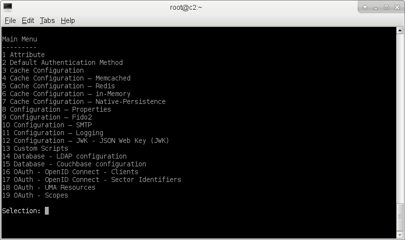
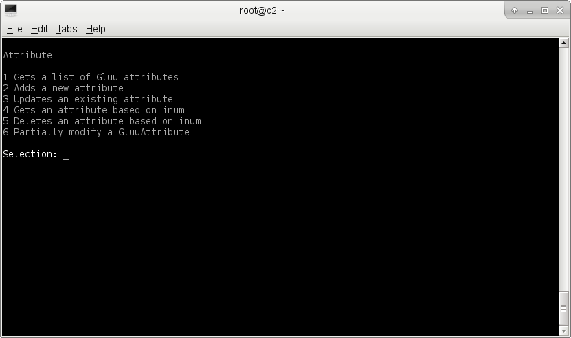
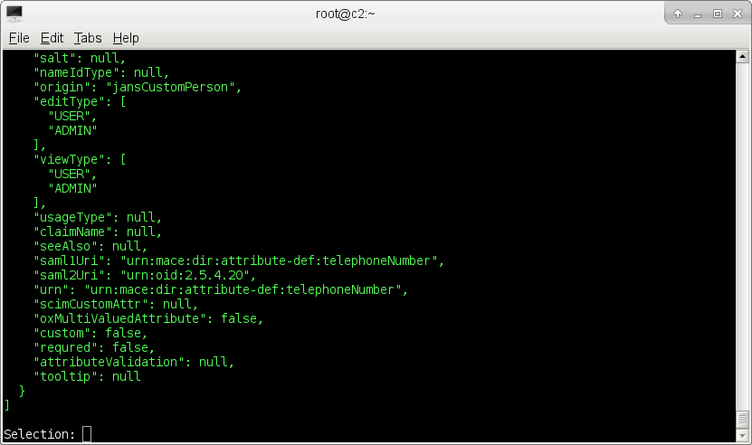
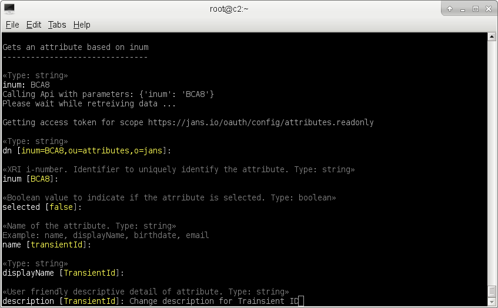
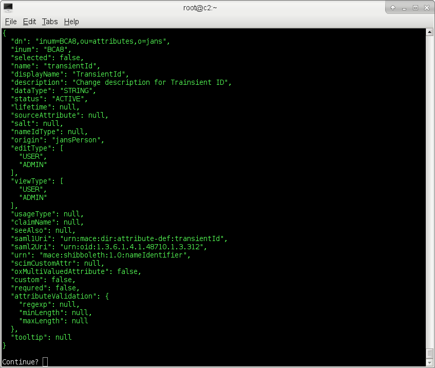

# Using jans-cli
`jans-cli` is automatically installed if you choose to install **jans-config-api** during installation of Janssen Server. `jans-cli` has two modes of operation
1. Menu-driven Interactive Mode
1. Command Line Argument Mode

## Menu-driven Interactive Mode
We will refer _Menu-driven Interactive Mode_ as **IM**. To run IM just simply execute jans-cli as follows:
```
/opt/jans/jans-cli/jca-cli.py
```
You will see main menu as


Using IM is ver simple and intuitive. Just make selection and answer questions. For example to get all attributes chose 1, you will get the following options:


Then chose 1, you will be asked Search size,  Search pattern and Status of the attribute. For simpleicity leave deafults in our case:


Once press Enter, it will retreive 50 attrbiutes and prints to screen in green color:


You can save result to file by chosing `w` in result screen. To go back enter `b`, to quit enter `q`. If you enter an reconised command, it will display valid commands.

To update an attrbiue, choose 3 (on Attribute screen). It will ask `inum` of attrbiute you are going to update. I want to change desctiption for attribute having inum **BCA8**. 
It will retreive current data and will ask for modifation of each properties, just leave defaults if you don't want to change that property.


When it comes to end, it will display modified data and ask if you want to continue (this data just before it sends to server)
 

After you enter `y` it will perform update and display updated data on screen.
