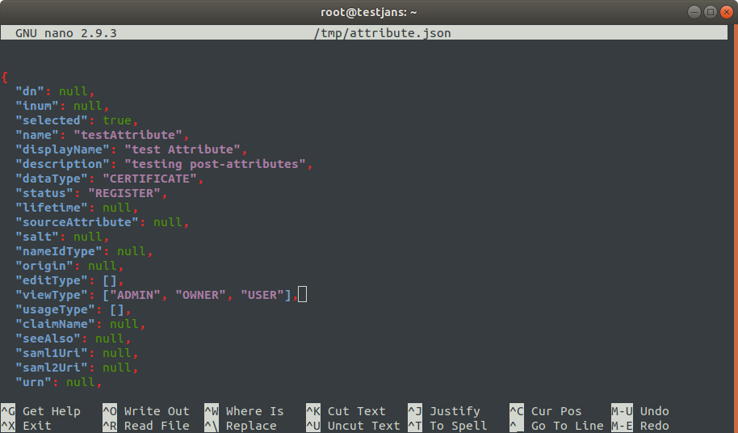

# Using jans-cli
`jans-cli` is automatically installed if you choose to install **jans-config-api** during installation of Janssen Server. `jans-cli` has two modes of operation
1. Menu-driven Interactive Mode
2. Command Line Argument Mode

## Menu-driven Interactive Mode
We will refer _Menu-driven Interactive Mode_ as **IM**. To run IM just simply execute jans-cli as follows:
```
/opt/jans/jans-cli/config-cli.py
```
You will see the main menu as below:


Using IM is very simple and intuitive. Just make selection and answer questions. From the following menu, you can choose any option by selecting it's number. Let's start from the beginning. 

### Attribute

Using **Janssen CLI**, You can perform some quick operation in _Attribute_. Such as:
- `view/find` list of Attributes in details.
- `add` new attributes.
- `update` an existing attribute
- `delete` an attribute using it's `inum`, etc.

For example to get all attributes choose 1 from the Menu, you will get the following options:


To `View/Find` attributes choose 1, you will be asked `Search size`,  `Search pattern` and `Status of the attribute`. For simplicity leave defaults in our case:


Once press Enter, it will retrieve 50 attributes and prints to screen in green color:


You can save result as a file by choosing `w` in result screen. To go back enter `b`, to quit enter `q`. If you enter an recognized command, it will display valid commands.

To `Add` a new attribute, choose 2 (on Attribute screen). Then enter value for each type of attribute items, after then it will ask to `continue?` enter `y` to continue. If everything are filled in the right way, it will create a new attribute on the list. 

 

To `update` an attribute, choose 3 (on Attribute screen). It will ask `inum` of attribute you are going to update. For example; I want to change description for attribute having inum **BCA8**. 
It will retrieve current data and will ask for modification of each properties, just leave defaults if you don't want to change that property.


When it comes to end, it will display modified data and ask if you want to continue (this data just before it sends to server)

 

After you enter `y` it will perform update and display updated data on screen.


To `delete` an attribute, choose option 5 from Attribute Menu. Enter the `inum` value that you want to delete. Here I chose that I already created in the above: `"inum=a0d1c46e-6184-44c1-a299-29acb3ee8ff7"` It will ask for confirmation, enter `y` to confirm.


### Authentication Method
Sometimes It's getting hard to change **Default Authentication Method** from web browser if you can't login using web interface. Here Janssen CLI is going to help you a lot. 


- `View` Default Authentication Method.
- `Update` Default Authentication Method.

Select option 2 from the Main Menu to chose Authentication Method. You can see such option as listed above.

To `View` default authentication method select 1 from Authentication Menu, It will show you current default authentication method of janssen server.


To `update` default authentication method select 2, then enter the default authentication method that you want to update with it. It will ask for the confirmation, `y` to confirm. 


### Cache Configuration
In the following Main Menu, Options `3, 4, 5, 6 & 7` are for **Cache Configuration**. 
- Cache Configuration
- Cache Configuration – Memcached
- Cache Configuration – Redis
- Cache Configuration – in-Memory
- Cache Configuration – Native-Persistence

Select option 3 to enter in _Cache Configuration_ menu. If you want to view cache configuration then choose option 1
from Cache Configuration Menu. It will return cache configuration in details as below:
```json5
{
  "cacheProviderType": "NATIVE_PERSISTENCE",
  "memcachedConfiguration": {
    "servers": "localhost:11211",
    "maxOperationQueueLength": 100000,
    "bufferSize": 32768,
    "defaultPutExpiration": 60,
    "connectionFactoryType": "DEFAULT"
  },
  "redisConfiguration": {
    "redisProviderType": "STANDALONE",
    "servers": "localhost:6379",
    "password": null,
    "defaultPutExpiration": 60,
    "sentinelMasterGroupName": null,
    "useSSL": false,
    "sslTrustStoreFilePath": null,
    "maxIdleConnections": 10,
    "maxTotalConnections": 500,
    "connectionTimeout": 3000,
    "soTimeout": 3000,
    "maxRetryAttempts": 5
  },
  "inMemoryConfiguration": {
    "defaultPutExpiration": 60
  },
  "nativePersistenceConfiguration": {
    "defaultPutExpiration": 60,
    "defaultCleanupBatchSize": 10000,
    "deleteExpiredOnGetRequest": false
  }
}
```

To update configuration for each type of cache provider, you can simply choose option `4, 5, 6 or 7` according to Cache Provider Type.

### Jans Authorization Server
From the Main Menu choose option 8 to `get/modify` Jans authorization server configuration properties.
```text
Configuration – Properties
--------------------------
1 Gets all Jans authorization server configuration properties
2 Partially modifies Jans authorization server Application configuration properties

```

Select 1 to get all the details about Jans authorization server configuration. It will show all the properties as below:
```json5
{
  "issuer": "https://testjans.gluu.com",
  "baseEndpoint": "https://testjans.gluu.com/jans-auth/restv1",
  "authorizationEndpoint": "https://testjans.gluu.com/jans-auth/restv1/authorize",
  "tokenEndpoint": "https://testjans.gluu.com/jans-auth/restv1/token",
  "tokenRevocationEndpoint": "https://testjans.gluu.com/jans-auth/restv1/revoke",
  "userInfoEndpoint": "https://testjans.gluu.com/jans-auth/restv1/userinfo",
  "clientInfoEndpoint": "https://testjans.gluu.com/jans-auth/restv1/clientinfo",
  "checkSessionIFrame": "https://testjans.gluu.com/jans-auth/opiframe.htm",
  "endSessionEndpoint": "https://testjans.gluu.com/jans-auth/restv1/end_session",
  "jwksUri": "https://testjans.gluu.com/jans-auth/restv1/jwks",
  "registrationEndpoint": "https://testjans.gluu.com/jans-auth/restv1/register",
  "openIdDiscoveryEndpoint": "https://testjans.gluu.com/.well-known/webfinger",
  "openIdConfigurationEndpoint": "https://testjans.gluu.com/.well-known/openid-configuration",
  "idGenerationEndpoint": "https://testjans.gluu.com/jans-auth/restv1/id",
  "introspectionEndpoint": "https://testjans.gluu.com/jans-auth/restv1/introspection",
  "deviceAuthzEndpoint": "https://testjans.gluu.com/jans-auth/restv1/device_authorization",
  "sessionAsJwt": false,
  "sectorIdentifierCacheLifetimeInMinutes": 1440,
  "umaConfigurationEndpoint": "https://testjans.gluu.com/jans-auth/restv1/uma2-configuration",
  "umaRptAsJwt": false,
  "umaRptLifetime": 3600,
  "umaTicketLifetime": 3600,
  "umaPctLifetime": 2592000,
  "umaResourceLifetime": 2592000,
  "umaAddScopesAutomatically": true,
  "umaValidateClaimToken": false,
  "umaGrantAccessIfNoPolicies": false,
  "umaRestrictResourceToAssociatedClient": false,
  "spontaneousScopeLifetime": 86400,
  "openidSubAttribute": "inum",
  "responseTypesSupported": [
    "['token', 'code']",
    "['id_token']",
    "['token']",
    "['id_token', 'code']",
    "['id_token', 'token', 'code']",
    "['code']",
    "['id_token', 'token']"
  ],
  "responseModesSupported": [
    "query",
    "form_post",
    "fragment"
  ],
  "grantTypesSupported": [
    "password",
    "client_credentials",
    "refresh_token",
    "urn:ietf:params:oauth:grant-type:uma-ticket",
    "urn:ietf:params:oauth:grant-type:device_code",
    "implicit",
    "authorization_code"
  ],
  "subjectTypesSupported": [
    "public",
    "pairwise"
  ],
  "defaultSubjectType": [
    "p",
    "a",
    "i",
    "r",
    "w",
    "i",
    "s",
    "e"
  ],
  "userInfoSigningAlgValuesSupported": [
    "HS256",
    "HS384",
    "HS512",
    "RS256",
    "RS384",
    "RS512",
    "ES256",
    "ES384",
    "ES512"
  ],
  "userInfoEncryptionAlgValuesSupported": [
    "RSA1_5",
    "RSA-OAEP",
    "A128KW",
    "A256KW"
  ],
  "userInfoEncryptionEncValuesSupported": [
    "A128CBC+HS256",
    "A256CBC+HS512",
    "A128GCM",
    "A256GCM"
  ],
  "idTokenSigningAlgValuesSupported": [
    "none",
    "HS256",
    "HS384",
    "HS512",
    "RS256",
    "RS384",
    "RS512",
    "ES256",
    "ES384",
    "ES512"
  ],
  "idTokenEncryptionAlgValuesSupported": [
    "RSA1_5",
    "RSA-OAEP",
    "A128KW",
    "A256KW"
  ],
  "idTokenEncryptionEncValuesSupported": [
    "A128CBC+HS256",
    "A256CBC+HS512",
    "A128GCM",
    "A256GCM"
  ],
  "requestObjectSigningAlgValuesSupported": [
    "none",
    "HS256",
    "HS384",
    "HS512",
    "RS256",
    "RS384",
    "RS512",
    "ES256",
    "ES384",
    "ES512"
  ],
  "requestObjectEncryptionAlgValuesSupported": [
    "RSA1_5",
    "RSA-OAEP",
    "A128KW",
    "A256KW"
  ],
  "requestObjectEncryptionEncValuesSupported": [
    "A128CBC+HS256",
    "A256CBC+HS512",
    "A128GCM",
    "A256GCM"
  ],
  "tokenEndpointAuthMethodsSupported": [
    "client_secret_basic",
    "client_secret_post",
    "client_secret_jwt",
    "private_key_jwt",
    "tls_client_auth",
    "self_signed_tls_client_auth"
  ],
  "tokenEndpointAuthSigningAlgValuesSupported": [
    "HS256",
    "HS384",
    "HS512",
    "RS256",
    "RS384",
    "RS512",
    "ES256",
    "ES384",
    "ES512"
  ],
  "dynamicRegistrationCustomAttributes": null,
  "displayValuesSupported": [
    "page",
    "popup"
  ],
  "claimTypesSupported": [
    "normal"
  ],
  "jwksAlgorithmsSupported": [
    "RS256",
    "RS384",
    "RS512",
    "ES256",
    "ES384",
    "ES512",
    "PS256",
    "PS384",
    "PS512",
    "RSA1_5",
    "RSA-OAEP"
  ],
  "serviceDocumentation": [
    "h",
    "t",
    "t",
    "p",
    ":",
    "/",
    "/",
    "j",
    "a",
    "n",
    "s",
    ".",
    "o",
    "r",
    "g",
    "/",
    "d",
    "o",
    "c",
    "s"
  ],
  "claimsLocalesSupported": [
    "en"
  ],
  "idTokenTokenBindingCnfValuesSupported": [
    "tbh"
  ],
  "uiLocalesSupported": [
    "en",
    "bg",
    "de",
    "es",
    "fr",
    "it",
    "ru",
    "tr"
  ],
  "claimsParameterSupported": false,
  "requestParameterSupported": true,
  "requestUriParameterSupported": true,
  "requestUriHashVerificationEnabled": false,
  "requireRequestUriRegistration": false,
  "opPolicyUri": "http://www.jans.io/doku.php?id=jans:policy",
  "opTosUri": "http://www.jans.io/doku.php?id=jans:tos",
  "authorizationCodeLifetime": 60,
  "refreshTokenLifetime": 14400,
  "idTokenLifetime": 3600,
  "idTokenFilterClaimsBasedOnAccessToken": false,
  "accessTokenLifetime": 300,
  "cleanServiceInterval": 60,
  "cleanServiceBatchChunkSize": 10000,
  "cleanServiceBaseDns": null,
  "keyRegenerationEnabled": true,
  "keyRegenerationInterval": 48,
  "defaultSignatureAlgorithm": [
    "R",
    "S",
    "2",
    "5",
    "6"
  ],
  "oxOpenIdConnectVersion": "openidconnect-1.0",
  "oxId": "https://testjans.gluu.com/oxid/service/jans/inum",
  "dynamicRegistrationEnabled": true,
  "dynamicRegistrationExpirationTime": -1,
  "dynamicRegistrationPersistClientAuthorizations": true,
  "trustedClientEnabled": true,
  "skipAuthorizationForOpenIdScopeAndPairwiseId": false,
  "dynamicRegistrationScopesParamEnabled": true,
  "dynamicRegistrationPasswordGrantTypeEnabled": false,
  "dynamicRegistrationAllowedPasswordGrantScopes": null,
  "dynamicRegistrationCustomObjectClass": null,
  "personCustomObjectClassList": [
    "jansCustomPerson",
    "jansPerson"
  ],
  "persistIdTokenInLdap": false,
  "persistRefreshTokenInLdap": true,
  "allowPostLogoutRedirectWithoutValidation": false,
  "invalidateSessionCookiesAfterAuthorizationFlow": false,
  "returnClientSecretOnRead": true,
  "rejectJwtWithNoneAlg": true,
  "expirationNotificatorEnabled": false,
  "useNestedJwtDuringEncryption": true,
  "expirationNotificatorMapSizeLimit": 100000,
  "expirationNotificatorIntervalInSeconds": 600,
  "authenticationFiltersEnabled": false,
  "clientAuthenticationFiltersEnabled": false,
  "clientRegDefaultToCodeFlowWithRefresh": true,
  "authenticationFilters": [
    {
      "filter": "(&(mail=*{0}*)(inum={1}))",
      "bind": false,
      "bind-password-attribute": null,
      "base-dn": null
    },
    {
      "filter": "uid={0}",
      "bind": true,
      "bind-password-attribute": null,
      "base-dn": null
    }
  ],
  "clientAuthenticationFilters": [
    {
      "filter": "myCustomAttr1={0}",
      "bind": null,
      "bind-password-attribute": null,
      "base-dn": null
    }
  ],
  "corsConfigurationFilters": [
    {
      "filterName": "CorsFilter",
      "corsEnabled": true,
      "corsAllowedOrigins": "*",
      "corsAllowedMethods": "GET,POST,HEAD,OPTIONS",
      "corsAllowedHeaders": "Origin,Authorization,Accept,X-Requested-With,Content-Type,Access-Control-Request-Method,Access-Control-Request-Headers",
      "corsExposedHeaders": null,
      "corsSupportCredentials": true,
      "corsLoggingEnabled": false,
      "corsPreflightMaxAge": 1800,
      "corsRequestDecorate": true
    }
  ],
  "sessionIdUnusedLifetime": 86400,
  "sessionIdUnauthenticatedUnusedLifetime": 120,
  "sessionIdEnabled": true,
  "sessionIdPersistOnPromptNone": true,
  "sessionIdRequestParameterEnabled": false,
  "changeSessionIdOnAuthentication": true,
  "sessionIdPersistInCache": false,
  "sessionIdLifetime": 86400,
  "serverSessionIdLifetime": 86400,
  "configurationUpdateInterval": 3600,
  "enableClientGrantTypeUpdate": true,
  "dynamicGrantTypeDefault": [
    "client_credentials",
    "refresh_token",
    "urn:ietf:params:oauth:grant-type:uma-ticket",
    "urn:ietf:params:oauth:grant-type:device_code",
    "implicit",
    "authorization_code"
  ],
  "cssLocation": null,
  "jsLocation": null,
  "imgLocation": null,
  "metricReporterInterval": 300,
  "metricReporterKeepDataDays": 15,
  "metricReporterEnabled": false,
  "pairwiseIdType": [
    "a",
    "l",
    "g",
    "o",
    "r",
    "i",
    "t",
    "h",
    "m",
    "i",
    "c"
  ],
  "pairwiseCalculationKey": "sckNNuFhwz3r2fC4xLLlBeVybFw",
  "pairwiseCalculationSalt": "USZej6vS3pI7RzFIl3AT",
  "shareSubjectIdBetweenClientsWithSameSectorId": true,
  "webKeysStorage": "keystore",
  "dnName": "CN=Jans Auth CA Certificates",
  "keyStoreFile": "/etc/certs/jans-auth-keys.jks",
  "keyStoreSecret": "0EIsfpb6tURD",
  "keySelectionStrategy": "OLDER",
  "oxElevenTestModeToken": null,
  "oxElevenGenerateKeyEndpoint": "https://testjans.gluu.com/oxeleven/rest/oxeleven/generateKey",
  "oxElevenSignEndpoint": "https://testjans.gluu.com/oxeleven/rest/oxeleven/sign",
  "oxElevenVerifySignatureEndpoint": "https://testjans.gluu.com/oxeleven/rest/oxeleven/verifySignature",
  "oxElevenDeleteKeyEndpoint": "https://testjans.gluu.com/oxeleven/rest/oxeleven/deleteKey",
  "introspectionAccessTokenMustHaveUmaProtectionScope": false,
  "endSessionWithAccessToken": false,
  "cookieDomain": null,
  "enabledOAuthAuditLogging": null,
  "jmsBrokerURISet": null,
  "jmsUserName": null,
  "jmsPassword": null,
  "clientWhiteList": [
    "*"
  ],
  "clientBlackList": [
    "*.attacker.com/*"
  ],
  "legacyIdTokenClaims": false,
  "customHeadersWithAuthorizationResponse": true,
  "frontChannelLogoutSessionSupported": true,
  "loggingLevel": "INFO",
  "loggingLayout": "text",
  "updateUserLastLogonTime": false,
  "updateClientAccessTime": false,
  "logClientIdOnClientAuthentication": true,
  "logClientNameOnClientAuthentication": false,
  "disableJdkLogger": true,
  "authorizationRequestCustomAllowedParameters": [
    "customParam2",
    "customParam3",
    "customParam1"
  ],
  "legacyDynamicRegistrationScopeParam": false,
  "openidScopeBackwardCompatibility": false,
  "disableU2fEndpoint": false,
  "useLocalCache": true,
  "fapiCompatibility": false,
  "forceIdTokenHintPrecense": false,
  "forceOfflineAccessScopeToEnableRefreshToken": true,
  "errorReasonEnabled": false,
  "removeRefreshTokensForClientOnLogout": true,
  "skipRefreshTokenDuringRefreshing": false,
  "refreshTokenExtendLifetimeOnRotation": false,
  "consentGatheringScriptBackwardCompatibility": false,
  "introspectionScriptBackwardCompatibility": false,
  "introspectionResponseScopesBackwardCompatibility": false,
  "softwareStatementValidationType": "script",
  "softwareStatementValidationClaimName": null,
  "authenticationProtectionConfiguration": {
    "attemptExpiration": 15,
    "maximumAllowedAttemptsWithoutDelay": 4,
    "delayTime": 2,
    "bruteForceProtectionEnabled": false
  },
  "errorHandlingMethod": "internal",
  "keepAuthenticatorAttributesOnAcrChange": false,
  "deviceAuthzRequestExpiresIn": 1800,
  "deviceAuthzTokenPollInterval": 5,
  "deviceAuthzResponseTypeToProcessAuthz": "code",
  "backchannelClientId": null,
  "backchannelRedirectUri": "https://testjans.gluu.com/jans-auth/ciba/home.htm",
  "backchannelAuthenticationEndpoint": "https://testjans.gluu.com/jans-auth/restv1/bc-authorize",
  "backchannelDeviceRegistrationEndpoint": "https://testjans.gluu.com/jans-auth/restv1/bc-deviceRegistration",
  "backchannelTokenDeliveryModesSupported": [
    "poll",
    "ping",
    "push"
  ],
  "backchannelAuthenticationRequestSigningAlgValuesSupported": null,
  "backchannelUserCodeParameterSupported": false,
  "backchannelBindingMessagePattern": "^[a-zA-Z0-9]{4,8}$",
  "backchannelAuthenticationResponseExpiresIn": 3600,
  "backchannelAuthenticationResponseInterval": 2,
  "backchannelLoginHintClaims": [
    "inum",
    "uid",
    "mail"
  ],
  "cibaEndUserNotificationConfig": {
    "apiKey": null,
    "authDomain": null,
    "databaseURL": null,
    "projectId": null,
    "storageBucket": null,
    "messagingSenderId": null,
    "appId": null,
    "notificationUrl": null,
    "notificationKey": null,
    "publicVapidKey": null
  },
  "backchannelRequestsProcessorJobIntervalSec": 5,
  "backchannelRequestsProcessorJobChunkSize": 100,
  "cibaGrantLifeExtraTimeSec": 180,
  "cibaMaxExpirationTimeAllowedSec": 1800,
  "cibaEnabled": false,
  "discoveryCacheLifetimeInMinutes": 60,
  "httpLoggingEnabled": false,
  "httpLoggingExludePaths": null,
  "externalLoggerConfiguration": null
}
```
By selecting 2nd option, you can modify partially some of its properties. 

### Janssen FIDO2
Janssen includes a FIDO2 component to implement a two-step, two-factor authentication (2FA) with username / password as 
the first step, and any FIDO2 device as the second step. During Janssen installation, the administrator will have the 
option to also install the FIDO2 component.

Using Janssen CLI, you can `view/update` details of the FIDO2 configuration.
From the main menu select option 9, It will give two option to choose:

```text
Configuration – Fido2
---------------------
1 Gets Jans Authorization Server Fido2 configuration properties
2 Updates Fido2 configuration properties
```
If you chose the first option, you will get some details of fido2 configuration properties:
```json5
{
  "issuer": "https://testjans.gluu.com",
  "baseEndpoint": "https://testjans.gluu.com/fido2/restv1",
  "cleanServiceInterval": 60,
  "cleanServiceBatchChunkSize": 10000,
  "useLocalCache": true,
  "disableJdkLogger": true,
  "loggingLevel": "INFO",
  "loggingLayout": "text",
  "externalLoggerConfiguration": "",
  "metricReporterInterval": 300,
  "metricReporterKeepDataDays": 15,
  "metricReporterEnabled": true,
  "personCustomObjectClassList": [
    "jansCustomPerson",
    "jansPerson"
  ],
  "fido2Configuration": {
    "authenticatorCertsFolder": "/etc/jans/conf/fido2/authenticator_cert",
    "mdsCertsFolder": "/etc/jans/conf/fido2/mds/cert",
    "mdsTocsFolder": "/etc/jans/conf/fido2/mds/toc",
    "serverMetadataFolder": "/etc/jans/conf/fido2/server_metadata",
    "requestedParties": [
      {
        "name": "https://testjans.gluu.com",
        "domains": [
          "testjans.gluu.com"
        ]
      }
    ],
    "userAutoEnrollment": false,
    "unfinishedRequestExpiration": 180,
    "authenticationHistoryExpiration": 1296000,
    "requestedCredentialTypes": [
      "RS256",
      "ES256"
    ]
  }
}
```
If you want to update fido2 configuration, you can choose 2nd option. It will ask to fill each property, skip for default values. 
For example, if you want to change logginglevel `INFO` to `DEBUG`, simply enter **DEBUG** when it will ask to enter a value.

### SMTP Server Configuration
Janssen CLI also supports SMTP configuration. You can do following things as stated below:
- `View/Get`
- `Add/Delete`
- `Update`
- `Test`

Simply select option 10 from Main Menu it will show some options as below:
```text
Configuration – SMTP
--------------------
1 Returns SMTP server configuration
2 Adds SMTP server configuration
3 Updates SMTP server configuration
4 Deletes SMTP server configuration
5 Test SMTP server configuration
```
Just go with the option and perform operation.

### Janssen Logging Configuration
Using Janssen CLI, you can easily update logging configuration. Just go with the option 11
from Main Menu, It will display two options as sated below.
```text
Configuration – Logging
-----------------------
1 Returns Jans Authorization Server logging settings
2 Updates Jans Authorization Server logging settings
```

First option returns current logging configuration.
```json
Returns Jans Authorization Server logging settings
--------------------------------------------------
Please wait while retreiving data ...

Getting access token for scope https://jans.io/oauth/config/logging.readonly

{
  "loggingLevel": "INFO",
  "loggingLayout": "text",
  "httpLoggingEnabled": false,
  "disableJdkLogger": true,
  "enabledOAuthAuditLogging": false,
  "externalLoggerConfiguration": null,
  "httpLoggingExludePaths": null
}
```
To update current logging configuration select option 2. For example, I have updated `logginglevel INFO to DEBUG` and enabled `enabledOAuthAuditLogging`.
```json
Returns Jans Authorization Server logging settings
--------------------------------------------------
Please wait while retreiving data ...

Getting access token for scope https://jans.io/oauth/config/logging.readonly

«Logging level for Jans Authorization Server logger. Type: string»
loggingLevel [INFO]: DEBUG

«Logging layout used for Jans Authorization Server loggers. Type: string»
loggingLayout [text]: 

«To enable http request/response logging. Type: boolean»
httpLoggingEnabled [false]: 

«To enable/disable Jdk logging. Type: boolean»
disableJdkLogger [true]: 

«To enable/disable OAuth audit logging. Type: boolean»
enabledOAuthAuditLogging [false]: true
Please enter a(n) boolean value: _true, _false
enabledOAuthAuditLogging [false]: _true

«Path to external log4j2 configuration file. Type: string»
externalLoggerConfiguration: 

«List of paths to exclude from logger. Type: array of string separated by _,»
Example: /auth/img, /auth/stylesheet
httpLoggingExludePaths: 
Obtained Data:

{
  "loggingLevel": "DEBUG",
  "loggingLayout": "text",
  "httpLoggingEnabled": false,
  "disableJdkLogger": true,
  "enabledOAuthAuditLogging": true,
  "externalLoggerConfiguration": null,
  "httpLoggingExludePaths": null
}

Continue? y
Getting access token for scope https://jans.io/oauth/config/logging.write
Please wait while posting data ...

{
  "loggingLevel": "DEBUG",
  "loggingLayout": "text",
  "httpLoggingEnabled": false,
  "disableJdkLogger": true,
  "enabledOAuthAuditLogging": true,
  "externalLoggerConfiguration": null,
  "httpLoggingExludePaths": null
}

```

### JSON Web Key 
This operation is used to get the JSON Web Key Set (JWKS) from OP host. The JWKS is a set of keys containing the public 
keys that should be used to verify any JSON Web Token (JWT) issued by the authorization server.
From the Main Menu, Select option 12, It returns some options as stated below:

```text
Configuration – JWK - JSON Web Key (JWK)
----------------------------------------
1 Gets list of JSON Web Key (JWK) used by server
2 Puts/replaces JWKS
3 Patch JWKS
```
You can `view` list of JSON Web Key, `add/replace` and `patch` using Janssen CLI.

### Custom Scripts
Interception scripts can be used to implement custom business logic for authentication, authorization and more in a way 
that is upgrade-proof and doesn't require forking the Gluu Server code. Using Janssen CLI, you can perform such operation 
as listed below:

```text
Custom Scripts
--------------
1 Gets a list of custom scripts
2 Adds a new custom script
3 Updates a custom script
4 Gets list of scripts by type
5 Gets a script by Inum
6 Deletes a custom script
```
To Add a new script, choose option 2 and fill each property:

`dn, inum, display name, valid script`
```
ScriptType: [PERSON_AUTHENTICATION, INTROSPECTION, RESOURCE_OWNER_PASSWORD_CREDENTIALS, APPLICATION_SESSION, CACHE_REFRESH, UPDATE_USER, USER_REGISTRATION, CLIENT_REGISTRATION, ID_GENERATOR, UMA_RPT_POLICY, UMA_RPT_CLAIMS, UMA_CLAIMS_GATHERING, CONSENT_GATHERING, DYNAMIC_SCOPE, SPONTANEOUS_SCOPE, END_SESSION, POST_AUTHN, SCIM, CIBA_END_USER_NOTIFICATION, PERSISTENCE_EXTENSION, IDP]

Programming Language: [PYTHON, JAVASCRIPT]
```

### LDAP Configuration 

Using Janssen CLI, Following list of actions can be performed in LDAP.
```text
Database - LDAP configuration
-----------------------------
1 Gets list of existing LDAP configurations
2 Adds a new LDAP configuration
3 Updates LDAP configuration
4 Gets an LDAP configuration by name
5 Deletes an LDAP configuration
6 Partially modify an LDAP configuration
7 Tests an LDAP configuration
```
To get list of existing LDAP configurations, select option 1 and press enter: you will get as following result.

```text
Gets list of existing LDAP configurations
-----------------------------------------
Please wait while retreiving data ...

Getting access token for scope https://jans.io/oauth/config/database/ldap.readonly

[
  {
    "configId": "auth_ldap_server",
    "bindDN": "cn=directory manager",
    "bindPassword": "gD63aUTvvS4=",
    "servers": [
      "localhost:1636"
    ],
    "maxConnections": 1000,
    "useSSL": true,
    "baseDNs": [
      "ou=people,o=jans"
    ],
    "primaryKey": "uid",
    "localPrimaryKey": "uid",
    "useAnonymousBind": false,
    "enabled": false,
    "version": 0,
    "level": 0
  }
]
```

To add a new LDAP configuration, choose option 2 and add the following properties:
```json5
{
  "configId":
  "bindDN": 
  "bindPassword":
  "servers": [],
  "maxConnections": 2,
  "useSSL": false,
  "baseDNs": [],
  "primaryKey":
  "localPrimaryKey":
  "useAnonymousBind": false,
  "enabled": false,
  "version": null,
  "level": null
}
```
Then enter `y` to confirm.

To update an existing LDAP configuration, select option 3 and enter ldap configuration name. 
the given name is matched with the existing configurations then It will ask to enter value for each property.


### Couchbase Configuration

From the main menu, select option 15 to enter into Couchbase configuration menu. You will get the following menu like LDAP configuration.

```text
Database - Couchbase configuration
----------------------------------
1 Gets list of existing Couchbase configurations
2 Adds a new Couchbase configuration
3 Updates Couchbase configuration
4 Gets a Couchbase configurations by name
5 Partially modify an Couchbase configuration
6 Deletes a Couchbase configurations by name
7 Tests a Couchbase configuration
```

### OpenID Connect - Clients

OpenID Connect Interactive Mode supports following list of actions:

```text
OAuth - OpenID Connect - Clients
--------------------------------
1 Gets list of OpenID Connect clients
2 Create new OpenId connect client
3 Update OpenId Connect client
4 Get OpenId Connect Client by Inum
5 Delete OpenId Connect client
6 Update modified properties of OpenId Connect client by Inum
```
Using Janssen CLI, Administrator can easily `create/update/delete` openid Connect without any interrupt.

## Command Line Argument Mode
We will refer this mode as **CL** Using this mode is difficult compared to IM. First is get help, so type:
```
/opt/jans/jans-cli/config-cli.py --help
```

This will print how to use CL:

```commandline
usage: config-cli.py [-h] [--host HOST] [--client-id CLIENT_ID]
                     [--client_secret CLIENT_SECRET] [-debug]
                     [--debug-log-file DEBUG_LOG_FILE]
                     [--operation-id OPERATION_ID] [--url-suffix URL_SUFFIX]
                     [--info {ApiCli,AppConfigurat,Attribute,AuthenticationFilt,AuthenticationMet,AuthenticationProtectionConfigurat,CIBAEndUserNotificationCon,CacheConfigurat,CacheConfiguration,CacheConfigurationInMemory,CacheConfigurationMemcached,CacheConfigurationNativePersistence,CacheConfigurationRedis,Cli,ClientAttribu,Configurat,ConfigurationFido2,ConfigurationJWKJSONWebKeyJWK,ConfigurationLogging,ConfigurationProperties,ConfigurationSMTP,CorsConfigurationFil,CouchbaseConfigurat,CustomAttrib,CustomScr,CustomScripts,DatabaseCouchbaseConfiguration,DatabaseLDAPConfiguration,DefaultAuthenticationMethod,ErrorRespo,Fido2Configurat,GluuAttrib,GluuAttributeAttributeValidat,InMemoryConfigurat,InlineResponse,JansFido2DynConfigurat,JsonWeb,LdapConfigurat,LoggingConfigurat,MemcachedConfigurat,NativePersistenceConfigurat,OAuthOpenIDConnectClients,OAuthOpenIDConnectSectorIdentifiers,OAuthScopes,OAuthUMAResources,PatchRequ,RedisConfigurat,RequestedPart,Sc,ScopeAttribu,ScriptEr,SectorIdentif,SimpleCustomPrope,SimpleExtendedCustomPrope,SmtpConfigurat,UmaResou,WebKeysConfigurat}]
                     [--op-mode {get,post,put,patch,delete}]
                     [--endpoint-args ENDPOINT_ARGS] [--schema SCHEMA]
                     [--data DATA]

optional arguments:
  -h, --help            show this help message and exit
  --host HOST           Hostname of server
  --client-id CLIENT_ID
                        Jans Config Api Client ID
  --client_secret CLIENT_SECRET
                        Jans Config Api Client ID secret
  -debug                Run in debug mode
  --debug-log-file DEBUG_LOG_FILE
                        Log file name when run in debug mode
  --operation-id OPERATION_ID
                        Operation ID to be done
  --url-suffix URL_SUFFIX
                        Argument to be added api endpoint url. For example
                        inum:2B29
  --info {ApiCli,AppConfigurat,Attribute,AuthenticationFilt,AuthenticationMet,AuthenticationProtectionConfigurat,CIBAEndUserNotificationCon,CacheConfigurat,CacheConfiguration,CacheConfigurationInMemory,CacheConfigurationMemcached,CacheConfigurationNativePersistence,CacheConfigurationRedis,Cli,ClientAttribu,Configurat,ConfigurationFido2,ConfigurationJWKJSONWebKeyJWK,ConfigurationLogging,ConfigurationProperties,ConfigurationSMTP,CorsConfigurationFil,CouchbaseConfigurat,CustomAttrib,CustomScr,CustomScripts,DatabaseCouchbaseConfiguration,DatabaseLDAPConfiguration,DefaultAuthenticationMethod,ErrorRespo,Fido2Configurat,GluuAttrib,GluuAttributeAttributeValidat,InMemoryConfigurat,InlineResponse,JansFido2DynConfigurat,JsonWeb,LdapConfigurat,LoggingConfigurat,MemcachedConfigurat,NativePersistenceConfigurat,OAuthOpenIDConnectClients,OAuthOpenIDConnectSectorIdentifiers,OAuthScopes,OAuthUMAResources,PatchRequ,RedisConfigurat,RequestedPart,Sc,ScopeAttribu,ScriptEr,SectorIdentif,SimpleCustomPrope,SimpleExtendedCustomPrope,SmtpConfigurat,UmaResou,WebKeysConfigurat}
                        Help for operation
  --op-mode {get,post,put,patch,delete}
                        Operation mode to be done
  --endpoint-args ENDPOINT_ARGS
                        Arguments to pass endpoint separated by comma. For
                        example limit:5,status:INACTIVE
  --schema SCHEMA       Get sample json schema
  --data DATA           Path to json data file
```
We start with getting information about tasks, the tasks are options of argument `--info`:

```
Attribute, CacheConfiguration, CacheConfigurationInMemory, CacheConfigurationMemcached, CacheConfigurationNativePersistence, CacheConfigurationRedis, ConfigurationFido2, ConfigurationJWKJSONWebKeyJWK, ConfigurationLogging, ConfigurationProperties, ConfigurationSMTP, CustomScripts, DatabaseCouchbaseConfiguration, DatabaseLDAPConfiguration, DefaultAuthenticationMethod, OAuthOpenIDConnectClients, OAuthOpenIDConnectSectorIdentifiers, OAuthScopes, OAuthUMAResources
```

To get information for a specific task we run command as below: 
```commandline
/opt/jans/jans-cli/config-cli.py --info [taks]
``` 
for example: 
```commandline
/opt/jans/jans-cli/config-cli.py --info DefaultAuthenticationMethod
``` 

It returns with some `operation id`:
```commandline
Operation ID: get-acrs
  Description: Gets default authentication method.
Operation ID: put-acrs
  Description: Updates default authentication method.
  Schema: /components/schemas/AuthenticationMethod

To get sample shema type /opt/jans/jans-cli/config-cli.py --schema <schma>, for example /opt/jans/jans-cli/config-cli.py --schema /components/schemas/AuthenticationMethod
```
To perform any operation, you have to run command line with the operation id. for example:

```commandline
/opt/jans/jans-cli/config-cli.py --operation-id get-acrs
```
It returns:

```text
Getting access token for scope https://jans.io/oauth/config/acrs.readonly
{
  "defaultAcr": "simple_password_auth"
}
```

This is how we can execute single line command to get information of the Janssen Server. As we discussed on a specific task in the Interactive Mode, similarly we will discuss here using single line command to perform such operation.

### Attribute

First thing, let's get the information for `Attribute`:
```commandline
/opt/jans/jans-cli/config-cli.py --info Attribute
```
In return, we get:

```text
Operation ID: get-attributes
  Description: Gets all attributes. Optionally max-size of the result, attribute status and pattern can be provided.
  Parameters:
  limit: Search size - max size of the results to return. [integer]
  pattern: Search pattern. [string]
  status: Status of the attribute [string]
Operation ID: post-attributes
  Description: Adds a new attribute.
  Schema: /components/schemas/GluuAttribute
Operation ID: put-attributes
  Description: Updates an existing attribute.
  Schema: /components/schemas/GluuAttribute
Operation ID: get-attributes-by-inum
  Description: Gets an attribute based on inum.
  url-suffix: inum
Operation ID: delete-attributes-by-inum
  Description: Deletes an attribute based on inum.
  url-suffix: inum
Operation ID: patch-attributes-by-inum
  Description: Partially modify a GluuAttribute.
  url-suffix: inum
  Schema: Array of /components/schemas/PatchRequest

To get sample shema type /opt/jans/jans-cli/config-cli.py --schema <schma>, for example /opt/jans/jans-cli/config-cli.py --schema /components/schemas/PatchRequest
```

- **get-attributes**

```text
Operation ID: get-attributes
  Description: Gets all attributes. Optionally max-size of the result, attribute status and pattern can be provided.
  Parameters:
  limit: Search size - max size of the results to return. [integer]
  pattern: Search pattern. [string]
  status: Status of the attribute [string]
```
Let's do some queries using `get-attributes` operation ID.

To get all the attributes without any arguments, run the following command:
```commandline
/opt/jans/jans-cli/config-cli.py --operation-id get-attributes
```

To get attributes with passing the arguments, let's retrieve randomly limit:5:

```commandline
/opt/jans/jans-cli/config-cli.py --operation-id get-attributes --enpoint-args limit:5
```

It will return any 5 attributes randomly:
```text
Getting access token for scope https://jans.io/oauth/config/attributes.readonly
Calling with params limit=5
[
  {
    "dn": "inum=B4B0,ou=attributes,o=jans",
    "inum": "B4B0",
    "selected": false,
    "name": "givenName",
    "displayName": "First Name",
    "description": "Given name(s) or first name(s) of the End-User.Note that in some cultures, people can have multiple given names;all can be present, with the names being separated by space characters.",
    "dataType": "STRING",
    "status": "ACTIVE",
    "lifetime": null,
    "sourceAttribute": null,
    "salt": null,
    "nameIdType": null,
    "origin": "jansPerson",
    "editType": [
      "USER",
      "ADMIN"
    ],
    "viewType": [
      "USER",
      "ADMIN"
    ],
    "usageType": null,
    "claimName": "given_name",
    "seeAlso": null,
    "saml1Uri": "urn:mace:dir:attribute-def:givenName",
    "saml2Uri": "urn:oid:2.5.4.42",
    "urn": "urn:mace:dir:attribute-def:givenName",
    "scimCustomAttr": null,
    "oxMultiValuedAttribute": false,
    "custom": false,
    "requred": false,
    "attributeValidation": null,
    "tooltip": null
  },
  {
    "dn": "inum=29DA,ou=attributes,o=jans",
    "inum": "29DA",
    "selected": false,
    "name": "inum",
    "displayName": "Inum",
    "description": "XRI i-number, persistent non-reassignable identifier",
    "dataType": "STRING",
    "status": "ACTIVE",
    "lifetime": null,
    "sourceAttribute": null,
    "salt": null,
    "nameIdType": null,
    "origin": "jansPerson",
    "editType": null,
    "viewType": [
      "USER",
      "ADMIN"
    ],
    "usageType": null,
    "claimName": "inum",
    "seeAlso": null,
    "saml1Uri": "urn:mace:dir:attribute-def:inum",
    "saml2Uri": "urn:oid:1.3.6.1.4.1.48710.1.3.117",
    "urn": "urn:jans:dir:attribute-def:inum",
    "scimCustomAttr": null,
    "oxMultiValuedAttribute": false,
    "custom": false,
    "requred": false,
    "attributeValidation": null,
    "tooltip": null
  },
  {
    "dn": "inum=B52A,ou=attributes,o=jans",
    "inum": "B52A",
    "selected": false,
    "name": "jansPrefUsrName",
    "displayName": "Preferred Username",
    "description": "A domain issued and managed identifier for the person.Subject - Identifier for the End-User at the Issuer.",
    "dataType": "STRING",
    "status": "ACTIVE",
    "lifetime": null,
    "sourceAttribute": null,
    "salt": null,
    "nameIdType": null,
    "origin": "jansPerson",
    "editType": [
      "ADMIN"
    ],
    "viewType": [
      "USER",
      "ADMIN"
    ],
    "usageType": null,
    "claimName": "preferred_username",
    "seeAlso": null,
    "saml1Uri": "urn:mace:dir:attribute-def:preferredUsername",
    "saml2Uri": "urn:oid:1.3.6.1.4.1.48710.1.3.320",
    "urn": "http://openid.net/specs/openid-connect-core-1_0.html/StandardClaims/preferred_username",
    "scimCustomAttr": null,
    "oxMultiValuedAttribute": false,
    "custom": false,
    "requred": false,
    "attributeValidation": null,
    "tooltip": null
  },
  {
    "dn": "inum=64A0,ou=attributes,o=jans",
    "inum": "64A0",
    "selected": false,
    "name": "profile",
    "displayName": "Profile URL",
    "description": "URL of the End-User's profile page. The contents of this Web page SHOULD be about the End-User.",
    "dataType": "STRING",
    "status": "ACTIVE",
    "lifetime": null,
    "sourceAttribute": null,
    "salt": null,
    "nameIdType": null,
    "origin": "jansPerson",
    "editType": [
      "USER",
      "ADMIN"
    ],
    "viewType": [
      "USER",
      "ADMIN"
    ],
    "usageType": null,
    "claimName": "profile",
    "seeAlso": null,
    "saml1Uri": "urn:mace:dir:attribute-def:profile",
    "saml2Uri": "urn:oid:1.3.6.1.4.1.48710.1.3.321",
    "urn": "http://openid.net/specs/openid-connect-core-1_0.html/StandardClaims/profile",
    "scimCustomAttr": null,
    "oxMultiValuedAttribute": false,
    "custom": false,
    "requred": false,
    "attributeValidation": null,
    "tooltip": null
  },
  {
    "dn": "inum=42E0,ou=attributes,o=jans",
    "inum": "42E0",
    "selected": false,
    "name": "uid",
    "displayName": "Username",
    "description": "A domain issued and managed identifier for the person.Subject - Identifier for the End-User at the Issuer.",
    "dataType": "STRING",
    "status": "ACTIVE",
    "lifetime": null,
    "sourceAttribute": null,
    "salt": null,
    "nameIdType": null,
    "origin": "jansPerson",
    "editType": [
      "ADMIN"
    ],
    "viewType": [
      "USER",
      "ADMIN"
    ],
    "usageType": null,
    "claimName": "user_name",
    "seeAlso": null,
    "saml1Uri": "urn:mace:dir:attribute-def:uid",
    "saml2Uri": "urn:oid:0.9.2342.19200300.100.1.1",
    "urn": "urn:mace:dir:attribute-def:uid",
    "scimCustomAttr": null,
    "oxMultiValuedAttribute": false,
    "custom": false,
    "requred": false,
    "attributeValidation": null,
    "tooltip": null
  }
]
```

To get attributes with `pattern & status`:
```commandline
/opt/jans/jans-cli/config-cli.py --operation-id get-attributes --endpoint-args limit:5,pattern:profile,status:ACTIVE
```
In return, we get:

```properties
Getting access token for scope https://jans.io/oauth/config/attributes.readonly
Calling with params limit=5&pattern=profile&status=ACTIVE
[
  {
    "dn": "inum=EC3A,ou=attributes,o=jans",
    "inum": "EC3A",
    "selected": false,
    "name": "picture",
    "displayName": "Picture URL",
    "description": "URL of the End-User's profile picture",
    "dataType": "STRING",
    "status": "ACTIVE",
    "lifetime": null,
    "sourceAttribute": null,
    "salt": null,
    "nameIdType": null,
    "origin": "jansPerson",
    "editType": [
      "USER",
      "ADMIN"
    ],
    "viewType": [
      "USER",
      "ADMIN"
    ],
    "usageType": null,
    "claimName": "picture",
    "seeAlso": null,
    "saml1Uri": "urn:mace:dir:attribute-def:picture",
    "saml2Uri": "urn:oid:1.3.6.1.4.1.48710.1.3.322",
    "urn": "http://openid.net/specs/openid-connect-core-1_0.html/StandardClaims/picture",
    "scimCustomAttr": null,
    "oxMultiValuedAttribute": false,
    "custom": false,
    "requred": false,
    "attributeValidation": null,
    "tooltip": null
  },
  {
    "dn": "inum=64A0,ou=attributes,o=jans",
    "inum": "64A0",
    "selected": false,
    "name": "profile",
    "displayName": "Profile URL",
    "description": "URL of the End-User's profile page. The contents of this Web page SHOULD be about the End-User.",
    "dataType": "STRING",
    "status": "ACTIVE",
    "lifetime": null,
    "sourceAttribute": null,
    "salt": null,
    "nameIdType": null,
    "origin": "jansPerson",
    "editType": [
      "USER",
      "ADMIN"
    ],
    "viewType": [
      "USER",
      "ADMIN"
    ],
    "usageType": null,
    "claimName": "profile",
    "seeAlso": null,
    "saml1Uri": "urn:mace:dir:attribute-def:profile",
    "saml2Uri": "urn:oid:1.3.6.1.4.1.48710.1.3.321",
    "urn": "http://openid.net/specs/openid-connect-core-1_0.html/StandardClaims/profile",
    "scimCustomAttr": null,
    "oxMultiValuedAttribute": false,
    "custom": false,
    "requred": false,
    "attributeValidation": null,
    "tooltip": null
  }
]
```

- **post-attributes**

```text
Operation ID: post-attributes
  Description: Adds a new attribute.
  Schema: /components/schemas/GluuAttribute
```
Before adding a new attribute, let's get sample `schema`:
```commandline
/opt/jans/jans-cli/config-cli.py --schema /components/schemas/GluuAttribute > /tmp/attribute.json
```  
It will return as below:

```text
{
  "dn": null,
  "inum": null,
  "selected": true,
  "name": "name, displayName, birthdate, email",
  "displayName": "string",
  "description": "string",
  "dataType": "STRING",
  "status": "REGISTER",
  "lifetime": null,
  "sourceAttribute": null,
  "salt": null,
  "nameIdType": null,
  "origin": null,
  "editType": [],
  "viewType": "array",
  "usageType": [],
  "claimName": null,
  "seeAlso": null,
  "saml1Uri": null,
  "saml2Uri": null,
  "urn": null,
  "scimCustomAttr": true,
  "oxMultiValuedAttribute": true,
  "custom": true,
  "requred": true,
  "attributeValidation": {
    "regexp": null,
    "minLength": null,
    "maxLength": null
  },
  "tooltip": null
}
```
Modify it to update attribute `name`, `display name`, `view type`:
```text
nano /tmp/attribute.json
```



Now, let's add this attribute using `post-attributes`:
```commandline
/opt/jans/jans-cli/config-cli.py --operation-id post-attributes --data /tmp/attribute.json
```
It will create new attribute into the Attribute list with updated `inum & dn`:

```text
Getting access token for scope https://jans.io/oauth/config/attributes.write
Server Response:
{
  "dn": "inum=256135af-56eb-43f3-9583-d7e9fc75c672,ou=attributes,o=jans",
  "inum": "256135af-56eb-43f3-9583-d7e9fc75c672",
  "selected": false,
  "name": "testAttribute",
  "displayName": "test Attribute",
  "description": "testing post-attributes",
  "dataType": "CERTIFICATE",
  "status": "REGISTER",
  "lifetime": null,
  "sourceAttribute": null,
  "salt": null,
  "nameIdType": null,
  "origin": null,
  "editType": null,
  "viewType": [
    "ADMIN",
    "OWNER",
    "USER"
  ],
  "usageType": null,
  "claimName": null,
  "seeAlso": null,
  "saml1Uri": null,
  "saml2Uri": null,
  "urn": null,
  "scimCustomAttr": false,
  "oxMultiValuedAttribute": false,
  "custom": false,
  "requred": false,
  "attributeValidation": {
    "regexp": null,
    "minLength": null,
    "maxLength": null
  },
  "tooltip": null
}
```


### OAuthScopes
Let's get information for a task **OAuthScopes**

```
 /opt/jans/jans-cli/config-cli.py --info OAuthScopes

Operation ID: get-oauth-scopes
  Description: Gets list of Scopes. Optionally type to filter the scope, max-size of the result and pattern can be provided.
  Parameters:
  type: Scope type. [string]
  limit: Search size - max size of the results to return. [integer]
  pattern: Search pattern. [string]
Operation ID: post-oauth-scopes
  Description: Create Scope.
  Schema: /components/schemas/Scope
Operation ID: put-oauth-scopes
  Description: Updates existing Scope.
  Schema: /components/schemas/Scope
Operation ID: get-oauth-scopes-by-inum
  Description: Get Scope by Inum
  url-suffix: inum
Operation ID: delete-oauth-scopes-by-id
  Description: Delete Scope.
  url-suffix: inum
Operation ID: patch-oauth-scopes-by-id
  Description: Update modified attributes of existing Scope by Inum.
  url-suffix: inum
  Schema: Array of /components/schemas/PatchRequest

To get sample schema type /opt/jans/jans-cli/config-cli.py --schema <schema>, for example /opt/jans/jans-cli/config-cli.py --schema /components/schemas/PatchRequest
```
Operations will be done with **Operation ID**. Some operations may take parameters, let's retrieve `3` scopes (**limit**) that has `view` in it's description (**pattern**) and **type** `openid`:

```
 /opt/jans/jans-cli/config-cli.py --operation-id get-oauth-scopes --endpoint-args limit:3,pattern:view,type:openid
 ```
 
It will return:
 
 ```
 Getting access token for scope https://jans.io/oauth/config/scopes.readonly
Calling with params limit=3&pattern=view&type=openid
[
  {
    "dn": "inum=43F1,ou=scopes,o=jans",
    "id": "profile",
    "inum": "43F1",
    "displayName": null,
    "description": "View your basic profile info.",
    "iconUrl": null,
    "authorizationPolicies": null,
    "defaultScope": false,
    "scopeType": "openid",
    "claims": [
      "inum=2B29,ou=attributes,o=jans",
      "inum=0C85,ou=attributes,o=jans",
      "inum=B4B0,ou=attributes,o=jans",
      "inum=A0E8,ou=attributes,o=jans",
      "inum=5EC6,ou=attributes,o=jans",
      "inum=B52A,ou=attributes,o=jans",
      "inum=64A0,ou=attributes,o=jans",
      "inum=EC3A,ou=attributes,o=jans",
      "inum=3B47,ou=attributes,o=jans",
      "inum=3692,ou=attributes,o=jans",
      "inum=98FC,ou=attributes,o=jans",
      "inum=A901,ou=attributes,o=jans",
      "inum=36D9,ou=attributes,o=jans",
      "inum=BE64,ou=attributes,o=jans",
      "inum=6493,ou=attributes,o=jans"
    ],
    "umaType": false,
    "umaAuthorizationPolicies": null,
    "attributes": {
      "spontaneousClientId": null,
      "spontaneousClientScopes": null,
      "showInConfigurationEndpoint": true
    }
  },
  {
    "dn": "inum=C17A,ou=scopes,o=jans",
    "id": "address",
    "inum": "C17A",
    "displayName": null,
    "description": "View your address.",
    "iconUrl": null,
    "authorizationPolicies": null,
    "defaultScope": false,
    "scopeType": "openid",
    "claims": [
      "inum=27DB,ou=attributes,o=jans",
      "inum=2A3D,ou=attributes,o=jans",
      "inum=6609,ou=attributes,o=jans",
      "inum=6EEB,ou=attributes,o=jans",
      "inum=BCE8,ou=attributes,o=jans",
      "inum=D90B,ou=attributes,o=jans",
      "inum=E6B8,ou=attributes,o=jans",
      "inum=E999,ou=attributes,o=jans"
    ],
    "umaType": false,
    "umaAuthorizationPolicies": null,
    "attributes": {
      "spontaneousClientId": null,
      "spontaneousClientScopes": null,
      "showInConfigurationEndpoint": true
    }
  },
  {
    "dn": "inum=764C,ou=scopes,o=jans",
    "id": "email",
    "inum": "764C",
    "displayName": null,
    "description": "View your email address.",
    "iconUrl": null,
    "authorizationPolicies": null,
    "defaultScope": false,
    "scopeType": "openid",
    "claims": [
      "inum=8F88,ou=attributes,o=jans",
      "inum=CAE3,ou=attributes,o=jans"
    ],
    "umaType": false,
    "umaAuthorizationPolicies": null,
    "attributes": {
      "spontaneousClientId": null,
      "spontaneousClientScopes": null,
      "showInConfigurationEndpoint": true
    }
  }
]
```

Let's create a scope, for this we need a sample schema, you can use of the above result, or can get sample schema. Remember when we queried info for a task **OAuthScopes** it printed:

```
Operation ID: post-oauth-scopes
  Description: Create Scope.
  Schema: /components/schemas/Scope
```
Thus, we can get sample schema and use Operation ID `post-oauth-scopes`. Lets get sample schema:

```
/opt/jans/jans-cli/config-cli.py --schema /components/schemas/Scope > /tmp/scope.json
```

Now edit file `tmp/scope.json` with an editor (like **nano**). As an example we just filled the following properties:

```
"id": "TestScopeID",
"displayName": "TestScope",
"description": "Test Scope created by jans-cli",
```

 

It is time to post the data:

```
 /opt/jans/jans-cli/config-cli.py --operation-id post-oauth-scopes --data /tmp/scope.json 

Getting access token for scope https://jans.io/oauth/config/scopes.write
Server Response:
{
  "dn": "inum=112116fd-257b-40d8-a2c9-0c23536680ed,ou=scopes,o=jans",
  "id": "TestScopeID",
  "inum": "112116fd-257b-40d8-a2c9-0c23536680ed",
  "displayName": "TestScope",
  "description": "Test Scope created by jans-cli",
  "iconUrl": null,
  "authorizationPolicies": null,
  "defaultScope": true,
  "scopeType": "openid",
  "claims": null,
  "umaType": false,
  "umaAuthorizationPolicies": null,
  "attributes": {
    "spontaneousClientId": null,
    "spontaneousClientScopes": null,
    "showInConfigurationEndpoint": true
  }
}

```

It created scope with inum `112116fd-257b-40d8-a2c9-0c23536680ed` and returned current data. Let's update `iconUrl` with patch method. So we need a schema for patch method. Remember when we queried info for the task **OAuthScopes** it printed:

```
Operation ID: patch-oauth-scopes-by-id
  Description: Update modified attributes of existing Scope by Inum.
  url-suffix: inum
  Schema: Array of /components/schemas/PatchRequest
 ```
 
This means we need schema `/components/schemas/PatchRequest`, be careful it states **Array of**, so we will make an array of this schema, in case you need multiple changes with patch method, you can put as many as of this schema into array. Get schema:

```
/opt/jans/jans-cli/config-cli.py --schema /components/schemas/PatchRequest > /tmp/patch.json
```

When you examine this json, you will see three properties in an object: op, path, and value. Meanings of these properties are as follows:
* __op__ operation to be done, one of `add`, `remove`, `replace`, `move`, `copy`, `test`
* __path__ Path of property to be changed. use path separator `/` to change a property inside object. For example to change **spontaneousClientId** you can use `attributes/spontaneousClientId`
* __value__ New value to be assigned for property defined in `path`

We can edit this json as follows (remember to make it an array):


Let's do the operation:

```
/opt/jans/jans-cli/config-cli.py --operation-id patch-oauth-scopes-by-id --url-suffix inum:112116fd-257b-40d8-a2c9-0c23536680ed --data /tmp/patch.json 

Getting access token for scope https://jans.io/oauth/config/scopes.write
Server Response:
{
  "dn": "inum=112116fd-257b-40d8-a2c9-0c23536680ed,ou=scopes,o=jans",
  "id": "TestScopeID",
  "inum": "112116fd-257b-40d8-a2c9-0c23536680ed",
  "displayName": "TestScope",
  "description": "Test Scope created by jans-cli",
  "iconUrl": "https://www.jans.io/icon.png",
  "authorizationPolicies": null,
  "defaultScope": true,
  "scopeType": "openid",
  "claims": null,
  "umaType": false,
  "umaAuthorizationPolicies": null,
  "attributes": {
    "spontaneousClientId": null,
    "spontaneousClientScopes": null,
    "showInConfigurationEndpoint": true
  }
}
```


