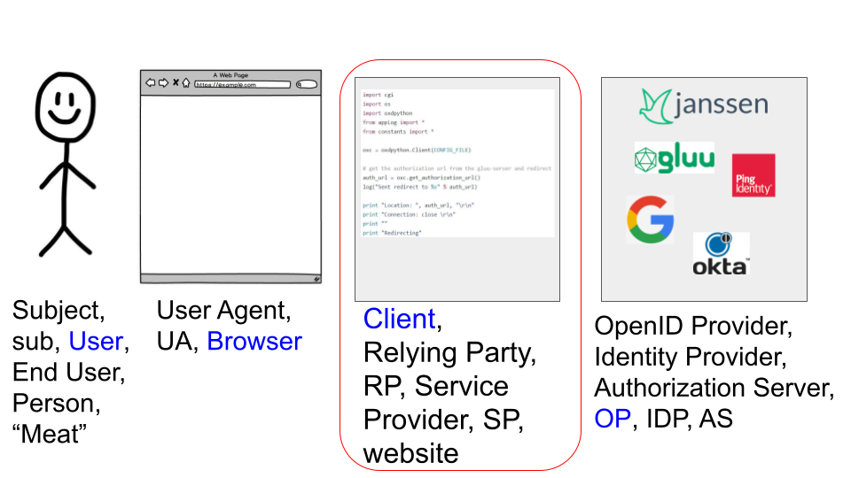
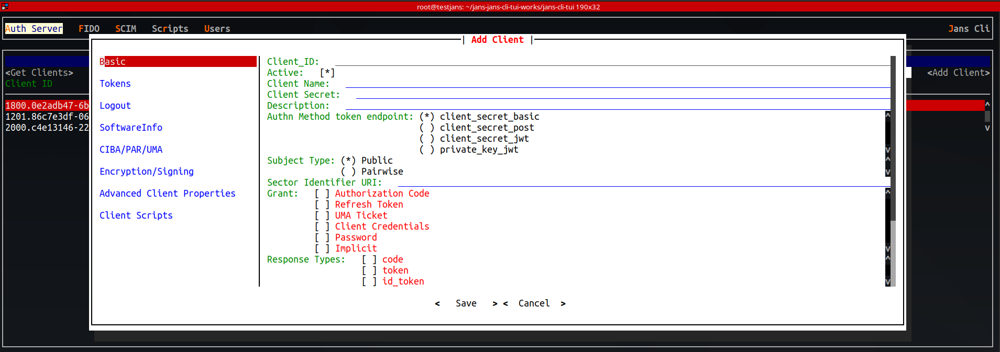

---
tags:
- administration
- client-management
---

## Background

A "client" is a piece of software either acting autonomously or on behalf of
a person. The OAuth framework defines the term client
[here](https://datatracker.ietf.org/doc/html/rfc6749#section-1.1). OpenId Connect
[clarifies](https://openid.net/specs/openid-connect-core-1_0.html#Introduction)
that:
`OAuth 2.0 Clients using OpenID Connect are also referred to as Relying Parties (RPs)`

Don't confuse a Client with either the Person or the Browser!


## Client Security

OpenID allows you to use as much security as you need. To a large extent, the
security of your implemenation depends on what client features you select.
For example, let's just consider how the client authenticates itself to Jans Auth
Server, which is defined by the `token_endpoint_auth_method` in OpenID Connect
[Client Metadata](https://openid.net/specs/openid-connect-registration-1_0.html#ClientMetadata).

| Method | Secret Not Sent in Clear | Signed | Only client has secret |
| ------ | :----------------------: | :----: | :--------------------: |
| `client_secret_basic` |   |   |   |
| `client_secret_post`  |   |   |   |
| `client_secret_jwt`   | X | X |   |
| `private_key_jwt`     | X | X | X |

Obviously, using asynchronous secrets for authentication is more secure. The
client configuration also determines what crypto is used for signing and
encryption of tokens, what scopes are available to the client (which determines
the extent of access to APIs), what grants are available,  what is a valid
`redirect_uri`, timeouts, whether to use a value or reference token, whether to
expire the client, and several other options that impact security.

## Client Tools

There are a few ways clients are created and managed in Jans Auth Server:

* [Jans Config API](../../config-guide/config-api/)
* [Command Line Tool (CLI)]((../../config-guide/jans-cli/README.md))
* [Jans Text UI (TUI)](../../config-guide/tui.md)
* [OpenID Connect Dynamic Client Registration](https://openid.net/specs/openid-connect-registration-1_0.html)

Which mechanism to use depends on the deployment requirements. For *ad hoc*
creation, the TUI is great. If you need to quickly script client creation (e.g.
in a bash script), use the CLI, or use `curl` to call the Jans Config API.  If
developers need to have the ability to register clients, then adopt OpenID
Connect Dynamic Client Registration.

### OpenID Dynamic Client Registration

Jans Auth server publishes the `registration_endpoint` in the OpenID
configuration JSON response, which you can find at `.well-known/openid-configuration`
in your specific deployment. Typically, it is
`https://{hostname}/jans-auth/restv1/register`

The OpenApi specification for [/registration](https://gluu.org/swagger-ui/?url=https://raw.githubusercontent.com/JanssenProject/jans/vreplace-janssen-version/jans-auth-server/docs/swagger.yaml#/Registration) documents Jans Auth Server's specific implementation,
which aligns with the requirements of OpenID Connect dynamic client
registration. Also check the
[Registration Endpoint documentation](../endpoints/client-registration.md) for
more details on the steps involved in dynamic client registration.

### Jans-CLI

Below is a one liner to add a client.

```
./config-cli-tui.pyz --host $FQDN --client-id $MY_CLIENT_ID \
--client-secret $MY_CLIENT_SECRET --no-tui \
--operation-id=post-oauth-openid-client  --data=my_client.json
```

For more information about how to use
the Jans-CLI, see the [docs](../../config-guide/jans-cli/README.md)

### Using TUI

To start registering a new client, navigate to
`Auth Server`->`Clients`->`Add Client`.  This brings up a screen as show below
with various sections to input client details.



### Using curl

To add a client via `curl`, see information on the
[curl documentation page](../../config-guide/curl.md).
