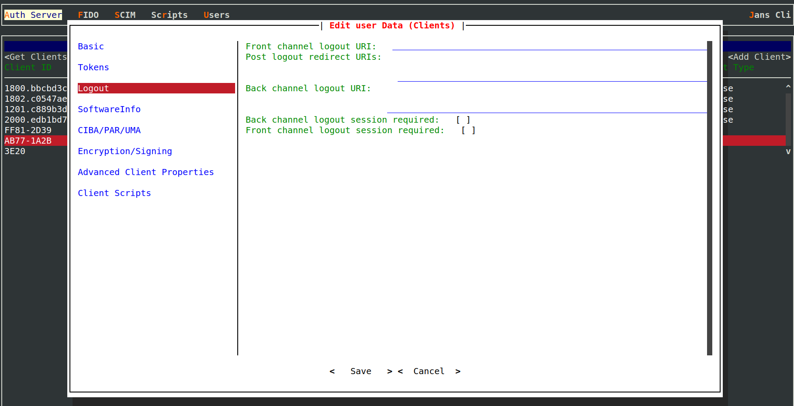

---
tags:
- administration
- auth-server
- end-session
- endpoint
---

# Overview

Janssen Server's `/end_session` endpoint supports logout using [OpenId Connect Front Channel Logout](https://openid.net/specs/openid-connect-frontchannel-1_0.html) mechanism.
When using OpenID Connect Logout, it is recommended to use Front-Channel Logout. In Front-Channel Logout the browser 
receives a page with a list of application logout urls within an iframe. This prompts the browser to call each 
application logout individually and the OpenID Connect end-session endpoint via Javascript.

URL to access end session endpoint on Janssen Server is listed in the response of Janssen Server's well-known
[configuration endpoint](./configuration.md) given below.

```text
https://janssen.server.host/jans-auth/.well-known/openid-configuration
```

`end_session_endpoint` claim in the response specifies the URL for end session endpoint. By default, end session 
ndpoint looks like below:

```
https://janssen.server.host/jans-auth/restv1/end_session
```

Refer to [this](https://gluu.org/docs/gluu-server/4.4/operation/logout/#openid-connect-single-log-out-slo) article from 
Gluu Server documentation to understand how end session endpoint works in Janssen Server.  

## Disabling The Endpoint Using Feature Flag

`/end_session` endpoint can be enabled or disable using [END_SESSION feature flag](../../reference/json/feature-flags/janssenauthserver-feature-flags.md#endsession).
Use [Janssen Text-based UI(TUI)](../../config-guide/tui.md) or [Janssen command-line interface](../../config-guide/jans-cli/README.md) to perform this task.

When using TUI, navigate via `Auth Server`->`Properties`->`enabledFeatureFlags` to screen below. From here, enable or
disable `END_SESSION` flag as required.


## Configuration Properties

End session endpoint can be further configured using Janssen Server configuration properties listed below. When using
[Janssen Text-based UI(TUI)](../../config-guide/tui.md) to configure the properties,
navigate via `Auth Server`->`Properties`.

- [allowEndSessionWithUnmatchedSid](../../reference/json/properties/janssenauthserver-properties.md#allowendsessionwithunmatchedsid)
- [endSessionEndpoint](../../reference/json/properties/janssenauthserver-properties.md#endsessionendpoint)
- [endSessionWithAccessToken](../../reference/json/properties/janssenauthserver-properties.md#endsessionwithaccesstoken)
- [mtlsEndSessionEndpoint](../../reference/json/properties/janssenauthserver-properties.md#mtlsendsessionendpoint)
- [rejectEndSessionIfIdTokenExpired](../../reference/json/properties/janssenauthserver-properties.md#rejectendsessionifidtokenexpired)
- [allowPostLogoutRedirectWithoutValidation](../../reference/json/properties/janssenauthserver-properties.md#allowpostlogoutredirectwithoutvalidation)
- [forceIdTokenHintPrecense](../../reference/json/properties/janssenauthserver-properties.md#forceidtokenhintprecense)

Apart from the above-mentioned server properties, the properties relevant to individual clients can be configured
during client registration or can be edited later. When using 
[Janssen Text-based UI(TUI)](../../config-guide/tui.md) to configure the properties, navigate via `Auth Server`->
`Clients`->`logout` as show in image below:



### Interception Scripts

Response from end session endpoint can be further customized using [end session](../../developer/scripts/end-session.md) 
interception script.

This script can be used to customize the HTML response generated from end session endpoint.

## Want to contribute?

If you have content you'd like to contribute to this page in the meantime, you can get started with our [Contribution guide](https://docs.jans.io/head/CONTRIBUTING/).