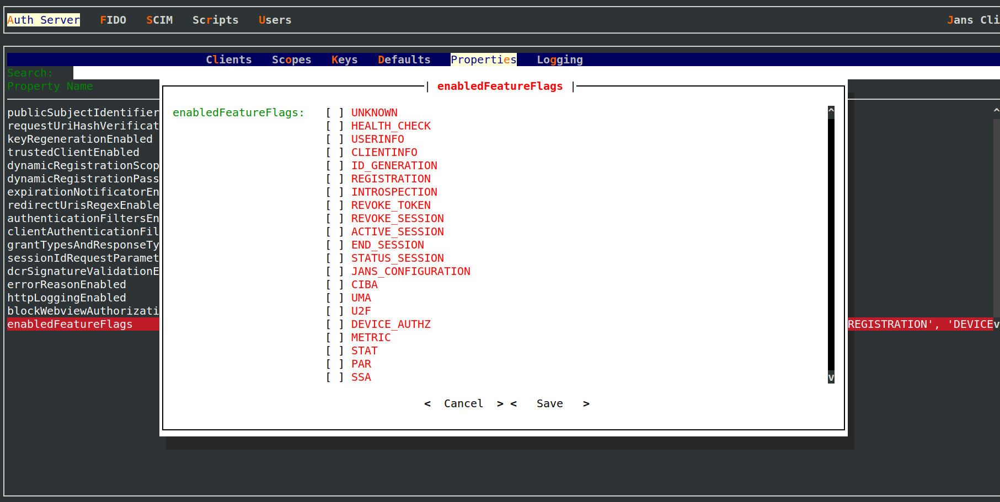

---
tags:
- administration
- auth-server
- par
- pushed authorization requests
- endpoint
---

# Pushed Authorization Request(PAR) Endpoint

PAR endpoint is used by client to send authorization request directly to the Janssen Server without using the usual
redirection mechanism via user agent. When PAR endpoint receives a valid request, it responds with a request URI. 
The request URI is a reference created and stored by Janssen Server. It is a reference to  authorization request and 
the metadata sent with it by the client. Client can send this request uri to the Janssen Server in a authorization
request using user agent redirect mechanism. There are multiple benefits of using this flow which are described along 
with other details in [PAR specification](https://datatracker.ietf.org/doc/html/rfc9126). Janssen Server PAR implementation 
conforms to PAR specification.

URL to access PAR endpoint on Janssen Server is listed in the response of Janssen Server's well-known
[configuration endpoint](./configuration.md) given below.

```text
https://janssen.server.host/jans-auth/.well-known/openid-configuration
```

`pushed_authorization_request_endpoint` claim in the response specifies the URL for PAR endpoint. By default, PAR endpoint looks
like below:

```
https://jans-dynamic-ldap/jans-auth/restv1/par
```

In response to a valid request, the PAR endpoint returns `request_uri` in response similar to below:

```
 HTTP/1.1 201 Created
 Content-Type: application/json
 Cache-Control: no-cache, no-store

 {
  "request_uri":
    "urn:ietf:params:oauth:request_uri:6esc_11ACC5bwc014ltc14eY22c",
  "expires_in": 60
 }
```

Since PAR endpoint is a protected resource. The client has to authenticate itself to the endpoint. Authentication 
methods used are same as the once used for client authentication at [token endpoint](./token.md#client-authentication). 

More information about request and response of the PAR endpoint can be found in
the OpenAPI specification of 
[jans-auth-server module](https://gluu.org/swagger-ui/?url=https://raw.githubusercontent.com/JanssenProject/jans/replace-janssen-version/jans-auth-server/docs/swagger.yaml#/Authorization/post_par).

## Disabling The Endpoint Using Feature Flag

`PAR` endpoint can be enabled or disable using [PAR feature flag](../../reference/json/feature-flags/janssenauthserver-feature-flags.md#par).
Use [Janssen Text-based UI(TUI)](../../config-guide/tui.md) or [Janssen command-line interface](../../config-guide/jans-cli/README.md) to perform this task.

When using TUI, navigate via `Auth Server`->`Properties`->`enabledFeatureFlags` to screen below. From here, enable or
disable `PAR` flag as required.



## Configuration Properties

PAR endpoint can be further configured using Janssen Server configuration properties listed below. When using
[Janssen Text-based UI(TUI)](../../config-guide/tui.md) to configure the properties,
navigate via `Auth Server`->`Properties`.

- [mtlsParEndpoint](../../reference/json/properties/janssenauthserver-properties.md#mtlsparendpoint)
- [parEndpoint](../../reference/json/properties/janssenauthserver-properties.md#parendpoint)
- [requirePar](../../reference/json/properties/janssenauthserver-properties.md#requirepar)
- [requestUriParameterSupported](../../reference/json/properties/janssenauthserver-properties.md#requesturiparametersupported)

## Want to contribute?

If you have content you'd like to contribute to this page in the meantime, you can get started with our [Contribution guide](https://docs.jans.io/head/CONTRIBUTING/).