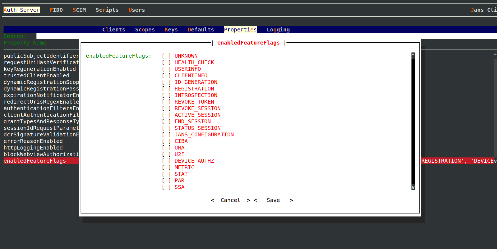

---
tags:
- administration
- auth-server
- token-revocation
- endpoint
---

# Overview

Janssen Server supports token revocation endpoint enables a client to notify the server that previously obtained 
refresh or access token is no longer needed, allowing the server to clean up security credentials. Implementation 
conforms with [token revocation specification](https://datatracker.ietf.org/doc/html/rfc7009).

Since a token is part of a grant, when the token is invalidated, all other token within the same grant are also revoked.
i.e when a refresh token related to a grant is invalidated, all access tokens from the same grant are also invalidated 
and vice-versa.

URL to access revocation endpoint on Janssen Server is listed in the response of Janssen Server's well-known
[configuration endpoint](./configuration.md) given below.

```text
https://<jans-server-host>/jans-auth/.well-known/openid-configuration
```

`revocation_endpoint` claim in the response specifies the URL for revocation endpoint. By default, revocation endpoint
looks like below:

```
https://jans-dynamic-ldap/jans-auth/restv1/revoke
```

More information about request and response of the revocation endpoint can be found in
the OpenAPI specification of [jans-auth-server module](https://gluu.org/swagger-ui/?url=https://raw.githubusercontent.com/JanssenProject/jans/replace-janssen-version/jans-auth-server/docs/swagger.yaml#/Token/revoke).


## Disabling The Endpoint Using Feature Flag

`Token revocation` endpoint can be enabled or disable using [REVOKE_TOKEN feature flag](../../reference/json/feature-flags/janssenauthserver-feature-flags.md#revoketoken).
Use [Janssen Text-based UI(TUI)](../../config-guide/tui.md) or [Janssen command-line interface](../../config-guide/jans-cli/README.md) to perform this task.

When using TUI, navigate via `Auth Server`->`Properties`->`enabledFeatureFlags` to screen below. From here, enable or
disable `REVOKE_TOKEN` flag as required.



## Configuration Properties

Token revocation endpoint can be further configured using Janssen Server configuration properties listed below. When using
[Janssen Text-based UI(TUI)](../../config-guide/tui.md) to configure the properties,
navigate via `Auth Server`->`Properties`.

- [mtlstokenrevocationendpoint](../../reference/json/properties/janssenauthserver-properties.md#mtlstokenrevocationendpoint)
- [tokenRevocationEndpoint](../../reference/json/properties/janssenauthserver-properties.md#tokenrevocationendpoint)

