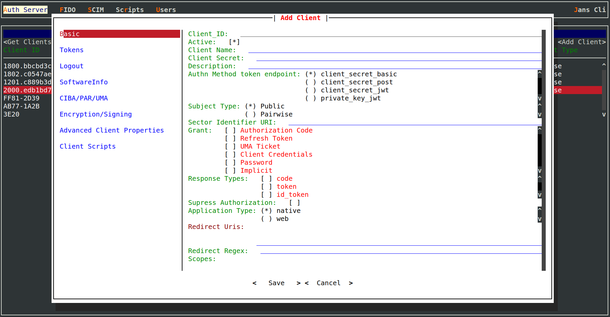
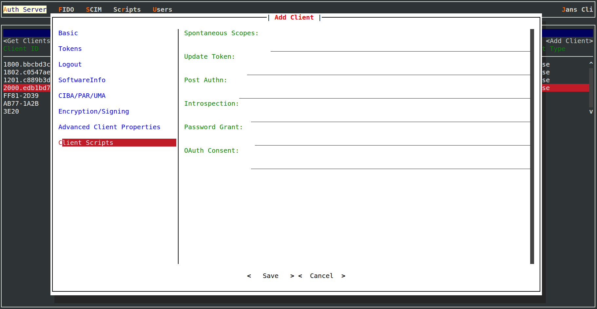

---
tags:
- administration
- auth-server
- token
- endpoint
---

# Overview

Token endpoint is an OAuth2 protected endpoint that is used to grant tokens to client in response to valid request.
Token endpoint is defined in the [OAuth 2.0 framework](https://datatracker.ietf.org/doc/html/rfc6749), 
[OpenID Connect](https://openid.net/specs/openid-connect-core-1_0.html) specification and other specifications relevant
to them. 

Tokens granted by this endpoint depends on grant type and scopes that are specified in the token request. The token
endpoint is used with every authorization grant type except for the implicit grant type (since an access token is issued 
directly). 

Based on request, this endpoint can grant following types of tokens:

- [Access Token](https://datatracker.ietf.org/doc/html/rfc6749#section-1.4)
- [Refresh Token](https://datatracker.ietf.org/doc/html/rfc6749#section-1.5)
- [ID Token](https://openid.net/specs/openid-connect-core-1_0.html#IDToken)


URL to access token endpoint on Janssen Server is listed in the response of Janssen Server's well-known
[configuration endpoint](./configuration.md) given below.

```text
https://janssen.server.host/jans-auth/.well-known/openid-configuration
```

`token_endpoint` claim in the response specifies the URL for userinfo endpoint. By default, userinfo endpoint looks
like below:

```
https://janssen.server.host/jans-auth/restv1/token
```

In response to a valid request, the token endpoint returns token/s in JSON format similar to below. This is just a 
sample response. Actual response can greatly vary in its contents based on request:

```
  HTTP/1.1 200 OK
  Content-Type: application/json
  Cache-Control: no-store
  Pragma: no-cache

  {
   "access_token": "SlAV32hkKG",
   "token_type": "Bearer",
   "refresh_token": "8xLOxBtZp8",
   "expires_in": 3600,
   "id_token": "eyJhbGciOiJSUzI1NiIsImtpZCI6IjFlOWdkazcifQ.ewogImlzc
     yI6ICJodHRwOi8vc2VydmVyLmV4YW1wbGUuY29tIiwKICJzdWIiOiAiMjQ4Mjg5
     NzYxMDAxIiwKICJhdWQiOiAiczZCaGRSa3F0MyIsCiAibm9uY2UiOiAibi0wUzZ
     fV3pBMk1qIiwKICJleHAiOiAxMzExMjgxOTcwLAogImlhdCI6IDEzMTEyODA5Nz
     AKfQ.ggW8hZ1EuVLuxNuuIJKX_V8a_OMXzR0EHR9R6jgdqrOOF4daGU96Sr_P6q
     Jp6IcmD3HP99Obi1PRs-cwh3LO-p146waJ8IhehcwL7F09JdijmBqkvPeB2T9CJ
     NqeGpe-gccMg4vfKjkM8FcGvnzZUN4_KSP0aAp1tOJ1zZwgjxqGByKHiOtX7Tpd
     QyHE5lcMiKPXfEIQILVq0pc_E2DzL7emopWoaoZTF_m0_N0YzFC6g6EJbOEoRoS
     K5hoDalrcvRYLSrQAZZKflyuVCyixEoV9GfNQC3_osjzw2PAithfubEEBLuVVk4
     XUVrWOLrLl0nx7RkKU8NXNHq-rvKMzqg"
  }
```

More information about request and response of the token endpoint can be found in
the OpenAPI specification of [jans-auth-server module](https://gluu.org/swagger-ui/?url=https://raw.githubusercontent.com/JanssenProject/jans/vreplace-janssen-version/jans-auth-server/docs/swagger.yaml#/Token/post-token).

## Configuration Properties

Token endpoint and tokens issued by token endpoint can be further configured using Janssen Server configuration properties listed below. When using
[Janssen Text-based UI(TUI)](../../config-guide/tui.md) to configure the properties,
navigate via `Auth Server`->`Properties`.

- [tokenEndpoint](../../reference/json/properties/janssenauthserver-properties.md#tokenendpoint)
- [tokenEndpointAuthMethodsSupported](../../reference/json/properties/janssenauthserver-properties.md#tokenendpointauthmethodssupported)
- [tokenEndpointAuthSigningAlgValuesSupported](../../reference/json/properties/janssenauthserver-properties.md#tokenendpointauthsigningalgvaluessupported)
- [accessTokenLifetime](../../reference/json/properties/janssenauthserver-properties.md#accesstokenlifetime)
- [checkUserPresenceOnRefreshToken](../../reference/json/properties/janssenauthserver-properties.md#checkuserpresenceonrefreshtoken)
- [defaultSignatureAlgorithm](../../reference/json/properties/janssenauthserver-properties.md#defaultsignaturealgorithm)
- [forceOfflineAccessScopeToEnableRefreshToken](../../reference/json/properties/janssenauthserver-properties.md#forceofflineaccessscopetoenablerefreshtoken)
- [grantTypesSupported](../../reference/json/properties/janssenauthserver-properties.md#granttypessupported)
- [accessTokenSigningAlgValuesSupported](../../reference/json/properties/janssenauthserver-properties.md#accesstokensigningalgvaluessupported)
- [idTokenEncryptionAlgValuesSupported](../../reference/json/properties/janssenauthserver-properties.md#idtokenencryptionalgvaluessupported)
- [idTokenEncryptionEncValuesSupported](../../reference/json/properties/janssenauthserver-properties.md#idtokenencryptionencvaluessupported)
- [idTokenFilterClaimsBasedOnAccessToken](../../reference/json/properties/janssenauthserver-properties.md#idtokenfilterclaimsbasedonaccesstoken)
- [idTokenLifetime](../../reference/json/properties/janssenauthserver-properties.md#idtokenlifetime)
- [idTokenSigningAlgValuesSupported](../../reference/json/properties/janssenauthserver-properties.md#idtokensigningalgvaluessupported)
- [accessTokenSigningAlgValuesSupported](../../reference/json/properties/janssenauthserver-properties.md#accesstokensigningalgvaluessupported)
- [legacyIdTokenClaims](../../reference/json/properties/janssenauthserver-properties.md#legacyidtokenclaims)
- [mtlsTokenEndpoint](../../reference/json/properties/janssenauthserver-properties.md#mtlstokenendpoint)
- [openidScopeBackwardCompatibility](../../reference/json/properties/janssenauthserver-properties.md#openidscopebackwardcompatibility)
- [persistIdTokenInLdap](../../reference/json/properties/janssenauthserver-properties.md#persistidtokeninldap)
- [persistRefreshTokenInLdap](../../reference/json/properties/janssenauthserver-properties.md#persistrefreshtokeninldap)
- [refreshTokenExtendLifetimeOnRotation](../../reference/json/properties/janssenauthserver-properties.md#refreshtokenextendlifetimeonrotation)
- [refreshTokenLifetime](../../reference/json/properties/janssenauthserver-properties.md#refreshtokenlifetime)
- [responseTypesSupported](../../reference/json/properties/janssenauthserver-properties.md#responsetypessupported)
- [skipRefreshTokenDuringRefreshing](../../reference/json/properties/janssenauthserver-properties.md#skiprefreshtokenduringrefreshing)
- [refreshTokenLifetime](../../reference/json/properties/janssenauthserver-properties.md#refreshtokenlifetime)

## Client Authentication

Janssen Server Token Endpoint requires confidential clients to authenticate using one of the supported client
authentication method listed below:

- client_secret_basic
- client_secret_post
- client_secret_jwt
- private_key_jwt

Refer to [Client Authentication](https://openid.net/specs/openid-connect-core-1_0.html#ClientAuthentication) section of OpenID
Connect core specification for more details on these authentication methods.

Client can specify the default authentication method. To set default authentication method using
[Janssen Text-based UI(TUI)](../../config-guide/tui.md),
navigate via `Auth Server`->`Clients`->`Add Client`->`Basic`-> `Authn Method Token Endpoint`.



## Supported Grant Types

Token endpoint supports below mentioned grant types. 

- [Authorization Code](../oauth-features/auth-code-grant.md)
- [Refresh Token](../oauth-features/refresh-token-grant.md)
- [Client Credentials](../oauth-features/client-credential-grant.md)
- [Password](../oauth-features/password-grant.md)

Client can configure all the possible grant types it can request from token endpoint during client configuration.
To select the available grant types using
[Janssen Text-based UI(TUI)](../../config-guide/tui.md),
navigate via `Auth Server`->`Clients`->`Add Client`/`search client`->`Basic`-> `Grant`. 


## Interception Scripts

Token endpoint response can be further customized using [interception scripts](../../developer/interception-scripts.md).
Following interception scripts are relevant to token endpoint:

- [Update Token](../../developer/scripts/update-token.md)

Client can configure a particular script to be executed using client configuration. To update configuration using
[Janssen Text-based UI(TUI)](../../config-guide/tui.md) navigate via `Auth Server`->`Clients`->`Add Client`/`search`->
`Client Scripts`


