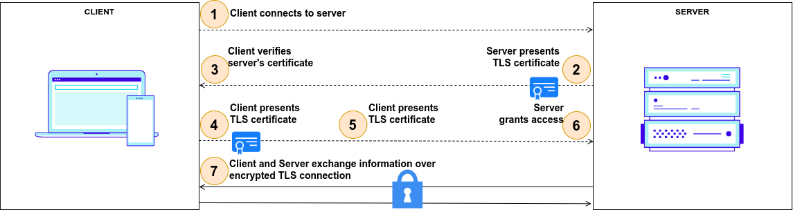

---
tags:
  - administration
  - auth-server
  - oauth
  - feature
  - mtls
  - mutual TLS
---

# mTLS (Mutual Transport Layer Security)

## What Is mTLS?

**mTLS** is a process that establishes an encrypted [TLS](https://wikipedia.org/wiki/Transport_Layer_Security)
connection in which both parties use X.509 digital certificates
to authenticate each other. **mTLS** can help mitigate the risk of moving services to the cloud and can help prevent
malicious third parties from imitating genuine apps.


## Where Is mTLS Useful?

Mutual client certificate authentication can be used any time the server needs to ensure the authenticity and validity
of either a specific user or a specific device. For example, a client certificate can be issued to a company-owned
laptop to identify and authorize it on a corporate network. Alternatively, a client certificate could be issued to an
employee and stored on a smart card, which then allows the employee to gain access to applications or restricted areas
of a building.

In practice, mTLS can identify and authorize the following:

- Devices onto a corporate network.
- Users into applications.
- Content delivery network (CDNs) or cloud security services to back-end web servers.
- Business-to-business (B2B) data exchanges that use APIs.
- Internet of Things (IoT) sensors, such as remote traffic cameras.
- Microservice architectures in which each microservice must ensure that each component it communicates with is valid
  and not tampered with.



## mTLS in Jans Auth

**Jans Auth** supports **mTLS**, and to configure it we must take these considerations into account:

- During DCR client registration, the `token_endpoint_auth_method` field can receive 2 new values:
    1. `tls_client_auth`: indicates that client authentication to the authorization server will occur with mutual TLS
       utilizing the PKI method of associating a certificate to a client.
    2. `self_signed_tls_client_auth`: Indicates that client authentication to the authorization server will occur using
       mutual TLS with the client utilizing a self-signed certificate.
- There is new client property `tls_client_auth_subject_dn` used to compare Subject DN of the certificate with
  configured value of client entry when authentication method is set to `tls_client_auth` (saved in
  tls_client_auth_subject_dn or oxAttributes on persistence layer).
- If MTLS Authentication is used then `access_token` automatically saves certificate `S256` hash of certificates which
  can be validated by RP. If `access_token` is JWT then `x5t#S256` claim is added to payload of the token. Otherwise,
  token can be introspected.

```
{
  "active": true,
  "iss": "https://server.example.com",
  "sub": "ty.webb@example.com",
  "exp": 1493726400,
  "nbf": 1493722800,
  "cnf": {
    "x5t#S256": "bwcK0esc3ACC3DB2Y5_lESsXE8o9ltc05O89jdN-dg2"
  },
  ...,
  ...
}
```

## Configuring Apache for mTLS

The information below belongs to `apache` and web client (usually web browser) mutual authentication setup method. This
also includes basic checks to be performed for the setup.

Is `mod_ssl` installed: Run below command to confirm if the ssl module is installed.

```bash
apachectl -M | grep ssl
```

If we get `ssl_module` related output, then we're good to proceed. The output could look like:

```
root@jans:~# apachectl -M | grep ssl
ssl_module (shared)
```

Usually third party or Certbot SSL certs are used for web server ssl connections. In that case no extra configuration is
necessary. But if we want to use self-signed certs, then follow on.

## Self-Signed SSL Certs

### Server-Side mTLS setup

Now, we're covering the case if you want to deploy your own CA Cert.

#### 1. Open Terminal.

#### 2. Create a new directory to generate certificates.

```bash
mkdir /etc/certs/mtlscert
```

Change to the directory created.

```bash
cd /etc/certs/mtlscert
```

#### 3. Generate Self-Signed CA Cert.

Run below command:

```bash
openssl req -newkey rsa:2048 -nodes -keyform PEM -keyout example-ca.key -x509 -days 3650 -outform PEM -out example-ca.crt
```

Below is a sample run of the command.

```
root@jans:/etc/certs/mtlscert# openssl req -newkey rsa:2048 -nodes -keyform PEM -keyout example-ca.key -x509 -days 3650 -outform PEM -out example-ca.crt
Generating a RSA private key
.........................................+++++
.........................................+++++
writing new private key to 'example-ca.key'
-----
You are about to be asked to enter information that will be incorporated
into your certificate request.
What you are about to enter is what is called a Distinguished Name or a DN.
There are quite a few fields but you can leave some blank
For some fields there will be a default value,
If you enter '.', the field will be left blank.
-----
Country Name (2 letter code) [AU]:US
State or Province Name (full name) [Some-State]:Austin
Locality Name (eg, city) []:TX
Organization Name (eg, company) [Internet Widgits Pty Ltd]:Janssen Org.
Organizational Unit Name (eg, section) []:IT
Common Name (e.g. server FQDN or YOUR name) []:yourdomain.com
Email Address []:youremail@yourdomain.com
```

Above command will create two files: `example-ca.key` and `example-ca.crt`.

```
root@jans:/etc/certs/mtlscert# ls
example-ca.crt  example-ca.key
```

#### 4. Generate private key.

Run below command:

```bash
openssl genrsa -out example.key 2048
```

Below is a sample run of the command.

```
root@jans:/etc/certs/mtlscert# openssl genrsa -out example.key 2048
Generating RSA private key, 2048 bit long modulus (2 primes)
......................................+++++
..........................................................................................................+++++
e is 65537 (0x010001)
```

Above command creates: `example.key`.

```
root@jans:/etc/certs/mtlscert# ls
example-ca.crt  example-ca.key  example.key
```

#### 5. Generate a server CSR (Certificate Signing Request):

Run below command:

```bash
openssl req -new -key example.key -out example.csr
```

Below is a sample run of the command.

```
root@jans:/etc/certs/mtlscert# openssl req -new -key example.key -out example.csr
You are about to be asked to enter information that will be incorporated
into your certificate request.
What you are about to enter is what is called a Distinguished Name or a DN.
There are quite a few fields but you can leave some blank
For some fields there will be a default value,
If you enter '.', the field will be left blank.
-----
Country Name (2 letter code) [AU]:US
State or Province Name (full name) [Some-State]:Austin
Locality Name (eg, city) []:TX
Organization Name (eg, company) [Internet Widgits Pty Ltd]:Janssen Org.
Organizational Unit Name (eg, section) []:IT
Common Name (e.g. server FQDN or YOUR name) []:yourdomain.com
Email Address []:youremail@yourdomain.com

Please enter the following 'extra' attributes
to be sent with your certificate request
A challenge password []:
An optional company name []:
```

Above command will create the file: `example.csr`.

```
root@jans:/etc/certs/mtlscert# ls
example-ca.crt  example-ca.key  example.csr  example.key
```

#### 6. Sign the CSR `example.csr` we just generated.

Run below command:

```bash
openssl x509 -req -in example.csr -CA example-ca.crt -CAkey example-ca.key -set_serial 100 -days 365 -outform PEM -out example.crt
```

Below is a sample run of the command.

```
root@jans:/etc/certs/mtlscert# openssl x509 -req -in example.csr -CA example-ca.crt -CAkey example-ca.key -set_serial 100 -days 365 -outform PEM -out example.crt
Signature ok
subject=C = US, ST = Austin, L = TX, O = Janssen Org., OU = IT, CN = yourdomain.com, emailAddress = youremail@yourdomain.com
Getting CA Private Key
```

Above command will create the file: `example.crt` for 365 days.

```
root@jans:/etc/certs/mtlscert# ls
example-ca.crt  example-ca.key  example.crt  example.csr  example.key
``` 

#### 7. Configure Apache2.

Add the following lines in the `/etc/apache2/sites-available/https_jans.conf` file.

```
SSLEngine On
SSLCertificateFile /etc/certs/mtlscert/example.crt
SSLCertificateKeyFile /etc/certs/mtlscert/example.key
SSLCACertificateFile /etc/certs/mtlscert/example-ca.crt
```

It is critical to configure certificates validation on Apache 2 correctly, since actual validation of the certificates
is performed by Apache 2. After Apache certificate validation is configured correctly, make sure there is client
certificate forward to `jans-auth` application. `jans-auth` (AS) expects certificate in `X-ClientCert` header.

```
<LocationMatch /jans-auth>
    SSLVerifyClient require
    SSLVerifyDepth 10
    SSLOptions -StdEnvVars +ExportCertData

    # Forward certificate to destination server (oxauth)
    RequestHeader set X-ClientCert %{SSL_CLIENT_CERT}s
</LocationMatch>
``` 

Now we must restart the Apache2 server.

```bash
service apache2 restart
```

To check if SSL cert on apache works:

```bash
openssl s_client -connect yourdomain.com:443
```

### Client-Side mTLS setup

#### 1. Generate private key.

Run below command:

```bash
openssl genrsa -out example-cli.key 2048
```

Below is a sample run of the command.

```
root@jans:/etc/certs/mtlscert# openssl genrsa -out example-cli.key 2048
Generating RSA private key, 2048 bit long modulus (2 primes)
...........................................+++++
.............................................+++++
e is 65537 (0x010001)
```

Above command will create the file: `example-cli.key`.

```
root@jans:/etc/certs/mtlscert# ls
example-ca.crt  example-ca.key  example-cli.key  example.crt  example.csr  example.key
```

#### 2. Generate a client CSR (Certificate Signing Request).

Run below command:

```bash
openssl req -new -key example-cli.key -out example-cli.csr
```

Below is a sample run of the command.

```
root@jans:/etc/certs/mtlscert# openssl req -new -key example-cli.key -out example-cli.csr
You are about to be asked to enter information that will be incorporated
into your certificate request.
What you are about to enter is what is called a Distinguished Name or a DN.
There are quite a few fields but you can leave some blank
For some fields there will be a default value,
If you enter '.', the field will be left blank.
-----
Country Name (2 letter code) [AU]:US
State or Province Name (full name) [Some-State]:Austin
Locality Name (eg, city) []:TX
Organization Name (eg, company) [Internet Widgits Pty Ltd]:Janssen Client Org.
Organizational Unit Name (eg, section) []:IT
Common Name (e.g. server FQDN or YOUR name) []:yourdomain.com
Email Address []:youremail@yourdomain.com

Please enter the following 'extra' attributes
to be sent with your certificate request
A challenge password []:
An optional company name []:
```

Above command will create the file: `example-cli.csr`.

```
root@jans:/etc/certs/mtlscert# ls
example-ca.crt  example-ca.key  example-cli.csr  example-cli.key  example.crt  example.csr  example.key
```

#### 3. Sign the CSR `example-cli.csr` we just generated.

Run below command:

```bash
openssl x509 -req -in example-cli.csr -CA example-ca.crt -CAkey example-ca.key -set_serial 101 -days 365 -outform PEM -out example-cli.crt
```

Below is a sample run of the command.

```
root@jans:/etc/certs/mtlscert# openssl x509 -req -in example-cli.csr -CA example-ca.crt -CAkey example-ca.key -set_serial 101 -days 365 -outform PEM -out example-cli.crt
Signature ok
subject=C = US, ST = Austin, L = TX, O = Janssen Client Org., OU = IT, CN = yourdomain.com, emailAddress = youremail@yourdomain.com
Getting CA Private Key
```

Above command will create the file: `example-cli.crt` for 365 days.

```
root@jans:/etc/certs/mtlscert# ls
example-ca.crt  example-ca.key  example-cli.crt  example-cli.csr  example-cli.key  example.crt  example.csr  example.key
```

#### 4. Generate PKCS12 cert

Some browsers need client certs to be in the format `pkcs12`.

Run below command:

```bash
openssl pkcs12 -export -inkey example-cli.key -in example-cli.crt -out example-cli.p12
```

Below is a sample run of the command.

```
root@jans:/etc/certs/mtlscert# openssl pkcs12 -export -inkey example-cli.key -in example-cli.crt -out example-cli.p12
Enter Export Password:
Verifying - Enter Export Password:
```

Above command will create the file: `example-cli.p12`.

```
root@jans:/etc/certs/mtlscert# ls
example-ca.crt  example-ca.key  example-cli.crt  example-cli.csr  example-cli.key  example-cli.p12  example.crt  example.csr  example.key
```

## mTLS testing

We are going to run an mTLS example where we will perform the following flow:

1. Register new client.
2. Call `authorize` endpoint.
3. Call `token` endpoint.
4. Call `introspection` endpoint.

Previously we need to configure the client's certificate in the browser of your choice.

### Google Chrome Settings

- In the search bar go to `chrome://settings/certificates`.
- In the `Your Certificates` section, click on `Import` button.
- Select the certificate `example-cli.p12` and enter the password you set when generating it.


### Firefox Settings

- In the search bar go to `about:preferences#privacy`.
- Click on `View Certificates`.
- In the `Your Certificates` section, click on `Import` button.
- Select the certificate `example-cli.p12` and enter the password you set when generating it.


### Solving the `curl` problem

If you have `openssl` version `3.x.x`, most likely when you are trying to consume
the `/.well-known/openid-configuration` endpoint.

```bash
curl --insecure --cert-type P12 --cert example-cli.p12:<YOUR_PASSWORD> --location 'https://<YOUR_DOMAIN>/.well-known/openid-configuration'
```

You will get the following error:

```
root@jans~# curl --insecure --cert-type P12 --cert example-cli.p12:<YOUR_PASSWORD> --location 'https://<YOUR_DOMAIN>/.well-known/openid-configuration'
curl: (58) could not parse PKCS12 file, check password, OpenSSL error error:0308010C:digital envelope routines::unsupported
```

To fix this error, edit the file `/etc/ssl/openssl.cnf` and make sure that these lines are uncommented and if they are
not, add them:

```
openssl_conf = openssl_init

[openssl_init]
providers = provider_sect

[provider_sect]
default = default_sect
legacy = legacy_sect

[default_sect]
activate = 1

[legacy_sect]
activate = 1
```

Once this change is done, you should be able to consume the `/.well-known/openid-configuration` endpoint without any
problems

```
root@jans~# curl --insecure --cert-type P12 --cert example-cli.p12:<YOUR_PASSWORD> --location 'https://<YOUR_DOMAIN>/.well-known/openid-configuration'
{
  "request_parameter_supported" : true,
  "pushed_authorization_request_endpoint" : "https://<YOUR_DOMAIN>/jans-auth/restv1/par",
  "introspection_endpoint" : "https://<YOUR_DOMAIN>/jans-auth/restv1/introspection",
  "claims_parameter_supported" : true,
  "issuer" : "https://<YOUR_DOMAIN>",
  "userinfo_encryption_enc_values_supported" : [ "A128CBC+HS256", "A256CBC+HS512", "A128GCM", "A256GCM" ],
  "id_token_encryption_enc_values_supported" : [ "A128CBC+HS256", "A256CBC+HS512", "A128GCM", "A256GCM" ],
  "access_token_signing_alg_values_supported" : [ "none", "HS256", "HS384", "HS512", "RS256", "RS384", "RS512", "ES256", "ES384", "ES512", "PS256", "PS384", "PS512" ],
  "authorization_endpoint" : "https://<YOUR_DOMAIN>/jans-auth/restv1/authorize",
  ...,
  ...,
  ...
}
```

### 1. Register new client

Run below command:

```bash
curl --insecure --cert-type P12 --cert example-cli.p12:<YOUR_PASSWORD> --location 'https://<YOUR_DOMAIN>/jans-auth/restv1/register' \
--header 'Content-Type: application/json' \
--data '{
  "client_name": "Test Client mTLS",
  "application_type": "web",
  "access_token_as_jwt": true,
  "token_endpoint_auth_method": "self_signed_tls_client_auth",
  "jwks": {
    "keys": [
      {
        "kid": "YOUR_KID",
        "kty": "RSA",
        "alg": "RS256",
        "use": "sig",
        "e": "AQAB",
        "n": "5elNNA2wYlUpEK2JxOqIgFe3JmHBs63M7wvKM_cbzXjMpLXn7UqAbIN7drDgLIvsIwSo9DAuWvFV3mLqApFYlL1qQCEveULbh6LorqPUzl2UjHwDDFlM1Hj6JpJ_GbacX5-YnRgXC7k_p4ZIf0GOkQxIo0WVNhulku3z84Ko8Efk5BeV7ImFyXWLoO-ru8h3Yvq2h1LRVYX02LZlG6Mv8dqCJsWHIbnmaB16TSe_HCA3qEA4k9La2fl4R7fPlq1u89LN3kz2M0cm1M8aTTquLHP0tv5EpeqX1pG4VjwurssevguRM9QqrGkPktAw_uzIKfO7s5_j3AD3teYdVQFryQ"
      }
    ]
  },
  "scope": [
    "openid",
    "profile",
    "email"
  ],
  "grant_types": [
    "authorization_code"
  ],
  "response_types": [
    "code",
    "token",
    "id_token"
  ],
  "redirect_uris": [
    https://<YOUR_DOMAIN>/jans-auth-rp/home.htm
  ]
}'
```

Response:

```json
{
  "allow_spontaneous_scopes": false,
  "jwks": {
    "keys": [
      {
        "kty": "RSA",
        "e": "AQAB",
        "use": "sig",
        "kid": "your-kid",
        "alg": "RS256",
        "n": "5elNNA2wYlUpEK2JxOqIgFe3JmHBs63M7wvKM_cbzXjMpLXn7UqAbIN7drDgLIvsIwSo9DAuWvFV3mLqApFYlL1qQCEveULbh6LorqPUzl2UjHwDDFlM1Hj6JpJ_GbacX5-YnRgXC7k_p4ZIf0GOkQxIo0WVNhulku3z84Ko8Efk5BeV7ImFyXWLoO-ru8h3Yvq2h1LRVYX02LZlG6Mv8dqCJsWHIbnmaB16TSe_HCA3qEA4k9La2fl4R7fPlq1u89LN3kz2M0cm1M8aTTquLHP0tv5EpeqX1pG4VjwurssevguRM9QqrGkPktAw_uzIKfO7s5_j3AD3teYdVQFryQ"
      }
    ]
  },
  "application_type": "web",
  "rpt_as_jwt": false,
  "registration_client_uri": "https://<YOUR_DOMAIN>/jans-auth/restv1/register?client_id=d16994c2-313c-4440-9713-25290fbb89a9",
  "tls_client_auth_subject_dn": "",
  "run_introspection_script_before_jwt_creation": false,
  "registration_access_token": "93a52334-bf79-4414-bc9a-983b6921597c",
  "client_id": "d16994c2-313c-4440-9713-25290fbb89a9",
  "token_endpoint_auth_method": "self_signed_tls_client_auth",
  "scope": "email openid profile",
  "client_secret": "e1c9e9df-e542-4225-adb4-d0590f85d97d",
  "client_id_issued_at": 1698114939,
  "backchannel_logout_uri": "",
  "backchannel_logout_session_required": false,
  "client_name": "Test Client mTLS",
  "par_lifetime": 600,
  "spontaneous_scopes": [],
  "id_token_signed_response_alg": "RS256",
  "access_token_as_jwt": true,
  "grant_types": [
    "implicit",
    "refresh_token",
    "authorization_code"
  ],
  "subject_type": "pairwise",
  "additional_token_endpoint_auth_methods": [],
  "keep_client_authorization_after_expiration": false,
  "require_par": false,
  "redirect_uris": [
    "https://<YOUR_DOMAIN>/jans-auth-rp/home.htm"
  ],
  "redirect_uris_regex": "",
  "additional_audience": [],
  "frontchannel_logout_session_required": false,
  "client_secret_expires_at": 1698201339,
  "access_token_signing_alg": "RS256",
  "response_types": [
    "code",
    "id_token",
    "token"
  ]
}
```

> **NOTE:** To obtain the `jwks` field data, follow the next step.

#### P12 to JWKS

To get the fields from `jwks` you can use the following command:

```bash
openssl x509 -in example-cli.p12 -pubkey -noout | pem-jwk | jq '{kid: "your-kid", kty: .kty , alg: "RS256" , use: "sig", e: .e, n: .n }'
```

Make sure you have `pem-jwk` installed, use the command: `npm install -g pem-jwk` or `yarn global add pem-jwk`.

Below is a sample run of the command.

```
root@jans:~# openssl x509 -in example-cli.p12 -pubkey -noout | pem-jwk | jq '{kid: "your-kid", kty: .kty , alg: "RS256" , use: "sig", e: .e, n: .n }'
Enter pass phrase for PKCS12 import pass phrase:
{
  "kid": "your-kid",
  "kty": "RSA",
  "alg": "RS256",
  "use": "sig",
  "e": "AQAB",
  "n": "5elNNA2wYlUpEK2JxOqIgFe3JmHBs63M7wvKM_cbzXjMpLXn7UqAbIN7drDgLIvsIwSo9DAuWvFV3mLqApFYlL1qQCEveULbh6LorqPUzl2UjHwDDFlM1Hj6JpJ_GbacX5-YnRgXC7k_p4ZIf0GOkQxIo0WVNhulku3z84Ko8Efk5BeV7ImFyXWLoO-ru8h3Yvq2h1LRVYX02LZlG6Mv8dqCJsWHIbnmaB16TSe_HCA3qEA4k9La2fl4R7fPlq1u89LN3kz2M0cm1M8aTTquLHP0tv5EpeqX1pG4VjwurssevguRM9QqrGkPktAw_uzIKfO7s5_j3AD3teYdVQFryQ"
}
```

### 2. Call `authorize` endpoint

From your browser of choice call the following url:

```
https://<YOUR_DOMAIN>/jans-auth/restv1/authorize?response_type=code&client_id=d16994c2-313c-4440-9713-25290fbb89a9&scope=openid+profil+email&redirect_uri=https://<YOUR_DOMAIN>/jans-auth-rp/home.htm&state=f9bb35cb-3485-4ae4-aa8e-63e9a97b6e5d&nonce=4a2f07cb-521b-465c-8b06-0c17711a96a7
```

URL parameters:

- `response_type=code`
- `client_id=d16994c2-313c-4440-9713-25290fbb89a9`
- `scope=openid+profil+email`
- `redirect_uri=https://<YOUR_DOMAIN>/jans-auth-rp/home.htm`
- `state=f9bb35cb-3485-4ae4-aa8e-63e9a97b6e5d`
- `nonce=4a2f07cb-521b-465c-8b06-0c17711a96a7`

The field we need to obtain is the `code`.


### 3. Call `token` endpoint

Previously we have obtained the `code` field, we will use this value to call the endpoint `token`.

```bash
curl --insecure --cert-type P12 --cert example-cli.p12:<YOUR_PASSWORD> --location 'https://<YOUR_DOMAIN>/jans-auth/restv1/token' \
--header 'Content-Type: application/x-www-form-urlencoded' \
--data-urlencode 'grant_type=authorization_code' \
--data-urlencode 'redirect_uri=https://<YOUR_DOMAIN>/jans-auth-rp/home.htm' \
--data-urlencode 'client_id=d16994c2-313c-4440-9713-25290fbb89a9' \
--data-urlencode 'client_secret=<YOUR_CLIENT_SECRET>' \
--data-urlencode 'code=<YOUR_CODE>'
```

Response:

```json
{
  "access_token": "eyJraWQiOiJjb25uZWN0X2NmNjBiZWZmLTU1MzUtNDllNS04MWQ5LTM5ZDM4ZmNlMWNhMF9zaWdfcnMyNTYiLCJ0eXAiOiJqd3QiLCJhbGciOiJSUzI1NiJ9.eyJzdWIiOiJNSGdqa2hnTktmZWF4ZUVEY0wycEt5c1EwVUQ4RDk1QUd5NFBGXzI2cmlnIiwiY29kZSI6ImE0NWE5ODI5LTFkMDQtNGQxNS05NjllLWRiMjk3Mzk4ZTdjMyIsImlzcyI6Imh0dHBzOi8vbWlsdG9uLWNoLWhhcmR5LW1pdGUuZ2x1dS5pbmZvIiwidG9rZW5fdHlwZSI6IkJlYXJlciIsImNsaWVudF9pZCI6IjVkODM1NDA3LTFlZjMtNDQxZC04YWU2LTZiYmRkNTcyNzZjYyIsImF1ZCI6IjVkODM1NDA3LTFlZjMtNDQxZC04YWU2LTZiYmRkNTcyNzZjYyIsImFjciI6ImJhc2ljIiwieDV0I1MyNTYiOiJPeHRJQXRBMEMwTkwteTR2UmZLeDd6TExFZXhfWG1DelduUWJ4ejZUem5ZIiwic2NvcGUiOlsib3BlbmlkIiwicHJvZmlsZSIsImVtYWlsIl0sImF1dGhfdGltZSI6MTY5ODE5NDczNiwiZXhwIjoxNjk4Mjc4MDQzLCJpYXQiOjE2OTgxOTY4MzIsInVzZXJuYW1lIjoiRGVmYXVsdCBBZG1pbiBVc2VyIn0.JpK7JYy6Avui3LNbxTKBYJW9fqjEIqijCXPw9fvqEO1kqO7AUozOEof00hPKzJo1Dh7VgGpY89MiAduDUoU3QCemtFsNSd1DCyExl2s3w5OF2mUm6nMzjaS377ZQQ39DAq91OGFFq_ISt4JIhWRf7_xUEvlLRAttTqxE5qp1ZYvgAYu07jbVJX8WqJvxYz3rZ3J-4kq2FLREunRf5KxYaHO-oKzrmhRVPTc_cj1vqwSfu8vRjLmx4P-eN7SgVNa0XmZ8WClLnmchucGBH6rYq3bXZWsOKixwLhno_2vPe1MmbK3XnNNBu_fm_bL2N5kgAwr9b-upoBJc08IyCje1vA",
  "refresh_token": "1e58e2c9-4175-4b3f-8170-65544b1a7c48",
  "id_token": "eyJraWQiOiJjb25uZWN0X2NmNjBiZWZmLTU1MzUtNDllNS04MWQ5LTM5ZDM4ZmNlMWNhMF9zaWdfcnMyNTYiLCJ0eXAiOiJqd3QiLCJhbGciOiJSUzI1NiJ9.eyJhdF9oYXNoIjoib1NoVDE4YUdRVHdtNXBjT255dkNMUSIsInN1YiI6Ik1IZ2praGdOS2ZlYXhlRURjTDJwS3lzUTBVRDhEOTVBR3k0UEZfMjZyaWciLCJhbXIiOlsiMTAiXSwiaXNzIjoiaHR0cHM6Ly9taWx0b24tY2gtaGFyZHktbWl0ZS5nbHV1LmluZm8iLCJub25jZSI6ImMxNGQ2Y2RlLWQ5NTYtNDM4Zi04Mzk5LTQ3MzdkNWZlOTkyOSIsInNpZCI6IjI2ZTM4YTJmLTEzZTktNGY4Yi05MzdjLTQ3M2ViMjdlNzFkNiIsImphbnNPcGVuSURDb25uZWN0VmVyc2lvbiI6Im9wZW5pZGNvbm5lY3QtMS4wIiwiYXVkIjoiNWQ4MzU0MDctMWVmMy00NDFkLThhZTYtNmJiZGQ1NzI3NmNjIiwicmFuZG9tIjoiMjVhZDViMmUtMGNkMi00Mjg3LTg1M2ItZWY3NWRhZjMzNWMwIiwiYWNyIjoiYmFzaWMiLCJjX2hhc2giOiJwM2ZJVHlGT09fd0tRZW9QT1VkWWF3IiwiYXV0aF90aW1lIjoxNjk4MTk0NzM2LCJleHAiOjE2OTgyMDA0MzIsImdyYW50IjoiYXV0aG9yaXphdGlvbl9jb2RlIiwiaWF0IjoxNjk4MTk2ODMyfQ.GMXkiFGcCy6dXI8gPPuCLd977Gs_rkG1w3FrNx_HlSnmcDUSsEQHvPxpA99Y3L8Z82uLHYCbP5Vga6iCEOmBBHnu9jEsmYgp-TSrB31HV-5g7-o4ZWJG05SdL9KgSP3PyDXRqcE0VFxBJ-uJSyvI-htQ4GUXMIhqVhbJJynPNosXtZvvDVIw1NBThupmqx58cozf5tIdnwaeiuN_Ce2XQrjZBiachI6KWFa-Mstrsdw1E6Ny_4bP-1UmeNgScd6pmIUemGsfclxIAgO0lACqgbGh7wo0PljbhEkGU_i9kP--0KJHkBkUxflULW3aAqdYtG9hEr_JEIddHVxXbi1c_w",
  "token_type": "Bearer",
  "expires_in": 81210
}
```

Once we have obtained the `access_token` in `jwt(json web token)` format, we will do the last step.

### 4. Call `introspection` endpoint

Run below command:

```bash
curl --insecure --cert-type P12 --cert example-cli.p12:<YOUR_PASSWORD> --location 'https://<YOUR_DOMAIN>/jans-auth/restv1/introspection' \
--header 'Content-Type: application/x-www-form-urlencoded' \
--header 'Authorization: Bearer <ACCESS_TOKEN>' \
--data-urlencode 'token=<ACCESS_TOKEN>' \
--data-urlencode 'response_as_jwt=false'
```

Response:

```json
{
  "sub": "MHgjkhgNKfeaxeEDcL2pKysQ0UD8D95AGy4PF_26rig",
  "iss": "https://<YOUR_DOMAIN>",
  "active": true,
  "token_type": "Bearer",
  "client_id": "d16994c2-313c-4440-9713-25290fbb89a9",
  "aud": "5d835407-1ef3-441d-8ae6-6bbdd57276cc",
  "acr": "basic",
  "nbf": null,
  "scope": "openid profile email",
  "auth_time": 1698194736,
  "cnf": {
    "x5t#S256": "OxtIAtA0C0NL-y4vRfKx7zLLEex_XmCzWnQbxz6TznY"
  },
  "exp": 1698278043,
  "iat": 1698201265,
  "jti": null,
  "username": "admin"
}
```

## Specification document

For more details of the specification, you can have a look at the following
link [OAuth 2.0 Mutual-TLS Client Authentication and Certificate-Bound Access Tokens](https://datatracker.ietf.org/doc/html/rfc8705)
