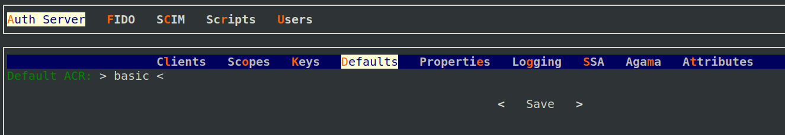
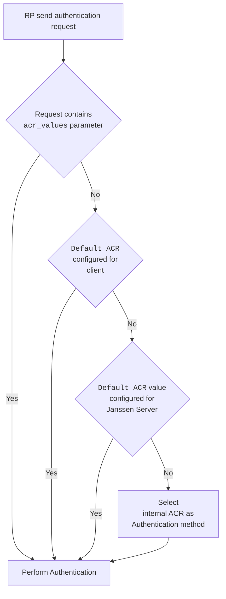

---
tags:
  - administration
  - auth-server
  - openidc
  - feature
  - acr
---

# ACR 

ACR(Authentication Context Class Reference) is defined by [OpenId Connect Specification](https://openid.net/specs/openid-connect-core-1_0.html#Terminology).

## Supported ACRs

Janssen Server lists supported ACRs in the response of Janssen Server's well-known
[configuration endpoint](./configuration.md) given below. Only ACRs that are supported and enabled by configuration
will be part of the list.

```text
https://janssen.server.host/jans-auth/.well-known/openid-configuration
```

The `acr_values_supported` claim in the response shows the list of supported and enabled ACRs for particular Janssen Server 
deployment.

## Categorising ACRs

ACRs available in Janssen Server can be broadly put into three categories. These categories are just for ease of 
understanding.

### Internal Janssen Server ACR

Janssen server will use internal ACR only if no other authentication method is set or could be invoked.
This internal ACR, `default_password_auth`, is set to level -1. This means that it has lower
priority than any scripts. This ACR is always available and enabled on any Janssen Server deployment.

This ACR is simple user-id and password based authentication mechanism. It'll try to authenticate the end-user
against locally deployed backend datastore.

### Pre-packaged ACR for authenticating using external LDAP or Active Directory

All Janssen Server deployments has `default_ldap_server` ACR which can be enabled to perform authentication against a
remote LDAP based IDP (e.g. ActiveDirectory). By default, this ACR is disabled. This ACR can only authenticate against
LDAP based IDP or a local LDAP.

Use the instructions provided in jans-cli 
[LDAP configuration options](../../config-guide/jans-cli/cli-ldap-configuration.md) documentation to learn how to 
enable and configure ACRs that use external LDAP as IDP.

### Script based ACRs

To enable highly flexible and pluggable authentication flows, Janssen Server allows script based ACRs. These ACRs are
backed by a [person authentication script](../../developer/scripts/person-authentication.md). To use these ACRs
in the authentication flow, the corresponding 
[script should be enabled](../../developer/scripts/person-authentication.md#enabling-an-authentication-mechanism).

## Configuring ACRs

ACRs can be configured at per client level and at the server level. 

### Client Configuration

A client can specify a list of ACRs that should be used if the authentication request is missing `acr_values` parameter.
Also, client can restrict ACR values that authentication requests can have as part of 
`acr_values` parameter.

Using Janssen Text base UI (TUI) configuration tool, these values can be configured by navigating to 
`Auth Server`->`clients`->`get clients`->`choose a client and press enter`->`Advanced Client Prop`. On this screen
populate ACR values in `Default ACRs` and `Allowed ACRs`:


### Server Configuration

Using Janssen Text base UI (TUI) configuration
tool, this value can be configured by navigating to `Auth Server`->`Defaults` as show below:



This is the default authentication mechanism exposed to all applications that send end-users to the
Janssen Server for sign-in.

## ACR Precedence Levels

Each authentication mechanism (script) has a "Level" assigned to it which describes how secure and reliable it is.
**The higher the "Level", higher is the reliability represented by the script.** Though several mechanisms can be
enabled at the same Janssen server instance at the same time, for any specific user's session only one of them can be
set as the current one (and will be returned as `acr` claim of id_token for them). 

If after initial session is created
a new authorization request from a RP comes and specifies another authentication method, its "Level" will be compared
to that of the method currently associated with this session. If requested method's "Level" is lower or equal to it,
nothing is changed and the usual SSO behavior is observed. If it's higher (i.e. a more secure method is requested),
it's not possible to serve such request using the existing session's context, and user must re-authenticate themselves
to continue. If they succeed, a new session becomes associated with that requested mechanism instead. 

## How The Applicable ACR Gets Determined



- When authentication request is received from a client(RP), the Janssen Server looks for `acr_values` parameter in
  the request. This parameter is defined in OpenId Connect core specification,
  section [3.1.2.1](https://openid.net/specs/openid-connect-core-1_0.html#AuthRequest).
- If the `acr_values` parameter is not received as part of the request, then Janssen Server uses the
  `default_acr_values` configuration parameter from the [client configuration](#client-configuration)
  Like `acr_values` request parameter, this configuration parameter lists ACR values in order of preference.
- If Janssen Server doesn't find `acr_values` request parameter nor does it find the `default_acr_values` configuration
  parameter configured for the client, then Janssen Server checks the server configuration property
  [useHighestLevelScriptIfAcrScriptNotFound](../../reference/json/properties/janssenauthserver-properties.md#usehighestlevelscriptifacrscriptnotfound).
  If this property is set to true, then Janssen Server invokes the authentication mechanism for which the corresponding
  script is enabled. Choosing the script with the highest [level](#acr-precedence-levels).
- If there is no script that can be invoked or the `useHighestLevelScriptIfAcrScriptNotFound` property is set to false,
  then the Janssen Server authenticates using the [default ACR for the server](#server-configuration). This default ACR is
  configurable by Janssen Server administrator.
- If default ACR for server is not configured for Janssen Server administrator, of it can not be invoked due to any
  issue, then the Janssen Server uses the [internal server ACR](#internal-janssen-server-acr).

## Want to contribute?

If you have content you'd like to contribute to this page in the meantime, you can get started with our [Contribution guide](https://docs.jans.io/head/CONTRIBUTING/).