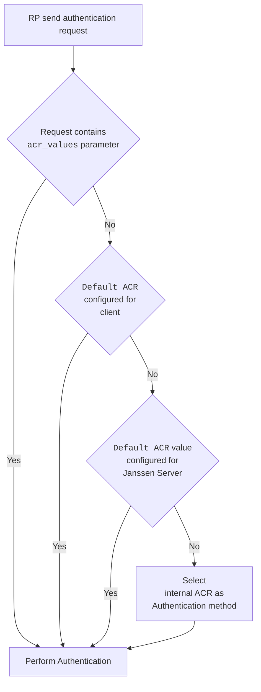

---
tags:
  - administration
  - auth-server
  - openidc
  - feature
  - acr
---

# ACR 

ACR(Authentication Context Class Reference) is defined by [OpenId Connect Specification](https://openid.net/specs/openid-connect-core-1_0.html#Terminology).

## Supported ACRs

Janssen Server lists supported ACRs in the response of Janssen Server's well-known
[configuration endpoint](./configuration.md) given below. Only ACRs that are supported and enabled by configuration
will be part of the list.

```text
https://janssen.server.host/jans-auth/.well-known/openid-configuration
```

The `acr_values_supported` claim in the response shows the list of supported and enabled ACRs for particular Janssen Server 
deployment.

## Types of ACRs

### Internal Janssen Server ACR

### ACR for authenticating using external LDAP or Active Directory

### Script based ACRs

## Configuring ACRs

### Client Configuration

### Server Configuration

## ACR Precedence

Levels 

Not related to level defined in [ISO/IEC 29115](https://www.iso.org/standard/45138.html).


### How The Applicable Authentication Mechanism Gets Determined



- When authentication request is received from a client(RP), the Janssen Server looks for `acr_values` parameter in
  the request. This parameter is defined in OpenId Connect core specification,
  section [3.1.2.1](https://openid.net/specs/openid-connect-core-1_0.html#AuthRequest).
  Supported list of acr values for given Janssen Server deployment can be found in the response of .well-known endpoint
  under `acr_values_supported` claim. List of supported values also depend on what methods are
  [enabled](#enabling-an-authentication-mechanism).
- If the `acr_values` parameter is not received as part of request from client(RP), then Janssen Server uses the
  [default_acr_values](#authentication-method-for-a-client--rp--) configuration parameter from the client configuration.
  Like `acr_values` request parameter, this configuration parameter lists ACR values in order of preference.
- If Janssen Server doesn't find `acr_values` request parameter nor does it find the `default_acr_values` configuration
  parameter configured for the client, then Janssen Server checks the server configuration property
  [useHighestLevelScriptIfAcrScriptNotFound](../../reference/json/properties/janssenauthserver-properties.md#usehighestlevelscriptifacrscriptnotfound).
  If this property is set to true, then Janssen Server invokes the authentication mechanism for which the corresponding
  script is enabled. Choosing the script with the highest [level](#level--rank--of-an-authentication-mechanism-).
- If there is no script that can be invoked or the `useHighestLevelScriptIfAcrScriptNotFound` property is set to false,
  then the Janssen Server authenticates using the [default ACR for the server](#default-acr-at-server-level). This default ACR is
  configurable by Janssen Server administrator.
- If default ACR for server is not configured for Janssen Server administrator, of it can not be invoked due to any
  issue, then the Janssen Server uses the [internal server ACR](#internal-acr).

#### Default ACR At Server Level

This is the default authentication mechanism exposed to all applications that send users to the
Janssen Server for sign-in. Using Janssen Text base UI (TUI) configuration
tool, this value can be configured by navigating to `Auth Server`->`Defaults` as show below:


#### Internal ACR

Janssen server will use internal ACR only if no other authentication method is set or could be invoked.
This internal ACR, `default_password_auth`, is set to level -1. This means that it has lower
priority than any scripts. This ACR is not a configurable parameter.

## Want to contribute?

If you have content you'd like to contribute to this page in the meantime, you can get started with our [Contribution guide](https://docs.jans.io/head/CONTRIBUTING/).