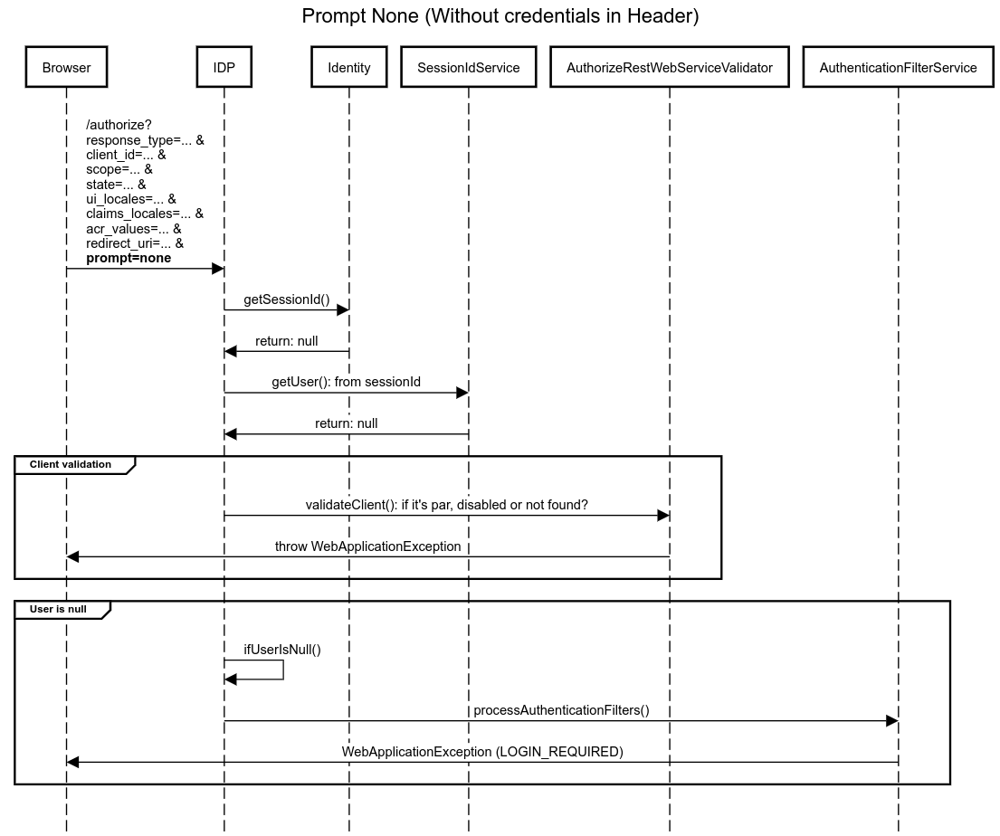
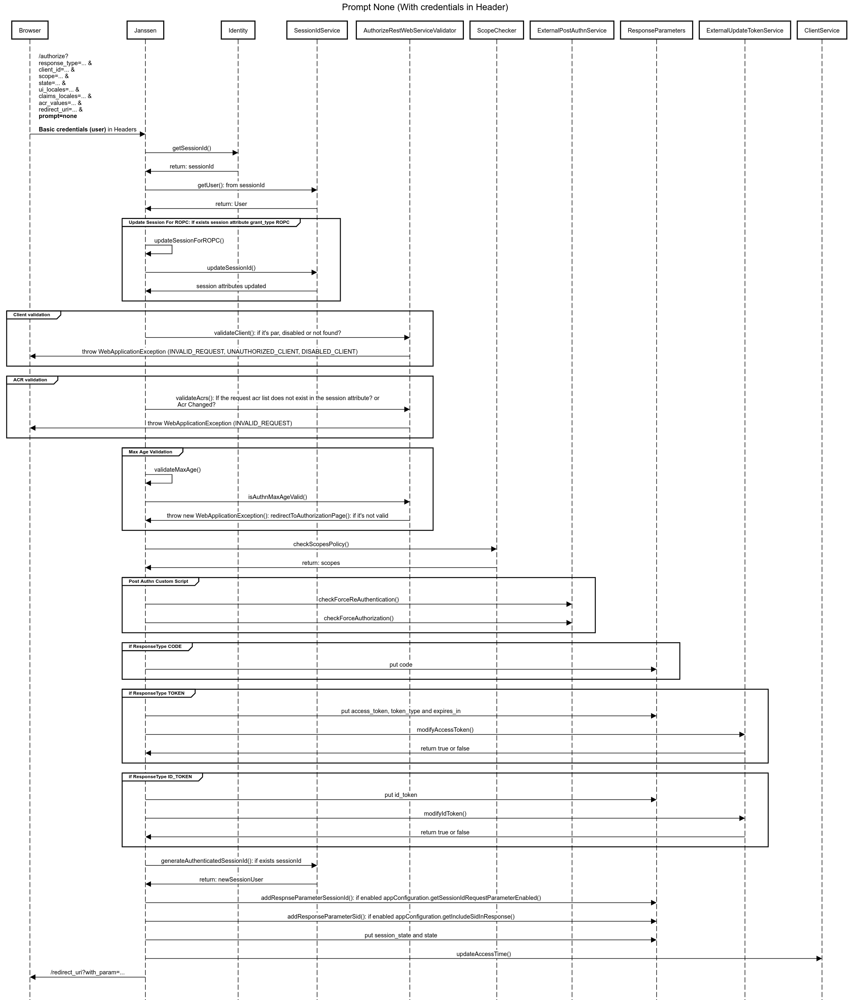

---
tags:
  - administration
  - auth-server
  - openidc
  - feature
---

# Prompt NONE

The OpenID Connect protocol supports a prompt=none parameter on the authentication request that allows applications to indicate that the authorization server must not display any user interaction (such as authentication, consent, or MFA). Janssen will either return the requested response back to the application, or return an error if the user is not already authenticated or if some type of consent or prompt is required before proceeding.

Initiate Silent Authentication requests
To initiate a silent authentication request, add the **prompt=none** parameter when you
redirect a user to the /authorize endpoint of Janssen authentication API.
(The individual parameters on the authentication request will vary depending on the specific needs of your app.)

For example:

```
GET https://YOUR_DOMAIN//authorize?
response_type={response_type}&
client_id={client_id}&
scope={scope}&
state={state}&
ui_locales=&
claims_locales=&
acr_values=&
redirect_uri={redirect_uri}&
prompt=none

Basic credential user
```

The **prompt=none** parameter causes Jannsen to immediately send a result to the specified
**redirect_uri** (callback URL) using the specified **response_mode** with one of two possible
responses: success or error.

Note: Any applicable rules will be executed as part of the silent authentication process.

Successful authentication responses
If the user was already logged in to Janssen and no other interactive prompts are required, Janssen
will respond exactly as if the user had authenticated manually through the login page.

This response is indistinguishable from a login performed directly without the **prompt=none** parameter.

Example 1: **Prompt None (Without credentials in Header)**
```
title Prompt None (Without credentials in Header)

participant Browser
participant IDP
participant Identity
participant SessionIdService
participant AuthorizeRestWebServiceValidator
participant AuthenticationFilterService

Browser->IDP: /authorize?\nresponse_type=... &\nclient_id=... &\nscope=... &\nstate=... &\nui_locales=... &\nclaims_locales=... &\nacr_values=... &\nredirect_uri=... &\n**prompt=none**

IDP->Identity: getSessionId()
Identity->IDP: return: null

IDP->SessionIdService: getUser(): from sessionId
SessionIdService->IDP: return: null

group Client validation
IDP->AuthorizeRestWebServiceValidator: validateClient(): if it's par, disabled or not found?
AuthorizeRestWebServiceValidator->Browser: throw WebApplicationException
end

group User is null
IDP->IDP: ifUserIsNull()
IDP->AuthenticationFilterService: processAuthenticationFilters()
AuthenticationFilterService->Browser: WebApplicationException (LOGIN_REQUIRED)
end
```


Example 2: **Prompt None (Without credentials in Header)**
```
title Prompt None (With credentials in Header)

participant Browser
participant Janssen
participant Identity
participant SessionIdService
participant AuthorizeRestWebServiceValidator
participant ScopeChecker
participant ExternalPostAuthnService
participant ResponseParameters
participant ExternalUpdateTokenService
participant ClientService

Browser->Janssen: /authorize?\nresponse_type=... &\nclient_id=... &\nscope=... &\nstate=... &\nui_locales=... &\nclaims_locales=... &\nacr_values=... &\nredirect_uri=... &\n**prompt=none**\n\n**Basic credentials (user)** in Headers

Janssen->Identity: getSessionId()
Identity->Janssen: return: sessionId

Janssen->SessionIdService: getUser(): from sessionId
SessionIdService->Janssen: return: User

group Update Session For ROPC: If exists session attribute grant_type ROPC
Janssen->Janssen: updateSessionForROPC()
Janssen->SessionIdService: updateSessionId()
SessionIdService->Janssen: session attributes updated
end

group Client validation
Janssen->AuthorizeRestWebServiceValidator: validateClient(): if it's par, disabled or not found?
AuthorizeRestWebServiceValidator->Browser: throw WebApplicationException (INVALID_REQUEST, UNAUTHORIZED_CLIENT, DISABLED_CLIENT)
end

group ACR validation
Janssen->AuthorizeRestWebServiceValidator: validateAcrs(): If the request acr list does not exist in the session attribute? or\n Acr Changed?
AuthorizeRestWebServiceValidator->Browser: throw WebApplicationException (INVALID_REQUEST)
end

group Max Age Validation
Janssen->Janssen: validateMaxAge()
Janssen->AuthorizeRestWebServiceValidator: isAuthnMaxAgeValid()
AuthorizeRestWebServiceValidator->Janssen: throw new WebApplicationException(): redirectToAuthorizationPage(): if it's not valid
end

Janssen->ScopeChecker: checkScopesPolicy()
ScopeChecker->Janssen: return: scopes

group Post Authn Custom Script
Janssen->ExternalPostAuthnService: checkForceReAuthentication()
Janssen->ExternalPostAuthnService: checkForceAuthorization()
end

group if ResponseType CODE
Janssen->ResponseParameters: put code
end

group if ResponseType TOKEN
Janssen->ResponseParameters: put access_token, token_type and expires_in
Janssen->ExternalUpdateTokenService: modifyAccessToken()
ExternalUpdateTokenService->Janssen: return true or false

end

group if ResponseType ID_TOKEN
Janssen->ResponseParameters: put id_token
Janssen->ExternalUpdateTokenService: modifyIdToken()
ExternalUpdateTokenService->Janssen: return true or false
end

Janssen->SessionIdService: generateAuthenticatedSessionId(): if exists sessionId
SessionIdService->Janssen: return: newSessionUser

Janssen->ResponseParameters: addRespnseParameterSessionId(): if enabled appConfiguration.getSessionIdRequestParameterEnabled()

Janssen->ResponseParameters: addResponseParameterSid(): if enabled appConfiguration.getIncludeSidInResponse()

Janssen->ResponseParameters: put session_state and state

Janssen->ClientService: updateAccessTime()

Janssen->Browser: /redirect_uri?with_param=...
```
