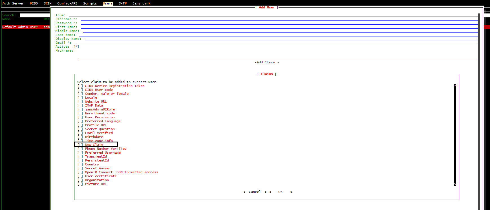
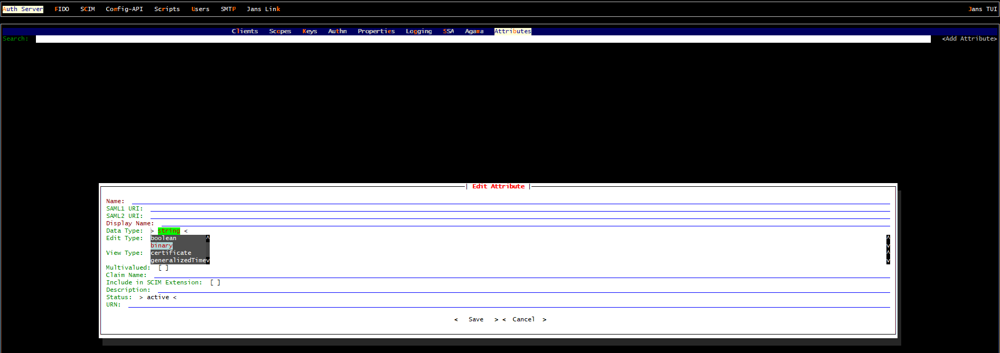

---
tags:
  - administration
  - auth-server
  - openidc
  - feature
  - claims
  - custom-claims
---

# Custom Claims

Custom claims provide the flexibility to include application-specific or user-specific information in the authentication process.Custom claims serve to enrich the information available to the relying party (RP), which is the application or service that relies on the identity provided by the OIDC provider. While standard claims provide basic user information, custom claims allow for the inclusion of domain-specific attributes or application-specific data that might be required for user personalization, authorization, or other business logic. User claims should be unique and non-null or empty.

## Adding a new custom user claim

### LDAP persistence

#### Step 1: Create a custom attribute

Create a new custom attribute using 
[Test User Interface](../../../config-guide/config-tools/jans-tui) or 
[CURL commands](../../../config-guide/config-tools/jans-cli/README.md), 
superb tools provided in Janssen. The attribute name should be the claim name.


#### Step 2: Make entry of the claim in OpenDJ Schema 

- In OpenDJ, add custom attributes in `/opt/opendj/config/schema/77-customAttributes.ldif`. In the below example, `newClaim` is our custom attribute.

  ```
    dn: cn=schema
    objectClass: top
    objectClass: ldapSubentry
    objectClass: subschema
    cn: schema
    attributeTypes: ( 1.3.6.1.4.1.48710.1.3.297 NAME 'newClaim'
    DESC 'New claim'
    EQUALITY caseIgnoreMatch
    SUBSTR caseIgnoreSubstringsMatch
    SYNTAX 1.3.6.1.4.1.1466.115.121.1.15
    X-ORIGIN 'Jans created attribute' )
  ```
  
- Add custom attribute to the jansCustomPerson objectClasses.

  ```
  objectClasses: ( 1.3.6.1.4.1.48710.1.4.101 NAME 'jansCustomPerson'
  SUP ( top )
  AUXILIARY
  MAY ( newClaim $ telephoneNumber $ mobile $ carLicense $ facsimileTelephoneNumber $ departmentNumber $ employeeType $ cn $ sn $ st $ uid $ givenName $ middleName $ nickname $ manager $ street $ postOfficeBox $ employeeNumber $ preferredDeliveryMethod $ roomNumber $ secretary $ userPassword $ homePostalAddress $ l $ postalCode $ description $ title $ jansStatus $ memberOf $ displayName $ mail $ emailVerified $ jansAdminUIRole )
  X-ORIGIN 'Jans - Custom persom objectclass' )
  ```

The complete 77-customAttributes.ldif will look like this:

  ```
  dn: cn=schema
  objectClass: top
  objectClass: ldapSubentry
  objectClass: subschema
  cn: schema
  attributeTypes: ( 1.3.6.1.4.1.48710.1.3.297 NAME 'newClaim'
    DESC 'New claim'
    EQUALITY caseIgnoreMatch
    SUBSTR caseIgnoreSubstringsMatch
    SYNTAX 1.3.6.1.4.1.1466.115.121.1.15
    X-ORIGIN 'Jans created attribute' )
  objectClasses: ( 1.3.6.1.4.1.48710.1.4.101 NAME 'jansCustomPerson'
    SUP ( top )
    AUXILIARY
    MAY ( newClaim $ telephoneNumber $ mobile $ carLicense $ facsimileTelephoneNumber $ departmentNumber $ employeeType $ cn $ sn $ st $ uid $ givenName $ middleName $ nickname $ manager $ street $ postOfficeBox $ employeeNumber $ preferredDeliveryMethod $ roomNumber $ secretary $ userPassword $ homePostalAddress $ l $ postalCode $ description $ title $ jansStatus $ memberOf $ displayName $ mail $ emailVerified $ jansAdminUIRole )
    X-ORIGIN 'Jans - Custom persom objectclass' )

  ```

!!!warning
    Spacing is extremely important in the customs attributes file above. There must be 2 spaces before and 1 after every entry (i.e. DESC), or your custom schema will fail to load properly because of a validation error. You cannot have line spaces between `attributeTypes:` or `objectClasses:`. This will cause failure in schema. Please check the error logs in /opt/opendj/logs/errors if you are experiencing issues with adding custom schema. This will help guide you on where there may be syntax errors.

#### Step 3: Restart `opendj` service.

[Restart](../../../../admin/vm-ops/restarting-services.md#reload) the `opendj` service.

That will create the custom user claim in the local LDAP server.

Once the user claim is added, it can be used in user management.



### MySQL persistence

#### Step 1: Create a custom attribute

Create a new custom attribute using 
[Test User Interface](../../../config-guide/config-tools/jans-tui) or 
[CURL commands](../../../config-guide/config-tools/jans-cli/README.md), 
superb tools provided in Janssen. The attribute-name should be the claim-name.


#### Step 2: Make entry of the claim in MySQL Schema

- Add a column to table `jansPerson` in MySQL. Command will be `ALTER TABLE jansPerson ADD COLUMN <claimName> <dataType>`;

**Example**
```
mysql> ALTER TABLE jansPerson ADD COLUMN newClaim VARCHAR(100);
```

**Choose dataType according to the following table**

|TUI dataType|SQL dataType|
|---|---|
|Text|VARCHAR() string value to be kept, SIZE is an integer for max string size|
|Numeric|INT|
|Boolean|SMALLINT|
|Binary|BINARY|
|Certificate|TEXT|
|Date|DATETIME(3)|
|Numeric|INT|
|Multivalued|JSON|



!!!warning 
    If the attribute is Multivalued, dataType should be JSON regardless of what you will choose for Type in Janssen TUI.

The above steps will create the custom user claim in the MySQL persistence.


Once the user claim is added, it can be used in user management.

