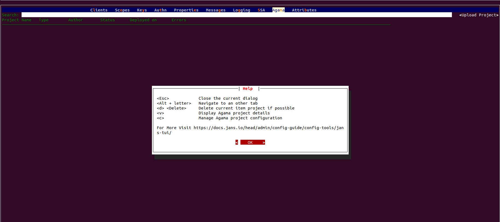
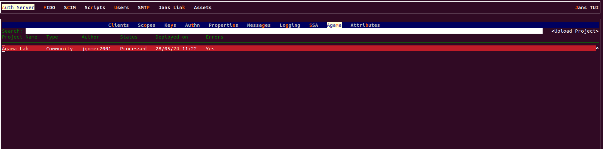
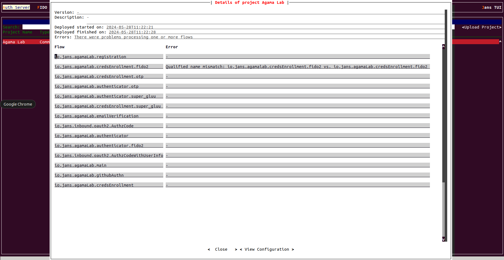
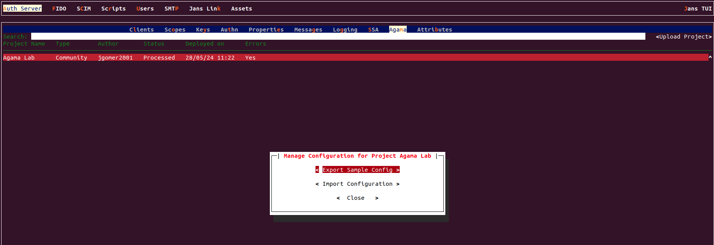
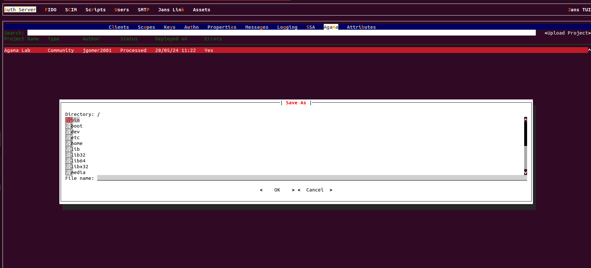

---
tags:
  - administration
  - configuration
  - agama project
subtitle: Learn how to manage and change Agama project configuration 
---

# Agama project configuration

You can use any of the available configuration tools to perform this 
configuration based on your need.

=== "Use Command-line"

    Learn how to use Jans CLI [here]() or Jump straight to 
    [configuration steps](#using-command-line)

=== "Use Text-based UI"

    Learn how to use Jans Text-based UI (TUI) [here]() or Jump straight to
    [configuration steps](#using-text-based-ui)

##  Using Command Line

In Janssen Server, You can deploy and customize Agama project using commandline.
To get the details of Janssen commandline operations relevant to Agama projects
, you can check the operations under `Agama` task using the  
command as below:

```bash title="Command"
/opt/jans/jans-cli/config-cli.py --info Agama
```

It will show you the details of available operation-id for Agama.

```text
Operation ID: get-agama-prj-by-name
  Description: Fetches deployed Agama project based on name.
  Parameters:
  name: Agama project name [string]
Operation ID: post-agama-prj
  Description: Deploy an Agama project.
  Parameters:
  name: Agama project name [string]
Operation ID: delete-agama-prj
  Description: Delete a deployed Agama project.
  Parameters:
  name: Agama project name [string]
Operation ID: get-agama-prj-configs
  Description: Retrieve the list of configs based on name.
  Parameters:
  name: Agama project name [string]
Operation ID: put-agama-prj
  Description: Update an Agama project.
  Parameters:
  name: Agama project name [string]
  Parameters:
    type: Description not found for this property
    additionalProperties: Description not found for this property
Operation ID: get-agama-prj
  Description: Retrieve the list of projects deployed currently.
  Parameters:
  start: No description is provided for this parameter [integer]
  count: No description is provided for this parameter [integer]
```

In the sections below, we will see how to use these operations to manage Agama
projects via commandline. 

### List Deployed Projects

To retrieve the list of deployed Agama projects:

```bash title="Command"
/opt/jans/jans-cli/config-cli.py --operation-id get-agama-prj
```

The output will display the total number of Agama projects that are enabled and 
their list. You can get modified list using supported parameters.

```json title="Sample Output" linenums="1"
{
  "start": 0,
  "totalEntriesCount": 1,
  "entriesCount": 1,
  "entries": [
    {
      "dn": "jansId=46546e9a-fed6-34d0-ba63-b615233b2115,ou=deployments,ou=agama,o=jans",
      "id": "46546e9a-fed6-34d0-ba63-b615233b2115",
      "createdAt": "2023-08-13T14:45:27",
      "taskActive": false,
      "finishedAt": "2023-08-13T14:45:43",
      "details": {
        "error": "There were problems processing one or more flows",
        "flowsError": {
          "mmrraju.np.test.me": null,
          "mmrraju.test2.agama": null,
          "mmrraju.u2f.me": "Syntax error: mismatched input '<EOF>' expecting {'|', 'Log', 'Trigger', 'Call', 'RRF', 'When', 'Repeat', 'Iterate over', 'Match', 'Finish', 'RFAC', ALPHANUM, QNAME, DOTEXPR, DOTIDXEXPR, WS}\nSymbol: [@9,43:42='<EOF>',<-1>,2:23]\nLine: 2\nColumn: 24"
        },
        "projectMetadata": {
          "projectName": "user_pass_auth",
          "author": "mmrraju",
          "type": "community",
          "description": "This is password based authentication",
          "version": "1.0.34",
          "configs": null
        }
      },
      "baseDn": "jansId=46546e9a-fed6-34d0-ba63-b615233b2115,ou=deployments,ou=agama,o=jans"
    }
  ]
}
```

#### Endpoint Arguments

Endpoint arguments are parameters passed to an API or function to specify 
how and what data to retrieve or process.

`start`: Should be an integer value. It's an index value of starting point of 
the list.

`count`: Should be an integer value. Total entries number you want to display. 

**Example:**

```bash title="Command"
/opt/jans/jans-cli/config-cli.py --operation-id get-agama-prj \
--endpoint-args start:1,count:1
```

```json title="Sample Output" linenums="1"
{
  "start": 1,
  "totalEntriesCount": 3,
  "entriesCount": 1,
  "entries": [
    {
      "dn": "jansId=3a0e91a4-b79b-37c2-9df7-122247e8ed9c,ou=deployments,ou=agama,o=jans",
      "id": "3a0e91a4-b79b-37c2-9df7-122247e8ed9c",
      "createdAt": "2023-08-15T05:56:19",
      "taskActive": false,
      "finishedAt": "2023-08-15T05:56:42",
      "details": {
        "error": "Archive missing web and/or code subdirectories",
        "flowsError": null,
        "projectMetadata": {
          "projectName": "testAuth",
          "configs": null
        }
      },
      "baseDn": "jansId=3a0e91a4-b79b-37c2-9df7-122247e8ed9c,ou=deployments,ou=agama,o=jans"
    }
  ]
}

```

### View Agama Project By Name

You can get the details of an Agama project deployed in Janssen by the project name. Commandline for this operation as below:

```bash title="Sample Command"
/opt/jans/jans-cli/config-cli.py --operation-id get-agama-prj-by-name \
--url-suffix="agama-project-name"
```

**Example:**
```bash title="Command"
/opt/jans/jans-cli/config-cli.py --operation-id get-agama-prj-by-name \
--url-suffix="testAuth"
```

```json title="Sample Output" linenums="1"
{
  "dn": "jansId=3a0e91a4-b79b-37c2-9df7-122247e8ed9c,ou=deployments,ou=agama,o=jans",
  "id": "3a0e91a4-b79b-37c2-9df7-122247e8ed9c",
  "createdAt": 1687247278717,
  "taskActive": false,
  "finishedAt": 1687247288646,
  "assets": null,
  "details": {
    "folders": null,
    "libs": [],
    "flowsError": {
      "imShakil.co.basicAuth": null
    },
    "error": null,
    "projectMetadata": {
      "projectName": "testAuth",
      "author": "imShakil",
      "type": "community",
      "description": "testing authentication with janssen server",
      "version": "1.0.0",
      "configs": null
    }
  },
  "baseDn": "jansId=3a0e91a4-b79b-37c2-9df7-122247e8ed9c,ou=deployments,ou=agama,o=jans"
}
```

### Post Agama Project in Janssen 

You can deploy Agama project in Janssen through commandline.

```bash title="Sample Command"
/opt/jans/jans-cli/config-cli.py --operation-id post-agama-prj \
--url-suffix="name:project-name" --data agama-project-file
```

**Example:**

Let's upload [a test project](../../../assets/agama/journey.zip) Zip file.
Assuming that the zip file has been downloaded in the folder at 
path `/tmp/journey.zip`, the command below will upload a new Agama project with
specified name in the Janssen Server. 

```bash title="Command"
/opt/jans/jans-cli/config-cli.py --operation-id=post-agama-prj \
--url-suffix="name:Agama Lab Journey" --data /tmp/journey.zip
```

```json title="Sample Output" 
{
  "message": "A deployment task for project Agama Lab Journey has been queued. Use the GET endpoint to poll status"
}
```

Now the project should be available in the 
[list of deployed projects](#list-deployed-projects).

### Retrieve Agama Project Configuration

To retrieve Agama project configuration:

```bash title="Command"
/opt/jans/jans-cli/config-cli.py --operation-id get-agama-prj-configs \
--url-suffix="name:agama-project-name"
```

### Update Agama Project

Let's update configuration for this project:

Take the 
[sample project configuration](../../../assets/agama/journey-configs.json) and 
keep it under `/tmp/journey-configs.json`.

Make few test changes to the configuration and run the command below to
update the configuration:

```bash title="Command"
/opt/jans/jans-cli/config-cli.py --operation-id=put-agama-prj \
--url-suffix "name:Agama Lab Journey" --data /tmp/journey-configs.json 
```

```json title="Sample Output" linenums="1"
{
  "io.jans.agamaLab.registration": true,
  "io.jans.agamaLab.main": true,
  "io.jans.agamaLab.credsEnrollment.otp": true,
  "io.jans.agamaLab.authenticator.super_gluu": true,
  "io.jans.agamaLab.credsEnrollment.super_gluu": true,
  "io.jans.agamaLab.githubAuthn": true
}
```


### Delete Agama Project

To delete Agama project by its name, use the command below

```bash title="Sample Command"
/opt/jans/jans-cli/config-cli.py --operation-id delete-agama-prj \
--url-suffix="agama-project-name"
```

### Agama Flow Configuration

`AgamaConfiguration` task groups operations that help understand the correctness
of the deployed Agama project configuration. 

```bash title="Command"
/opt/jans/jans-cli/config-cli.py --info AgamaConfiguration
```

```text title="Sample Output" linenums="1"
Operation ID: agama-syntax-check
  Description: Determine if the text passed is valid Agama code
  Parameters:
  qname: Agama Flow name [string]
```

#### Agama Flow DSL Syntax

To check if a deployed Agama project is running into Agama
DSL related errors, run the command below:

```bash title="Sample Command"
/opt/jans/jans-cli/config-cli.py --operation-id agama-syntax-check \
--url-suffix qname:"fully-qualified-flow-name"
```

You can do some syntax check with this operation-id. 
It will help to find out syntax error in Agama low code projects. 

***Example***:

```bash title="Command"
/opt/jans/jans-cli/config-cli.py --operation-id agama-syntax-check \
--url-suffix qname:"imShakil.co.test"
```

```json title="Sample Output" linenums="1"
{
  "error": "mismatched input 'newline' expecting 'Flow'",
  "symbol": "[@0,0:-1='newline',<9>,1:0]",
  "line": 1,
  "column": 0,
  "message": "Syntax error: mismatched input 'newline' expecting 'Flow'\nSymbol: [@0,0:-1='newline',<9>,1:0]\nLine: 1\nColumn: 1"
}
```

##  Using Text-based UI

In Janssen, You can deploy and customize Agama project using Text-Based UI.

You can run it by executing:

```title="Command"
sudo /opt/jans/jans-cli/jans_cli_tui.py
```
### Agama Help 

* You first access the help screen by using the `F1` key, 
where all operating instructions for the Agama are displayed.
  

* In below screenshot, showing the Agama help screen.

 

### Agama Project Screen

* In below screenshot, we are getting the list of existing Agama projects. 

* With the button which is located on right upper side named "Upload Project", it's possible to create new project.

* We can search the Agama project by project name.



### Agama Project Detail Screen

* In the below screenshot, we can view the Agama project details.



### Agama Project Configuration Screen
    
* In the below screenshot, we can manage the configuration for the Agama project.

* Both exporting and importing the configuration are options.



* In the below screenshot, showing the add configurations screen.




