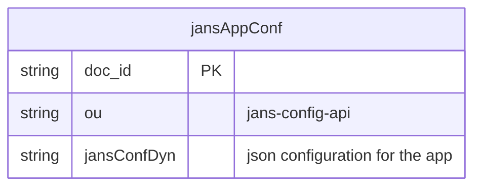
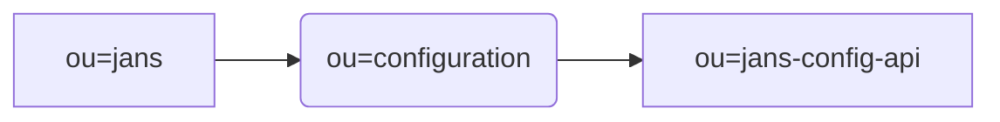

---
tags:
  - administration
  - config-api
  - configuration
---

# Config-api-configuration

## Overview
[Jans Config API](https://github.com/JanssenProject/jans/tree/main/jans-config-api) configuration enables to manage application-level configuration.

## Config API Configuration Parameters:
| Field named | Example | Description|
|--|--|--|
|configOauthEnabled| true | property can be used to enable or disable the oAuth2 authorization. By default, its set to true.|
|apiApprovedIssuer| ["https://<jans.auth.server>,https://<gluu.server>,https://<anyAuth.server>"] | Enables to set more than one authorization servers. By default, the current auth-server is set. You can add more server separated by comma. |
|apiProtectionType | oauth2| Currently support mechanisms is OAuth 2.0 tokens. |
|apiClientId | 1800.52eb1bed-ab5c-4ba6-b87e-90aad26058d0| Jans Config API Client. |
|apiClientPassword | lwI/8mcMkF63mvueYTZ0mQ==| Encrypted secret of Jans Config API Client|
|endpointInjectionEnabled |false| To be used in-case endpoint needs to be injected. |
|authIssuerUrl| https://my-jans-server.jans.io  | URL of underlying auth-server.|
|authOpenidConfigurationUrl| https://my-jans-server.jans.io/.well-known/openid-configuration | Metadata url of the authorization server.|
|authOpenidIntrospectionUrl| https://my-jans-server.jans.io/jans-auth/restv1/introspection | Authorization server endpoint ro check the state of an OAuth 2.0 token and to determine meta-information about token.|
|authOpenidTokenUrl| https://my-jans-server.jans.io/jans-auth/restv1/token | Authorization server endpoint to obtain an Access Token, an ID Token, and optionally a Refresh Token.|
|authOpenidRevokeUrl| https://my-jans-server.jans.io/jans-auth/restv1/token | Authorization server endpoint to notify an OAuth 2.0 authorization server that a previously obtained refresh or access token is no longer needed, allowing the server to clean up security credentials.|
|smallryeHealthRootPath| /health-check | Deprecated param for health-check|
|exclusiveAuthScopes| ["jans_stat","https://jans.io/scim/users.read","https://jans.io/scim/users.write"] | Scopes that are only validated against the underlying Jansen Authorization server.|
|corsConfigurationFilters| [{"filterName":"CorsFilter","corsEnabled":true,"corsAllowedOrigins":"*","corsAllowedMethods":"GET,PUT,POST,DELETE,PATCH,HEAD,OPTIONS","corsAllowedHeaders":"","corsExposedHeaders":"","corsSupportCredentials":true,"corsLoggingEnabled":false,"corsPreflightMaxAge":1800,"corsRequestDecorate":true}] | This list specifies the CORS configuration filters.  |
|exclusiveAuthScopes| ["jans_stat","https://jans.io/scim/users.read","https://jans.io/scim/users.write"] | Scopes that are only validated against the underlying Jansen Authorization server.|
|loggingLevel | "INFO" or "TRACE" or "DEBUG" | Logging level for Config API.|
|loggingLayout |"text"|Contents of logs as plain text format.|
|externalLoggerConfiguration||Path to external log4j2 logging configuration.|
|disableJdkLogger|true|Boolean to disable JDK loggers.|
|maxCount|200|To be used to set maximum records returned in response.|
|userExclusionAttributes|["userPassword"]|List of attributes to be excluded in User response.|
|userMandatoryAttributes|["mail","displayName","jansStatus","userPassword","givenName"]|List of attributes mandatory for creating a User.|
|agamaConfiguration|{"mandatoryAttributes":["qname","source"],"optionalAttributes":["serialVersionUID","enabled"]}|Configuration parameters like mandatory, optional, etc for agama flow.|
|auditLogConf|{"enabled":true,"ignoreHttpMethod":[],"headerAttributes":["User-inum"]}|Audit Log configuration.|
|dataFormatConversionConf|{"enabled":true,"ignoreHttpMethod":["@jakarta.ws.rs.GET()"]}|DB specific data format conversion configuration for Date field.|
|plugins|[{"name":"admin","description":"admin-ui plugin","className":"io.jans.ca.plugin.adminui.rest.ApiApplication"},{"name":"fido2","description":"fido2 plugin","className":"io.jans.configapi.plugin.fido2.rest.ApiApplication"},{"name":"scim","description":"scim plugin","className":"io.jans.configapi.plugin.scim.rest.ApiApplication"},{"name":"user-management","description":"user-management plugin","className":"io.jans.configapi.plugin.mgt.rest.ApiApplication"}]|List of configured plugin.|


## Configuring the Config API:
### 1. Read Configuration parameters:

Use the following command to obtain configuration parameters:

`/opt/jans/jans-cli/config-cli.py --operation-id get-config-api-properties`

Response:
> ```javascript
>{
>  "configOauthEnabled": true,
>  "apiApprovedIssuer": ["https://<your-jans-host>"],
>  "apiProtectionType": "oauth2",
>  "apiClientId": "1800.0a6a17a0-0d3b-4ce5-881c-f98b2f2b75a7",
>  "apiClientPassword": "BlRk0TlvJp8QJg1vs5e1vw==",
>  "endpointInjectionEnabled": false,
>  "authIssuerUrl": "https://<your-jans-host>",
>  "authOpenidConfigurationUrl": "https://<your-jans-host>/.well-known/openid-configuration",
>  "authOpenidIntrospectionUrl": "https://<your-jans-host>/jans-auth/restv1/introspection",
>  "authOpenidTokenUrl": "https://<your-jans-host>/jans-auth/restv1/token",
>  "authOpenidRevokeUrl": "https://<your-jans-host>/jans-auth/restv1/revoke",
>  "smallryeHealthRootPath": "/health-check",
>  "disableJdkLogger":true,
>  "loggingLevel":"INFO",
>  "loggingLayout":"text",
>  "externalLoggerConfiguration":"",
>  "exclusiveAuthScopes": [
>    "jans_stat",
>    "https://jans.io/scim/users.read",
>    "https://jans.io/scim/users.write"
>  ],
>  "corsConfigurationFilters": [
>    {
>      "filterName": "CorsFilter",
>      "corsAllowedOrigins": "*",
>      "corsAllowedMethods": "GET,PUT,POST,DELETE,PATCH,HEAD,OPTIONS",
>      "corsAllowedHeaders": "",
>      "corsExposedHeaders": "",
>      "corsSupportCredentials": true,
>      "corsLoggingEnabled": false,
>      "corsPreflightMaxAge": 1800,
>      "corsRequestDecorate": true,
>      "corsEnabled": true
>    }
>  ],
>  "userExclusionAttributes": [
>    "userPassword"
>  ],
>   "userMandatoryAttributes": [
>	"mail",
>	"displayName",
>	"jansStatus",
>	"userPassword",
>	"givenName"
>  ],
>  "agamaConfiguration": {
>     "mandatoryAttributes": [
>	 "qname",
>	 "source"
>     ],
>	 "optionalAttributes": [
>	 "serialVersionUID",
>	 "enabled"
>     ]
>  }
>}
> ```

### 2. Update configuration parameters:

  Config API configuration parameters can be updated via PATCH request.
  Steps:
  A. Create a JSON file say `/tmp/config_values.json` by editing the JSON with JSON Patch operation list.
     Refer JSON Patch document [RFC 6902] (https://datatracker.ietf.org/doc/html/rfc6902)
	
  Example:
> ```javascript	
>[
> {
>   "op": "replace",
>   "path": "/loggingLevel",
>   "value": "TRACE"
> },
> {
>   "op": "add",
>   "path": "/exclusiveAuthScopes/3",
>   "value": "https://jans.io/oauth/config/properties.write"
> }
>]
> ```
   
  B. Use the following command
  `/opt/jans/jans-cli/config-cli.py --operation-id patch-config-api-properties --data /tmp/config_values.json`


### 3. Two options to make effect any manual changes done to the configuration
1. Restart jans-config-api 
2. Increment the `jansRevision` property of the configuration without restarting the application. The timer job will detect the change and fetch the latest configuration from the DB.

### 4. Locating Config API configuration in Persistence Layer

While it is not recommended that an administrator directly edits a configuration at the persistence layer, it may be useful information for a developer.

#### A. MySQL


#### B. LDAP




### Important attributes

#### OAuth authorization

`configOauthEnabled` property can be used to enable or disable the oAuth2 authorization. By default, its set to true.

> ```javascript
>  ...
> "configOauthEnabled": true
>  ...
>```

#### Api protection 

`apiProtectionType` property states the protocol used for API authorization. Currently supported value is `oauth2`.

> ```javascript
>  ...
> "apiProtectionType": "oauth2"
>  ...
> ```

### Api protection auth server

`apiApprovedIssuer` property enables to set more than one authorization servers. By default, the current auth-server is set. You can add more server separated by comma.

> ```javascript
>  ...
> apiApprovedIssuer": ["https://<jans.auth.server>,https://<gluu.server>,https://<anyAuth.server>"]
>  ...
> ```

### Logging level 

`loggingLevel` property can be used to the change the logging level to the desired values `(TRACE, DEBUG, INFO, WARN, ERROR)`. By default, the level is set to `INFO`

> ```javascript
>  ...
> "loggingLevel":"DEBUG",
>  ...
>``

### Scopes other than the one defined by config-api

Config API endpoints are oAuth2 protected. These scopes are created while installation. However, there are few endpoints that require scopes defined by other modules like auth-server. 

A list of these scopes is maintained in configuration in order to avoid creation of these scopes during Config API start-up.
`exclusiveAuthScopes` property can be used to the change the logging level to the desired value `(TRACE, DEBUG, INFO, WARN, ERROR)`. By default, the level is set to `INFO`

> ```javascript
>  ...
>  "exclusiveAuthScopes": [
>    "jans_stat",
>    "https://jans.io/scim/users.read",
>    "https://jans.io/scim/users.write"
>  ],
>  ...
> ```

### User - Mandatory and exclusion attributes

#### MandatoryAttributes 

`userMandatoryAttributes` can be used to define mandatory attributes for User while creation and update.

> ```javascript
>  ...
>   "userMandatoryAttributes": [
>	"mail",
>	"displayName",
>	"jansStatus",
>	"userPassword",
>	"givenName"
>  ],
>  ...
> ```

#### Exclusion attributes

`userExclusionAttributes` can be used to define User attributes that are not to be returned  in API response. More attributes that are to be skipped in response can be added to the list.

> ```javascript
>  ...
>  "userExclusionAttributes": [
>    "userPassword"
>  ],
>  ...
> ```


### Agama flow configuration

`agamaConfiguration` stores Agama related configuration used in Agama related endpoints.

`mandatoryAttributes` list defines required attributes for Agama flow creation and update.
`optionalAttributes` list specify the optional attributes.

> ```javascript
>  ...
>  "agamaConfiguration": {
>     "mandatoryAttributes": [
>	 "qname",
>	 "source"
>     ],
>	 "optionalAttributes": [
>	 "serialVersionUID",
>	 "enabled"
>     ]
>  }
>  ...
> ```
