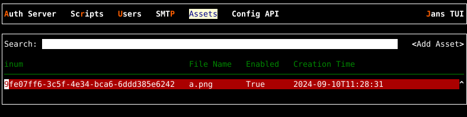

---
tags:
 - administration
 - configuration
 - custom assets
---

# Custom Assets Configuration

The Janssen Server provides multiple configuration tools to configure custom
assets.

=== "Use Command-line"

    Use the command line to perform actions from the terminal. Learn how to 
    use Jans CLI [here](../config-guide/config-tools/jans-cli/README.md) or jump straight to 
    the [Using Command Line](#using-command-line)

=== "Use Text-based UI"

    Use a fully functional text-based user interface from the terminal. 
    Learn how to use Jans Text-based UI (TUI) 
    [here](../config-guide/config-tools/jans-tui/README.md) or jump straight to the
    [Using Text-based UI](#using-text-based-ui)

=== "Use REST API"

    Use REST API for programmatic access or invoke via tools like CURL or 
    Postman. Learn how to use Janssen Server Config API 
    [here](../config-guide/config-tools/config-api/README.md) or Jump straight to the
    [Using Configuration REST API](#using-configuration-rest-api)

##  Using The Command Line


In the Janssen Server, you can deploy custom assets using the
command line. To get the details of Janssen command line operations relevant to
the custom assets, check the operations under the `JansAssets` task using the
command below.

```bash title="Command"
/opt/jans/jans-cli/config-cli.py --info JansAssets
```

```test title="Sample Output" linenums="1"
Operation ID: get-asset-by-inum
 Description: Gets an asset by inum - unique identifier
 Parameters:
 inum: Asset Inum [string]
Operation ID: delete-asset
 Description: Delete an asset
 Parameters:
 inum: Asset identifier [string]
Operation ID: get-asset-by-name
 Description: Fetch asset by name.
 Parameters:
 name: Asset Name [string]
Operation ID: get-all-assets
 Description: Gets all Jans assets.
 Parameters:
 limit: Search size - max size of the results to return [integer]
 pattern: Search pattern [string]
 status: Status of the attribute [string]
 startIndex: The 1-based index of the first query result [integer]
 sortBy: Attribute whose value will be used to order the returned response [string]
 sortOrder: Order in which the sortBy param is applied. Allowed values are "ascending" and "descending" [string]
 fieldValuePair: Field and value pair for searching [string]
Operation ID: get-asset-services
 Description: Gets asset services
Operation ID: get-asset-types
 Description: Get valid asset types
Operation ID: put-asset
 Description: Update existing asset
 Schema: AssetForm
Operation ID: post-new-asset
 Description: Upload new asset
 Schema: AssetForm

To get sample schema type /opt/jans/jans-cli/config-cli.py --schema-sample <schema>, for example /opt/jans/jans-cli/config-cli.py --schema-sample AssetForm
```

### Get All Current Custom Assets

Get all the currently configured custom assets on the Janssen Server by 
performing this operation.

```bash title="Command"
/opt/jans/jans-cli/config-cli.py --operation-id get-all-assets
```
```json title="Sample Output" linenums="1"
{
  "start": 0,
  "totalEntriesCount": 2,
  "entriesCount": 2,
  "entries": [
 {
      "dn": "inum=36014ca4-0978-4d95-8858-964b815ea770,ou=document,o=jans",
      "inum": "36014ca4-0978-4d95-8858-964b815ea770",
      "displayName": "custom.xhtml",
      "description": "custom page",
      "document": "",
      "creationDate": "2024-07-25T11:40:17",
      "jansService": [
        "jans-auth"
 ],
      "jansLevel": 1,
      "jansEnabled": true,
      "baseDn": "inum=36014ca4-0978-4d95-8858-964b815ea770,ou=document,o=jans"
 },
 {
      "dn": "inum=b5ab08e4-17b2-487d-845a-bdc6b48fd5b4,ou=document,o=jans",
      "inum": "b5ab08e4-17b2-487d-845a-bdc6b48fd5b4",
      "displayName": "a.png",
      "description": "custom image",
      "document": "",
      "creationDate": "2024-07-25T11:44:38",
      "jansService": [
        "jans-auth"
 ],
      "jansLevel": 2,
      "jansEnabled": true,
      "baseDn": "inum=b5ab08e4-17b2-487d-845a-bdc6b48fd5b4,ou=document,o=jans"
 }
 ]
}
```

### Get Custom Asset By inum

With `get-all-assets` operation-id, we can get any specific asset matched 
with `inum`. If we know the `inum`, we can simply use the below command:

```bash title="Command"
/opt/jans/jans-cli/config-cli.py --operation-id get-asset-by-inum \
--url-suffix inum:36014ca4-0978-4d95-8858-964b815ea770
```
It returns the details as below:


```json title="Sample Output" linenums="1"
 {
  "dn": "inum=36014ca4-0978-4d95-8858-964b815ea770,ou=document,o=jans",
  "inum": "36014ca4-0978-4d95-8858-964b815ea770",
  "displayName": "custom.xhtml",
  "description": "custom page",
  "document": "",
  "creationDate": "2024-07-25T11:40:17",
  "jansService": [
    "jans-auth"
 ],
  "jansLevel": 1,
  "jansEnabled": true,
  "baseDn": "inum=36014ca4-0978-4d95-8858-964b815ea770,ou=document,o=jans"
}
```


### Get Custom Asset By Name

With `get-asset-by-name` operation-id, we can get any specific asset matched with `name`.
 If we know the `name`, we can simply use the below command:

```bash title="Command"
/opt/jans/jans-cli/config-cli.py --operation-id get-asset-by-name \
--url-suffix name:a.png
```
It returns the details as below:

```json title="Sample Output" linenums="1"
{
  "start": 0,
  "totalEntriesCount": 1,
  "entriesCount": 1,
  "entries": [
 {
      "dn": "inum=b5ab08e4-17b2-487d-845a-bdc6b48fd5b4,ou=document,o=jans",
      "inum": "b5ab08e4-17b2-487d-845a-bdc6b48fd5b4",
      "displayName": "a.png",
      "description": "custom image",
      "document": "",
      "creationDate": "2024-07-25T11:44:38",
      "jansService": [
        "jans-auth"
 ],
      "jansLevel": 2,
      "jansEnabled": true,
      "baseDn": "inum=b5ab08e4-17b2-487d-845a-bdc6b48fd5b4,ou=document,o=jans"
 }
 ]
}
```

### Get Services


Get the list of Janssen Server services that support custom assets
 by performing `get-asset-services` operation.

```bash title="Command"
/opt/jans/jans-cli/config-cli.py --operation-id get-asset-services
```

```text title="Sample Output" linenums="1"
[
 "jans-auth",
 "jans-casa",
 "jans-config-api",
 "jans-fido2",
 "jans-link",
 "jans-lock",
 "jans-scim",
 "jans-keycloak-link"
]
```


### Get Valid Asset Types

Get the asset types of your Janssen Server by performing `get-asset-types` 
operation.

```bash title="Command"
/opt/jans/jans-cli/config-cli.py --operation-id get-asset-types
```

```text title="Sample Output" linenums="1"
[
 "properties",
 "jar",
 "xhtml",
 "js",
 "css",
 "png",
 "gif",
 "jpg",
 "jpeg"
]
```

### Add New Custom Asset

To create a new asset, we can use `post-new-asset` operation id. As shown in
the [output](#using-command-line) for `--info` command, the `post-new-asset` 
operation requires data to be sent according to `AssetForm` schema.


To see the schema, use the command below:

```bash title="Command"
/opt/jans/jans-cli/config-cli.py --schema AssetForm
```

For better understanding, the Janssen Server also provides a sample of data to 
be sent to the server. This sample conforms to the schema above. Use the command 
below to get the sample.

```bash title="Command"
/opt/jans/jans-cli/config-cli.py --schema-sample AssetForm
```

Using the schema and the example above, we have added below data to the 
file `/tmp/add-asset.json`. Example below will load `p.properties` file as
a custom asset to the `jans-auth` service.

```json title="Input" linenums="1" 
{
  "document": {
    "displayName": "p.properties",
    "description": "Valid text description",
    "jansService": [
      "jans-auth"
    ],
    "jansLevel": 142,
    "jansEnabled": true
  },
  "assetFile": "/tmp/p.properties"
}

```
Now let's post this Assert to the Janssen Server to be added to the existing set:

```bash title="Command"
 /opt/jans/jans-cli/config-cli.py --operation-id post-new-asset \
 --data /tmp/add-asset.json
```


### Update Existing Custom Assets

Use the `put-asset` operation to update an existing asset. This operation uses
same schema as [add new asset](#add-new-custom-asset) operation. For example,
assuming that there is an existing asset as show below:

```json title="Existing Asset"
    {
      "dn": "inum=48f2e07b-b879-4db2-816b-36bc4d69701f,ou=document,o=jans",
      "inum": "48f2e07b-b879-4db2-816b-36bc4d69701f",
      "displayName": "p.properties",
      "description": "Valid text description",
      "document": "cHJvcGVydGllcyBoZXJlLiAK\r\n",
      "creationDate": "2024-07-31T06:24:55",
      "jansService": [
        "jans-auth"
      ],
      "jansLevel": 142,
      "jansEnabled": true,
      "baseDn": "inum=48f2e07b-b879-4db2-816b-36bc4d69701f,ou=document,o=jans"
    }
```

Now to update level of this asset to 6, create a text file with following
content in it. Let's name this text file as `/tmp/update-asset.json`

```json 
{
  "document": {
      "dn": "inum=48f2e07b-b879-4db2-816b-36bc4d69701f,ou=document,o=jans",
      "inum": "48f2e07b-b879-4db2-816b-36bc4d69701f",
      "displayName": "p.properties",
      "description": "Valid text description",
      "document": "cHJvcGVydGllcyBoZXJlLiAK\r\n",
      "creationDate": "2024-07-31T06:24:55",
      "jansService": [
        "jans-auth"
      ],
      "jansLevel": 6,
      "jansEnabled": true
   },
  "assetFile": "/tmp/p.properties"
}
```

Now use the command below to update the asset with new value for level.

```bash title="Sample Command"
/opt/jans/jans-cli/config-cli.py --operation-id put-asset \
--data /tmp/update-asset.json
```

Upon successful execution, this command will return with updated asset values.

```json title="Return values"

```

3. We have changed only the `` to ` ` in the existing asset.
 Use the updated file to send the update to the Janssen Server using the command below
 ```bash title="Command"
   /opt/jans/jans-cli/config-cli.py --operation-id put-asset \
   --data /tmp/update-asset.json
 ```
This will update the existing asset matched with inum value.


### Delete Custom Asset

You can delete any custom asset by its `inum` value.

```bash title="Command"
/opt/jans/jans-cli/config-cli.py --operation-id delete-asset \
--url-suffix inum:36014ca4-0978-4d95-8858-964b815ea770
```

## Using Text-based UI


In Janssen, You can deploy custom asset using
the [Text-Based UI](./config-tools/jans-tui/README.md) also.

You can start TUI using the command below:

```bash title="Command"
sudo /opt/jans/jans-cli/jans_cli_tui.py
```

### Asset Screen

Navigate to `Assets` tab to open the Assets screen as shown in the image below.

* To get the list of currently added Assets, bring the control to the Search 
box (using the tab key), and press Enter. Type the search string to search 
for Asset with matching `Display Name` and `inum`.





* Use the `Add Asset` button to create a new asset. 
* From the screen below, select the custom asset that needs to be uploaded
and select the Janssen Server service to which the asset will be uploaded.


## Using Configuration REST API

Janssen Server Configuration REST API exposes relevant endpoints for managing
and configuring the custom assets. Endpoint details are published in the [Swagger
document](./../reference/openapi.md).