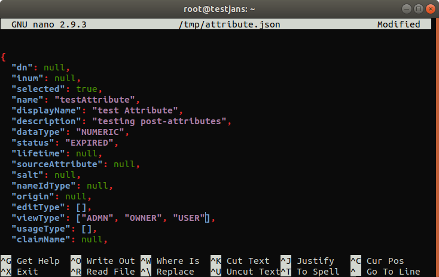
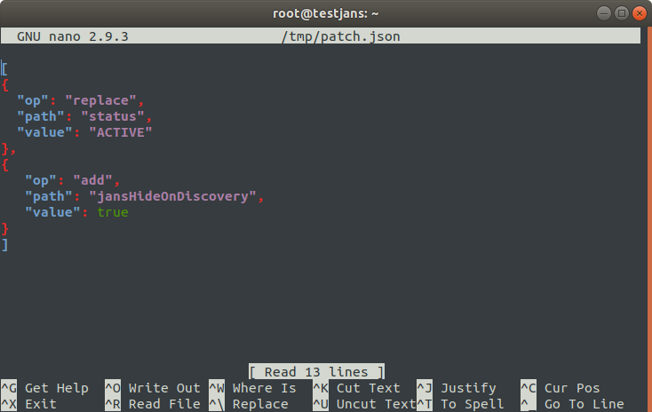

---
tags:
  - administration
  - configuration
  - cli
  - commandline
---

# Attribute

First thing, let's get the information for `Attribute`:
```commandline
/opt/jans/jans-cli/config-cli.py --info Attribute
```
In return, we get a list of Operations ID as below:

```text
Operation ID: get-all-attribute
  Description: Gets all attributes. Optionally max-size of the result, attribute status and pattern can be provided.
  Parameters:
  limit: Search size - max size of the results to return. [integer]
  pattern: Search pattern. [string]
  status: Status of the attribute [string]
  startIndex: The 1-based index of the first query result. [integer]
  sortBy: Attribute whose value will be used to order the returned response. [string]
  sortOrder: Order in which the sortBy param is applied. Allowed values are "ascending" and "descending". [string]
Operation ID: post-attributes
  Description: Adds a new attribute.
  Schema: /components/schemas/GluuAttribute
Operation ID: put-attributes
  Description: Updates an existing attribute.
  Schema: /components/schemas/GluuAttribute
Operation ID: get-attributes-by-inum
  Description: Gets an attribute based on inum.
  url-suffix: inum
Operation ID: delete-attributes-by-inum
  Description: Deletes an attribute based on inum.
  url-suffix: inum
Operation ID: patch-attributes-by-inum
  Description: Partially modify a GluuAttribute.
  url-suffix: inum
  Schema: Array of /components/schemas/PatchRequest

To get sample schema type /opt/jans/jans-cli/config-cli.py --schema <schma>, for example /opt/jans/jans-cli/config-cli.py --schema /components/schemas/PatchRequest
```

We have discussed here about each of this operations ID with few examples to understand how these really works.

Table of Contents
=================

* [Attribute](#attribute)
  * [Get Attributes](#get-attributes)
  * [Creating an Attribute](#creating-an-attribute)
  * [Updating an Attribute](#updating-an-attribute)
  * [Get Attribute by inum](#get-attribute-by-inum)
  * [Delete Attributes](#delete-attributes)
  * [Patch Attributes](#patch-attributes)

## Get Attributes

> Prerequisite: Know how to use the Janssen CLI in [command-line mode](cli-index.md)

As we know, Attributes are individual pieces of user data, like `uid` or `email`, that are required by applications in order to identify a user and grant access to protect resources. The user attributes that are available in your Janssen Server can be found by using this operation-ID. If we look at the description below:

```text
Operation ID: get-all-attribute
  Description: Gets all attributes. Optionally max-size of the result, attribute status and pattern can be provided.
  Parameters:
  limit: Search size - max size of the results to return. [integer]
  pattern: Search pattern. [string]
  status: Status of the attribute [string]
  startIndex: The 1-based index of the first query result. [integer]
  sortBy: Attribute whose value will be used to order the returned response. [string]
  sortOrder: Order in which the sortBy param is applied. Allowed values are "ascending" and "descending". [string]
```

To get all the attributes without any arguments, run the following command:
```commandline
/opt/jans/jans-cli/config-cli.py --operation-id get-all-attribute
```

To get attributes with passing the arguments, let's retrieve randomly limit:5:

```commandline
/opt/jans/jans-cli/config-cli.py --operation-id get-attributes --endpoint-args limit:5
```

It will return any 5 attributes randomly:
```text
Getting access token for scope https://jans.io/oauth/config/attributes.readonly
Calling with params limit=5
[
  {
    "dn": "inum=B4B0,ou=attributes,o=jans",
    "inum": "B4B0",
    "selected": false,
    "name": "givenName",
    "displayName": "First Name",
    "description": "Given name(s) or first name(s) of the End-User.Note that in some cultures, people can have multiple given names;all can be present, with the names being separated by space characters.",
    "dataType": "STRING",
    "status": "ACTIVE",
    "lifetime": null,
    "sourceAttribute": null,
    "salt": null,
    "nameIdType": null,
    "origin": "jansPerson",
    "editType": [
      "USER",
      "ADMIN"
    ],
    "viewType": [
      "USER",
      "ADMIN"
    ],
    "usageType": null,
    "claimName": "given_name",
    "seeAlso": null,
    "saml1Uri": "urn:mace:dir:attribute-def:givenName",
    "saml2Uri": "urn:oid:2.5.4.42",
    "urn": "urn:mace:dir:attribute-def:givenName",
    "scimCustomAttr": null,
    "oxMultiValuedAttribute": false,
    "custom": false,
    "requred": false,
    "attributeValidation": null,
    "tooltip": null
  },
  {
    "dn": "inum=29DA,ou=attributes,o=jans",
    "inum": "29DA",
    "selected": false,
    "name": "inum",
    "displayName": "Inum",
    "description": "XRI i-number, persistent non-reassignable identifier",
    "dataType": "STRING",
    "status": "ACTIVE",
    "lifetime": null,
    "sourceAttribute": null,
    "salt": null,
    "nameIdType": null,
    "origin": "jansPerson",
    "editType": null,
    "viewType": [
      "USER",
      "ADMIN"
    ],
    "usageType": null,
    "claimName": "inum",
    "seeAlso": null,
    "saml1Uri": "urn:mace:dir:attribute-def:inum",
    "saml2Uri": "urn:oid:1.3.6.1.4.1.48710.1.3.117",
    "urn": "urn:jans:dir:attribute-def:inum",
    "scimCustomAttr": null,
    "oxMultiValuedAttribute": false,
    "custom": false,
    "requred": false,
    "attributeValidation": null,
    "tooltip": null
  },
  {
    "dn": "inum=B52A,ou=attributes,o=jans",
    "inum": "B52A",
    "selected": false,
    "name": "jansPrefUsrName",
    "displayName": "Preferred Username",
    "description": "A domain issued and managed identifier for the person.Subject - Identifier for the End-User at the Issuer.",
    "dataType": "STRING",
    "status": "ACTIVE",
    "lifetime": null,
    "sourceAttribute": null,
    "salt": null,
    "nameIdType": null,
    "origin": "jansPerson",
    "editType": [
      "ADMIN"
    ],
    "viewType": [
      "USER",
      "ADMIN"
    ],
    "usageType": null,
    "claimName": "preferred_username",
    "seeAlso": null,
    "saml1Uri": "urn:mace:dir:attribute-def:preferredUsername",
    "saml2Uri": "urn:oid:1.3.6.1.4.1.48710.1.3.320",
    "urn": "http://openid.net/specs/openid-connect-core-1_0.html/StandardClaims/preferred_username",
    "scimCustomAttr": null,
    "oxMultiValuedAttribute": false,
    "custom": false,
    "requred": false,
    "attributeValidation": null,
    "tooltip": null
  },
  {
    "dn": "inum=64A0,ou=attributes,o=jans",
    "inum": "64A0",
    "selected": false,
    "name": "profile",
    "displayName": "Profile URL",
    "description": "URL of the End-User's profile page. The contents of this Web page SHOULD be about the End-User.",
    "dataType": "STRING",
    "status": "ACTIVE",
    "lifetime": null,
    "sourceAttribute": null,
    "salt": null,
    "nameIdType": null,
    "origin": "jansPerson",
    "editType": [
      "USER",
      "ADMIN"
    ],
    "viewType": [
      "USER",
      "ADMIN"
    ],
    "usageType": null,
    "claimName": "profile",
    "seeAlso": null,
    "saml1Uri": "urn:mace:dir:attribute-def:profile",
    "saml2Uri": "urn:oid:1.3.6.1.4.1.48710.1.3.321",
    "urn": "http://openid.net/specs/openid-connect-core-1_0.html/StandardClaims/profile",
    "scimCustomAttr": null,
    "oxMultiValuedAttribute": false,
    "custom": false,
    "requred": false,
    "attributeValidation": null,
    "tooltip": null
  },
  {
    "dn": "inum=42E0,ou=attributes,o=jans",
    "inum": "42E0",
    "selected": false,
    "name": "uid",
    "displayName": "Username",
    "description": "A domain issued and managed identifier for the person.Subject - Identifier for the End-User at the Issuer.",
    "dataType": "STRING",
    "status": "ACTIVE",
    "lifetime": null,
    "sourceAttribute": null,
    "salt": null,
    "nameIdType": null,
    "origin": "jansPerson",
    "editType": [
      "ADMIN"
    ],
    "viewType": [
      "USER",
      "ADMIN"
    ],
    "usageType": null,
    "claimName": "user_name",
    "seeAlso": null,
    "saml1Uri": "urn:mace:dir:attribute-def:uid",
    "saml2Uri": "urn:oid:0.9.2342.19200300.100.1.1",
    "urn": "urn:mace:dir:attribute-def:uid",
    "scimCustomAttr": null,
    "oxMultiValuedAttribute": false,
    "custom": false,
    "requred": false,
    "attributeValidation": null,
    "tooltip": null
  }
]
```

To get attributes with `pattern & status`:

```commandline
/opt/jans/jans-cli/config-cli.py --operation-id get-attributes --endpoint-args limit:5,pattern:profile,status:ACTIVE
```
In return, we get a list of attribute that are matched with the given `pattern` and `status`:

```properties
Getting access token for scope https://jans.io/oauth/config/attributes.readonly
Calling with params limit=5&pattern=profile&status=ACTIVE
[
  {
    "dn": "inum=EC3A,ou=attributes,o=jans",
    "inum": "EC3A",
    "selected": false,
    "name": "picture",
    "displayName": "Picture URL",
    "description": "URL of the End-User's profile picture",
    "dataType": "STRING",
    "status": "ACTIVE",
    "lifetime": null,
    "sourceAttribute": null,
    "salt": null,
    "nameIdType": null,
    "origin": "jansPerson",
    "editType": [
      "USER",
      "ADMIN"
    ],
    "viewType": [
      "USER",
      "ADMIN"
    ],
    "usageType": null,
    "claimName": "picture",
    "seeAlso": null,
    "saml1Uri": "urn:mace:dir:attribute-def:picture",
    "saml2Uri": "urn:oid:1.3.6.1.4.1.48710.1.3.322",
    "urn": "http://openid.net/specs/openid-connect-core-1_0.html/StandardClaims/picture",
    "scimCustomAttr": null,
    "oxMultiValuedAttribute": false,
    "custom": false,
    "requred": false,
    "attributeValidation": null,
    "tooltip": null
  },
  {
    "dn": "inum=64A0,ou=attributes,o=jans",
    "inum": "64A0",
    "selected": false,
    "name": "profile",
    "displayName": "Profile URL",
    "description": "URL of the End-User's profile page. The contents of this Web page SHOULD be about the End-User.",
    "dataType": "STRING",
    "status": "ACTIVE",
    "lifetime": null,
    "sourceAttribute": null,
    "salt": null,
    "nameIdType": null,
    "origin": "jansPerson",
    "editType": [
      "USER",
      "ADMIN"
    ],
    "viewType": [
      "USER",
      "ADMIN"
    ],
    "usageType": null,
    "claimName": "profile",
    "seeAlso": null,
    "saml1Uri": "urn:mace:dir:attribute-def:profile",
    "saml2Uri": "urn:oid:1.3.6.1.4.1.48710.1.3.321",
    "urn": "http://openid.net/specs/openid-connect-core-1_0.html/StandardClaims/profile",
    "scimCustomAttr": null,
    "oxMultiValuedAttribute": false,
    "custom": false,
    "requred": false,
    "attributeValidation": null,
    "tooltip": null
  }
]
```

## Creating an Attribute

To create SSO for certain applications, you may need to add custom attributes to your Janssen Server. Custom attributes can be added by using this operation-ID. It has a schema file where it's defined: the properties it needs to be filled to create a new custom attribute.

```text
Operation ID: post-attributes
  Description: Adds a new attribute.
  Schema: /components/schemas/GluuAttribute
```
Before adding a new attribute, let's get sample `schema`:
```commandline
/opt/jans/jans-cli/config-cli.py --schema /components/schemas/GluuAttribute > /tmp/attribute.json
```  
It will return as below:

```text
{
  "dn": null,
  "inum": null,
  "selected": true,
  "name": "name, displayName, birthdate, email",
  "displayName": "string",
  "description": "string",
  "dataType": "STRING",
  "status": "REGISTER",
  "lifetime": null,
  "sourceAttribute": null,
  "salt": null,
  "nameIdType": null,
  "origin": null,
  "editType": [],
  "viewType": "array",
  "usageType": [],
  "claimName": null,
  "seeAlso": null,
  "saml1Uri": null,
  "saml2Uri": null,
  "urn": null,
  "scimCustomAttr": true,
  "oxMultiValuedAttribute": true,
  "custom": true,
  "requred": true,
  "attributeValidation": {
    "regexp": null,
    "minLength": null,
    "maxLength": null
  },
  "tooltip": null
}
```
Modify it to update attribute `name`, `display name`, `view type`:
```text
nano /tmp/attribute.json
```



Now, let's add this attribute using `post-attributes`:
```commandline
/opt/jans/jans-cli/config-cli.py --operation-id post-attributes --data /tmp/attribute.json
```
It will create a new attribute into the Attribute list with updated `inum & dn`:

```text
Getting access token for scope https://jans.io/oauth/config/attributes.write
Server Response:
{
  "dn": "inum=256135af-56eb-43f3-9583-d7e9fc75c672,ou=attributes,o=jans",
  "inum": "256135af-56eb-43f3-9583-d7e9fc75c672",
  "selected": false,
  "name": "testAttribute",
  "displayName": "test Attribute",
  "description": "testing post-attributes",
  "dataType": "CERTIFICATE",
  "status": "REGISTER",
  "lifetime": null,
  "sourceAttribute": null,
  "salt": null,
  "nameIdType": null,
  "origin": null,
  "editType": null,
  "viewType": [
    "ADMIN",
    "OWNER",
    "USER"
  ],
  "usageType": null,
  "claimName": null,
  "seeAlso": null,
  "saml1Uri": null,
  "saml2Uri": null,
  "urn": null,
  "scimCustomAttr": false,
  "oxMultiValuedAttribute": false,
  "custom": false,
  "requred": false,
  "attributeValidation": {
    "regexp": null,
    "minLength": null,
    "maxLength": null
  },
  "tooltip": null
}
```

## Updating an Attribute

This operation-id can be used to update an existing attribute information.
The Janssen Server administrator can make changes to attributes, such as changing their status to `active/inactive` by using this operation-ID.
Let's look at the schema:

```
/opt/jans/jans-cli/config-cli.py --schema /components/schemas/GluuAttribute > /tmp/attrib.json
```

You must see the similar schema while performed in `post-attributes` operation.

To update an existing attribute, we have to ensure following properties in the schema file.

In our case, I have modified the schema file as below:

```
{
  "dn": "inum=b691f2ab-a7db-4725-b85b-9961575b441f,ou=attributes,o=jans",
  "inum": "b691f2ab-a7db-4725-b85b-9961575b441f",
  "selected": true,
  "name": "testAttribute",
  "display_name": "testAttribute",
  "description": "testing put-attribute",
  "data_type": "STRING",
  "status": "ACTIVE",
  "edit_type": ["ADMIN", "OWNER"],
  "view_type": ["ADMIN", "OWNER", "USER"]
}
```

Now if we run the below command line:

```
/opt/jans/jans-cli/config-cli.py --operation-id put-attributes --data /tmp/attrb.json
```

```
Getting access token for scope https://jans.io/oauth/config/attributes.write
Server Response:
{
  "dn": "inum=b691f2ab-a7db-4725-b85b-9961575b441f,ou=attributes,o=jans",
  "inum": "b691f2ab-a7db-4725-b85b-9961575b441f",
  "selected": false,
  "name": "testAttribute",
  "displayName": "testAttribute",
  "description": "testing put-attribute",
  "dataType": "STRING",
  "status": "ACTIVE",
  "lifetime": null,
  "sourceAttribute": null,
  "salt": null,
  "nameIdType": null,
  "origin": null,
  "editType": [
    "ADMIN",
    "OWNER"
  ],
  "viewType": [
    "ADMIN",
    "OWNER",
    "USER"
  ],
  "usageType": null,
  "claimName": null,
  "seeAlso": null,
  "saml1Uri": null,
  "saml2Uri": null,
  "urn": null,
  "scimCustomAttr": null,
  "oxMultiValuedAttribute": false,
  "custom": false,
  "requred": false,
  "attributeValidation": null,
  "tooltip": null,
  "jansHideOnDiscovery": null
}
```

It just replace the previous value with new one. 

## Get Attribute by `inum`

As we know, There are a lot of attributes available in the Janssen Server including custom attributes as well. You may want to know details information for a single attribute uniquely identified by `inum`.
Getting an attribute information by using its `inum` is pretty simple.

```
/opt/jans/jans-cli/config-cli.py --operation-id get-attributes-by-inum --url-suffix inum:b691f2ab-a7db-4725-b85b-9961575b441f
```

It will show all details information of the selected Attribute.

```
Getting access token for scope https://jans.io/oauth/config/attributes.readonly
{
  "dn": "inum=b691f2ab-a7db-4725-b85b-9961575b441f,ou=attributes,o=jans",
  "inum": "b691f2ab-a7db-4725-b85b-9961575b441f",
  "selected": false,
  "name": "testAttribute",
  "displayName": "testAttribute",
  "description": "testing put-attribute",
  "dataType": "STRING",
  "status": "ACTIVE",
  "lifetime": null,
  "sourceAttribute": null,
  "salt": null,
  "nameIdType": null,
  "origin": null,
  "editType": [
    "ADMIN",
    "OWNER"
  ],
  "viewType": [
    "ADMIN",
    "OWNER",
    "USER"
  ],
  "usageType": null,
  "claimName": null,
  "seeAlso": null,
  "saml1Uri": null,
  "saml2Uri": null,
  "urn": null,
  "scimCustomAttr": null,
  "oxMultiValuedAttribute": false,
  "custom": false,
  "requred": false,
  "attributeValidation": null,
  "tooltip": null,
  "jansHideOnDiscovery": null
}
```

## Delete Attributes

For any reason, If it needs to delete any attribute, you can do that simply using its `inum` value. See below example, just change the `inum` value with one that you want to delete.

```
/opt/jans/jans-cli/config-cli.py --operation-id delete-attributes-by-inum --url-suffix inum:b691f2ab-a7db-4725-b85b-9961575b441f
```

## Patch Attributes

This operation can also used for updating an existing attribute by using its `inum` value.

```
Operation ID: patch-attributes-by-inum
  Description: Partially modify a GluuAttribute.
  url-suffix: inum
  Schema: Array of /components/schemas/PatchRequest
```

If we look at the description, we see that there is a schema file. Let's get the schema file with below command:

```
/opt/jans/jans-cli/config-cli.py --schema /components/schemas/PatchRequest > /tmp/patch.json
```

```
# cat /tmp/patch.json

{
  "op": "add",
  "path": "string",
  "value": {}
}
```

Let's modify this schema file to change the status of an attribute as below:



In the above image, added two tasks. To know more about how we can modify this schema file to perform a specific task, follow this link: [patch-request-schema](cli-index.md#patch-request-schema)

Let's update an attribute by its `inum` value. In our case, `inum`: 6EEB. Before patching the selected attribute, you can check its properties using [get-attributes-by-inum](#get-attribute-by-inum) operation.

Before patching the attribute, its properties are:

```
{
  "dn": "inum=6EEB,ou=attributes,o=jans",
  "inum": "6EEB",
  "selected": false,
  "name": "l",
  "displayName": "City",
  "description": "City",
  "dataType": "STRING",
  "status": "INACTIVE",
  "lifetime": null,
  "sourceAttribute": null,
  "salt": null,
  "nameIdType": null,
  "origin": "jansCustomPerson",
  "editType": [
    "USER",
    "ADMIN"
  ],
  "viewType": [
    "USER",
    "ADMIN"
  ],
  "usageType": null,
  "claimName": "locality",
  "seeAlso": null,
  "saml1Uri": "urn:mace:dir:attribute-def:l",
  "saml2Uri": "urn:oid:2.5.4.7",
  "urn": "urn:mace:dir:attribute-def:l",
  "scimCustomAttr": null,
  "oxMultiValuedAttribute": false,
  "custom": false,
  "requred": false,
  "attributeValidation": null,
  "tooltip": null,
  "jansHideOnDiscovery": null
}
```
According to the schema file, There should be two changes, `status` and `jansHideOnDiscovery`. Let's perform the operation:

```
/opt/jans/jans-cli/config-cli.py --operation-id patch-attributes-by-inum --url-suffix inum:6EEB --data /tmp/patch.json
```

The updated attribute looks like:

```
Getting access token for scope https://jans.io/oauth/config/attributes.write
Server Response:
{
  "dn": "inum=6EEB,ou=attributes,o=jans",
  "inum": "6EEB",
  "selected": false,
  "name": "l",
  "displayName": "City",
  "description": "City",
  "dataType": "STRING",
  "status": "ACTIVE",
  "lifetime": null,
  "sourceAttribute": null,
  "salt": null,
  "nameIdType": null,
  "origin": "jansCustomPerson",
  "editType": [
    "USER",
    "ADMIN"
  ],
  "viewType": [
    "USER",
    "ADMIN"
  ],
  "usageType": null,
  "claimName": "locality",
  "seeAlso": null,
  "saml1Uri": "urn:mace:dir:attribute-def:l",
  "saml2Uri": "urn:oid:2.5.4.7",
  "urn": "urn:mace:dir:attribute-def:l",
  "scimCustomAttr": null,
  "oxMultiValuedAttribute": false,
  "custom": false,
  "requred": false,
  "attributeValidation": null,
  "tooltip": null,
  "jansHideOnDiscovery": true
}
```

As you see, there are two changes.
