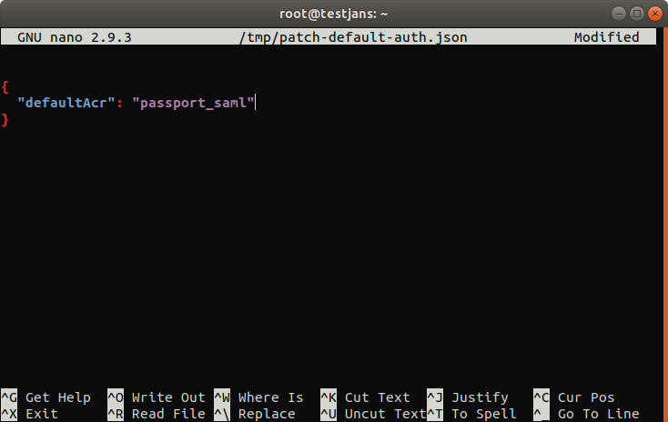
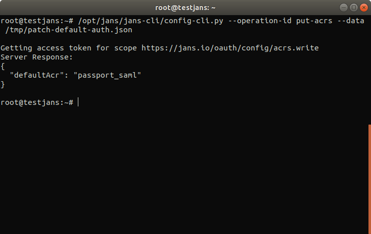

---
tags:
  - administration
  - configuration
  - cli
  - commandline
---

# Default Authentication Method

> Prerequisite: Know how to use the Janssen CLI in [command-line mode](cli-index.md)

Let's get the information of **Default Authentication Method**:

```
/opt/jans/jans-cli/config-cli.py --info DefaultAuthenticationMethod

Operation ID: get-acrs
  Description: Gets default authentication method.
Operation ID: put-acrs
  Description: Updates default authentication method.
  Schema: /components/schemas/AuthenticationMethod

To get sample shema type /opt/jans/jans-cli/config-cli.py --schema <schma>, for example /opt/jans/jans-cli/config-cli.py --schema /components/schemas/AuthenticationMethod
```

Table of Contents
=================

* [Default AUthentication Method](#default-authentication-method)
  * [Find Current Authentication Method](#find-current-authentication-method)
  * [Update Default Authentication Method](#update-default-authentication-method)

## Find Current Authentication Method
  
To get the default authentication method:
```
/opt/jans/jans-cli/config-cli.py --operation-id get-acrs


Getting access token for scope https://jans.io/oauth/config/acrs.readonly
{
  "defaultAcr": "simple_password_auth"
}
```

## Update Default Authentication Method

Let's update the _Default Authentication Method_ using janssen CLI command line. To perform the _put-acrs_ operation, we have to use its schema.
To get its schema:

```commandline
/opt/jans/jans-cli/config-cli.py --schema /components/schemas/AuthenticationMethod > /tmp/patch-default-auth.json


{
  "defaultAcr": null
}
```

It will create a `.json` file with a schema. It comes with a `null` value. We need to modify this file to update default acr.
we have seen that our Default Authentication Method is `simple_password_auth`. We are going to update it with `passport_saml` authenitcation method.

```commandline
nano /tmp/patch-default-auth.json
```


Now let's do the operation:
```commandline
/opt/jans/jans-cli/config-cli.py --operation-id put-acrs --data /tmp/patch-default-auth.json
```

It will show the updated result.



