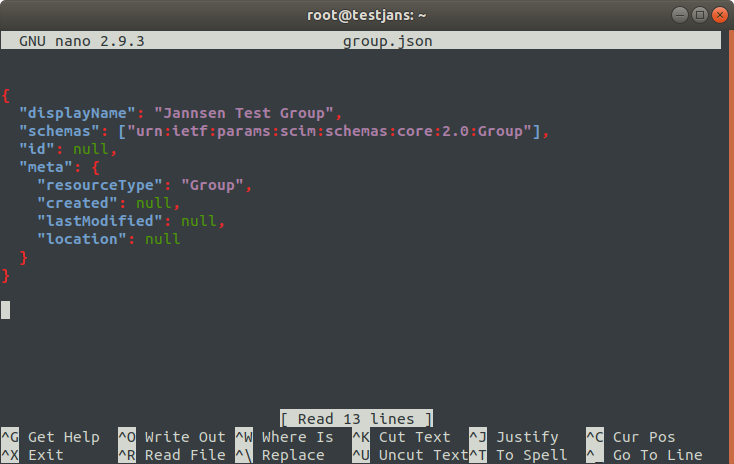
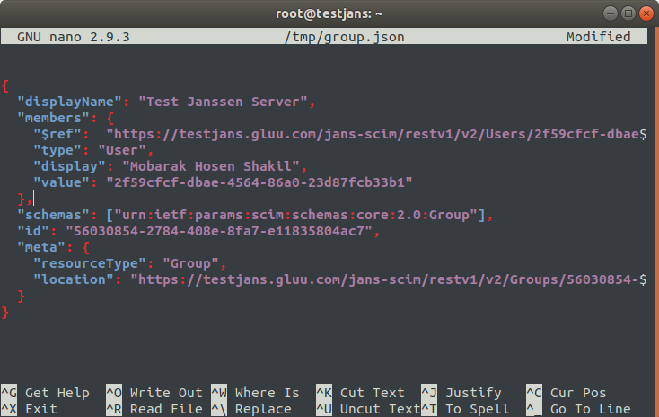

---
tags:
  - administration
  - configuration
  - cli
  - commandline
---

# Group Resources

> Prerequisite: Know how to use the Janssen CLI in [command-line mode](cli-index.md)

Group resources are used to manage user resources easily with some operations. 
If you run the below command, then you will get a list of operations as below:

```
root@testjans:~# /opt/jans/jans-cli/scim-cli.py --info Group

Operation ID: get-groups
Description: Query Group resources (see section 3.4.2 of RFC 7644)
Parameters:
attributes: A comma-separated list of attribute names to return in the response [string]
excludedAttributes: When specified, the response will contain a default set of attributes minus those listed here (as a comma-separated list) [string]
filter: An expression specifying the search criteria. See section 3.4.2.2 of RFC 7644 [string]
startIndex: The 1-based index of the first query result [integer]
count: Specifies the desired maximum number of query results per page [integer]
sortBy: The attribute whose value will be used to order the returned responses [string]
sortOrder: Order in which the sortBy param is applied. Allowed values are "ascending" and "descending" [string]
Operation ID: create-group
Description: Allows creating a Group resource via POST (see section 3.3 of RFC 7644)
Parameters:
attributes: A comma-separated list of attribute names to return in the response [string]
excludedAttributes: When specified, the response will contain a default set of attributes minus those listed here (as a comma-separated list) [string]
Schema: /components/schemas/GroupResource
Schema: /components/schemas/GroupResource
Operation ID: get-group-by-id
Description: Retrieves a Group resource by Id (see section 3.4.1 of RFC 7644)
url-suffix: id
Parameters:
attributes: A comma-separated list of attribute names to return in the response [string]
excludedAttributes: When specified, the response will contain a default set of attributes minus those listed here (as a comma-separated list) [string]
id: No description is provided for this parameter [string]
Operation ID: update-group-by-id
Description: Updates a Group resource (see section 3.5.1 of RFC 7644). Update works in a replacement fashion&amp;#58; every
attribute value found in the payload sent will replace the one in the existing resource representation. Attributes 
not passed in the payload will be left intact.

url-suffix: id
Parameters:
attributes: A comma-separated list of attribute names to return in the response [string]
excludedAttributes: When specified, the response will contain a default set of attributes minus those listed here (as a comma-separated list) [string]
id: No description is provided for this parameter [string]
Schema: /components/schemas/GroupResource
Schema: /components/schemas/GroupResource
Operation ID: delete-group-by-id
Description: Deletes a group resource (see section 3.6 of RFC 7644)
url-suffix: id
Parameters:
id: Identifier of the resource to delete [string]
Operation ID: patch-group-by-id
Description: Updates one or more attributes of a Group resource using a sequence of additions, removals, and 
replacements operations. See section 3.5.2 of RFC 7644

url-suffix: id
Parameters:
attributes: A comma-separated list of attribute names to return in the response [string]
excludedAttributes: When specified, the response will contain a default set of attributes minus those listed here (as a comma-separated list) [string]
id: No description is provided for this parameter [string]
Schema: /components/schemas/PatchRequest
Schema: /components/schemas/PatchRequest
Operation ID: search-group
Description: Query Group resources (see section 3.4.2 of RFC 7644)
Schema: /components/schemas/SearchRequest
Schema: /components/schemas/SearchRequest

To get sample schema type /opt/jans/jans-cli/scim-cli.py --schema <schma>, for example /opt/jans/jans-cli/scim-cli.py --schema /components/schemas/SearchRequest

root@testjans:~# 
```

Table of Contents
=================

  * [Group Resources](#group-resources)
    * [Get Groups](#get-groups)
    * [Create Group](#create-group)
    * [Get Group by ID](#get-group-by-id)
    * [Update Group by ID](#update-group-by-id)
    * [Delete Group by ID](#delete-group-by-id)
    * [Patch Group](#patch-group)
    * [Search Group](#search-group)


## Get Groups

This operation can be used to get list of groups that are used to organize user resources. Let's run the below command:

```
# /opt/jans/jans-cli/scim-cli.py --operation-id get-users
```

It will show the list of groups with all the members linked with each of the group. You can filter for the advanced search with some of its properties:

1. attributes
2. excludeAttributes
3. filter
4. count [define maximum number of query]
5. sortBy [attribute]
6. sortOrder ['ascending', 'descending']


```

Getting access token for scope https://jans.io/scim/groups.read
{
"Resources": [
  {
    "displayName": "Jannsen Manager Group",
    "members": [
      {
        "$ref": "https://testjans.gluu.org/jans-scim/restv1/v2/Users/e0b8a6a5-1955-49d7-acba-55a75b2373df",
        "type": "User",
        "display": "Default Admin User",
        "value": "e0b8a6a5-1955-49d7-acba-55a75b2373df"
        }
      ],
      "schemas": [
        "urn:ietf:params:scim:schemas:core:2.0:Group"
      ],
      "id": "60B7",
      "meta": {
        "resourceType": "Group",
        "created": null,
        "lastModified": null,
        "location": "https://testjans.gluu.org/jans-scim/restv1/v2/Groups/60B7"
      }
    }
  ],
  "schemas": [
    "urn:ietf:params:scim:api:messages:2.0:ListResponse"
  ],
  "totalResults": 1,
  "startIndex": 1,
  "itemsPerPage": 1
}

root@testjans:~# 

```

## Create Group

This operation can be used to create group resources to manage user resources. 

```
Operation ID: create-group
Description: Allows creating a Group resource via POST (see section 3.3 of RFC 7644)
Parameters:
attributes: A comma-separated list of attribute names to return in the response [string]
excludedAttributes: When specified, the response will contain a default set of attributes minus those listed here (as a comma-separated list) [string]
Schema: /components/schemas/GroupResource

```

So, let's get first the schema, to get schema:

```
/opt/jans/jans-cli/scim-cli.py --schema /components/schemas/GroupResource
```

```
root@testjans:~# /opt/jans/jans-cli/scim-cli.py --schema /components/schemas/GroupResource


{
  "displayName": null,
  "members": {
    "$ref": null,
    "type": null,
    "display": null,
    "value": null
  },
  "schemas": [],
  "id": null,
  "meta": {
    "resourceType": null,
    "created": null,
    "lastModified": null,
    "location": null
  }
}
```
The schema defines the properties of an attribute.Just Create a json file with each properties in schema filling by a value.



As you see, I have removed `members` from the schema. We will add members in this group later. Let's use the command to create the group with this data.

```
/opt/jans/jans-cli/scim-cli.py --operation-id create-group --data group.json
```

```
Getting access token for scope https://jans.io/scim/groups.write
Server Response:
{
  "displayName": "Jannsen Test Group",
  "members": null,
  "schemas": [
    "urn:ietf:params:scim:schemas:core:2.0:Group"
  ],
  "id": "766ffd8c-88a8-4aa8-a430-a5b3ae809c21",
  "meta": {
    "resourceType": "Group",
    "created": "2021-04-14T19:54:03.091Z",
    "lastModified": "2021-04-14T19:54:03.091Z",
    "location": "https://testjans.gluu.org/jans-scim/restv1/v2/Groups/766ffd8c-88a8-4aa8-a430-a5b3ae809c21"
  }
}
```

To verify let's use the `get-groups` operation id:

```
root@testjans:~# /opt/jans/jans-cli/scim-cli.py --operation-id get-groups

Getting access token for scope https://jans.io/scim/groups.read
{
  "Resources": [
    {
      "displayName": "Jannsen Manager Group",
      "members": [
        {
          "$ref": "https://testjans.gluu.org/jans-scim/restv1/v2/Users/e0b8a6a5-1955-49d7-acba-55a75b2373df",
          "type": "User",
          "display": "Default Admin User",
          "value": "e0b8a6a5-1955-49d7-acba-55a75b2373df"
        }
      ],
      "schemas": [
        "urn:ietf:params:scim:schemas:core:2.0:Group"
      ],
      "id": "60B7",
      "meta": {
        "resourceType": "Group",
        "created": null,
        "lastModified": null,
        "location": "https://testjans.gluu.org/jans-scim/restv1/v2/Groups/60B7"
      }
    },
    {
      "displayName": "Jannsen Test Group",
      "members": [],
      "schemas": [
        "urn:ietf:params:scim:schemas:core:2.0:Group"
      ],
      "id": "766ffd8c-88a8-4aa8-a430-a5b3ae809c21",
      "meta": {
        "resourceType": "Group",
        "created": "2021-04-14T19:54:03.091Z",
        "lastModified": "2021-04-14T19:54:03.091Z",
        "location": "https://testjans.gluu.org/jans-scim/restv1/v2/Groups/766ffd8c-88a8-4aa8-a430-a5b3ae809c21"
      }
    }
  ],
  "schemas": [
    "urn:ietf:params:scim:api:messages:2.0:ListResponse"
  ],
  "totalResults": 2,
  "startIndex": 1,
  "itemsPerPage": 2
}

root@testjans:~# 
```

## Get Group by ID

If you have an id of a group resource, Then you can view its properties through this operation.

```
Operation ID: get-group-by-id
Description: Retrieves a Group resource by Id (see section 3.4.1 of RFC 7644)
url-suffix: id
Parameters:
attributes: A comma-separated list of attribute names to return in the response [string]
excludedAttributes: When specified, the response will contain a default set of attributes minus those listed here (as a comma-separated list) [string]
id: No description is provided for this parameter [string]
```
In our case, id:766ffd8c-88a8-4aa8-a430-a5b3ae809c21 that's created while performing the `create-group` operation.

```
/opt/jans/jans-cli/scim-cli.py --operation-id get-group-by-id --url-suffix id:766ffd8c-88a8-4aa8-a430-a5b3ae809c21
```

In return, you must see the group resources linked with the id:

```
Getting access token for scope https://jans.io/scim/groups.read
{
"displayName": "Jannsen Test Group",
"members": [],
"schemas": [
  "urn:ietf:params:scim:schemas:core:2.0:Group"
],
"id": "766ffd8c-88a8-4aa8-a430-a5b3ae809c21",
"meta": {
  "resourceType": "Group",
  "created": "2021-04-14T19:54:03.091Z",
  "lastModified": "2021-04-14T19:54:03.091Z",
  "location": "https://testjans.gluu.org/jans-scim/restv1/v2/Groups/766ffd8c-88a8-4aa8-a430-a5b3ae809c21"
}
}
```
## Update Group by ID

If we look at the description, We see this op-mode needs `url-suffix` as `id` and `schema` definition for data. 

```
Operation ID: update-group-by-id
Description: Updates a Group resource (see section 3.5.1 of RFC 7644). 
Update works in a replacement fashion&amp;#58; every attribute 
value found in the payload sent will replace the one in
the existing resource representation. Attributes not passed in the
payload will be left intact.

url-suffix: id
Parameters:
attributes: A comma-separated list of attribute names to return in the response [string]
excludedAttributes: When specified, the response will contain a default set of attributes minus those listed here (as a comma-separated list) [string]
id: No description is provided for this parameter [string]
Schema: /components/schemas/GroupResource
```

Let's get the schema first:

```
/opt/jans/jans-cli/scim-cli.py --schema /components/schemas/GroupResource > /tmp/group.json
```

let's modify this schema to add members into a selected group:



- displayName: It should be a group name
- id: Selected group id which one you want to updae
- meta: Meta data of the selected group

Now let's add this member into the group we are going to update.

```
root@testjans:~# /opt/jans/jans-cli/scim-cli.py --operation-id update-group-by-id --data /tmp/group.json --url-suffix id:56030854-2784-408e-8fa7-e11835804ac7

Getting access token for scope https://jans.io/scim/groups.write
Server Response:
{
"displayName": "Test Janssen Server",
"members": [
{
  "$ref": "https://testjans.gluu.com/jans-scim/restv1/v2/Users/null",
  "type": "User",
  "display": null,
  "value": null
}
],
"schemas": [
"urn:ietf:params:scim:schemas:core:2.0:Group"
],
"id": "56030854-2784-408e-8fa7-e11835804ac7",
"meta": {
"resourceType": "Group",
"created": "2021-04-19T22:15:15.151Z",
"lastModified": "2021-04-21T16:22:24.085Z",
"location": "https://testjans.gluu.com/jans-scim/restv1/v2/Groups/56030854-2784-408e-8fa7-e11835804ac7"
}
}

root@testjans:~# 
```

That's how we can update a group using this operation method.
Please remember one thing, this update method just replace the data. If you want to add members instead of replacing then you must try [patch-group-by-id](#patch-group).

## Delete Group by ID

You can delete a group by its ID. The command line looks like:

```
/opt/jans/jans-cli/scim-cli.py --operation-id delete-group-by-id --url-suffix id:56030854-2784-408e-8fa7-e11835804ac7
```

It will delete the group and all of its data matched with the unique ID.

```
root@testjans:~# /opt/jans/jans-cli/scim-cli.py --operation-id delete-group-by-id --url-suffix id:56030854-2784-408e-8fa7-e11835804ac7

Getting access token for scope https://jans.io/scim/groups.write
```

## Patch Group

This is also an option to update any existing group resources. The only difference between [update-group-by-id](#update-group-by-id) and [patch-group](#patch-group) is that the first one just replace new data with previous data. It won't add any new data into the group. But Patch-group supports few more operations including replace. Like, You can `test`, `add`, `replace`, `delete`, `copy` any data from a Group resource.

If wee look at the description:

```
Operation ID: patch-group-by-id
  Description: Updates one or more attributes of a Group resource using a sequence of additions, removals, and 
replacements operations. See section 3.5.2 of RFC 7644

  url-suffix: id
  Parameters:
  attributes: A comma-separated list of attribute names to return in the response [string]
  excludedAttributes: When specified, the response will contain a default set of attributes minus those listed here (as a comma-separated list) [string]
  id: No description is provided for this parameter [string]
  Schema: /components/schemas/PatchRequest
```

As we see, It has a schema file. So, Let's get the schema:

```

```

## Search Group

