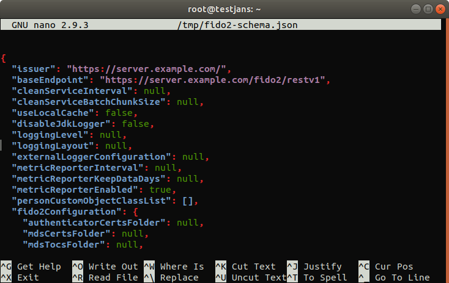

---
tags:
  - administration
  - configuration
  - cli
  - commandline
---

# Janssen FIDO2 Configuration

> Prerequisite: Know how to use the Janssen CLI in [command-line mode](cli-index.md)

Using Janssen CLI, You can `get/update` Fido2 properties.
To get the information of Janssen Fido2 CLI, run the following command:

```
/opt/jans/jans-cli/config-cli.py --info ConfigurationFido2

Operation ID: get-properties-fido2
  Description: Gets Jans Authorization Server Fido2 configuration properties.
Operation ID: put-properties-fido2
  Description: Updates Fido2 configuration properties.
  Schema: /components/schemas/JansFido2DynConfiguration

To get sample shema type /opt/jans/jans-cli/config-cli.py --schema <schma>, for example /opt/jans/jans-cli/config-cli.py --schema /components/schemas/JansFido2DynConfiguration
```

Table of Contents
=================

* [Janssen FIDO2 Configuration](#janssen-fido2-configuration)
  * [Find FIDO2 Configuration Properties](#find-fido2-configuration-properties)
  * [Update FIDO2 Configuration Properties](#update-fido2-configuration-properties)

## Find FIDO2 Configuration Properties

To get the properties of Janssen Fido2 Configuration, run below command:
`/opt/jans/jans-cli/config-cli.py --operation-id get-properties-fido2`

It will return the result as below:

```text
Getting access token for scope https://jans.io/oauth/config/fido2.readonly
{
  "issuer": "https://testjans.gluu.com",
  "baseEndpoint": "https://testjans.gluu.com/fido2/restv1",
  "cleanServiceInterval": 60,
  "cleanServiceBatchChunkSize": 10000,
  "useLocalCache": false,
  "disableJdkLogger": false,
  "loggingLevel": "DEBUG",
  "loggingLayout": "text",
  "externalLoggerConfiguration": null,
  "metricReporterInterval": 300,
  "metricReporterKeepDataDays": 15,
  "metricReporterEnabled": false,
  "personCustomObjectClassList": [
    "jansCustomPerson",
    "jansPerson"
  ],
  "fido2Configuration": {
    "authenticatorCertsFolder": null,
    "mdsCertsFolder": null,
    "mdsTocsFolder": null,
    "serverMetadataFolder": null,
    "requestedParties": [
      {
        "name": null,
        "domains": []
      }
    ],
    "userAutoEnrollment": false,
    "unfinishedRequestExpiration": null,
    "authenticationHistoryExpiration": null,
    "requestedCredentialTypes": []
  }
}
```

## Update FIDO2 Configuration Properties

To perform this operation, let's check the schema first.

```text
/opt/jans/jans-cli/config-cli.py --schema /components/schemas/JansFido2DynConfiguration > /tmp/fido2-schema.json
```

This command will create a fido2 schema file on `/tmp/`. You can edit this file depending on the requirements:



Now let's do the operation:

```text
/opt/jans/jans-cli/config-cli.py --operation-id put-properties-fido2 --data /tmp/fido2-schema.json

Getting access token for scope https://jans.io/oauth/config/fido2.write
Server Response:
{
  "issuer": "https://server.example.com/",
  "baseEndpoint": "https://server.example.com/fido2/restv1",
  "cleanServiceInterval": null,
  "cleanServiceBatchChunkSize": null,
  "useLocalCache": false,
  "disableJdkLogger": false,
  "loggingLevel": "INFO",
  "loggingLayout": null,
  "externalLoggerConfiguration": null,
  "metricReporterInterval": null,
  "metricReporterKeepDataDays": null,
  "metricReporterEnabled": true,
  "personCustomObjectClassList": [],
  "fido2Configuration": {
    "authenticatorCertsFolder": null,
    "mdsCertsFolder": null,
    "mdsTocsFolder": null,
    "serverMetadataFolder": null,
    "requestedParties": [
      {
        "name": null,
        "domains": null
      },
      {
        "name": null,
        "domains": null
      }
    ],
    "userAutoEnrollment": true,
    "unfinishedRequestExpiration": null,
    "authenticationHistoryExpiration": null,
    "requestedCredentialTypes": []
  }
}
```

You may find that I have updated to `logginglabel:INFO` from `NULL`.


