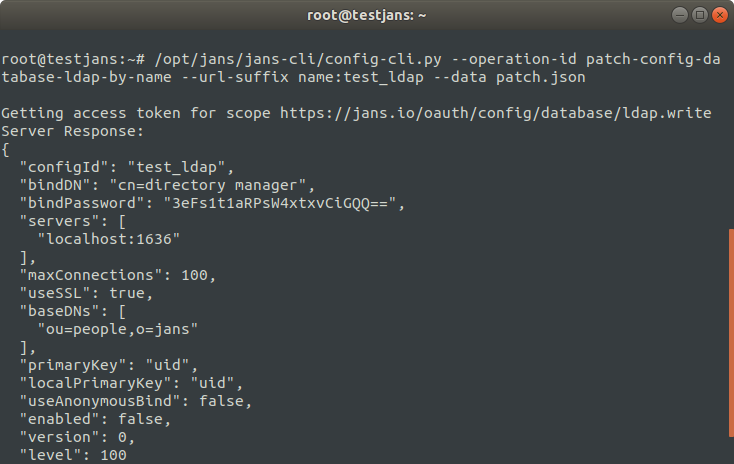

---
tags:
  - administration
  - configuration
  - cli
  - commandline
---


# Lightweight Directory Active Protocol (LDAP) Configuration

> Prerequisite: Know how to use the Janssen CLI in [command-line mode](cli-index.md)

As like as [Interactive Menu](im/im-ldap-configuration.md), We can do the same operations here.
Let's run the following command to get operation-id details of LDAP Database COnfiguration.

```
/opt/jans/jans-cli/config-cli.py --info DatabaseLDAPConfiguration
```

It comes with the following options:

```
Operation ID: get-config-database-ldap
  Description: Gets list of existing LDAP configurations.
Operation ID: post-config-database-ldap
  Description: Adds a new LDAP configuration.
  Schema: /components/schemas/LdapConfiguration
Operation ID: put-config-database-ldap
  Description: Updates LDAP configuration.
  Schema: /components/schemas/LdapConfiguration
Operation ID: get-config-database-ldap-by-name
  Description: Gets an LDAP configuration by name.
  url-suffix: name
Operation ID: delete-config-database-ldap-by-name
  Description: Deletes an LDAP configuration.
  url-suffix: name
Operation ID: patch-config-database-ldap-by-name
  Description: Partially modify an LDAP configuration.
  url-suffix: name
  Schema: Array of /components/schemas/PatchRequest
Operation ID: post-config-database-ldap-test
  Description: Tests an LDAP configuration.
  Schema: /components/schemas/LdapConfiguration

To get sample schema type /opt/jans/jans-cli/config-cli.py --schema <schma>, for example /opt/jans/jans-cli/config-cli.py --schema /components/schemas/LdapConfiguration
```

## Get Existing LDAP Configurations

To find the existing ldap configurations, let's run the following command:

```
/opt/jans/jans-cli/config-cli.py --operation-id get-config-database-ldap
```


```json
[
  {
    "configId": "auth_ldap_server",
    "bindDN": "cn=directory manager",
    "bindPassword": "m+OTwmlCEho=",
    "servers": [
      "localhost:1636"
    ],
    "maxConnections": 1000,
    "useSSL": true,
    "baseDNs": [
      "ou=people,o=jans"
    ],
    "primaryKey": "uid",
    "localPrimaryKey": "uid",
    "useAnonymousBind": false,
    "enabled": false,
    "version": 0,
    "level": 0
  }
]

```


## Adds a new LDAP Configuration

At first, we have checked the existing ldap database configurations the janssen server have. Indeed we can create a new ldap configuration as well. 

```
Operation ID: post-config-database-ldap
  Description: Adds a new LDAP configuration.
  Schema: /components/schemas/LdapConfiguration
```

Let's get the schema file and update it to push into the server.

```
/opt/jans/jans-cli/config-cli.py --schema /components/schemas/LdapConfiguration > /tmp/ldap.json
```
```
{
  "configId": "auth_ldap_server",
  "bindDN": "string",
  "bindPassword": "string",
  "servers": "array",
  "maxConnections": 2,
  "useSSL": "boolean",
  "baseDNs": "array",
  "primaryKey": "SAMAccountName,uid, email",
  "localPrimaryKey": "uid, email",
  "useAnonymousBind": false,
  "enabled": false,
  "version": null,
  "level": null
}
```
You need to modify `ldap.json` file with valid information. In our case, I have modified as below for testing only:

```
{
  "configId": "test_ldap",
  "bindDN": "cn=directory manager",
  "bindPassword": "password",
  "servers": [
	"localhost:1636"
	],
  "maxConnections": 1000,
  "useSSL": "true",
  "baseDNs": ["ou=people,o=jans"],
  "primaryKey": "uid",
  "localPrimaryKey": "uid",
  "useAnonymousBind": false,
  "enabled": false,
  "version": 0,
  "level": 0
}
```

Now, lets post this configuration into the database.

```
/opt/jans/jans-cli/config-cli.py --operation-id post-config-database-ldap --data /tmp/ldap.json
```

```
Getting access token for scope https://jans.io/oauth/config/database/ldap.write
Server Response:
{
  "configId": "test_ldap",
  "bindDN": "cn=directory manager",
  "bindPassword": "m+OTwmlCEho=",
  "servers": [
    "localhost:1636"
  ],
  "maxConnections": 1000,
  "useSSL": true,
  "baseDNs": [
    "ou=people,o=jans"
  ],
  "primaryKey": "uid",
  "localPrimaryKey": "uid",
  "useAnonymousBind": false,
  "enabled": false,
  "version": 0,
  "level": 0
}
```


Please note that `configId` should be a unique identifier name for each configuration. Otherwise you will get error while going to post duplicate configuration into the server. In that case, you can go through the next option to replace instead of adding a new one.


## Updating LDAP Database Configurations

With this operation, we can update any ldap database configuration.

```
Operation ID: put-config-database-ldap
  Description: Updates LDAP configuration.
  Schema: /components/schemas/LdapConfiguration
```

For example, let say we are going to change to `maxConnections` in the above `test_ldap` configuration. So lets modify the `/tmp/ldap.json` file as below:

```
{
  "configId": "test_ldap",
  "bindDN": "cn=directory manager",
  "bindPassword": "Mh@006",
  "servers": [
	"localhost:1636"
	],
  "maxConnections": 100,
  "useSSL": "true",
  "baseDNs": ["ou=people,o=jans"],
  "primaryKey": "uid",
  "localPrimaryKey": "uid",
  "useAnonymousBind": false,
  "enabled": false,
  "version": 0,
  "level": 0
}
```

Finally lets do the operation:

```
/opt/jans/jans-cli/config-cli.oy --operation-id put-config-database-ldap --data /tmp/ldap.json
```

It will update the configuration if match with its `configId` otherwise return an error.

## Gets LDAP Database Configuration by its name

In the above operation, we have updated `test_ldap.json`. Let's check the updated result with this operation by calling its name id. 

```
/opt/jans/jans-cli/config-cli.py --operation-id get-config-database-ldap-by-name --url-suffix name:test_ldap
```

Here name is the `configId` of the configuration. If we run this command, it returns the configuration details matched with configId.

```
Getting access token for scope https://jans.io/oauth/config/database/ldap.readonly
{
  "configId": "test_ldap",
  "bindDN": "cn=directory manager",
  "bindPassword": "3eFs1t1aRPsW4xtxvCiGQQ==",
  "servers": [
    "localhost:1636"
  ],
  "maxConnections": 100,
  "useSSL": true,
  "baseDNs": [
    "ou=people,o=jans"
  ],
  "primaryKey": "uid",
  "localPrimaryKey": "uid",
  "useAnonymousBind": false,
  "enabled": false,
  "version": 0,
  "level": 0
}

```

## Delete LDAP Database Configurations

In case, we need to delete any existing LDAP Database configuration we can do that as well.

The command line:

```
/opt/jans/jans-cli/config-cli.py --operation-id delete-config-database-ldap-by-name --url-suffix name:test_ldap
```

It will delete data ldap database configuration matched with the name.

## Patch LDAP Database Configurations

If required, We can patch single information of a ldap database configuration by using its name id. In that case, we have to make an array of operations in schema file. So, let's get the schema file first.

```
/opt/jans/jans-cli/config-cli.py --schema /components/schemas/PatchRequest > patch.json
```

We know already that this operation support three types of value `op`, `path` and `value` to be replaced. For more info visit this [link](cli-index.md#patch-request-schema)


For example, let's say, we want to change the level of the `test_ldap` configuration. So, Let's update the patch file as below:

```
[
  {
    "op": "replace",
    "path": "level",
    "value": "100"
  }
]

```

To patch data, the command looks like for this:

```
/opt/jans/jans-cli/config-cli.py --operation-id patch-config-database-ldap-by-name --url-suffix name:test_ldap --data patch.json
```

It will update the configuration and will show the updated result as below image on the display.


