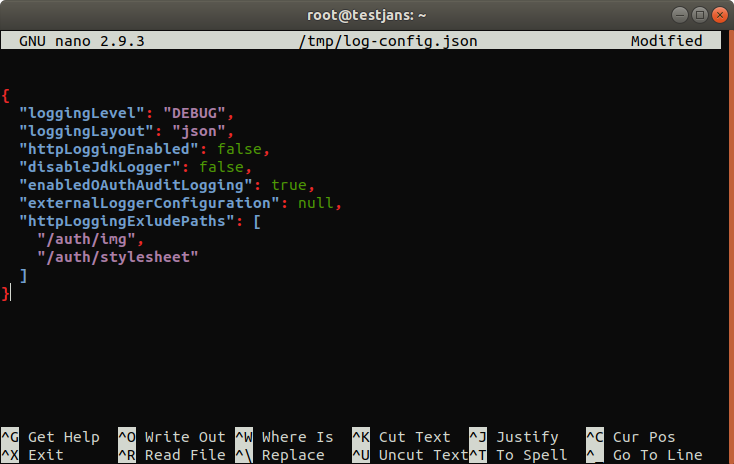

---
tags:
  - administration
  - configuration
  - cli
  - commandline
---

# Log Management

> Prerequisite: Know how to use the Janssen CLI in [command-line mode](cli-index.md)

To `view/update` logging configuration, let's get the information of logging Configuration.

`/opt/jans/jans-cli/config-cli.py --info ConfigurationLogging`

```text
Operation ID: get-config-logging
  Description: Returns Jans Authorization Server logging settings.
Operation ID: put-config-logging
  Description: Updates Jans Authorization Server logging settings.
  Schema: /components/schemas/LoggingConfiguration

To get sample shema type /opt/jans/jans-cli/config-cli.py --schema <schma>, for example /opt/jans/jans-cli/config-cli.py --schema /components/schemas/LoggingConfiguration
```

Table of Contents
=================

* [Log Management](#log-management)
  * [Find Logging Configuration](#find-logging-configuration)
  * [Update Logging Configuration](#update-logging-configuration)

## Find Logging Configuration

```text
/opt/jans/jans-cli/config-cli.py --operation-id get-config-logging

Getting access token for scope https://jans.io/oauth/config/logging.readonly
{
  "loggingLevel": "INFO",
  "loggingLayout": "text",
  "httpLoggingEnabled": false,
  "disableJdkLogger": true,
  "enabledOAuthAuditLogging": false,
  "externalLoggerConfiguration": null,
  "httpLoggingExcludePaths": null
}
```

## Update Logging Configuration

To update logging configuration, get the schema first:

```commandline
/opt/jans/jans-cli/config-cli.py --schema /components/schemas/LoggingConfiguration > /tmp/log-config.json


{
  "loggingLevel": "FATAL",
  "loggingLayout": "text",
  "httpLoggingEnabled": true,
  "disableJdkLogger": true,
  "enabledOAuthAuditLogging": false,
  "externalLoggerConfiguration": null,
  "httpLoggingExcludePaths": [
    "/auth/img",
    "/auth/stylesheet"
  ]
}
```

let's update the schema:
```text
nano /tmp/log-config.json
```

Here I have updated `loggingLevel` to `DEBUG` and `enabledOAuditLogging` to `true` as below image.




Let's do the operation:

```commandline
/opt/jans/jans-cli/config-cli.py --operation-id put-config-logging --data /tmp/log-config.json
```

You will get the updated result as below:

```text

Getting access token for scope https://jans.io/oauth/config/logging.write
Server Response:
{
  "loggingLevel": "DEBUG",
  "loggingLayout": "json",
  "httpLoggingEnabled": false,
  "disableJdkLogger": false,
  "enabledOAuthAuditLogging": true,
  "externalLoggerConfiguration": null,
  "httpLoggingExcludePaths": [
    "/auth/img",
    "/auth/stylesheet"
  ]
}
```


