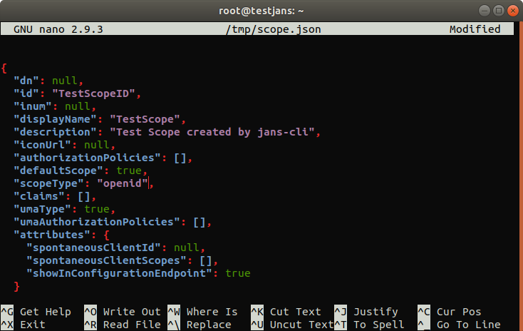
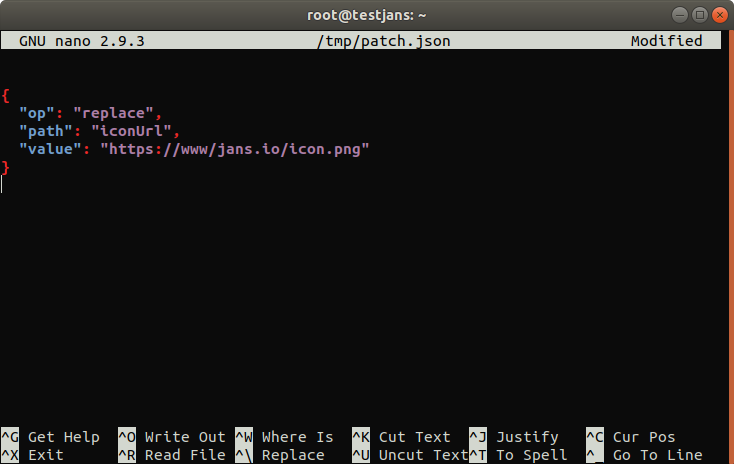

---
tags:
  - administration
  - configuration
  - cli
  - commandline
---

# OAuth Scopes

> Prerequisite: Know how to use the Janssen CLI in [command-line mode](cli-index.md)

Let's get information for a task **OAuthScopes**

```
 /opt/jans/jans-cli/config-cli.py --info OAuthScopes

Operation ID: get-oauth-scopes
  Description: Gets list of Scopes. Optionally type to filter the scope, max-size of the result and pattern can be provided.
  Parameters:
  type: Scope type. [string]
  limit: Search size - max size of the results to return. [integer]
  pattern: Search pattern. [string]
Operation ID: post-oauth-scopes
  Description: Create Scope.
  Schema: /components/schemas/Scope
Operation ID: put-oauth-scopes
  Description: Updates existing Scope.
  Schema: /components/schemas/Scope
Operation ID: get-oauth-scopes-by-inum
  Description: Get Scope by Inum
  url-suffix: inum
Operation ID: delete-oauth-scopes-by-inum
  Description: Delete Scope.
  url-suffix: inum
Operation ID: patch-oauth-scopes-by-id
  Description: Update modified attributes of existing Scope by Inum.
  url-suffix: inum
  Schema: Array of /components/schemas/PatchRequest

To get sample schema type /opt/jans/jans-cli/config-cli.py --schema <schma>, for example /opt/jans/jans-cli/config-cli.py --schema /components/schemas/PatchRequest

```
## Find/View OAuth Scopes

Operations will be done with **Operation ID**. Some operations may take parameters, let's retrieve `3` scopes (**limit**) that has `view` in it's description (**pattern**) and **type** `openid`:

```
 /opt/jans/jans-cli/config-cli.py --operation-id get-oauth-scopes --endpoint-args limit:3,pattern:view,type:openid
 ```
 
It will return:
 
 ```
 Getting access token for scope https://jans.io/oauth/config/scopes.readonly
Calling with params limit=3&pattern=view&type=openid
[
  {
    "dn": "inum=43F1,ou=scopes,o=jans",
    "id": "profile",
    "inum": "43F1",
    "displayName": null,
    "description": "View your basic profile info.",
    "iconUrl": null,
    "authorizationPolicies": null,
    "defaultScope": false,
    "scopeType": "openid",
    "claims": [
      "inum=2B29,ou=attributes,o=jans",
      "inum=0C85,ou=attributes,o=jans",
      "inum=B4B0,ou=attributes,o=jans",
      "inum=A0E8,ou=attributes,o=jans",
      "inum=5EC6,ou=attributes,o=jans",
      "inum=B52A,ou=attributes,o=jans",
      "inum=64A0,ou=attributes,o=jans",
      "inum=EC3A,ou=attributes,o=jans",
      "inum=3B47,ou=attributes,o=jans",
      "inum=3692,ou=attributes,o=jans",
      "inum=98FC,ou=attributes,o=jans",
      "inum=A901,ou=attributes,o=jans",
      "inum=36D9,ou=attributes,o=jans",
      "inum=BE64,ou=attributes,o=jans",
      "inum=6493,ou=attributes,o=jans"
    ],
    "umaType": false,
    "umaAuthorizationPolicies": null,
    "attributes": {
      "spontaneousClientId": null,
      "spontaneousClientScopes": null,
      "showInConfigurationEndpoint": true
    }
  },
  {
    "dn": "inum=C17A,ou=scopes,o=jans",
    "id": "address",
    "inum": "C17A",
    "displayName": null,
    "description": "View your address.",
    "iconUrl": null,
    "authorizationPolicies": null,
    "defaultScope": false,
    "scopeType": "openid",
    "claims": [
      "inum=27DB,ou=attributes,o=jans",
      "inum=2A3D,ou=attributes,o=jans",
      "inum=6609,ou=attributes,o=jans",
      "inum=6EEB,ou=attributes,o=jans",
      "inum=BCE8,ou=attributes,o=jans",
      "inum=D90B,ou=attributes,o=jans",
      "inum=E6B8,ou=attributes,o=jans",
      "inum=E999,ou=attributes,o=jans"
    ],
    "umaType": false,
    "umaAuthorizationPolicies": null,
    "attributes": {
      "spontaneousClientId": null,
      "spontaneousClientScopes": null,
      "showInConfigurationEndpoint": true
    }
  },
  {
    "dn": "inum=764C,ou=scopes,o=jans",
    "id": "email",
    "inum": "764C",
    "displayName": null,
    "description": "View your email address.",
    "iconUrl": null,
    "authorizationPolicies": null,
    "defaultScope": false,
    "scopeType": "openid",
    "claims": [
      "inum=8F88,ou=attributes,o=jans",
      "inum=CAE3,ou=attributes,o=jans"
    ],
    "umaType": false,
    "umaAuthorizationPolicies": null,
    "attributes": {
      "spontaneousClientId": null,
      "spontaneousClientScopes": null,
      "showInConfigurationEndpoint": true
    }
  }
]
```

## Create an OAuth Scope

Let's create a scope. Remember when we queried info for a task **OAuthScopes** it printed:

```
Operation ID: post-oauth-scopes
  Description: Create Scope.
  Schema: /components/schemas/Scope
```
Thus, we can get sample schema and use Operation ID `post-oauth-scopes`. Lets get sample schema:

```
/opt/jans/jans-cli/config-cli.py --schema /components/schemas/Scope > /tmp/scope.json
```

Now edit file `tmp/scope.json` with an editor (like **nano**). As an example we just filled the following properties:

```
"id": "TestScopeID",
"displayName": "TestScope",
"description": "Test Scope created by jans-cli",
```

 

It is time to post the data:

```
 /opt/jans/jans-cli/config-cli.py --operation-id post-oauth-scopes --data /tmp/scope.json 

Getting access token for scope https://jans.io/oauth/config/scopes.write
Server Response:
{
  "dn": "inum=112116fd-257b-40d8-a2c9-0c23536680ed,ou=scopes,o=jans",
  "id": "TestScopeID",
  "inum": "112116fd-257b-40d8-a2c9-0c23536680ed",
  "displayName": "TestScope",
  "description": "Test Scope created by jans-cli",
  "iconUrl": null,
  "authorizationPolicies": null,
  "defaultScope": true,
  "scopeType": "openid",
  "claims": null,
  "umaType": false,
  "umaAuthorizationPolicies": null,
  "attributes": {
    "spontaneousClientId": null,
    "spontaneousClientScopes": null,
    "showInConfigurationEndpoint": true
  }
}

```

It created scope with inum `112116fd-257b-40d8-a2c9-0c23536680ed` and returned current data. 


## Update Existing OAuth Scopes

In case we need to update an existing OAuth Scope, we can do that as well.

To update an existing OAuth Scope, we have to create a json file with updated details. You can get the schema file as well to understand the format of the OAuth Scope JSON file.

This is an existing OAuth Scope we are going to update.
```
{
  "dn": "inum=5c3ba3f0-d2ce-4974-9efb-883697d929d1,ou=scopes,o=jans",
  "inum": "5c3ba3f0-d2ce-4974-9efb-883697d929d1",
  "displayName": "TestScope",
  "id": "TestScopeID",
  "iconUrl": null,
  "description": "TestScope for jans-cli",
  "scopeType": "dynamic",
  "claims": null,
  "defaultScope": true,
  "groupClaims": true,
  "dynamicScopeScripts": null,
  "umaAuthorizationPolicies": null,
  "attributes": {
    "spontaneousClientId": null,
    "spontaneousClientScopes": null,
    "showInConfigurationEndpoint": false
  },
  "umaType": false,
  "deletable": false,
  "expirationDate": null
}
```
We have changed only the `scopeType` to `openid`.

The updated data:

```
{
  "dn": "inum=5c3ba3f0-d2ce-4974-9efb-883697d929d1,ou=scopes,o=jans",
  "inum": "5c3ba3f0-d2ce-4974-9efb-883697d929d1",
  "displayName": "TestScope",
  "id": "TestScopeID",
  "iconUrl": null,
  "description": "TestScope for jans-cli",
  "scopeType": "openid",
  "claims": null,
  "defaultScope": true,
  "groupClaims": true,
  "dynamicScopeScripts": null,
  "umaAuthorizationPolicies": null,
  "attributes": {
    "spontaneousClientId": null,
    "spontaneousClientScopes": null,
    "showInConfigurationEndpoint": false
  },
  "umaType": false,
  "deletable": false,
  "expirationDate": null
}
```

The command line is:

```
/opt/jans/jans-cli/config-cli.py --operation-id put-oauth-scopes --data /tmp/scope.json
```

This will updated the existing oauth scopes matched with inum value.

## Patch OAuth Scopes by `inum`

Let's update `iconUrl` with patch method. So we need a schema for the patch method. Remember when we queried info for the task **OAuthScopes** it printed:

```
Operation ID: patch-oauth-scopes-by-id
  Description: Update modified attributes of existing Scope by Inum.
  url-suffix: inum
  Schema: Array of /components/schemas/PatchRequest
 ```
 
This means we need schema `/components/schemas/PatchRequest`, be careful it states **Array of**, so we will make an array of this schema, in case you need multiple changes with patch method, you can put as many as of this schema into array. To know more about `PatchRequest` schema, please visit this [link](cli-index.md#patch-request-schema).

Let's Get schema:

```
/opt/jans/jans-cli/config-cli.py --schema /components/schemas/PatchRequest > /tmp/patch.json
```

We can edit this json as follows (remember to make it an array):



Let's do the operation:

```
/opt/jans/jans-cli/config-cli.py --operation-id patch-oauth-scopes-by-id --url-suffix inum:112116fd-257b-40d8-a2c9-0c23536680ed --data /tmp/patch.json 

Getting access token for scope https://jans.io/oauth/config/scopes.write
Server Response:
{
  "dn": "inum=112116fd-257b-40d8-a2c9-0c23536680ed,ou=scopes,o=jans",
  "id": "TestScopeID",
  "inum": "112116fd-257b-40d8-a2c9-0c23536680ed",
  "displayName": "TestScope",
  "description": "Test Scope created by jans-cli",
  "iconUrl": "https://www.jans.io/icon.png",
  "authorizationPolicies": null,
  "defaultScope": true,
  "scopeType": "openid",
  "claims": null,
  "umaType": false,
  "umaAuthorizationPolicies": null,
  "attributes": {
    "spontaneousClientId": null,
    "spontaneousClientScopes": null,
    "showInConfigurationEndpoint": true
  }
}
```

## Find OAuth Scopes by `inum`

In case We know the `inum` value of an OAuth Scope, We can get the details of that scope.

```
Operation ID: get-oauth-scopes-by-inum
  Description: Get Scope by Inum
  url-suffix: inum
```
We can see that, the `url-suffix` here for `inum` value. And the command line is:

```
/opt/jans/jans-cli/config-cli.py --operation-id get-oauth-scopes-by-inum --url-suffix inum:value
```

For example:

```
/opt/jans/jans-cli/config-cli.py --operation-id get-oauth-scopes-by-inum --url-suffix inum:C4F6
```

It returns the details of the scope matched with the `inum` value.

```
{
  "dn": "inum=C4F6,ou=scopes,o=jans",
  "inum": "C4F6",
  "displayName": "refresh_token",
  "id": "offline_access",
  "iconUrl": null,
  "description": "This scope value requests that an OAuth 2.0 Refresh Token be issued.",
  "scopeType": "openid",
  "claims": null,
  "defaultScope": true,
  "groupClaims": null,
  "dynamicScopeScripts": null,
  "umaAuthorizationPolicies": null,
  "attributes": {
    "spontaneousClientId": null,
    "spontaneousClientScopes": null,
    "showInConfigurationEndpoint": true
  },
  "umaType": false,
  "deletable": false,
  "expirationDate": null
}

```

That's it.

## Delete OAuth Scopes by `inum`

You can delete any OAuth Scopes by its `inum` value.
The command line is:

```
/opt/jans/jans-cli/config-cli.py --operation-id delete-oauth-scopes-by-inum --url-suffix inum:f9a7add1-04ca-432c-84d4-cb127e84bd48
```

Just change the `inum` value to your own according to which one you want to delete.
