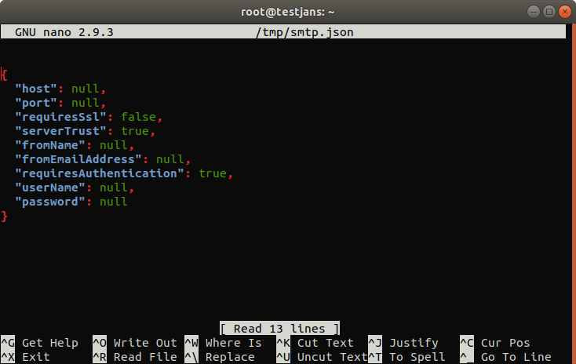

---
tags:
  - administration
  - configuration
  - cli
  - commandline
---

# SMTP Configuration

> Prerequisite: Know how to use the Janssen CLI in [command-line mode](cli-index.md)

Let's get the information of **SMTP Configuration** using Janssen CLI.

```commandline
/opt/jans/jans-cli/config-cli.py --info ConfigurationSMTP


Operation ID: get-config-smtp
  Description: Returns SMTP server configuration.
Operation ID: post-config-smtp
  Description: Adds SMTP server configuration.
  Schema: /components/schemas/SmtpConfiguration
Operation ID: put-config-smtp
  Description: Updates SMTP server configuration.
  Schema: /components/schemas/SmtpConfiguration
Operation ID: delete-config-smtp
  Description: Deletes SMTP server configuration.
Operation ID: test-config-smtp
  Description: Test SMTP server configuration.

To get sample shema type /opt/jans/jans-cli/config-cli.py --schema <schma>, for example /opt/jans/jans-cli/config-cli.py --schema /components/schemas/SmtpConfiguration
```
As we see, we can perform many operations such as `update`, `delete`, `test`, `post`, etc. Let's do some operations.

## Find SMTP Server Configuration

To view the current SMTP server configuration, run the following command line:

```commandline
/opt/jans/jans-cli/config-cli.py --operation-id get-config-smtp
```

It will show your SMTP server configuration as below:

```text
Getting access token for scope https://jans.io/oauth/config/smtp.readonly
{
  "host": "webmail.gluu.org",
  "port": 587,
  "requiresSsl": null,
  "serverTrust": null,
  "fromName": null,
  "fromEmailAddress": null,
  "requiresAuthentication": null,
  "userName": null,
  "password": "fHze8OEMs1MzkGhWw/29eg=="
}
```

## Setup New SMTP Server Configuration

This operation can be performed to update/post a new SMTP configuration on your Janssen server.
Let's see the schema first:

```commandline
/opt/jans/jans-cli/config-cli.py --schema /components/schemas/SmtpConfiguration > /tmp/smtp.json
```

It will create a `.json` file. Let's modify this file:

```commandline
nano /tmp/smtp.json
```



You can update each of its properties. To perform this operation, run the following command:

```commandline
/opt/jans/jans-cli/config-cli.py --operation-id post-config-smtp --data /tmp/smtp.json
```

If you run the following command, it will update your janssen smtp server and print on the screen as below.

```text
Getting access token for scope https://jans.io/oauth/config/smtp.write
Server Response:
{
  "host": "webmail.gluu.org",
  "port": 587,
  "requiresSsl": null,
  "serverTrust": null,
  "fromName": null,
  "fromEmailAddress": null,
  "requiresAuthentication": null,
  "userName": null,
  "password": "fHze8OEMs1MzkGhWw/29eg=="
}
```

## Update SMTP Server Configuration

To update smtp server, simply change any information on `/tmp/smtp.json` file and run the following command:

```commandline
/opt/jans/jans-cli/config-cli.py --operation-id put-config-smtp --data /tmp/smtp.json
```
It will update the information.

