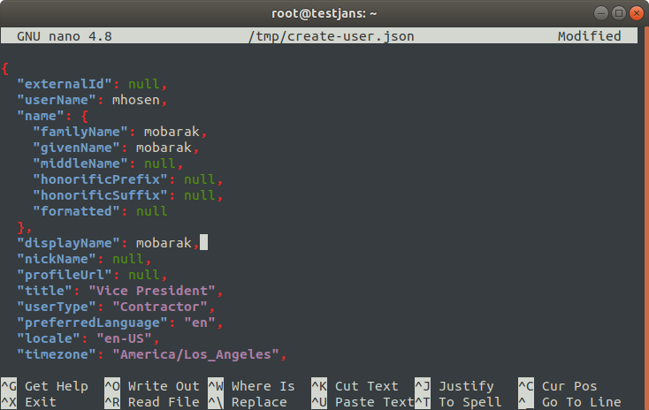

---
tags:
  - administration
  - configuration
  - cli
  - commandline
---

# User Resources

> Prerequisite: Know how to use the Janssen CLI in [command-line mode](cli-index.md)

The first thing is to do, Let's get some information for the following task:

```
/opt/jans/jans-cli/scim-cli.py --info User
```

In retrun we get,

```
root@testjans:~# /opt/jans/jans-cli/scim-cli.py --info User

Operation ID: get-users
  Description: Query User resources (see section 3.4.2 of RFC 7644)
  Parameters:
  attributes: A comma-separated list of attribute names to return in the response [string]
  excludedAttributes: When specified, the response will contain a default set of attributes minus those listed here (as a comma-separated list) [string]
  filter: An expression specifying the search criteria. See section 3.4.2.2 of RFC 7644 [string]
  startIndex: The 1-based index of the first query result [integer]
  count: Specifies the desired maximum number of query results per page [integer]
  sortBy: The attribute whose value will be used to order the returned responses [string]
  sortOrder: Order in which the sortBy param is applied. Allowed values are "ascending" and "descending" [string]
Operation ID: create-user
  Description: Allows creating a User resource via POST (see section 3.3 of RFC 7644)
  Parameters:
  attributes: A comma-separated list of attribute names to return in the response [string]
  excludedAttributes: When specified, the response will contain a default set of attributes minus those listed here (as a comma-separated list) [string]
  Schema: /components/schemas/UserResource
  Schema: /components/schemas/UserResource
Operation ID: get-user-by-id
  Description: Retrieves a User resource by Id (see section 3.4.1 of RFC 7644)
  url-suffix: id
  Parameters:
  attributes: A comma-separated list of attribute names to return in the response [string]
  excludedAttributes: When specified, the response will contain a default set of attributes minus those listed here (as a comma-separated list) [string]
  id: No description is provided for this parameter [string]
Operation ID: update-user-by-id
  Description: Updates a User resource (see section 3.5.1 of RFC 7644). Update works in a replacement fashion&amp;#58; every
attribute value found in the payload sent will replace the one in the existing resource representation. Attributes 
not passed in the payload will be left intact.

  url-suffix: id
  Parameters:
  attributes: A comma-separated list of attribute names to return in the response [string]
  excludedAttributes: When specified, the response will contain a default set of attributes minus those listed here (as a comma-separated list) [string]
  id: No description is provided for this parameter [string]
  Schema: /components/schemas/UserResource
  Schema: /components/schemas/UserResource
Operation ID: delete-user-by-id
  Description: Deletes a user resource
  url-suffix: id
  Parameters:
  id: Identifier of the resource to delete [string]
Operation ID: patch-user-by-id
  Description: Updates one or more attributes of a User resource using a sequence of additions, removals, and 
replacements operations. See section 3.5.2 of RFC 7644

  url-suffix: id
  Parameters:
  attributes: A comma-separated list of attribute names to return in the response [string]
  excludedAttributes: When specified, the response will contain a default set of attributes minus those listed here (as a comma-separated list) [string]
  id: No description is provided for this parameter [string]
  Schema: /components/schemas/PatchRequest
  Schema: /components/schemas/PatchRequest
Operation ID: search-user
  Description: Query User resources (see section 3.4.2 of RFC 7644)
  Schema: /components/schemas/SearchRequest
  Schema: /components/schemas/SearchRequest

To get sample schema type /opt/jans/jans-cli/scim-cli.py --schema <schma>, for example /opt/jans/jans-cli/scim-cli.py 
```

## Find Users List 
  
This operation is used to get list of the users and its properties. The command line is: 
  
```
/opt/jans/jans-cli/scim-cli.py --operation-id get-users
```
  
By default, This will return all of the users and their properties. 

```
root@testjans:~# /opt/jans/jans-cli/scim-cli.py --operation-id get-users

Getting access token for scope https://jans.io/scim/users.read
{
  "Resources": [
    {
      "externalId": null,
      "userName": "admin",
      "name": {
        "familyName": "User",
        "givenName": "Admin",
        "middleName": "Admin",
        "honorificPrefix": null,
        "honorificSuffix": null,
        "formatted": "Admin Admin User"
      },
      "displayName": "Default Admin User",
      "nickName": "Admin",
      "profileUrl": null,
      "title": "MH Shakil",
      "userType": null,
      "preferredLanguage": null,
      "locale": null,
      "timezone": null,
      "active": true,
      "password": null,
      "emails": [
        {
          "value": "admin@testjans.gluu.com",
          "display": null,
          "type": null,
          "primary": false
        }
      ],
      "phoneNumbers": null,
      "ims": null,
      "photos": null,
      "addresses": null,
      "groups": [
        {
          "value": "60B7",
          "$ref": "https://testjans.gluu.com/jans-scim/restv1/v2/Groups/60B7",
          "display": "Jannsen Manager Group",
          "type": "direct"
        }
      ],
      "entitlements": null,
      "roles": null,
      "x509Certificates": null,
      "urn:ietf:params:scim:schemas:extension:gluu:2.0:User": null,
      "schemas": [
        "urn:ietf:params:scim:schemas:core:2.0:User"
      ],
      "id": "18ca6089-42fb-410a-a5b5-c2631d75dc7d",
      "meta": {
        "resourceType": "User",
        "created": null,
        "lastModified": "2021-04-06T18:39:54.087Z",
        "location": "https://testjans.gluu.com/jans-scim/restv1/v2/Users/18ca6089-42fb-410a-a5b5-c2631d75dc7d"
      }
    }
  ],
  "schemas": [
    "urn:ietf:params:scim:api:messages:2.0:ListResponse"
  ],
  "totalResults": 1,
  "startIndex": 1,
  "itemsPerPage": 1
}

```

It also supports parameters for the advanced search. Those parameters are:

    1. attributes
    2. excludeAttributes
    3. filter
    4. count [define maximum number of query]
    5. sortBy [attribute]
    6. sortOrder ['ascending', 'descending']

This is an example with `endpoint-args`:

```
/opt/jans/jans-cli/scim-cli.py --operation-id get-users --endpoint-args count:1
```

It returns as below:

```
Getting access token for scope https://jans.io/scim/users.read
Calling with params count=1
{
  "Resources": [
    {
      "externalId": null,
      "userName": "admin",
      "name": {
        "familyName": "User",
        "givenName": "Admin",
        "middleName": "Admin",
        "honorificPrefix": null,
        "honorificSuffix": null,
        "formatted": "Admin Admin User"
      },
      "displayName": "Default Admin User",
      "nickName": "Admin",
      "profileUrl": null,
      "title": "MH Shakil",
      "userType": null,
      "preferredLanguage": null,
      "locale": null,
      "timezone": null,
      "active": true,
      "password": null,
      "emails": [
        {
          "value": "admin@testjans.gluu.com",
          "display": null,
          "type": null,
          "primary": false
        }
      ],
      "phoneNumbers": null,
      "ims": null,
      "photos": null,
      "addresses": null,
      "groups": [
        {
          "value": "60B7",
          "$ref": "https://testjans.gluu.com/jans-scim/restv1/v2/Groups/60B7",
          "display": "Jannsen Manager Group",
          "type": "direct"
        }
      ],
      "entitlements": null,
      "roles": null,
      "x509Certificates": null,
      "urn:ietf:params:scim:schemas:extension:gluu:2.0:User": null,
      "schemas": [
        "urn:ietf:params:scim:schemas:core:2.0:User"
      ],
      "id": "18ca6089-42fb-410a-a5b5-c2631d75dc7d",
      "meta": {
        "resourceType": "User",
        "created": null,
        "lastModified": "2021-04-06T18:39:54.087Z",
        "location": "https://testjans.gluu.com/jans-scim/restv1/v2/Users/18ca6089-42fb-410a-a5b5-c2631d75dc7d"
      }
    }
  ],
  "schemas": [
    "urn:ietf:params:scim:api:messages:2.0:ListResponse"
  ],
  "totalResults": 1,
  "startIndex": 1,
  "itemsPerPage": 1
}

```

## Creating an User Resources

This operation can be performed to create user resources. 

```
Operation ID: create-user
  Description: Allows creating a User resource via POST (see section 3.3 of RFC 7644)
  Parameters:
  attributes: A comma-separated list of attribute names to return in the response [string]
  excludedAttributes: When specified, the response will contain a default set of attributes minus those listed here (as a comma-separated list) [string]
  Schema: /components/schemas/UserResource
```

As we see, to perform this operation we need to define the schema. So, let's get the schema of this operation.

```
/opt/jans/jans-cli/scim-cli.py --schema /components/schemas/UserResource > /tmp/create-user.json
```

```
root@testjans:~# cat /tmp/create-user.json


{
  "externalId": null,
  "userName": null,
  "name": {
    "familyName": null,
    "givenName": null,
    "middleName": null,
    "honorificPrefix": null,
    "honorificSuffix": null,
    "formatted": null
  },
  "displayName": null,
  "nickName": null,
  "profileUrl": null,
  "title": "Vice President",
  "userType": "Contractor",
  "preferredLanguage": "en",
  "locale": "en-US",
  "timezone": "America/Los_Angeles",
  "active": false,
  "password": null,
  "emails": {
    "value": "gossow@nsfw.com",
    "display": null,
    "type": "work",
    "primary": true
  },
  "phoneNumbers": {
    "value": "+1-555-555-8377",
    "display": null,
    "type": "fax",
    "primary": true
  },
  "ims": {
    "value": null,
    "display": null,
    "type": "gtalk",
    "primary": true
  },
  "photos": {
    "value": "https://pics.nsfw.com/gossow.png",
    "display": null,
    "type": "thumbnail",
    "primary": true
  },
  "addresses": {
    "formatted": null,
    "streetAddress": "56 Acacia Avenue",
    "locality": null,
    "region": null,
    "postalCode": null,
    "country": "UK",
    "type": "home",
    "primary": false
  },
  "groups": {
    "value": "180ee84f0671b1",
    "$ref": "https://nsfw.com/scim/restv1/v2/Groups/180ee84f0671b1",
    "display": "Cult managers",
    "type": "direct"
  },
  "entitlements": {
    "value": "Stakeholder",
    "display": null,
    "type": null,
    "primary": false
  },
  "roles": {
    "value": "Project manager",
    "display": null,
    "type": null,
    "primary": false
  },
  "x509Certificates": {
    "value": null,
    "display": null,
    "type": null,
    "primary": true
  },
  "urn:ietf:params:scim:schemas:extension:gluu:2.0:User": {},
  "schemas": [],
  "id": null,
  "meta": {
    "resourceType": null,
    "created": null,
    "lastModified": null,
    "location": null
  }
}
```
Now it's pretty simple. Fill each of this information, you may skip some of this properties as well. If you look at the schema, some of the properties are already filled with some random value. You can modify them as well or ignore them.

let's modify this schema:

```
nano /tmp/create-user.json
```



Finally use below command line, to create an user resources.

```
/opt/jans/jans-cli/scim-cli.py --operation-id create-user --data /tmp/create-user.json

```

It will generate user `inum` value, metadata and will be added in user resources:

```
Getting access token for scope https://jans.io/scim/users.write
Server Response:
{
  "externalId": null,
  "userName": "mhosen",
  "name": {
    "familyName": "mobarak",
    "givenName": "mobarak",
    "middleName": null,
    "honorificPrefix": null,
    "honorificSuffix": null,
    "formatted": "mobarak mobarak"
  },
  "displayName": "mobarak",
  "nickName": null,
  "profileUrl": null,
  "title": "Vice President",
  "userType": "Contractor",
  "preferredLanguage": "en",
  "locale": "en-US",
  "timezone": "America/Los_Angeles",
  "active": true,
  "password": null,
  "emails": null,
  "phoneNumbers": null,
  "ims": null,
  "photos": null,
  "addresses": null,
  "groups": null,
  "entitlements": null,
  "roles": null,
  "x509Certificates": null,
  "urn:ietf:params:scim:schemas:extension:gluu:2.0:User": null,
  "schemas": [
    "urn:ietf:params:scim:schemas:core:2.0:User"
  ],
  "id": "7034663f-dc43-4f8c-8074-e8e75cae9c96",
  "meta": {
    "resourceType": "User",
    "created": "2021-04-17T14:54:30.430Z",
    "lastModified": "2021-04-17T14:54:30.430Z",
    "location": "https://testjans.gluu.org/jans-scim/restv1/v2/Users/7034663f-dc43-4f8c-8074-e8e75cae9c96"
  }
}

root@testjans:~# 
```

