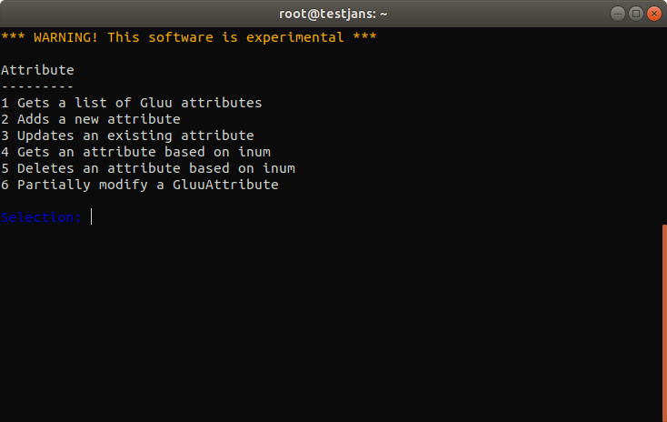
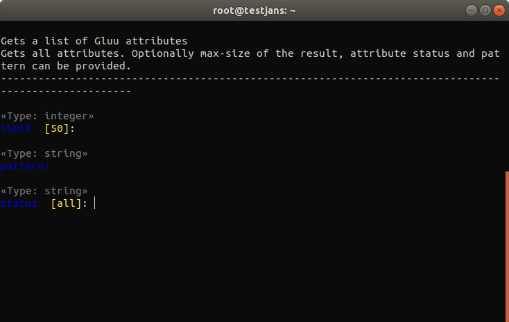
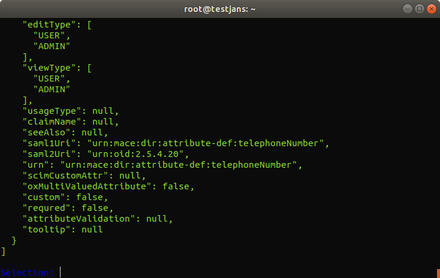
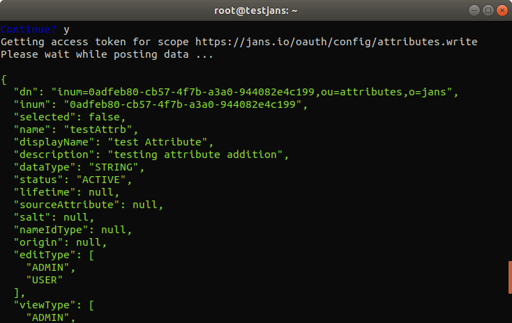
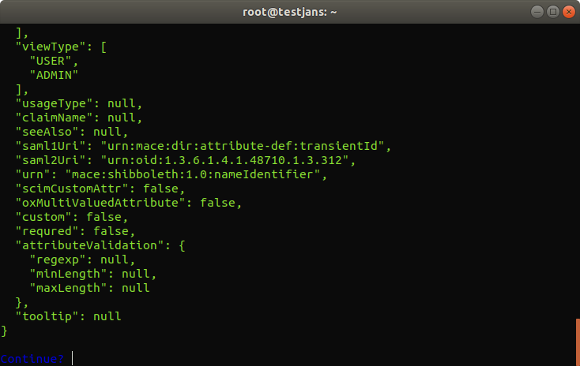
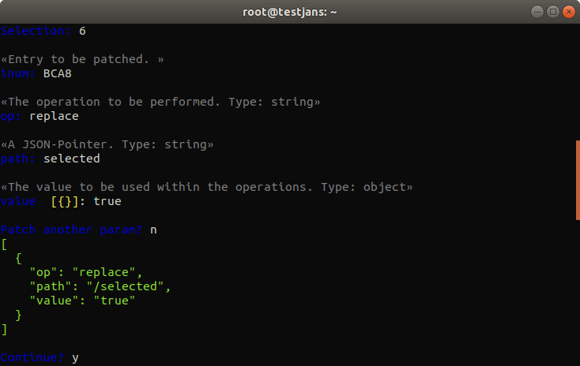
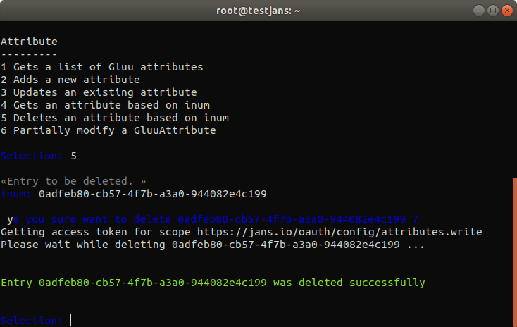

---
tags:
  - administration
  - configuration
  - cli
  - interactive
---

# Attribute


!!! Important
    The interactive mode of the CLI will be deprecated upon the full release of the Configuration TUI in the coming months.
    
> Prerequisite: Know how to use the Janssen CLI in [interactive mode](im-index.md)

Using **Janssen CLI**, You can perform some quick operations in _Attribute_. Such as:
- `view/find` list of Attributes in detail.
- `add` new attributes.
- `update` an existing attribute
- `delete` an attribute using its `inum` etc.

For example, to get all attributes to choose 1 from the Main Menu, you will get the following options:



To `View/Find` attributes choose 1, you will be asked to enter `Search size`,  `Search pattern` and `Status of the attribute` . For simplicity, leave defaults in our case:



Once press Enter, it will retrieve 50 attributes and prints to screen in green color:



You can save the result as a file by choosing `w` in the result screen. To go back enter `b`, to quit enter `q`. If you enter a recognized command, it will display valid command.

To `Add` a new attribute, choose 2 (on the Attribute screen). Then enter a value for each type of attribute item, after then it will ask to `continue?` enter `y` to continue. If everything is filled in the right way, it will create a new attribute on the list.
You can go with to add a new attribute quickly:
```text
Obtained Data:
{
  "dn": "ou=attributes,o=jans",
  "inum": null,
  "selected": false,
  "name": "testAttrb",
  "displayName": "test Attribute",
  "description": "testing attribute addition",
  "dataType": "STRING",
  "status": "ACTIVE",
  "lifetime": null,
  "sourceAttribute": null,
  "salt": null,
  "nameIdType": null,
  "origin": null,
  "editType": [
    "ADMIN",
    "USER"
  ],
  "viewType": [
    "ADMIN",
    "USER"
  ],
  "usageType": null,
  "claimName": null,
  "seeAlso": null,
  "saml1Uri": null,
  "saml2Uri": null,
  "urn": null,
  "scimCustomAttr": false,
  "oxMultiValuedAttribute": false,
  "custom": false,
  "requred": false,
  "attributeValidation": {
    "regexp": null,
    "minLength": null,
    "maxLength": null
  },
  "tooltip": null
}
```

 

To `update` an attribute, choose 3 (on the Attribute screen). It will ask `inum` of the attribute you are going to update. For example, I want to change the description for an attribute having `inum=BCA8`. 
It will retrieve current data and ask for the modification of each property, just leave defaults if you don't want to change that property.

When it comes to an end, it will display modified data and ask if you want to continue (this data just before it sends to a server)

```text
Obtained Data:

{
  "dn": "inum=BCA8,ou=attributes,o=jans",
  "inum": "BCA8",
  "selected": false,
  "name": "transientId",
  "displayName": "TransientId",
  "description": "TransientId",
  "dataType": "STRING",
  "status": "ACTIVE",
  "lifetime": null,
  "sourceAttribute": null,
  "salt": null,
  "nameIdType": null,
  "origin": "jansPerson",
  "editType": [
    "USER",
    "ADMIN"
  ],
  "viewType": [
    "USER",
    "ADMIN"
  ],
  "usageType": null,
  "claimName": null,
  "seeAlso": null,
  "saml1Uri": "urn:mace:dir:attribute-def:transientId",
  "saml2Uri": "urn:oid:1.3.6.1.4.1.48710.1.3.312",
  "urn": "mace:shibboleth:1.0:nameIdentifier",
  "scimCustomAttr": false,
  "oxMultiValuedAttribute": false,
  "custom": false,
  "requred": false,
  "attributeValidation": {
    "regexp": null,
    "minLength": null,
    "maxLength": null
  },
  "tooltip": null
}
```


Enter `y` to perform an `update` and display updated data on the screen.

To update property of an attribute, you can go with partial updates from Attribute Menu. To update partially, you must be asked to enter `inum`, `op`, `path` and `value`.
- **__inum__** identity of an attribute where operation to be done.
- **__op__** means operation to be done: [`replace`, `move`, `add`, `remove`, `copy`, `test`]
- **__path__** chose path where operation will be performed: for example `attributeValidation/minLength`
- **__value__** value that you want update. It can be integer, boolean or string.



Finally, it will display the updated result.

```text
Getting access token for scope https://jans.io/oauth/config/attributes.write
Please wait for patching...

{
  "dn": "inum=BCA8,ou=attributes,o=jans",
  "inum": "BCA8",
  "selected": true,
  "name": "transientId",
  "displayName": "TransientId",
  "description": "TransientId",
  "dataType": "STRING",
  "status": "ACTIVE",
  "lifetime": null,
  "sourceAttribute": null,
  "salt": null,
  "nameIdType": null,
  "origin": "jansPerson",
  "editType": [
    "USER",
    "ADMIN"
  ],
  "viewType": [
    "USER",
    "ADMIN"
  ],
  "usageType": null,
  "claimName": null,
  "seeAlso": null,
  "saml1Uri": "urn:mace:dir:attribute-def:transientId",
  "saml2Uri": "urn:oid:1.3.6.1.4.1.48710.1.3.312",
  "urn": "mace:shibboleth:1.0:nameIdentifier",
  "scimCustomAttr": false,
  "oxMultiValuedAttribute": false,
  "custom": false,
  "requred": false,
  "attributeValidation": {
    "regexp": null,
    "minLength": null,
    "maxLength": null
  },
  "tooltip": null
}
```

To `delete` an attribute, choose option 5 from Attribute Menu. Enter the `inum` value that you want to delete. Here I chose that I already created in the above: `"inum=0adfeb80-cb57-4f7b-a3a0-944082e4c199"` It will ask for confirmation, enter `y` to confirm.



