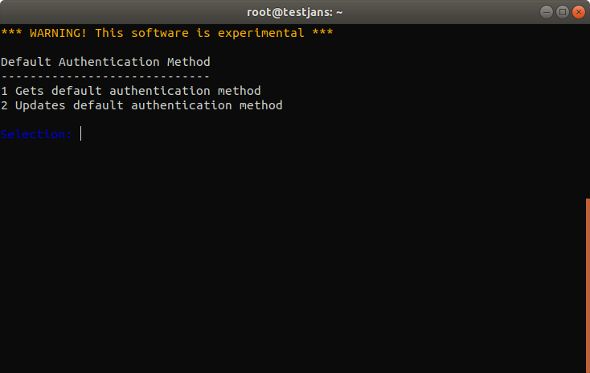
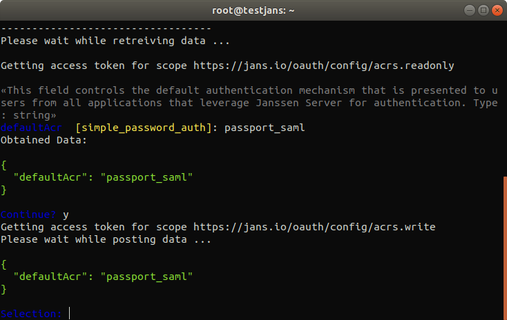

---
tags:
  - administration
  - configuration
  - cli
  - interactive
---

# Default Authentication Method

!!! Important
    The interactive mode of the CLI will be deprecated upon the full release of the Configuration TUI in the coming months.

> Prerequisite: Know how to use the Janssen CLI in [interactive mode](im-index.md)

Sometimes It's getting hard to change **Default Authentication Method** from a web browser if you can't log in using the web interface. Here Janssen CLI is going to help you a lot.

- `View` Default Authentication Method.
- `Update` Default Authentication Method.

Select option 2 from Main Menu to chose Authentication Method. You can see such options as listed above.

To `View` default authentication method select '1' from Authentication Menu, It will show you the current default authentication method of the Janssen server.

To `update` the default authentication method select '2', then enter the default authentication method that you want to update with it. It will ask for the confirmation, `y` to confirm. 

