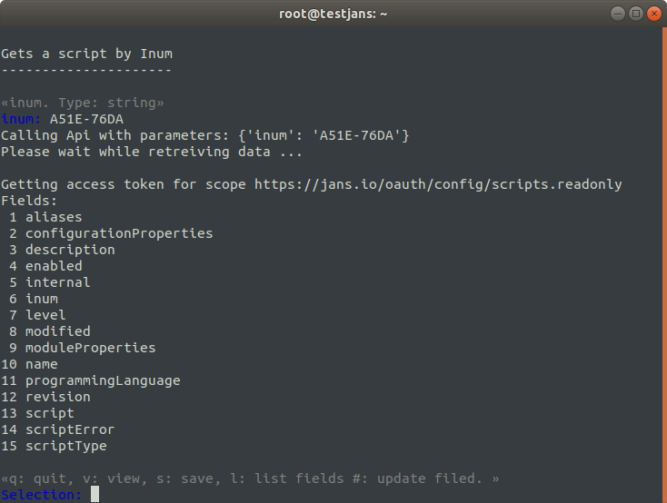

---
tags:
  - administration
  - configuration
  - cli
  - interactive
---

# Custom Scripts

!!! Important
    The interactive mode of the CLI will be deprecated upon the full release of the Configuration TUI in the coming months.

> Prerequisite: Know how to use the Janssen CLI in [interactive mode](im-index.md)

Interception scripts can be used to implement custom business logic for authentication, authorization, and more in a way that is upgrade-proof and doesn't require forking the Gluu Server code. Using Janssen CLI, you can perform such an operation as listed below:

```text
Custom Scripts
--------------
1 Gets a list of custom scripts
2 Adds a new custom script
3 Updates a custom script
4 Deletes a custom script
```

## Get list of Custom Scripts

To get the status of each type of script select option 1, you will get the below result in return:

```
Gets a list of custom scripts
-----------------------------
Please wait while retreiving data ...

Getting access token for scope https://jans.io/oauth/config/scripts.readonly
+----+-------------------------------------+-----------------------------------------------------------+-----------+-----------+
|    | scriptType                          | name                                                      | enabled   | inum      |
+====+=====================================+===========================================================+===========+===========+
|  1 | RESOURCE_OWNER_PASSWORD_CREDENTIALS | resource_owner_password_credentials_example               | False     | 2DAF-AA91 |
+----+-------------------------------------+-----------------------------------------------------------+-----------+-----------+
|  2 | INTROSPECTION                       | introspection_custom_params                               | False     | 2DAF-BA90 |
+----+-------------------------------------+-----------------------------------------------------------+-----------+-----------+
|  3 | UMA_CLAIMS_GATHERING                | sampleClaimsGathering                                     | False     | 2DAF-F996 |
+----+-------------------------------------+-----------------------------------------------------------+-----------+-----------+
|  4 | END_SESSION                         | frontchannel_logout_sample                                | False     | 2DAF-CA90 |
+----+-------------------------------------+-----------------------------------------------------------+-----------+-----------+
|  5 | UPDATE_TOKEN                        | update_token_sample                                       | False     | 2D3E.5A03 |
+----+-------------------------------------+-----------------------------------------------------------+-----------+-----------+
|  6 | INTROSPECTION                       | introspection_sample                                      | False     | 2DAF-AA90 |
+----+-------------------------------------+-----------------------------------------------------------+-----------+-----------+
|  7 | RESOURCE_OWNER_PASSWORD_CREDENTIALS | resource_owner_password_credentials_custom_params_example | False     | 2DAF-BA91 |
+----+-------------------------------------+-----------------------------------------------------------+-----------+-----------+
|  8 | CIBA_END_USER_NOTIFICATION          | firebase_ciba_end_user_notification                       | False     | C1BA-C1BA |
+----+-------------------------------------+-----------------------------------------------------------+-----------+-----------+
|  9 | PERSON_AUTHENTICATION               | basic                                                     | False     | A51E-76DA |
+----+-------------------------------------+-----------------------------------------------------------+-----------+-----------+
| 10 | CONSENT_GATHERING                   | consent_gathering                                         | False     | DAA9-BA60 |
+----+-------------------------------------+-----------------------------------------------------------+-----------+-----------+
| 11 | PERSON_AUTHENTICATION               | basic_lock                                                | False     | 4BBE-C6A8 |
+----+-------------------------------------+-----------------------------------------------------------+-----------+-----------+
| 12 | PERSON_AUTHENTICATION               | cert                                                      | False     | 2124-0CF1 |
+----+-------------------------------------+-----------------------------------------------------------+-----------+-----------+
| 13 | PERSON_AUTHENTICATION               | yubicloud                                                 | False     | 24FD-B96E |
+----+-------------------------------------+-----------------------------------------------------------+-----------+-----------+
| 14 | PERSON_AUTHENTICATION               | otp                                                       | False     | 5018-D4BF |
+----+-------------------------------------+-----------------------------------------------------------+-----------+-----------+
| 15 | PERSON_AUTHENTICATION               | smpp                                                      | False     | 09A0-93D7 |
+----+-------------------------------------+-----------------------------------------------------------+-----------+-----------+
| 16 | PERSON_AUTHENTICATION               | twilio_sms                                                | False     | 09A0-93D6 |
+----+-------------------------------------+-----------------------------------------------------------+-----------+-----------+
| 17 | PERSON_AUTHENTICATION               | thumb_sign_in                                             | False     | 92F0-759E |
+----+-------------------------------------+-----------------------------------------------------------+-----------+-----------+
| 18 | PERSON_AUTHENTICATION               | u2f                                                       | False     | 8BAF-80D6 |
+----+-------------------------------------+-----------------------------------------------------------+-----------+-----------+
| 19 | PERSON_AUTHENTICATION               | duo                                                       | False     | 5018-F9CF |
+----+-------------------------------------+-----------------------------------------------------------+-----------+-----------+
| 20 | PERSON_AUTHENTICATION               | super_gluu                                                | False     | 92F0-BF9E |
+----+-------------------------------------+-----------------------------------------------------------+-----------+-----------+
| 21 | PERSON_AUTHENTICATION               | fido2                                                     | False     | 8BAF-80D7 |
+----+-------------------------------------+-----------------------------------------------------------+-----------+-----------+
| 22 | PERSON_AUTHENTICATION               | uaf                                                       | False     | 5018-AF9C |
+----+-------------------------------------+-----------------------------------------------------------+-----------+-----------+
| 23 | UMA_RPT_POLICY                      | scim_access_policy                                        | False     | 2DAF-F9A5 |
+----+-------------------------------------+-----------------------------------------------------------+-----------+-----------+
| 24 | UMA_RPT_POLICY                      | uma_rpt_policy                                            | False     | 2DAF-F995 |
+----+-------------------------------------+-----------------------------------------------------------+-----------+-----------+
| 25 | DYNAMIC_SCOPE                       | org_name                                                  | False     | 031C-5621 |
+----+-------------------------------------+-----------------------------------------------------------+-----------+-----------+
| 26 | PERSISTENCE_EXTENSION               | persistence_extension                                     | False     | 8AF7.D82A |
+----+-------------------------------------+-----------------------------------------------------------+-----------+-----------+
| 27 | ID_GENERATOR                        | id_generator                                              | False     | 031C-4A65 |
+----+-------------------------------------+-----------------------------------------------------------+-----------+-----------+
| 28 | IDP                                 | idp                                                       | False     | 8AF7.D82B |
+----+-------------------------------------+-----------------------------------------------------------+-----------+-----------+
| 29 | CACHE_REFRESH                       | cache_refresh                                             | False     | 13D3-E7AD |
+----+-------------------------------------+-----------------------------------------------------------+-----------+-----------+
| 30 | APPLICATION_SESSION                 | application_session                                       | False     | DAA9-B789 |
+----+-------------------------------------+-----------------------------------------------------------+-----------+-----------+
| 31 | DYNAMIC_SCOPE                       | dynamic_permission                                        | True      | CB5B-3211 |
+----+-------------------------------------+-----------------------------------------------------------+-----------+-----------+
| 32 | SCIM                                | scim_event_handler                                        | False     | A910-56AB |
+----+-------------------------------------+-----------------------------------------------------------+-----------+-----------+
| 33 | CLIENT_REGISTRATION                 | client_registration                                       | False     | DAA9-B788 |
+----+-------------------------------------+-----------------------------------------------------------+-----------+-----------+
| 34 | DYNAMIC_SCOPE                       | work_phone                                                | False     | 031C-5622 |
+----+-------------------------------------+-----------------------------------------------------------+-----------+-----------+


```

## Add a new Custom Script

To add a new script, choose option 2 and fill each property:

`dn, inum, display name, valid script`
```
ScriptType: [PERSON_AUTHENTICATION, INTROSPECTION, RESOURCE_OWNER_PASSWORD_CREDENTIALS, APPLICATION_SESSION, CACHE_REFRESH, CLIENT_REGISTRATION, ID_GENERATOR, UMA_RPT_POLICY, UMA_RPT_CLAIMS, UMA_CLAIMS_GATHERING, CONSENT_GATHERING, DYNAMIC_SCOPE, SPONTANEOUS_SCOPE, END_SESSION, POST_AUTHN, SCIM, CIBA_END_USER_NOTIFICATION, PERSISTENCE_EXTENSION, IDP]

Programming Language: [PYTHON, JAVA]
```

## Update Custom Scripts

Let update `Person Authentication basic` by its inum. Select option 3 from **custom scripts** menu
and enter its inum, in my case it's `A51E-76DA`



selecting the field we are gonna update: 4

```
«q: quit, v: view, s: save, l: list fields #: update filed. »
Selection: 4

«boolean value indicating if script enabled. Type: boolean»
enabled  [false]: true
Please enter a(n) boolean value: _true, _false
enabled  [false]: _true

«q: quit, v: view, s: save, l: list fields #: update filed. »
Selection: 4

«boolean value indicating if script enabled. Type: boolean»
enabled  [true]: 

```
In this way you can update any field you want.

## How to delete Custom Scripts?

To delete a custom script, you need an `inum` of a custom script that you want to delete.
It will ask for confirmation when you enter `inum`, simply enter `yes/y` to delete it otherwise enter `no/n` to cancel the operation.

