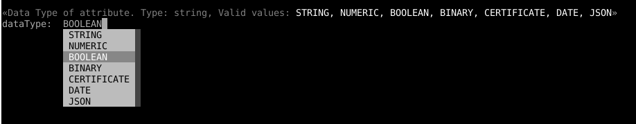

---
tags:
  - administration
  - configuration
  - cli
  - interactive
---

# Menu Driven Interactive Mode

!!! Important
    The interactive mode of the CLI will be deprecated upon the full release of the Configuration TUI in the coming months.

We will refer _Menu-driven Interactive Mode_ as **IM**. To run IM just simply execute jans-cli as follows:
```
/opt/jans/jans-cli/config-cli.py
```

Note: You can supply certificate and key with options `--key-file` and `--cert-file`, to disable ssl verification use `-noverify`.
For more information `/opt/jans/jans-cli/config-cli.py -h`

You will see the main menu as below:


Using IM is very simple and intuitive. Just make a selection and answer questions.
There is a special option to read value for a question from a file using **_file** tag.
This option is the most suitable choice to input the large text (e.g., interception
script source code or JSON file content). To use this option input
**_file /path/of/file** e.g. **_file /home/user/interceptionscript.py**.
From the following menu, you can choose an option by selecting its number.


IM uses auto-filler for user inputs. When you type, it displays available values.
To see all values, press **space** button. For example:



## Quick Tips

1. `_` is an escape character for IM mode. For example, you can create a list `["me", "you"]` by entering `me_,you`
1. `_true` means boolean **True** instead of string `"true"`, similarly `_false` is boolean **False** instead of string `"false"`
1. `_null` is comprehended as **None** (or in json **null**)
1. `_x` exits the current process and go back to the parent menu
1. `_file path_to_file` the string property will be read ffrom file **path_to_file**
3. `_q` refers to `quit`


