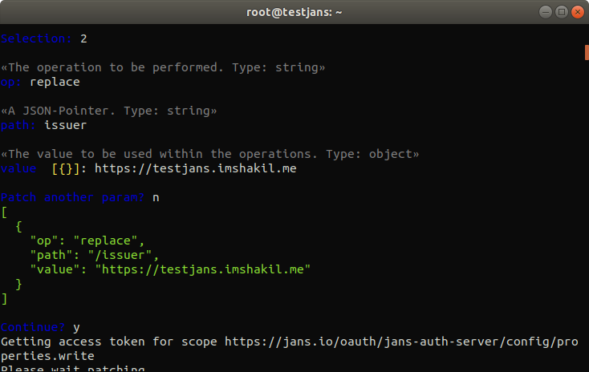

---
tags:
  - administration
  - configuration
  - cli
  - interactive
---

# Janssen Authorization Server

!!! Important
    The interactive mode of the CLI will be deprecated upon the full release of the Configuration TUI in the coming months.

> Prerequisite: Know how to use the Janssen CLI in [interactive mode](im-index.md)

From the Main Menu choose option 8 to `get/modify` Jans authorization server configuration properties.
```text
Configuration – Properties
--------------------------
1 Gets all Jans authorization server configuration properties
2 Partially modifies Jans authorization server Application configuration properties
```

Select 1 to get all the details about Jans authorization server configuration. It will show all the properties as below:
```json5
{
  "issuer": "https://testjans.gluu.com",
  "baseEndpoint": "https://testjans.gluu.com/jans-auth/restv1",
  "authorizationEndpoint": "https://testjans.gluu.com/jans-auth/restv1/authorize",
  "tokenEndpoint": "https://testjans.gluu.com/jans-auth/restv1/token",
  "tokenRevocationEndpoint": "https://testjans.gluu.com/jans-auth/restv1/revoke",
  "userInfoEndpoint": "https://testjans.gluu.com/jans-auth/restv1/userinfo",
  "clientInfoEndpoint": "https://testjans.gluu.com/jans-auth/restv1/clientinfo",
  "checkSessionIFrame": "https://testjans.gluu.com/jans-auth/opiframe.htm",
  "endSessionEndpoint": "https://testjans.gluu.com/jans-auth/restv1/end_session",
  "jwksUri": "https://testjans.gluu.com/jans-auth/restv1/jwks",
  "registrationEndpoint": "https://testjans.gluu.com/jans-auth/restv1/register",
  "openIdDiscoveryEndpoint": "https://testjans.gluu.com/.well-known/webfinger",
  "openIdConfigurationEndpoint": "https://testjans.gluu.com/.well-known/openid-configuration",
  "idGenerationEndpoint": "https://testjans.gluu.com/jans-auth/restv1/id",
  "introspectionEndpoint": "https://testjans.gluu.com/jans-auth/restv1/introspection",
  "deviceAuthzEndpoint": "https://testjans.gluu.com/jans-auth/restv1/device_authorization",
  "sessionAsJwt": false,
  "sectorIdentifierCacheLifetimeInMinutes": 1440,
  "umaConfigurationEndpoint": "https://testjans.gluu.com/jans-auth/restv1/uma2-configuration",
  "umaRptAsJwt": false,
  "umaRptLifetime": 3600,
  "umaTicketLifetime": 3600,
  "umaPctLifetime": 2592000,
  "umaResourceLifetime": 2592000,
  "umaAddScopesAutomatically": true,
  "umaValidateClaimToken": false,
  "umaGrantAccessIfNoPolicies": false,
  "umaRestrictResourceToAssociatedClient": false,
  "spontaneousScopeLifetime": 86400,
  "openidSubAttribute": "inum",
  "responseTypesSupported": [
    "['token', 'code']",
    "['id_token']",
    "['token']",
    "['id_token', 'code']",
    "['id_token', 'token', 'code']",
    "['code']",
    "['id_token', 'token']"
  ],
  "responseModesSupported": [
    "query",
    "form_post",
    "fragment"
  ],
  "grantTypesSupported": [
    "password",
    "client_credentials",
    "refresh_token",
    "urn:ietf:params:oauth:grant-type:uma-ticket",
    "urn:ietf:params:oauth:grant-type:device_code",
    "urn:ietf:params:oauth:grant-type:token-exchange",
    "implicit",
    "authorization_code"
  ],
  "subjectTypesSupported": [
    "public",
    "pairwise"
  ],
  "defaultSubjectType": [
    "p",
    "a",
    "i",
    "r",
    "w",
    "i",
    "s",
    "e"
  ],
  "userInfoSigningAlgValuesSupported": [
    "HS256",
    "HS384",
    "HS512",
    "RS256",
    "RS384",
    "RS512",
    "ES256",
    "ES384",
    "ES512"
  ],
  "userInfoEncryptionAlgValuesSupported": [
    "RSA1_5",
    "RSA-OAEP",
    "A128KW",
    "A256KW"
  ],
  "userInfoEncryptionEncValuesSupported": [
    "A128CBC+HS256",
    "A256CBC+HS512",
    "A128GCM",
    "A256GCM"
  ],
  "idTokenSigningAlgValuesSupported": [
    "none",
    "HS256",
    "HS384",
    "HS512",
    "RS256",
    "RS384",
    "RS512",
    "ES256",
    "ES384",
    "ES512"
  ],
  "idTokenEncryptionAlgValuesSupported": [
    "RSA1_5",
    "RSA-OAEP",
    "A128KW",
    "A256KW"
  ],
  "idTokenEncryptionEncValuesSupported": [
    "A128CBC+HS256",
    "A256CBC+HS512",
    "A128GCM",
    "A256GCM"
  ],
  "requestObjectSigningAlgValuesSupported": [
    "none",
    "HS256",
    "HS384",
    "HS512",
    "RS256",
    "RS384",
    "RS512",
    "ES256",
    "ES384",
    "ES512"
  ],
  "requestObjectEncryptionAlgValuesSupported": [
    "RSA1_5",
    "RSA-OAEP",
    "A128KW",
    "A256KW"
  ],
  "requestObjectEncryptionEncValuesSupported": [
    "A128CBC+HS256",
    "A256CBC+HS512",
    "A128GCM",
    "A256GCM"
  ],
  "tokenEndpointAuthMethodsSupported": [
    "client_secret_basic",
    "client_secret_post",
    "client_secret_jwt",
    "private_key_jwt",
    "tls_client_auth",
    "self_signed_tls_client_auth"
  ],
  "tokenEndpointAuthSigningAlgValuesSupported": [
    "HS256",
    "HS384",
    "HS512",
    "RS256",
    "RS384",
    "RS512",
    "ES256",
    "ES384",
    "ES512"
  ],
  "dynamicRegistrationCustomAttributes": null,
  "displayValuesSupported": [
    "page",
    "popup"
  ],
  "claimTypesSupported": [
    "normal"
  ],
  "jwksAlgorithmsSupported": [
    "RS256",
    "RS384",
    "RS512",
    "ES256",
    "ES384",
    "ES512",
    "PS256",
    "PS384",
    "PS512",
    "RSA1_5",
    "RSA-OAEP"
  ],
  "serviceDocumentation": [
    "h",
    "t",
    "t",
    "p",
    ":",
    "/",
    "/",
    "j",
    "a",
    "n",
    "s",
    ".",
    "o",
    "r",
    "g",
    "/",
    "d",
    "o",
    "c",
    "s"
  ],
  "claimsLocalesSupported": [
    "en"
  ],
  "idTokenTokenBindingCnfValuesSupported": [
    "tbh"
  ],
  "uiLocalesSupported": [
    "en",
    "bg",
    "de",
    "es",
    "fr",
    "it",
    "ru",
    "tr"
  ],
  "claimsParameterSupported": false,
  "requestParameterSupported": true,
  "requestUriParameterSupported": true,
  "requestUriHashVerificationEnabled": false,
  "requireRequestUriRegistration": false,
  "opPolicyUri": "http://www.jans.io/doku.php?id=jans:policy",
  "opTosUri": "http://www.jans.io/doku.php?id=jans:tos",
  "authorizationCodeLifetime": 60,
  "refreshTokenLifetime": 14400,
  "idTokenLifetime": 3600,
  "idTokenFilterClaimsBasedOnAccessToken": false,
  "accessTokenLifetime": 300,
  "cleanServiceInterval": 60,
  "cleanServiceBatchChunkSize": 10000,
  "cleanServiceBaseDns": null,
  "keyRegenerationEnabled": true,
  "keyRegenerationInterval": 48,
  "defaultSignatureAlgorithm": [
    "R",
    "S",
    "2",
    "5",
    "6"
  ],
  "oxOpenIdConnectVersion": "openidconnect-1.0",
  "oxId": "https://testjans.gluu.com/oxid/service/jans/inum",
  "dynamicRegistrationEnabled": true,
  "dynamicRegistrationExpirationTime": -1,
  "dynamicRegistrationPersistClientAuthorizations": true,
  "trustedClientEnabled": true,
  "skipAuthorizationForOpenIdScopeAndPairwiseId": false,
  "dynamicRegistrationScopesParamEnabled": true,
  "dynamicRegistrationPasswordGrantTypeEnabled": false,
  "dynamicRegistrationAllowedPasswordGrantScopes": null,
  "dynamicRegistrationCustomObjectClass": null,
  "personCustomObjectClassList": [
    "jansCustomPerson",
    "jansPerson"
  ],
  "persistIdTokenInLdap": false,
  "persistRefreshTokenInLdap": true,
  "allowPostLogoutRedirectWithoutValidation": false,
  "invalidateSessionCookiesAfterAuthorizationFlow": false,
  "returnClientSecretOnRead": true,
  "rejectJwtWithNoneAlg": true,
  "expirationNotificatorEnabled": false,
  "useNestedJwtDuringEncryption": true,
  "expirationNotificatorMapSizeLimit": 100000,
  "expirationNotificatorIntervalInSeconds": 600,
  "authenticationFiltersEnabled": false,
  "clientAuthenticationFiltersEnabled": false,
  "clientRegDefaultToCodeFlowWithRefresh": true,
  "authenticationFilters": [
    {
      "filter": "(&(mail=*{0}*)(inum={1}))",
      "bind": false,
      "bind-password-attribute": null,
      "base-dn": null
    },
    {
      "filter": "uid={0}",
      "bind": true,
      "bind-password-attribute": null,
      "base-dn": null
    }
  ],
  "clientAuthenticationFilters": [
    {
      "filter": "myCustomAttr1={0}",
      "bind": null,
      "bind-password-attribute": null,
      "base-dn": null
    }
  ],
  "corsConfigurationFilters": [
    {
      "filterName": "CorsFilter",
      "corsEnabled": true,
      "corsAllowedOrigins": "*",
      "corsAllowedMethods": "GET,POST,HEAD,OPTIONS",
      "corsAllowedHeaders": "Origin,Authorization,Accept,X-Requested-With,Content-Type,Access-Control-Request-Method,Access-Control-Request-Headers",
      "corsExposedHeaders": null,
      "corsSupportCredentials": true,
      "corsLoggingEnabled": false,
      "corsPreflightMaxAge": 1800,
      "corsRequestDecorate": true
    }
  ],
  "sessionIdUnusedLifetime": 86400,
  "sessionIdUnauthenticatedUnusedLifetime": 120,
  "sessionIdEnabled": true,
  "sessionIdPersistOnPromptNone": true,
  "sessionIdRequestParameterEnabled": false,
  "changeSessionIdOnAuthentication": true,
  "sessionIdPersistInCache": false,
  "sessionIdLifetime": 86400,
  "serverSessionIdLifetime": 86400,
  "configurationUpdateInterval": 3600,
  "enableClientGrantTypeUpdate": true,
  "dynamicGrantTypeDefault": [
    "client_credentials",
    "refresh_token",
    "urn:ietf:params:oauth:grant-type:uma-ticket",
    "urn:ietf:params:oauth:grant-type:device_code",
    "urn:ietf:params:oauth:grant-type:token-exchange",
    "implicit",
    "authorization_code"
  ],
  "cssLocation": null,
  "jsLocation": null,
  "imgLocation": null,
  "metricReporterInterval": 300,
  "metricReporterKeepDataDays": 15,
  "metricReporterEnabled": false,
  "pairwiseIdType": [
    "a",
    "l",
    "g",
    "o",
    "r",
    "i",
    "t",
    "h",
    "m",
    "i",
    "c"
  ],
  "pairwiseCalculationKey": "sckNNuFhwz3r2fC4xLLlBeVybFw",
  "pairwiseCalculationSalt": "USZej6vS3pI7RzFIl3AT",
  "shareSubjectIdBetweenClientsWithSameSectorId": true,
  "webKeysStorage": "keystore",
  "dnName": "CN=Jans Auth CA Certificates",
  "keyStoreFile": "/etc/certs/jans-auth-keys.jks",
  "keyStoreSecret": "0EIsfpb6tURD",
  "keySelectionStrategy": "OLDER",
  "oxElevenTestModeToken": null,
  "oxElevenGenerateKeyEndpoint": "https://testjans.gluu.com/oxeleven/rest/oxeleven/generateKey",
  "oxElevenSignEndpoint": "https://testjans.gluu.com/oxeleven/rest/oxeleven/sign",
  "oxElevenVerifySignatureEndpoint": "https://testjans.gluu.com/oxeleven/rest/oxeleven/verifySignature",
  "oxElevenDeleteKeyEndpoint": "https://testjans.gluu.com/oxeleven/rest/oxeleven/deleteKey",
  "introspectionAccessTokenMustHaveUmaProtectionScope": false,
  "endSessionWithAccessToken": false,
  "cookieDomain": null,
  "enabledOAuthAuditLogging": null,
  "jmsBrokerURISet": null,
  "jmsUserName": null,
  "jmsPassword": null,
  "clientWhiteList": [
    "*"
  ],
  "clientBlackList": [
    "*.attacker.com/*"
  ],
  "legacyIdTokenClaims": false,
  "customHeadersWithAuthorizationResponse": true,
  "frontChannelLogoutSessionSupported": true,
  "loggingLevel": "INFO",
  "loggingLayout": "text",
  "updateUserLastLogonTime": false,
  "updateClientAccessTime": false,
  "logClientIdOnClientAuthentication": true,
  "logClientNameOnClientAuthentication": false,
  "disableJdkLogger": true,
  "authorizationRequestCustomAllowedParameters": [
    "customParam2",
    "customParam3",
    "customParam1"
  ],
  "legacyDynamicRegistrationScopeParam": false,
  "openidScopeBackwardCompatibility": false,
  "disableU2fEndpoint": false,
  "useLocalCache": true,
  "fapiCompatibility": false,
  "forceIdTokenHintPrecense": false,
  "forceOfflineAccessScopeToEnableRefreshToken": true,
  "errorReasonEnabled": false,
  "removeRefreshTokensForClientOnLogout": true,
  "skipRefreshTokenDuringRefreshing": false,
  "refreshTokenExtendLifetimeOnRotation": false,
  "consentGatheringScriptBackwardCompatibility": false,
  "introspectionScriptBackwardCompatibility": false,
  "introspectionResponseScopesBackwardCompatibility": false,
  "softwareStatementValidationType": "script",
  "softwareStatementValidationClaimName": null,
  "authenticationProtectionConfiguration": {
    "attemptExpiration": 15,
    "maximumAllowedAttemptsWithoutDelay": 4,
    "delayTime": 2,
    "bruteForceProtectionEnabled": false
  },
  "errorHandlingMethod": "internal",
  "keepAuthenticatorAttributesOnAcrChange": false,
  "deviceAuthzRequestExpiresIn": 1800,
  "deviceAuthzTokenPollInterval": 5,
  "deviceAuthzResponseTypeToProcessAuthz": "code",
  "backchannelClientId": null,
  "backchannelRedirectUri": "https://testjans.gluu.com/jans-auth/ciba/home.htm",
  "backchannelAuthenticationEndpoint": "https://testjans.gluu.com/jans-auth/restv1/bc-authorize",
  "backchannelDeviceRegistrationEndpoint": "https://testjans.gluu.com/jans-auth/restv1/bc-deviceRegistration",
  "backchannelTokenDeliveryModesSupported": [
    "poll",
    "ping",
    "push"
  ],
  "backchannelAuthenticationRequestSigningAlgValuesSupported": null,
  "backchannelUserCodeParameterSupported": false,
  "backchannelBindingMessagePattern": "^[a-zA-Z0-9]{4,8}$",
  "backchannelAuthenticationResponseExpiresIn": 3600,
  "backchannelAuthenticationResponseInterval": 2,
  "backchannelLoginHintClaims": [
    "inum",
    "uid",
    "mail"
  ],
  "cibaEndUserNotificationConfig": {
    "apiKey": null,
    "authDomain": null,
    "databaseURL": null,
    "projectId": null,
    "storageBucket": null,
    "messagingSenderId": null,
    "appId": null,
    "notificationUrl": null,
    "notificationKey": null,
    "publicVapidKey": null
  },
  "backchannelRequestsProcessorJobIntervalSec": 5,
  "backchannelRequestsProcessorJobChunkSize": 100,
  "cibaGrantLifeExtraTimeSec": 180,
  "cibaMaxExpirationTimeAllowedSec": 1800,
  "cibaEnabled": false,
  "discoveryCacheLifetimeInMinutes": 60,
  "httpLoggingEnabled": false,
  "httpLoggingExcludePaths": null,
  "externalLoggerConfiguration": null,
  "redirectUrisRegexEnabled": false,
  "useHighestLevelScriptIfAcrScriptNotFound": true
}
```
By selecting the 2nd option, you can modify its properties partially. 



At the end, it will show the updated result.

