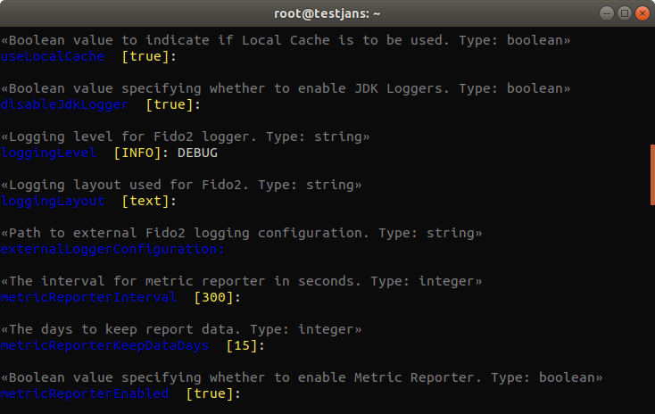

---
tags:
  - administration
  - configuration
  - cli
  - interactive
---

# Janssen FIDO2 Configuration

!!! Important
    The interactive mode of the CLI will be deprecated upon the full release of the Configuration TUI in the coming months.

> Prerequisite: Know how to use the Janssen CLI in [interactive mode](im-index.md)

Janssen includes a FIDO2 component to implement a two-step, two-factor authentication (2FA) with a username/password as the first step, and any FIDO2 device as the second step. During Janssen installation, the administrator will have an option to install the FIDO2 component.

Using Janssen CLI, you can `view/update` details of the FIDO2 configuration.
From the main menu select option 9, you will get two options.

```text
Configuration – Fido2
---------------------
1 Gets Jans Authorization Server Fido2 configuration properties
2 Updates Fido2 configuration properties
```
If you chose the first option, You will get some details of fido2 configuration properties:
```json5
{
  "issuer": "https://testjans.gluu.com",
  "baseEndpoint": "https://testjans.gluu.com/fido2/restv1",
  "cleanServiceInterval": 60,
  "cleanServiceBatchChunkSize": 10000,
  "useLocalCache": true,
  "disableJdkLogger": true,
  "loggingLevel": "INFO",
  "loggingLayout": "text",
  "externalLoggerConfiguration": "",
  "metricReporterInterval": 300,
  "metricReporterKeepDataDays": 15,
  "metricReporterEnabled": true,
  "personCustomObjectClassList": [
    "jansCustomPerson",
    "jansPerson"
  ],
  "fido2Configuration": {
    "authenticatorCertsFolder": "/etc/jans/conf/fido2/authenticator_cert",
    "mdsCertsFolder": "/etc/jans/conf/fido2/mds/cert",
    "mdsTocsFolder": "/etc/jans/conf/fido2/mds/toc",
    "serverMetadataFolder": "/etc/jans/conf/fido2/server_metadata",
    "requestedParties": [
      {
        "name": "https://testjans.gluu.com",
        "domains": [
          "testjans.gluu.com"
        ]
      }
    ],
    "userAutoEnrollment": false,
    "unfinishedRequestExpiration": 180,
    "authenticationHistoryExpiration": 1296000,
    "requestedCredentialTypes": [
      "RS256",
      "ES256"
    ]
  }
}

```
If you want to update the fido2 configuration, you can choose the 2nd option. It will ask to fill each property, skip for default values. 
For example, if you want to change **_logginglevel_** `INFO` to `DEBUG`, simply enter **DEBUG** when it will ask to enter a value.



> **__Add RequestedParties?__**; If you want to add any requested domains then enter `y`, it will ask `name` and `domains` information of requested parties. Otherwise, enter `n` to skip.

```text
Continue? y
Getting access token for scope https://jans.io/oauth/config/fido2.write
Please wait while posting data ...

{
  "issuer": "https://testjans.gluu.com",
  "baseEndpoint": "https://testjans.gluu.com/fido2/restv1",
  "cleanServiceInterval": 60,
  "cleanServiceBatchChunkSize": 10000,
  "useLocalCache": false,
  "disableJdkLogger": false,
  "loggingLevel": "DEBUG",
  "loggingLayout": "text",
  "externalLoggerConfiguration": null,
  "metricReporterInterval": 300,
  "metricReporterKeepDataDays": 15,
  "metricReporterEnabled": false,
  "personCustomObjectClassList": [
    "jansCustomPerson",
    "jansPerson"
  ],
  "fido2Configuration": {
    "authenticatorCertsFolder": null,
    "mdsCertsFolder": null,
    "mdsTocsFolder": null,
    "serverMetadataFolder": null,
    "requestedParties": [
      {
        "name": null,
        "domains": []
      }
    ],
    "userAutoEnrollment": false,
    "unfinishedRequestExpiration": null,
    "authenticationHistoryExpiration": null,
    "requestedCredentialTypes": []
  }
}
```

