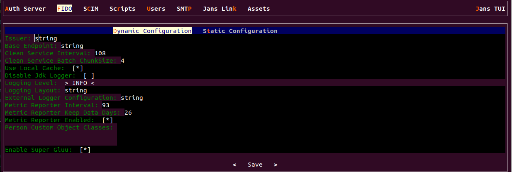
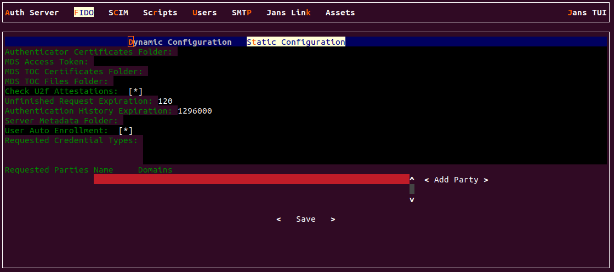
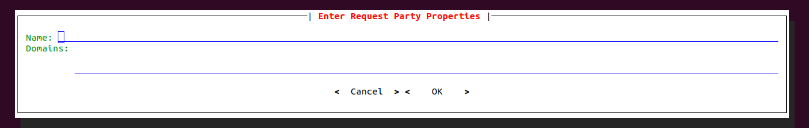

---
tags:
  - administration
  - configuration
  - fido2
---

# Janssen FIDO2 Configuration

The Janssen Server provides multiple configuration tools to perform these 
tasks.

=== "Use Command-line"

    Use the command line to perform actions from the terminal. Learn how to 
    use Jans CLI [here](./config-tools/jans-cli/README.md) or jump straight to 
    the [Using Command Line](#using-command-line)

=== "Use Text-based UI"

    Use a fully functional text-based user interface from the terminal. 
    Learn how to use Jans Text-based UI (TUI) 
    [here](./config-tools/jans-tui/README.md) or jump straight to the
    [Using Text-based UI](#using-text-based-ui)

=== "Use REST API"

    Use REST API for programmatic access or invoke via tools like CURL or 
    Postman. Learn how to use Janssen Server Config API 
    [here](./config-tools/config-api/README.md) or Jump straight to the
    [Using Configuration REST API](#using-configuration-rest-api)

##  Using Command Line


In the Janssen Server, you can deploy and customize the FIDO2 Configuration using the
command line. To get the details of Janssen command line operations relevant to
FIDO2 Configuration, you can check the operations under `Fido2Configuration` task using the
command below:


```bash title="Command"
/opt/jans/jans-cli/config-cli.py --info Fido2Configuration
```

It will show the details of the available operation-ids for Fido2.

```text title="Sample Output"
Operation ID: get-properties-fido2
  Description: Gets Jans Authorization Server Fido2 configuration properties
Operation ID: put-properties-fido2
  Description: Updates Fido2 configuration properties
  Schema: Fido2:AppConfiguration

To get sample schema type /opt/jans/jans-cli/config-cli.py --schema <schema>, for example /opt/jans/jans-cli/config-cli.py --schema Fido2:AppConfiguration
```

### Find FIDO2 Configuration Properties

To get the properties of Janssen Fido2 Configuration, run below command:

```bash title="Command"
/opt/jans/jans-cli/config-cli.py --operation-id get-properties-fido2
```

It will return the result as below:

```json title="Sample Output" linenums="1"
{
  "issuer": "https://jans-project.lxd",
  "baseEndpoint": "https://jans-project.lxd/jans-fido2/restv1",
  "cleanServiceInterval": 60,
  "cleanServiceBatchChunkSize": 10000,
  "useLocalCache": true,
  "disableJdkLogger": true,
  "loggingLevel": "INFO",
  "loggingLayout": "text",
  "metricReporterInterval": 300,
  "metricReporterKeepDataDays": 15,
  "metricReporterEnabled": true,
  "personCustomObjectClassList": [
    "jansCustomPerson",
    "jansPerson"
  ],
  "superGluuEnabled": false,
  "sessionIdPersistInCache": false,
  "oldU2fMigrationEnabled": true,
  "errorReasonEnabled": false,
  "fido2Configuration": {
    "authenticatorCertsFolder": "/etc/jans/conf/fido2/authenticator_cert",
    "mdsCertsFolder": "/etc/jans/conf/fido2/mds/cert",
    "mdsTocsFolder": "/etc/jans/conf/fido2/mds/toc",
    "checkU2fAttestations": false,
    "userAutoEnrollment": false,
    "unfinishedRequestExpiration": 180,
    "authenticationHistoryExpiration": 1296000,
    "serverMetadataFolder": "/etc/jans/conf/fido2/server_metadata",
    "requestedCredentialTypes": [
      "RS256",
      "ES256"
    ],
    "requestedParties": [
      {
        "name": "https://jans-project.lxd",
        "domains": [
          "jans-project.lxd"
        ]
      }
    ],
    "skipDownloadMdsEnabled": false,
    "skipValidateMdsInAttestationEnabled": false,
    "assertionOptionsGenerateEndpointEnabled": true
  }
}

```

### Update FIDO2 Configuration Properties

To perform this operation, let's check the schema first.

```text title="Command"
/opt/jans/jans-cli/config-cli.py --schema Fido2:AppConfiguration > \
/tmp/fido2-schema.json
```
Above command will create a fido2 schema file on `/tmp/`.

You can use the above command without a file to get the format of the `Fido2:AppConfiguration` schema

```text title="Schema Format"
issuer                        string
baseEndpoint                  string
cleanServiceInterval          integer
                              format: int32
cleanServiceBatchChunkSize    integer
                              format: int32
useLocalCache                 boolean
disableJdkLogger              boolean
loggingLevel                  string
loggingLayout                 string
externalLoggerConfiguration   string
metricReporterInterval        integer
                              format: int32
metricReporterKeepDataDays    integer
                              format: int32
metricReporterEnabled         boolean
personCustomObjectClassList   array of string
superGluuEnabled              boolean
sessionIdPersistInCache       boolean
oldU2fMigrationEnabled        boolean
errorReasonEnabled            boolean
fido2Configuration            object
                                authenticatorCertsFolder: string
                                mdsAccessToken: string
                                mdsCertsFolder: string
                                mdsTocsFolder: string
                                checkU2fAttestations: boolean
                                userAutoEnrollment: boolean
                                unfinishedRequestExpiration: integer
                                authenticationHistoryExpiration: integer
                                serverMetadataFolder: string
                                requestedCredentialTypes: array of string
                                requestedParties: array
                                metadataUrlsProvider: string
                                skipDownloadMdsEnabled: boolean
                                skipValidateMdsInAttestationEnabled: boolean
                                assertionOptionsGenerateEndpointEnabled: boolean
```

you can also use the following command for `Fido2:AppConfiguration` schema example.

```bash title="Command"
/opt/jans/jans-cli/config-cli.py --schema-sample Fido2:AppConfiguration

```

```text title="Schema Example"
{
  "issuer": "string",
  "baseEndpoint": "string",
  "cleanServiceInterval": 23,
  "cleanServiceBatchChunkSize": 156,
  "useLocalCache": false,
  "disableJdkLogger": true,
  "loggingLevel": "string",
  "loggingLayout": "string",
  "externalLoggerConfiguration": "string",
  "metricReporterInterval": 197,
  "metricReporterKeepDataDays": 110,
  "metricReporterEnabled": false,
  "personCustomObjectClassList": [
    "string"
  ],
  "superGluuEnabled": false,
  "sessionIdPersistInCache": true,
  "oldU2fMigrationEnabled": true,
  "errorReasonEnabled": true,
  "fido2Configuration": {
    "authenticatorCertsFolder": "string",
    "mdsAccessToken": "string",
    "mdsCertsFolder": "string",
    "mdsTocsFolder": "string",
    "checkU2fAttestations": true,
    "userAutoEnrollment": false,
    "unfinishedRequestExpiration": 124,
    "authenticationHistoryExpiration": 118,
    "serverMetadataFolder": "string",
    "requestedCredentialTypes": [
      "string"
    ],
    "requestedParties": null,
    "metadataUrlsProvider": "string",
    "skipDownloadMdsEnabled": false,
    "skipValidateMdsInAttestationEnabled": false,
    "assertionOptionsGenerateEndpointEnabled": false
  }
}


```


I have updated to `logginglabel:INFO` from `user` and `jans` value for 
`authenticatorCertsFolder`.

Now let's do the operation:

```bash title="Command"
/opt/jans/jans-cli/config-cli.py --operation-id put-properties-fido2 \
--data /tmp/fido2-schema.json
```

```json title="Sample Output" linenums="1"
{
  "issuer": "https://jans-project.lxd",
  "baseEndpoint": "https://jans-project.lxd/jans-fido2/restv1",
  "cleanServiceInterval": 60,
  "cleanServiceBatchChunkSize": 10000,
  "useLocalCache": true,
  "disableJdkLogger": true,
  "loggingLevel": "user",
  "loggingLayout": "text",
  "metricReporterInterval": 300,
  "metricReporterKeepDataDays": 15,
  "metricReporterEnabled": true,
  "personCustomObjectClassList": [
    "jansCustomPerson",
    "jansPerson"
  ],
  "superGluuEnabled": false,
  "sessionIdPersistInCache": false,
  "oldU2fMigrationEnabled": true,
  "errorReasonEnabled": false,
  "fido2Configuration": {
    "authenticatorCertsFolder": "jans",
    "mdsCertsFolder": "/etc/jans/conf/fido2/mds/cert",
    "mdsTocsFolder": "/etc/jans/conf/fido2/mds/toc",
    "checkU2fAttestations": false,
    "userAutoEnrollment": false,
    "unfinishedRequestExpiration": 180,
    "authenticationHistoryExpiration": 1296000,
    "serverMetadataFolder": "/etc/jans/conf/fido2/server_metadata",
    "requestedCredentialTypes": [
      "RS256",
      "ES256"
    ],
    "requestedParties": [
      {
        "name": "https://jans-project.lxd",
        "domains": [
          "jans-project.lxd"
        ]
      }
    ],
    "skipDownloadMdsEnabled": false,
    "skipValidateMdsInAttestationEnabled": false,
    "assertionOptionsGenerateEndpointEnabled": true
  }
}

```

##  Using Text-based UI

In Janssen, You can manage FIDO2 Configuration using 
the [Text-Based UI](./config-tools/jans-tui/README.md) also.

You can start TUI using the command below:

```bash title="Command"
sudo /opt/jans/jans-cli/jans_cli_tui.py
```

Navigate to `FIDO` on that screen.
Users are presented with two options:`Dynamic Configuration` 
and `Static Configuration`.

### Dynamic Configuration Screen

* Various fields are accessible on this page, where users can input 
accurate data corresponding to each field.
* Once all valid information has been inputted, the user has the option
to save the dynamic configuration.




### Static Configuration Screen 

* On the static configuration page, users have the ability to 
input valid data for the corresponding field.



* The two fields available for `Party` are `Name` and `Domains`.
 
  

* After entering all the necessary information, the user is given the 
choice to save the Static configuration.


## Using Configuration REST API

Janssen Server Configuration REST API exposes relevant endpoints for 
managing and configuring the FIDO2 Configuration. Endpoint details 
are published in the [Swagger document](./../reference/openapi.md).