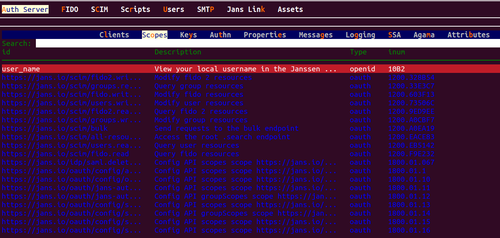
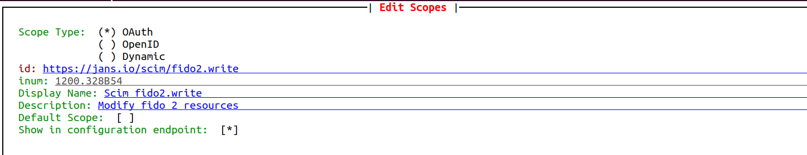

---
tags:
  - administration
  - configuration
  - scopes
---

# OAuth Scopes


The Janssen Server provides multiple configuration tools to perform these
tasks.

=== "Use Command-line"

    Use the command line to perform actions from the terminal. Learn how to 
    use Jans CLI [here](./config-tools/jans-cli/README.md) or jump straight to 
    the [Using Command Line](#using-command-line)


=== "Use Text-based UI"

    Use a fully functional text-based user interface from the terminal. 
    Learn how to use Jans Text-based UI (TUI) 
    [here](./config-tools/jans-tui/README.md) or jump straight to the
    [configuration steps](#using-text-based-ui)

=== "Use REST API"

    Use REST API for programmatic access or invoke via tools like CURL or 
    Postman. Learn how to use Janssen Server Config API 
    [here](./config-tools/config-api/README.md) or Jump straight to the
    [Using Configuration REST API](#using-configuration-rest-api)


##  Using Command Line


In the Janssen Server, you can deploy and customize the OAuth scopes using the
command line. To get the details of Janssen command line operations relevant to
OAuth Scope, you can check the operations under the `OauthScopes` task using the


```bash title="Command"
opt/jans/jans-cli/config-cli.py --info OauthScopes
```
```text title="Sample Output"
Operation ID: get-oauth-scopes
  Description: Gets list of Scopes
  Parameters:
  type: Scope type [string]
  limit: Search size - max size of the results to return [integer]
  pattern: Search pattern [string]
  startIndex: The 1-based index of the first query result [integer]
  sortBy: Attribute whose value will be used to order the returned response [string]
  sortOrder: Order in which the sortBy param is applied. Allowed values are "ascending" and "descending" [string]
  withAssociatedClients: Boolean fag to indicate if clients associated with the scope are to be returned [boolean]
  fieldValuePair: Field and value pair for seraching [string]
Operation ID: put-oauth-scopes
  Description: Update Scope
  Schema: Scope
Operation ID: post-oauth-scopes
  Description: Create Scope
  Schema: Scope
Operation ID: get-oauth-scopes-by-inum
  Description: Get Scope by Inum
  Parameters:
  inum: Scope identifier [string]
  withAssociatedClients: No description is provided for this parameter [boolean]
Operation ID: delete-oauth-scopes-by-inum
  Description: Delete Scope
  Parameters:
  inum: Scope identifier [string]
Operation ID: patch-oauth-scopes-by-id
  Description: Patch Scope
  Parameters:
  inum: Scope identifier [string]
  Schema: Array of JsonPatch
Operation ID: get-scope-by-creator
  Description: Get Scope by creatorId
  Parameters:
  creatorId: Id of the scope creator. If creator is client then client_id if user then user_id [string]
Operation ID: get-scope-by-type
  Description: Get Scope by type
  Parameters:
  type: Type of the scope [string]

To get sample schema type /opt/jans/jans-cli/config-cli.py --schema-sample <schema>, for example /opt/jans/jans-cli/config-cli.py --schema-sample JsonPatch
```

### Find/View OAuth Scopes

Operations will be done with **Operation ID**. Some operations may take parameters, 
let's retrieve `3` scopes (**limit**) that has `view` in it's description (**pattern**) 
and **type** `openid`:

```bash title="Command"
 /opt/jans/jans-cli/config-cli.py --operation-id get-oauth-scopes \
--endpoint-args limit:3,pattern:view,type:openid
```
 
```text title="Sample Output"
 {
  "start": 0,
  "totalEntriesCount": 7,
  "entriesCount": 3,
  "entries": [
    {
      "dn": "inum=10B2,ou=scopes,o=jans",
      "inum": "10B2",
      "displayName": "view_username",
      "id": "user_name",
      "description": "View your local username in the Janssen Server.",
      "scopeType": "openid",
      "claims": [
        "inum=42E0,ou=attributes,o=jans"
      ],
      "defaultScope": false,
      "attributes": {
        "showInConfigurationEndpoint": true
      },
      "creationDate": "2024-06-25T09:02:25",
      "umaType": false,
      "baseDn": "inum=10B2,ou=scopes,o=jans"
    },
    {
      "dn": "inum=341A,ou=scopes,o=jans",
      "inum": "341A",
      "displayName": "view_client",
      "id": "clientinfo",
      "description": "View the client info.",
      "scopeType": "openid",
      "claims": [
        "inum=2B29,ou=attributes,o=jans",
        "inum=29DA,ou=attributes,o=jans"
      ],
      "defaultScope": false,
      "attributes": {
        "showInConfigurationEndpoint": true
      },
      "creationDate": "2024-06-25T09:02:25",
      "umaType": false,
      "baseDn": "inum=341A,ou=scopes,o=jans"
    },
    {
      "dn": "inum=43F1,ou=scopes,o=jans",
      "inum": "43F1",
      "displayName": "view_profile",
      "id": "profile",
      "description": "View your basic profile info.",
      "scopeType": "openid",
      "claims": [
        "inum=2B29,ou=attributes,o=jans",
        "inum=0C85,ou=attributes,o=jans",
        "inum=B4B0,ou=attributes,o=jans",
        "inum=A0E8,ou=attributes,o=jans",
        "inum=5EC6,ou=attributes,o=jans",
        "inum=B52A,ou=attributes,o=jans",
        "inum=64A0,ou=attributes,o=jans",
        "inum=EC3A,ou=attributes,o=jans",
        "inum=3B47,ou=attributes,o=jans",
        "inum=3692,ou=attributes,o=jans",
        "inum=98FC,ou=attributes,o=jans",
        "inum=A901,ou=attributes,o=jans",
        "inum=36D9,ou=attributes,o=jans",
        "inum=BE64,ou=attributes,o=jans",
        "inum=6493,ou=attributes,o=jans",
        "inum=4CF1,ou=attributes,o=jans",
        "inum=29DA,ou=attributes,o=jans"
      ],
      "defaultScope": false,
      "attributes": {
        "showInConfigurationEndpoint": true
      },
      "creationDate": "2024-06-25T09:02:25",
      "umaType": false,
      "baseDn": "inum=43F1,ou=scopes,o=jans"
    }
  ]
}

```

### Create an OAuth Scope

Let's create a scope. Remember when we queried info for a task **OAuthScopes** it printed:

```text
Operation ID: post-oauth-scopes
  Description: Create Scope
  Schema: Scope
```

Thus, we can get sample schema and use Operation ID `post-oauth-scopes`. 
Lets get sample schema:

```bash title="Command"
/opt/jans/jans-cli/config-cli.py --schema Scope > /tmp/scope.json
```
For your information, you can obtain the format of the `Scope` schema by 
running the aforementioned command without a file.

```text title="Schema Format"
dn                         string
expirationDate             string
                           format: date-time
deletable                  boolean
inum                       string
displayName                string
id                         string
iconUrl                    string
description                string
scopeType                  string
                           enum: ['openid', 'dynamic', 'uma', 'spontaneous', 'oauth']
claims                     array of string
defaultScope               boolean
groupClaims                boolean
dynamicScopeScripts        array of string
umaAuthorizationPolicies   array of string
attributes                 object
                             spontaneousClientScopes: array of string
                             showInConfigurationEndpoint: boolean
creatorId                  string
creatorType                string
                           enum: ['none', 'client', 'user', 'auto']
creationDate               string
                           format: date-time
creatorAttributes          object
                           additionalProperties: ordereddict([('type', 'string')])
umaType                    boolean
baseDn                     string
```

You can also use the following command for `Scope` schema example:

```bash title="Command"
/opt/jans/jans-cli/config-cli.py --schema-sample Scope
```
```json title="Schema Example"
{
  "dn": "string",
  "expirationDate": "string",
  "deletable": true,
  "inum": "string",
  "displayName": "string",
  "id": "string",
  "iconUrl": "string",
  "description": "string",
  "scopeType": "oauth",
  "claims": [
    "string"
  ],
  "defaultScope": false,
  "groupClaims": false,
  "dynamicScopeScripts": [
    "string"
  ],
  "umaAuthorizationPolicies": [
    "string"
  ],
  "attributes": {
    "spontaneousClientScopes": [
      "string"
    ],
    "showInConfigurationEndpoint": false
  },
  "creatorId": "string",
  "creatorType": "user",
  "creationDate": "string",
  "creatorAttributes": {},
  "umaType": true,
  "baseDn": "string"
}

```

Now edit file `tmp/scope.json`. As an example we just filled the following properties:

```text
"id": "TestScopeID",
"displayName": "TestScope",
"description": "Test Scope created by jans-cli",
```

```json title="Input"                                                                                                                                                           
{
  "dn": null,
  "id": "TestScopeID",
  "inum":null,
  "displayName": "TestScope",
  "description": "Test Scope created by jans-cli",
  "iconUrl": null,
  "authorizationPolicies": [],
  "defaultScope": true,
  "scopeType": "openid",
  "claims": [],
  "umaType": false,
  "umaAuthorizationPolicies": [],
  "attributes": {
    "spontaneousClientId": null,
    "spontaneousClientScopes": [],
    "showInConfigurationEndpoint": true
  }
}
```
Now let's post the data using below command:

```bash title="Command"
 /opt/jans/jans-cli/config-cli.py --operation-id post-oauth-scopes \
 --data /tmp/scope.json 
```


```json title="Sample Output"
{
  "dn": "inum=8eb2b0c0-d1d9-453d-8364-e2809ce857f2,ou=scopes,o=jans",
  "inum": "8eb2b0c0-d1d9-453d-8364-e2809ce857f2",
  "displayName": "TestScope",
  "id": "TestScopeID",
  "description": "Test Scope created by jans-cli",
  "scopeType": "openid",
  "defaultScope": true,
  "attributes": {
    "showInConfigurationEndpoint": true
  },
  "creationDate": "2024-06-25T08:44:08",
  "umaType": false,
  "baseDn": "inum=8eb2b0c0-d1d9-453d-8364-e2809ce857f2,ou=scopes,o=jans"
}
```

It created scope with inum `8eb2b0c0-d1d9-453d-8364-e2809ce857f2` and 
returned current data. 


### Update Existing OAuth Scopes

In case we need to update an existing OAuth Scope, we can do that as well.

To update an existing OAuth Scope, we have to create a json file 
with updated details. You can get the schema file as well to
understand the format of the OAuth Scope JSON file.

This is an existing OAuth Scope we are going to update.

```json 
{
  "dn": "inum=8eb2b0c0-d1d9-453d-8364-e2809ce857f2,ou=scopes,o=jans",
  "inum": "8eb2b0c0-d1d9-453d-8364-e2809ce857f2",
  "displayName": "TestScope",
  "id": "TestScopeID",
  "description": "Test Scope created by jans-cli",
  "scopeType": "openid",
  "defaultScope": true,
  "attributes": {
    "showInConfigurationEndpoint": true
  },
  "creationDate": "2024-06-25T08:44:08",
  "umaType": false,
  "baseDn": "inum=8eb2b0c0-d1d9-453d-8364-e2809ce857f2,ou=scopes,o=jans"
}
```
We have changed only the `scopeType` to `dynamic`.

Let's update using the below command:

```bash title="Command"
/opt/jans/jans-cli/config-cli.py --operation-id put-oauth-scopes \
--data /tmp/scope.json
```

```json title="Sample output"
{
  "dn": "inum=8eb2b0c0-d1d9-453d-8364-e2809ce857f2,ou=scopes,o=jans",
  "inum": "8eb2b0c0-d1d9-453d-8364-e2809ce857f2",
  "displayName": "TestScope",
  "id": "TestScopeID",
  "description": "Test Scope created by jans-cli",
  "scopeType": "dynamic",
  "defaultScope": true,
  "attributes": {
    "showInConfigurationEndpoint": true
  },
  "creationDate": "2024-06-25T08:44:08",
  "umaType": false,
  "baseDn": "inum=8eb2b0c0-d1d9-453d-8364-e2809ce857f2,ou=scopes,o=jans"
}

```


This will updated the existing oauth scopes matched with inum value.

### Patch OAuth Scopes by `inum`

Let's update `iconUrl` with patch method. So we need a schema for the patch method. 
Remember when we queried info for the task **OAuthScopes** it printed:

```
Operation ID: patch-oauth-scopes-by-id
  Description: Patch Scope
  Parameters:
  inum: Scope identifier [string]
  Schema: Array of JsonPatch
```
The `patch-oauth-scopes-by-id` operation uses the [JSON Patch](https://jsonpatch.com/#the-patch) schema to describe 
the configuration change. Refer [here](../../admin/config-guide/config-tools/jans-cli/README.md#patch-request-schema) 
to know more about schema.


```bash title="Command"
/opt/jans/jans-cli/config-cli.py --schema JsonPatch > /tmp/patch.json
```

For instance, to perform a `replace` operation at `iconUrl` 
and change it from `null` to `https://www.jans.io/icon.png`, 
the JSON Patch data would look like below:

```json title="Input"
[
  {
  "op": "replace",
  "path": "iconUrl",
  "value": "https://www.jans.io/icon.png"
  }
]
```
Store the above JSON Patch data in a file, for instance, `/tmp/patch.json`

Let's do the operation:
```bash title="Command"
/opt/jans/jans-cli/config-cli.py --operation-id patch-oauth-scopes-by-id \
--url-suffix inum:8eb2b0c0-d1d9-453d-8364-e2809ce857f2 --data /tmp/patch.json 
```

```json title="Sample Output"
{
  "dn": "inum=8eb2b0c0-d1d9-453d-8364-e2809ce857f2,ou=scopes,o=jans",
  "inum": "8eb2b0c0-d1d9-453d-8364-e2809ce857f2",
  "displayName": "TestScope",
  "id": "TestScopeID",
  "iconUrl": "https://www.jans.io/icon.png",
  "description": "Test Scope created by jans-cli",
  "scopeType": "dynamic",
  "defaultScope": true,
  "attributes": {
    "showInConfigurationEndpoint": true
  },
  "creationDate": "2024-06-25T08:44:08",
  "umaType": false,
  "baseDn": "inum=8eb2b0c0-d1d9-453d-8364-e2809ce857f2,ou=scopes,o=jans"
}


```

### Find OAuth Scopes by `inum`

In case We know the `inum` value of an OAuth Scope, We can get the details of that scope.

```text
Operation ID: get-oauth-scopes-by-inum
  Description: Get Scope by Inum
  Parameters:
  inum: Scope identifier [string]
  withAssociatedClients: No description is provided for this parameter [boolean]
```

We can use the `url-suffix` for the `inum` value.
```bash title="Sample Command"
/opt/jans/jans-cli/config-cli.py --operation-id get-oauth-scopes-by-inum \
--url-suffix inum:value
```

For example:

```bash title="Command"
/opt/jans/jans-cli/config-cli.py --operation-id get-oauth-scopes-by-inum \
--url-suffix inum:8eb2b0c0-d1d9-453d-8364-e2809ce857f2
```
It returns the details of the scope matched with the `inum` value.
        
```json title="Sample Output"
{
  "dn": "inum=8eb2b0c0-d1d9-453d-8364-e2809ce857f2,ou=scopes,o=jans",
  "inum": "8eb2b0c0-d1d9-453d-8364-e2809ce857f2",
  "displayName": "TestScope",
  "id": "TestScopeID",
  "iconUrl": "https://www.jans.io/icon.png",
  "description": "Test Scope created by jans-cli",
  "scopeType": "dynamic",
  "defaultScope": true,
  "attributes": {
    "showInConfigurationEndpoint": true
  },
  "creationDate": "2024-06-25T08:44:08",
  "umaType": false,
  "baseDn": "inum=8eb2b0c0-d1d9-453d-8364-e2809ce857f2,ou=scopes,o=jans"
}
```

### Delete OAuth Scopes by `inum`

You can delete any OAuth Scopes by its `inum` value.

```bash title="Command"
/opt/jans/jans-cli/config-cli.py --operation-id delete-oauth-scopes-by-inum --url-suffix inum:8eb2b0c0-d1d9-453d-8364-e2809ce857f2
```

Just change the `inum` value to your own according to which one you want to delete.

## Using Text-based UI


In Janssen, You can deploy and customize an Scope using
the [Text-Based UI](./config-tools/jans-tui/README.md) also.

You can start TUI using the command below:

```bash title="Command"
sudo /opt/jans/jans-cli/jans_cli_tui.py
```

### Scope Screen 

Navigate to `Auth Server` -> `Scopes` to open the scope screen as shown in the image below.

* To get the list of currently added Scope, bring the control to Search box (using the tab key),
and press Enter. Type the search string to search for Scope with matching `id` and `inum`.



### Add Scope screen

* Use the `Add Scope` button to create a new scope. 
* You can create several types of scopes in the screen below, 
such as `oauth`, `OpenID`, `dynamic`, and `uma`, with the correct data.
* For example, below is the picture availability scope data.

  

## Using Configuration REST API

Janssen Server Configuration REST API exposes relevant endpoints for managing
and configuring the OAuth Scope. Endpoint details are published in the [Swagger
document](./../reference/openapi.md).