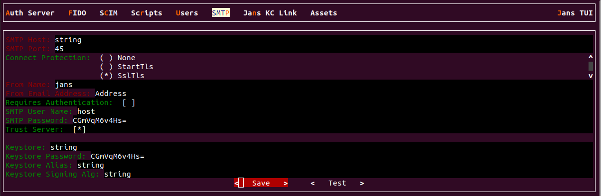
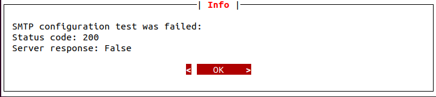

---
tags:
 - administration
 - configuration
 - smtp
---

# SMTP Configuration

The Janssen Server provides multiple configuration tools to perform these
tasks.


=== "Use Command-line"

    Use the command line to perform actions from the terminal. Learn how to 
    use Jans CLI [here](./config-tools/jans-cli/README.md) or jump straight to 
    the [Using Command Line](#using-command-line)

=== "Use Text-based UI"

    Use a fully functional text-based user interface from the terminal. 
    Learn how to use Jans Text-based UI (TUI) 
    [here](./config-tools/jans-tui/README.md) or jump straight to the
    [Using Text-based UI](#using-text-based-ui)

=== "Use REST API"

    Use REST API for programmatic access or invoke via tools like CURL or 
    Postman. Learn how to use Janssen Server Config API 
    [here](./config-tools/config-api/README.md) or Jump straight to the
    [Using Configuration REST API](#using-configuration-rest-api)


##  Using Command Line


In the Janssen Server, you can deploy and customize the SMTP using the
command line. To get the details of Janssen command line operations relevant to
SMTP Configuration, you can check the operations under `ConfigurationSmtp` task using the
command below:

```bash title="Command"
/opt/jans/jans-cli/config-cli.py --info ConfigurationSmtp
```


```text title="Sample Output"
Operation ID: get-config-smtp
 Description: Returns SMTP server configuration
Operation ID: put-config-smtp
 Description: Updates SMTP server configuration
 Schema: SmtpConfiguration
Operation ID: post-config-smtp
 Description: Adds SMTP server configuration
 Schema: SmtpConfiguration
Operation ID: delete-config-smtp
 Description: Deletes SMTP server configuration
Operation ID: test-config-smtp
 Description: Signing Test SMTP server configuration
 Schema: SmtpTest
```


### Find SMTP Server Configuration

To view the current SMTP server configuration, run the following command line:

```bash title="Command"
/opt/jans/jans-cli/config-cli.py --operation-id get-config-smtp
```

It will show your SMTP server configuration as below:

```json title="Sample Output" linenums="1"
{
  "valid": false,
  "port": 0,
  "trust_host": false,
  "requires_authentication": false,
  "key_store": "/etc/certs/smtp-keys.pkcs12",
  "key_store_password": "kb5JITTrmCyX1LNEp8uorA==",
  "key_store_alias": "smtp_sig_ec256",
  "signing_algorithm": "SHA256withECDSA"
}
```

### Setup New SMTP Server Configuration


To add a new SMTP Server, we can use `post-config-smtp` operation id.
As shown in the [output](#using-command-line) for`--info` 
command, the `post-config-smtp` operation requires data to be sent 
according to the `SmtpConfiguration` schema.

To see the schema, use the command below:
```bash title="Command"
/opt/jans/jans-cli/config-cli.py --schema SmtpConfiguration 
```

The Janssen Server also provides an example of data that adheres to the above schema.
To fetch the example, use the command below.

```bash title="Command"
/opt/jans/jans-cli/config-cli.py --schema-sample SmtpConfiguration 
```

Using the schema and the example above, we have added below  data to the file 
`/tmp/smtp.json`.


```json title="Input" linenums="1"
{
  "valid": true,
  "host": "string",
  "port": 5,
  "connect_protection": "StartTls",
  "trust_host": false,
  "from_name": "jans",
  "from_email_address": "string",
  "requires_authentication": false,
  "smtp_authentication_account_username": "string",
  "smtp_authentication_account_password": "string",
  "key_store": "string",
  "key_store_password": "string",
  "key_store_alias": "string",
  "signing_algorithm": "string"
}
```

To set up a new SMTP server configuration, Run the following command:

```bash title="Command"
/opt/jans/jans-cli/config-cli.py --operation-id post-config-smtp\
 --data /tmp/smtp.json
```


```json title="Sample Output" linenums="1"
{
  "valid": true,
  "host": "string",
  "port": 5,
  "connect_protection": "StartTls",
  "trust_host": false,
  "from_name": "jans",
  "from_email_address": "string",
  "requires_authentication": false,
  "smtp_authentication_account_username": "string",
  "smtp_authentication_account_password": "CGmVqM6v4Hs=",
  "key_store": "string",
  "key_store_password": "CGmVqM6v4Hs=",
  "key_store_alias": "string",
  "signing_algorithm": "string"
}
```


### Update SMTP Server Configuration

To update `SMTP Server`, simply change any information on `/tmp/smtp.json`
file and run the following command:

In that file, update the value `false` to `true` of the `trust_host` field.

```bash title="Command"
/opt/jans/jans-cli/config-cli.py --operation-id put-config-smtp \
--data /tmp/smtp.json
```
It will update the information.

### Test SMTP Server Configuration

Testing SMTP Server configuration token with `https://jans.io/oauth/config/smtp.write` 
scope is required. To test the SMTP server configuration update, change any information 
on the `/tmp/smtp.json` file with test data and run the following command:

```bash title="Command"
/opt/jans/jans-cli/config-cli.py --operation-id test-config-smtp \
--data /tmp/smtp.json
```
This will return status code 200 with a response as true or false based on the 
SMTP test result.
Note:  `SMTP Password` should be an App password and not a web login password.


##  Using Text-based UI

Start TUI using the command below:

```bash title="Command"
sudo /opt/jans/jans-cli/jans_cli_tui.py
```

### SMPT Screen

Navigate to `Auth Server` -> `SMPT` to open the SMPT screen as shown
in the image below.



* This screen shows the current SMTP server configuration.
* After changing the SMPT data, update the SMPT server using the `Save` button.
* Test the SMPTS server using the `Test` button, and the result will be displayed.

The test result image is shown below.




## Using Configuration REST API

Janssen Server Configuration REST API exposes relevant endpoints for managing
and configuring the SMTP. Endpoint details are published in the [Swagger
document](./../reference/openapi.md).

