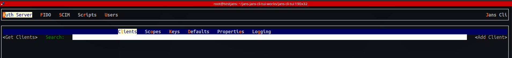
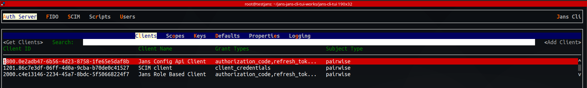
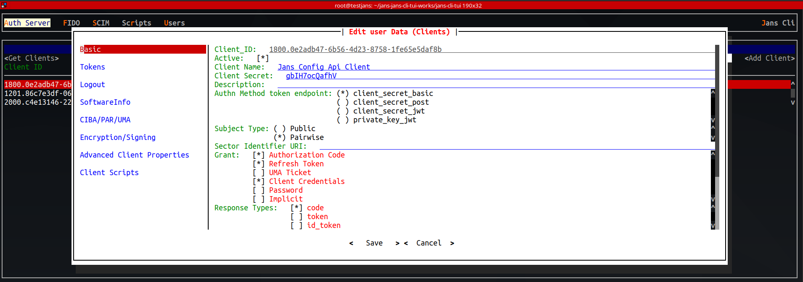
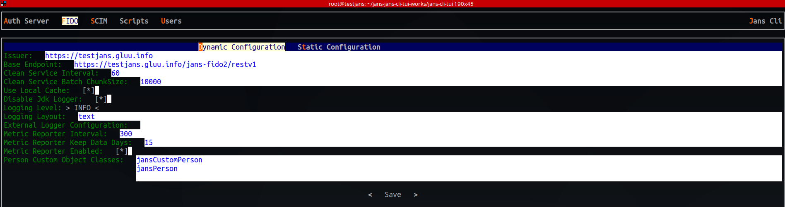
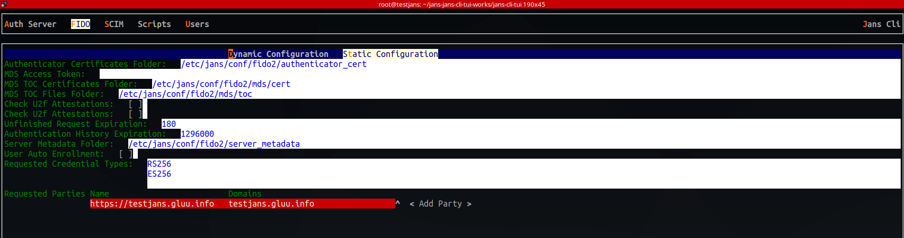

---
tags:
- installation
- administration
- configuration
- config
- tui
---

# Configuration Text-Based User Interface (TUI)

## Overview

## Installation

Installation of a Jans TUI ( Text-Based User Interface ) need a Jans server to be installed as base. After that download and build Jans-ClI-TUI and make it. 

### Build: 

 - `pip3 install shiv`
 - `wget https://github.com/JanssenProject/jans/archive/refs/heads/jans-cli-tui-works.zip`
 - `unzip jans-cli-tui-works.zip`
 - `cd jans-jans-cli-tui-works/jans-cli-tui/`
 - `make zipapp`

### Run 

 - `./config-cli-tui.pyz` 

## Administration

It's possible to manage Janssen server with Jans-Cli-TUI. There are lot of available options here which administrator can use for daily activities. 
Some of them are stated below. 

This is what it looks like when run `config-cli-tui.pyz`, this is the main panel. 

### Auth Server

With "Auth Server" option, administrator can operate openid client configuration in their Janssen server. 

 - In below screenshot, we are getting the list of existing clients. 
 - It's possible to get details of any client as well. Just hit enter on any client and  you will see information like this. 
 - With the button which is located on right upper side named "Add Client", it's possible to create new client. 

### FIDO

Janssen includes a FIDO2 component to implement a two-step, two-factor authentication (2FA) with a username/password as the first step, and any FIDO2 device as the second step. During Janssen installation, the administrator will have an option to install the FIDO2 component. 

Using Janssen CLI-TUI, you can view/update details of the FIDO2 configuration. 

There are two configurations included here: 

 - Dynamic Configuration 
 - Static Configuration 

### SCIM

System for Cross-domain Identity Management, in short SCIM, is a specification that simplifies the exchange of user identity information across different domains. The Janssen Server provides implementation for the SCIM specification.

With Janssen CLI-TUI, it's possible to view / update SCIM configuration. 

### Scripts

### Users
