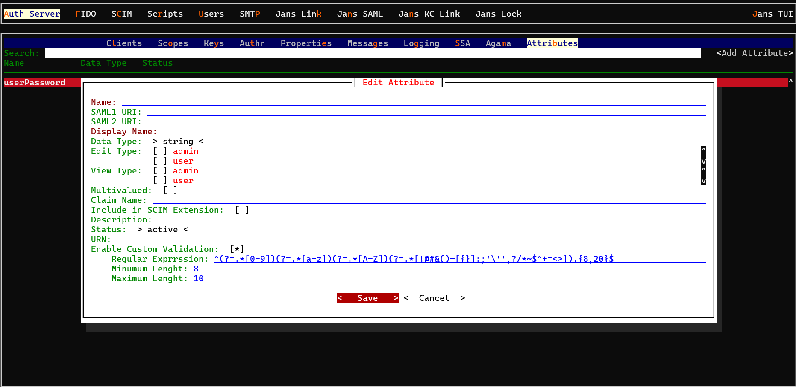
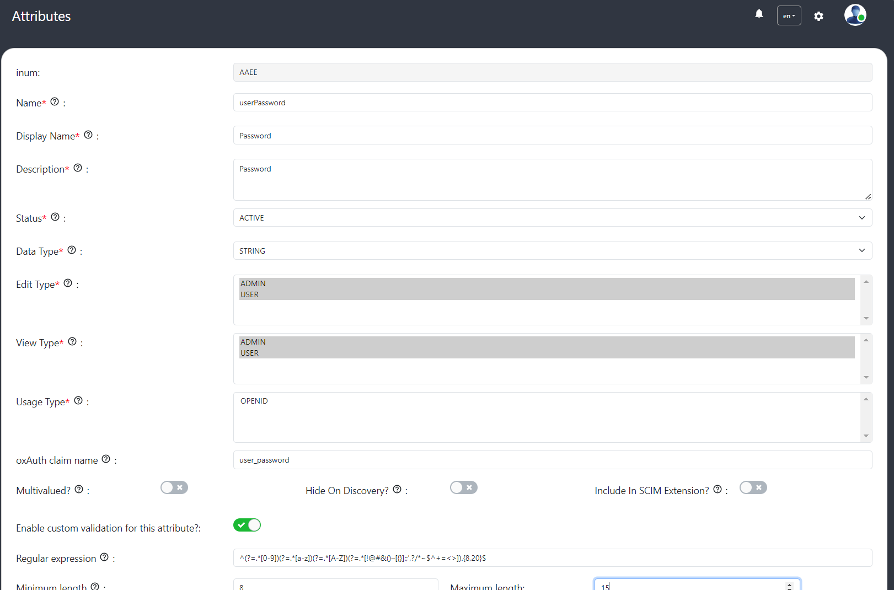

---
tags:
  - administration
  - configuration
  - password
---

# Password validation
User password validation can be set to check the password strength, like the password must have at least one uppercase, or lowercase, number, and the length of the password
By default the attribute validation is not enabled.  

## Enable validation
To enable custom validation for password attribute use admin-ui Schema screen.
1. Search for password attribute.

2. Check **Enable custom validation for this attribute?** 

3. Enter valid regex expression to check the strength of the password.

4. Enter **Minimum length**,the minimum length of a value associated with this attribute.

5. Enter **Maximum length**, the maximum length of a value associated with this attribute.

6. Click on save.

# Create User 
1. Create a new user using **User Management** screen.

2. Enter user details.

3. Enter password.

4. Save user details.

5. Error notification will be displayed if the password does not match the validation.

