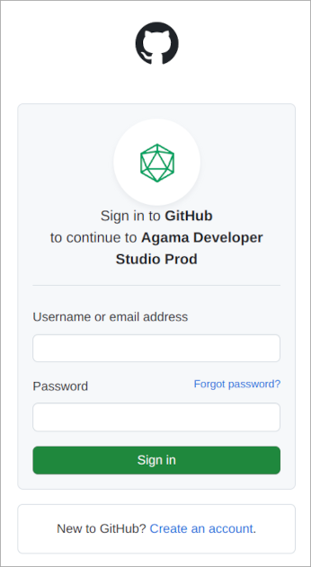

# Quick Start Using Agama Lab

In this quick start guide, we will see how to build, deploy and test a simple password based authentication flow using
Agama and [Agama Lab](https://cloud.gluu.org/agama-lab). 

[Agama Lab](https://cloud.gluu.org/agama-lab) is an online visual editor to build these authentication flows. The flow
built on Agama Lab is packaged as a `.gama` project file. `.gama` package needs to be manually deployed on 
Janssen Server where Agama engine will execute the flow when authentication request is received.

Major Steps involved in this process are:
- Designing a flow using Agama labs
- Enable Agama engine on Janssen Server
- Deploying `.gama` on Janssen Server
- Testing the flow

## Prerequisites

- Janssen Server instance
- A public GitHub repository with at least one prior commit

## Create Agama Project

To design a simple username-password based user authentication [Agama Labs](https://cloud.gluu.org/agama-lab/) follow 
the steps below.

### Design The Flow

#### Log Into Agama Lab

#### Create A Project

1. Use https://cloud.gluu.org/agama-lab online tool to make an agama flow.

Hit the above URL and you will see a page with Login with GitHub button. Click on it to go to GitHub authentication page.

  

Authenticate on GitHub authentication page.

Input the name of the repository where Agama Lab should commit the project artifacts. Hit `Next`

Project listing page is shown. All the existing projects for your GitHub user are listed here. Projects can be editted, deleted
from project listing page.

To create new project, click on the `New Project` button.

Enter the name and the description for the new project and click `Create` button

This will create a new project and it'll be visible on the project listing page.

#### Configure The Authentication Flow

Create/import

1. Create Flow File

Click on :material-arrow-top-right:. 
This will open flow authering view with a blank canvas. To start creating the flow, we need to create a `Flow File`. To
do that, 

_Right click on `code` and then `New`. Select `Flow File`_

Give name and description for flow file

Newly created flow file has one stage in it by default. Right-clicking on any will allow you to edit the existing stage
using :material-pencil: and add further stages by clicking :material-plus-circle:

2. Create AuthenticationService [call]() block

3. Create CdiUtil call block

4. Create [assignment]() block

5. Create [repeat]() block

6. Create [RRF]() block

7. Create CdiUtil call block

8. Create [assignment]() block

9. Create conditional [When]() block

10. Create [finish]() blocks

### Design User Interface

1. Create a template file

2. Use the visual editor

3. Customise using CSS and resources

### Release Project To GitHub

## Enable Agama using TUI

- Access TUI
- Make sure Agama engine is enabled ( )

## Deploy Agama Project

## Test

## Notes:

- more details about inputs given on this screen: https://github.com/GluuFederation/private/wiki/Agama-Lab-Quick-Start-Guide#2
  like what are the available values and how to use them
- give a flow chart that depicts auth journey